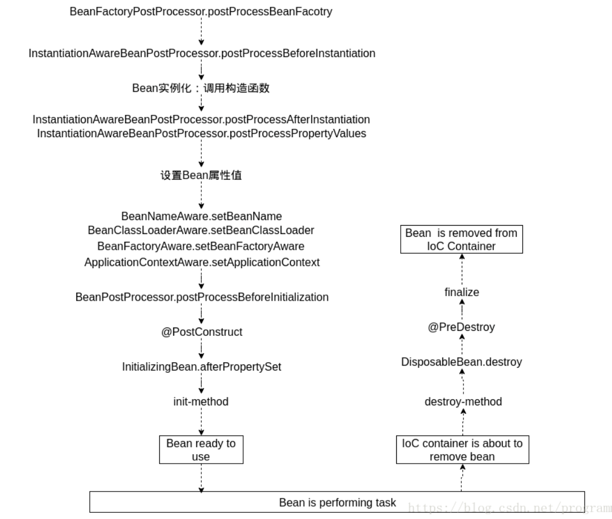
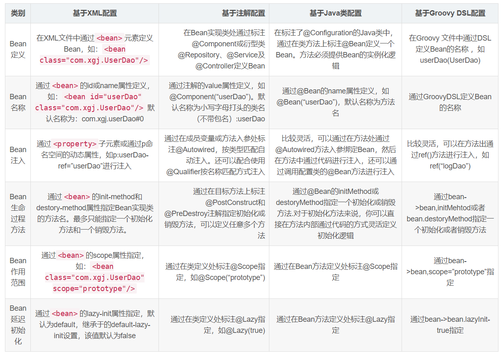
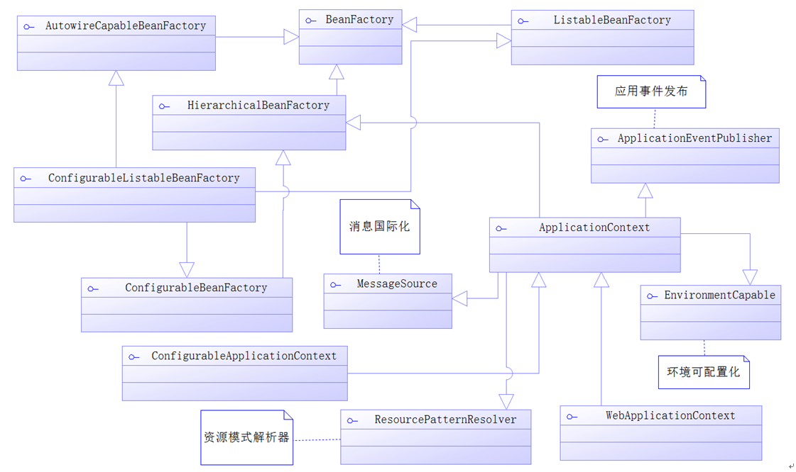
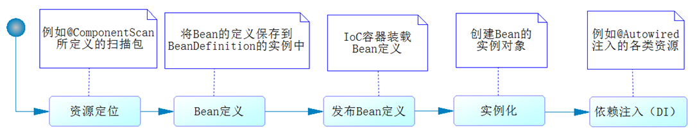
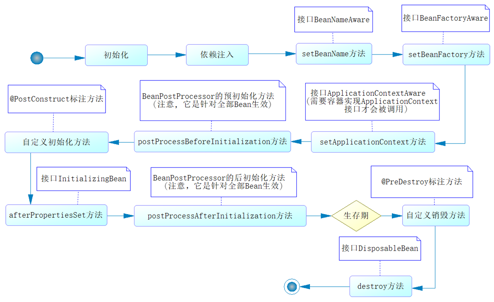

[TOC]

## Spring IoC

### 基础

#### Bean Scope

Scope 用来声明容器中的对象所应该处的限定场景或者说该对象的存活时间，即容器在对象进入其相应的 scope之前，生成并装配这些对象，在该对象不再处于这些 scope 的限定之后，容器通常会销毁 Spring 的 IoC 容器这些对象。

如果你不指定 bean 的 scope，**singleton** 便是容器**默认**的 scope.

- **singleton**: 在 Spring 的 IoC 容器中只存在**一个实例**，所有对该对象的引用将**共享**这个实例。该实例从容器启动，并因为第一次被请求而初始化之后，将一直存活到容器退出，也就是说，它与 IoC 容器“几乎”拥有相同的“寿命”。标记为 singleton 的 bean是由容器来保证这种类型的 bean 在**同一个容器中**只存在一个共享实例；而 Singleton 模式则是保证在同一个 **Classloader** **中**只存在一个这种类型的实例。

- **propertype**: 针对声明为拥有 prototype scope 的 bean 定义，容器在接到该类型对象的请求的时候，会每次都**重新生成一个新的对象实例**给请求方。虽然这种类型的对象的实例化以及属性设置等工作都是由容器负责的，但是只要准备完毕，并且对象实例返回给请求方之后，**容器就不再拥有当前返回对象的引用**，请求方需要自己负责当前返回对象的后继生命周期的管理工作，包括该对象的销毁。
    对于那些请求方不能共享使用的对象类型，应该将其 bea n定义的 scope 设置为 prototype。这样每个请求方可以得到自己对应的一个对象实例。通常，声明为 prototype 的 scope 的 bean 定义类型，都是==**一些有状态的**==，比如保存每个顾客信息的对象。

另外三种 scope 类型，即 request、session 和 global session 类型,只有在支持 Web 应用的 **ApplicationContext **中才能使用这三个 scope。

- **request**: 为每一个 **HTTP** 请求创建一个全新的 bean，当请求结束之后，该对象的生命周期即告结束。
- **session**: 为每一个独立的 **session** 创建一个全新的 bean 对象，session 结束之后，该 bean 对象的生命周期即告结束。
- **global session**: global session只有应用在基于 portlet的Web应用程序中才有意义，它映射到portlet的global范围的 session。用得少。

注意：singleton 的对象在 IOC 容器创建的时候就会创建。在不指定 @Scope 的情况下，所有的 bean 都是**单实例**的 bean, 而且是**饿汉加载**（容器启动实例就创建好了）。

指定 @Scope 为 **prototype** 表示为**多实例**的，而且还是**懒汉模式**加载（IOC 容器启动的时候，并不会创建对象，而是在第一次使用的时候才会创建。

如果对 singleton 的 bean 指定为 **@Lazy 懒加载**，那么会在第一次使用时创建。Bean 的懒加载 @Lazy (主要针对**单实例**的bean 容器启动的时候，不创建对象，在第一次使用的时候才会创建该对象)  。

````java
@Bean
@Lazy
public Person person() {
    return new Person();
}
````


#### Bean生命周期

Spring 容器将对其所管理的对象全部给予**统一的生命周期**管理，这些被管理的对象完全摆脱了原来那种“new 完后被使用，脱离作用域后即被回收”的命运。

  

**==什么时候创建Bean？==**

容器启动之后，并不会马上就实例化相应的 bean 定义。容器现在仅仅拥有所有对象的 **BeanDefinition** 来保存**实例化**阶段将要用的必要信息。只有当请求方通过 **BeanFactory** 的 **getBean**() 方法来请求某个**对象实例**的时候，才**有可能触发** Bean实例化阶段的活动。BeanFactory 的 getBean() 方法可以被客户端对象显式调用，也可以在容器**内部隐式**地被调用。

隐式调用有如下两种情况:

- **BeanFactory** 来说，对象实例化默认采用**延迟初始化**。通常情况下，当对象 A 被请求而需要第一次实例化的时候，如果它所依赖的对象 B 之前同样没有被实例化，那么容器会先实例化对象 A 所依赖的对象。这时容器内部就会首先实例化对象 B，以及对象 A 依赖的其他还没有实例化的对象。这种情况是容器内部调用**getBean**()，对于本次请求的请求方是隐式的。
- **ApplicationContext** 启动之后会**实例化所有单例 bean** 定义。但 ApplicationContext 在实现的过程中依然遵循 Spring 容器实现流程的两个阶段，只不过它会在启动阶段的活动完成之后，紧接着调用注册到该容器的所有 bean 定义的实例化方法 getBean()。这就是为什么当你得到 ApplicationContext 类型的容器引用时，容器内所有对象已经被**全部实例化**完成。 ApplicationContext 会利用反射机制自动识别出配置文件中定义的 BeanPostProcessor、InstantiationAwareBeanPostProcessor 和 BeanFactoryPostProcessor，并将它们自动注册到应用上下文中，而 BeanFactory 需要手工调用 addBeanPostProcessor() 方法进行注册。ApplicationContext 在启动时，将首先为配置文件中的每个 \<bean> 生成一个 **BeanDefinition** 对象，它是这个 Bean 在Spring 容器中的内部表示。

​       之所以说 getBean() 方法是有可能触发 Bean 实例化阶段的活动，是因为只有当对应某个  bean 定义的getBean() 方法第一次被调用时，不管是显式的还是隐式的，Bean实例化阶段的活动才会被触发，第二次被调用则会直接返回容器**缓存**的第一次实例化完的 **singleton** 对象实例（prototype 类型 bean 除外）。当 getBean() 方法内部发现该 bean 定义之前还没有被实例化之后，会通过 createBean() 方法来进行具体的对象实例化。


#### BeanFactory 与FactoryBean

 两个特别像，但是功能却千差万别。有关于 **BeanFactory**，我们都知道，这是 Spring **容器的基础实现类**，它负责生产和管理 Bean 的一个**工厂**。当然 BeanFactory 只是一个**接口**，它的常用实现有 XmlBeanFactory、DefaultListableBeanFactory、**ApplicationContext **等。


FactoryBean 是一个**接口**，具体方法如下： 

```java
public interface FactoryBean<T> {
 	// 返回由 FactoryBean 创建的Bean实例
	T getObject() throws Exception;
 	// 返回 FactoryBean 创建Bean的类型
	Class<?> getObjectType();
 	// 返回是否是 singleton
	boolean isSingleton();
}
```

**我们常规的 Bean 都是使用 Class 的反射获取具体实例，如果 Bean 的获取过程比较==复杂==，那么常规的 xml 配置需要配置大量属性值，这个时候我们就可以使用 FactoryBean，实现这个接口，在其 getObject() 方法中初始化这个 bean。** 

FactoryBean 使用实例：

```java
public class StudentFactoryBean implements FactoryBean {
 
    @Override
    public Object getObject() throws Exception {
        Student student = new Student();
        student.setAge(22);
        student.setName("jj");
        student.setId(10);
        return student;
    }
 
    // 对象具体类型
    @Override
    public Class<?> getObjectType() {
        return Student.class;
    }
 
    // 是否单例
    @Override
    public boolean isSingleton() {
        return true;
    }
}
```

 在 SpringConfiguration 中添加该 bean 

```java
@Configuration
public class SpringConfiguration {
    // 添加Bean
    @Bean
    public StudentFactoryBean studentFactoryBean(){
        return new StudentFactoryBean();
    }
}
```

测试

```java
@Test
public void testStudentFactoryBean(){
    AnnotationConfigApplicationContext applicationContext
        = new AnnotationConfigApplicationContext(SpringConfiguration.class);
    Student student = (Student) applicationContext.getBean("studentFactoryBean");
    System.out.println(student);
}
// res
Student(id=10, name=test:jj, age=22)
```

小结：

- **BeanFactory：工厂类接口，Spring 容器的核心接口，实例化 bean、配置 bean 之间的依赖关系**

- **FactoryBean：实例化 bean 过程比较复杂时可以考虑使用**


#### Bean配置方式

 对于 Spring 来讲，为实现 Bean 的信息定义，提供了基于 XML、基于注解、基于 JAVA 类、基于 Groovy 这 4 种选项，同事还允许各种配置方式复合共存。 

几种配置方式对比：




#### 容器内部工作机制

AbstractApplicationContext 是 ApplicationContext 的抽象实现类，该类的 refresh() 方法定义了 Spring 容器在加载配置文件后的各项处理过程，refresh() 方法的源码如下。

```java
public void refresh() throws BeansException, IllegalStateException {
        synchronized (this.startupShutdownMonitor) {
            // 做refresh之前的初始化工作，包括设定此context的状态等
            prepareRefresh();

            // 留给子类的两个模板方法，用于子类真正实现刷新和返回其内置BeanFactory
            ConfigurableListableBeanFactory beanFactory = obtainFreshBeanFactory();

            // 设置BeanFactory的各个域值
            prepareBeanFactory(beanFactory);

            try {
                // Allows post-processing of the bean factory in context subclasses.
                postProcessBeanFactory(beanFactory);

                // 注册工厂后处理器
                invokeBeanFactoryPostProcessors(beanFactory);

                // 注册Bean后处理器
                registerBeanPostProcessors(beanFactory);

                // 初始化消息源
                initMessageSource();

                // 初始化应用上下文事件广播器
                initApplicationEventMulticaster();

                // 初始化其他特殊的bean
                onRefresh();

                // 注册事件监听器
                registerListeners();

                // 初始化所有单实例的bean
                finishBeanFactoryInitialization(beanFactory);

                // 完成刷新并发布容器刷新事件
                finishRefresh();
            }

            catch (BeansException ex) {
                if (logger.isWarnEnabled()) {
                    logger.warn("Exception encountered during context initialization - " +
                            "cancelling refresh attempt: " + ex);
                }

                // Destroy already created singletons to avoid dangling resources.
                destroyBeans();

                // Reset 'active' flag.
                cancelRefresh(ex);

                // Propagate exception to caller.
                throw ex;
            }

            finally {
                // Reset common introspection caches in Spring's core, since we
                // might not ever need metadata for singleton beans anymore...
                resetCommonCaches();
            }
        }
}
```


#### IOC容器

所有IOC容器都需要实现接口BeanFactory或其子接口，它是一个顶级容器接口。


##### BeanFactory源码分析

```java
package org.springframework.beans.factory;

/**
BeanFactory接口源码
*/
public interface BeanFactory {

    /**
     * 用来引用一个实例，或把它和工厂产生的Bean区分开，就是说，如果一个FactoryBean的名字为a，那么，&a会得到那个Factory
     */
    String FACTORY_BEAN_PREFIX = "&";       // 前缀

    /*
     * 四个不同形式的getBean方法，获取实例
     */
    Object getBean(String name) throws BeansException;

    <T> T getBean(String name, Class<T> requiredType) throws BeansException;

    <T> T getBean(Class<T> requiredType) throws BeansException;

    Object getBean(String name, Object... args) throws BeansException;

    boolean containsBean(String name);      // 是否包含Bean

    boolean isSingleton(String name) throws NoSuchBeanDefinitionException;      // 是否为单实例

    boolean isPrototype(String name) throws NoSuchBeanDefinitionException;      // 是否为原型（多实例）

    boolean isTypeMatch(String name, Class<?> targetType) throws NoSuchBeanDefinitionException;   // 名称、类型是否匹配

    Class<?> getType(String name) throws NoSuchBeanDefinitionException;     // 获取类型

    String[] getAliases(String name);       // 根据实例的名字获取实例的别名

}
```

- bean默认单例存在。getBean方法返回的是同一个bean对象。
- 允许我们按名称或类型获取bean。
- ApplicationContext 是 BeanFactory 的子接口。
- AnnotationConfigApplicationContext 是一个基于注解的IOC容器。都包含上述的这些方法。


**Spring IoC容器的接口设计**




#### Bean的装配

##### 基于Config的装配

定义一个普通的POJO类。

```java
/**
* 普通的User类 没有任何注解
*/
public class User {

	private Long id;
	private String userName;
    private String note;
    // Getter and setters
}
```

再自定义一个AppConfig类。

- **@Configuration** 标注指明类为配置类
- @Bean 将getDevDataSource()方法返回的POJO装配到IOC容器中 标注有 @Configuration 的类被认为为配置类，Spring自动根据其生成IoC容器来装配bean。

```java
/**
* 自定义的配置类
*/
@Configuration      // 标注指明类为配置类
public class AppConfig {
	// 指明Bean名称为user，否则使用方法名作为bean的名称
    @Bean(name = "user")
    public User initUser() {
        User user = new User();
        user.setId(1L);
        user.setUserName("Tom");
        user.setNote("Note 1");
        return user;
    }
}
```

以下通过AnnotationConfigApplicationContext容器来获取bean。此处AnnotationConfigApplicationContext是BeanFactory接口的子接口，也具有getBean方法来得到bean。此处比较适合第三方bean的装配，如上述的数据库连接bean的装配。

```java
public class IoCTest{
    public static void main(String[] args){
        // 传入配置类
        ApplicationContext ctx = new AnnotationConfigApplicationContext(AppConfig.class);
        User user = ctx.getBean(User.class);
        System.out.println(user.getId());
    }
}
```

再看关于数据源的Bean装配，另外再定义AppConfig类。添加了不少注解。

- @Configuration 说明为一个配置类
- @ComponentScan 标明采用何种策略去**扫描装配** Bean，默认扫描AppConfig类当前所在的包及其子包。可以自定义扫描路径如下所示。配置项：basePackages 定义扫描的包名；basePackageClasses定义扫描的类；includeFilters定义满足条件的才扫描；excludeFIlters则是排除过滤器条件的bean，这两个需要@Filter注解去定义，它有一个type类型去定义条件。lazyInit 配置项配置是否延迟初始化。

```java
@Configuration
@ComponentScan(basePackages = "com.springboot.chapter3.*") // 此处的包名即为上述User类所在的包
@ImportResource(value = {"classpath:spring-other.xml"})
public class AppConfig {
	
	@Bean(name = "dataSource", destroyMethod = "close")
	@Profile("dev")
	public DataSource getDevDataSource() {
		Properties props = new Properties();
		props.setProperty("driver", "com.mysql.jdbc.Driver");
		props.setProperty("url", "jdbc:mysql://localhost:3306/dev_spring_boot");
		props.setProperty("username", "root");
		props.setProperty("password", "123456");
		DataSource dataSource = null;
		try {
			dataSource = BasicDataSourceFactory.createDataSource(props);
		} catch (Exception e) {
			e.printStackTrace();
		}
		return dataSource;
	}
}
```

其他的扫描路径方法示意。

```java
@ComponentScan("com.springboot.chapter3.*") 	// 此处的包名即为上述User类所在的包
@ComponentScan(basePackages = {"com.springboot.chapter3.*"}) 	// 此处的包名即为上述User类所在的包
@ComponentScan(basePackageClasses = {User.class}) 	// 根据类名扫描
@ComponentScan(basePackages = "com.springboot.chapter3.*", excludeFilters = {@Filter(classes = {User.class})}) 		// 自定义排除扫描条件 
```


##### 基于注解的装配

定义一个POJO类，这次的类带注解。直接在此类里面注入属性。注意与上面的User类对比。

- @Component 标明哪个类被扫描到容器中
- @Value 字段中注入属性值

```java
import org.springframework.beans.factory.annotation.Value;
import org.springframework.stereotype.Component;

/**
* User类
*/
@Component("user")      // 指定user为bean名称 如果不指定则把类名首字母小写当做类名称
public class User {

	@Value("1")         // @Value注入属性值
	private Long id;
	@Value("user_name_1")
	private String userName;
	@Value("note_1")
	private String note;

	// Getters and Setters
}
```


#### 依赖注入

##### 注解@Autowired

getBean() 方法支持根据类型和名称来获取对应的 bean。@Autowired 注解首先根据类型去**寻找对应的 bean**，找不到再根据**属性名称和 bean 名称**来寻找 bean。默认必须找到对应 Bean，否则报错（可以使用 required = false 关闭必须装配）。

可以标注在**属性**上，也可以标注在方法上，还可以标注在入参上。

```java
@Autowired	
private Animal animal = null;
```

```java
@Override
@Autowired
public void setAnimal(Animal animal) {
    this.animal = animal;
}
```

```java
public BussinessPerson(@Autowired Animal animal) {
    this.animal = animal;
}
```

##### 使用@Primary与@Qualifier消除歧义问题

两个接口：动物与人接口。

```java
public interface Person {
	
	public void service();
	
	public void setAnimal(Animal animal);
	
}
```

```java
public interface Animal {
	public void use();
}
```

实现接口

**狗类**

```java
@Component
public class Dog implements Animal {

	@Override
	public void use() {
		System.out.println("狗【" + Dog.class.getSimpleName()+"】是看门用的。");
	}
}
```

```java
@Component
public class BussinessPerson implements Person{
    // 自动注入实现了动物接口的类
    @Autowired	
    private Animal animal = null;

    @Override
    public void service() {
        this.animal.use();
    }

    @Override
    public void setAnimal(Animal animal) {
        this.animal = animal;
    }
}
```

上述 BussinessPerson 中自动注入实现了动物接口的类，此时容器中实现了 Animal 接口的**只有 Dog 类**，因此注入 Dog 的实例。

如果再实现一个动物类。

**猫类**

```java
@Component
public class Cat implements Animal {

	@Override
	public void use() {
		System.out.println("猫【" + Cat.class.getSimpleName()+"】是抓老鼠。");
	}
}
```

此时同时有 Dog 类和 Cat 类实现了 Animal 接口。

此时 BussinessPerson 的自动注入会报错，因为**不知道注入哪一个**实例。产生注入失败是因为**按类型查找**，动物 Animal 接口有多个类型，这就是存在歧义。

###### @Primary 与 @Qualifier 注解

注解 @Primary 可以修改**优先权**。比如在 Cat 类上使用此注解。

```java
@Component
@Primary
public class Cat implements Animal {...}
```

此时容器会优先注入 Cat 实例到 Animal 中。

@Primary 也可以用在多个类上，此时也会有歧义，可以使用 **@Qualifier 注解**。

@Qualifier 注解的配置项 **value** 需要一个字符串去定义，它可以与 @Autowired 一起去通过**类型域名称一起寻找 Bean**。如下。此时注入的就是 Dog 类的实例。

```java
@Autowired
@Qualifier("dog")
Animal animal = null;
```


#### 生命周期

- Bean定义、Bean初始化、Bean生存期、Bean销毁。

##### Spring初始化Bean流程

- 资源定位(例如@ComponentScan所定义的扫描包)
- Bean定义(将Bean的定义保存到BeanDefinition的实例中)
- 发布Bean定义(IOC容器装载Bean的定义)
- 实例化(创建Bean的实例对象)
- 依赖注入(例如@Autowired类的各类资源)



##### Spring Bean的生命周期



- 可以使用 @Bean 来配置自定义初始化和销毁方法

> @Bean(initMethod = "init", destroyMethod = "destroy")

---

针对单实例 bean，容器启动的时候，bean 的对象就创建了，而且容器销毁的时候，也会调用 Bean 的销毁方法。
针对多实例 bean 的话,容器启动的时候，bean 是不会被创建的而是在获取 bean 的时候被创建，而且 bean 的销毁不受 IOC 容器的管理。销毁之后由 GC 处理。


#### 使用属性文件

##### application.properties

是默认的配置文件，yml 文件也是类似的效果。

```properties
# application.properties中
database.url = jdbc:mysql://localhost:3306/test_db
database.username = root
database.password = 123456
```

可以在类中注入属性文件中的值

```java
@Component
public class DatabaseProperties{
    
    @Value("${database.url}")   // 此处引用配置文件中的属性并注入
    private String url = null;
}
```

如果都用上述的方法可能需要写很多次，因此可以用如下方法直接指定属性文件中的值，如database，然后用全限定名去定位值，如database.url。

```java
@Component
@ConfigurationProperties("database")    // 使用此注解传入字符串database，会去配置文件寻找对应的属性自动注入
public class DatabaseProperties{
    
    private String url = null;
    
    // Getters and Setters
}
```

##### 自定义属性文件

如把数据库连接信息放入 jdbc.properties 中，然后使用 @PropertySource 去定义对应的属性文件, @PropertySource 注解需要在配置类中标注，value 值可以有多个。ignoreResourceNotFound 指示找不到文件就忽略。

```java
@SpringBootApplication
@ComponentScan(basePackages = {"com.springboot.chapter"})
@PropertySource(value = {"classpath:jdbc.properties"}, ignoreResourceNotFound = ture)  // 寻找配置文件
public class IoCTest{
    public static void main(String[] args){
        SpringApplication.run(IoCTest.class, args);
    }
}
```


#### 条件装配Bean

满足一定条件才装配 Bean，否则不装配，比如数据库配置信息不全就不装配。

##### @Conditional 注解

用于条件装配 Bean，需要配合 Condition 接口使用。

```java
@Configuration
@ComponentScan(basePackages = "com.springboot.chapter3.*")
@ImportResource(value = {"classpath:spring-other.xml"})
public class AppConfig {
	
	@Bean(name = "dataSource", destroyMethod = "close")
	@Conditional(DatabaseConditional.class)     // 传入的类需实现Condition接口 
	public DataSource getDataSource(            // 使用@Value去取配置文件中的值并注入
			@Value("${database.driverName}") String driver,
			@Value("${database.url}") String url,
			@Value("${database.username}") String username, 
			@Value("${database.password}") String password
			) {
		Properties props = new Properties();
		props.setProperty("driver", driver);
		props.setProperty("url", url);
		props.setProperty("username", username);
		props.setProperty("password", password);
		DataSource dataSource = null;
		try {
			dataSource = BasicDataSourceFactory.createDataSource(props);
		} catch (Exception e) {
			e.printStackTrace();
		}
		return dataSource;
	}
}	
```

上述的

> @Conditional(DatabaseConditional.class)

传入了DatabaseConditional 类，传入 @Conditional 注解的类需要实现 Condition 接口。

```java
import org.springframework.context.annotation.Condition;
import org.springframework.context.annotation.ConditionContext;
import org.springframework.core.env.Environment;
import org.springframework.core.type.AnnotatedTypeMetadata;

public class DatabaseConditional implements Condition {

    /**
	 * 数据库装配条件 不符合条件的就不装配
	 * @param context 条件上下文
	 * @param 
	 */
	@Override
	public boolean matches(ConditionContext context, AnnotatedTypeMetadata metadata) {
		Environment env = context.getEnvironment();
        // 此处是判断条件
		return env.containsProperty("database.driverName") && env.containsProperty("database.url") 
				&& env.containsProperty("database.username") && env.containsProperty("database.password");
	}
}
```

只有满足了**上述的条件**，才会**装配** DataSource 。


#### Bean的作用域

##### 作用域分类

|   Scope   |                         Description                          |
| :-------: | :----------------------------------------------------------: |
| singleton | （默认的）在每个Spring IoC容器中，一个bean定义对应只会有唯一的一个bean实例 |
| prototype |                一个bean定义可以有多个bean实例                |
|  request  | 一个bean定义对应于单个HTTP请求的生命周期.仅适用于WebApplicationContext环境。 |
|  session  |       一个bean 定义对应于单个HTTP Session 的生命周期.        |

- singleton作用域表示在整个Spring容器中一个bean定义只生成了唯一的一个bean实例，被Spring容器管理。所有对这个bean的请求和引用都会返回这个bean实例
- prototype作用域表示的是一个bean定义可以创建多个bean实例，有点像一个类可以new多个实例一样。也就是说，当注入到其他的bean中或者对这个bean定义调用getBean()时，都会生成一个新的bean实例。
- 当singleton的bean依赖prototype的bean 当singleton的bean依赖prototype的bean时，请注意，这个依赖关系是在实例化时候解析的，并且只解析一次。因此，每个依赖的prototype的bean都是一个新的bean实例。然而，如果一个singleton的bean想要在运行时，在每次注入时都能有一个新的prototype的bean生成并注入，这是不行的。因为依赖注入在初始化的时候只会注入一次。

```
作为规则，应该对所有有状态的bean指定prototype作用域，对所有无状态的bean指定singleton作用域。
```

##### @Scope 注解

如下所示为一个POJO类使用 @Scope 注解。使用 ConfigurableBeanFactory 只能提供单例 (SCOPE_SINGLETON)和原型 (SCOPE_PROTOTYPE)。在MVC中，还可以使用 WebApplicationContext 去提供MVC下特有的作用域形式，如请求（SCOPE_REQUEST），会话（SCOPE_SESSION）。

```java
import org.springframework.beans.factory.config.ConfigurableBeanFactory;
import org.springframework.context.annotation.Profile;
import org.springframework.context.annotation.Scope;
import org.springframework.stereotype.Component;

@Component
@Scope(ConfigurableBeanFactory.SCOPE_SINGLETON)  	// 设置bean类型
// @Scope(WebApplicationContext.SCOPE_REQUSET)  	// 设置bean类型(For MVC)
public class ScopeBean {
}
```


#### 环境切换

##### @Profile 注解

使用Profile机制，在各个环境之间转换。使用 @Profile 注解可以实现不同环境下配置参数的切换，如生产环境与开发环境。任何@Component或@Configuration注解的类都可以使用@Profile注解。 如

```java
@Configuration
@ComponentScan(basePackages = "com.springboot.chapter3.*")
@ImportResource(value = {"classpath:spring-other.xml"})
public class AppConfig {
	
	// 生产环境中使用的数据库连接
	@Bean(name = "dataSource", destroyMethod = "close")
	@Profile("dev")
	public DataSource getDevDataSource() {
		Properties props = new Properties();
		props.setProperty("driver", "com.mysql.jdbc.Driver");
		props.setProperty("url", "jdbc:mysql://localhost:3306/dev_spring_boot");
		props.setProperty("username", "root");
		props.setProperty("password", "123456");
		DataSource dataSource = null;
		try {
			dataSource = BasicDataSourceFactory.createDataSource(props);
		} catch (Exception e) {
			e.printStackTrace();
		}
		return dataSource;
	}
	
	// 测试环境中使用的数据库连接
	@Bean(name = "dataSource", destroyMethod = "close")
	@Profile("test")
	public DataSource getTestDataSource() {
		Properties props = new Properties();
		props.setProperty("driver", "com.mysql.jdbc.Driver");
		props.setProperty("url", "jdbc:mysql://localhost:3306/test_spring_boot");
		props.setProperty("username", "root");
		props.setProperty("password", "123456");
		DataSource dataSource = null;
		try {
			dataSource = BasicDataSourceFactory.createDataSource(props);
		} catch (Exception e) {
			e.printStackTrace();
		}
		return dataSource;
	}
}
```

在Java启动项目中，可以使用如下配置开启Profile机制。

```
JAVA_OPTS="-Dspring.profiles.active=dev"
```


#### 使用Spring EL

```java
import org.springframework.beans.factory.annotation.Value;
import org.springframework.stereotype.Component;
 
@Component("customerBean")
public class Customer {
 
    @Value("#{'lei'.toUpperCase()}")        	// Spring EL
    private String name;
 
    @Value("#{priceBean.getSpecialPrice()}")    // Spring EL
    private double amount;
    
    @Value("${database.driverName}")        	// Spring EL
    String driver = null;
    
    // getter and setter...省略
 
    @Override
    public String toString() {
        return "Customer [name=" + name + ", amount=" + amount + "]";
    }
 
}
```

- @Value中的 ${...} 代表占位符，它会读取上下文的属性值装配到属性中, 如属性文件中的值。
- \#{...}  代表启用Spring表达式，它将具有运算的功能。


#### 添加组件的注解

往 IOC 容器**添加组件**的注解。

① 通过 @CompentScan +@Controller @Service @Respository @compent

适用场景: 针对我们**自己写的组件**可以通过该方式来进行加载到容器中。

② 通过 @Bean 的方式来导入组件(适用于导入**第三方组件**的类)。

③ 通过 @Import 来**导入组件** （导入组件的 id 为全类名路径）。也可以导入**第三方**组件。

```java
@Configuration
@Import(value = {Person.class, Car.class})
public class MainConfig {
}
```

通过 @Import 的 ImportSeletor 类实现组件的导入 (导入组件的 id 为全类名路径)  。**自动装配**原理经常使用。

```java
public class TulingImportSelector implements ImportSelector {
    // 可以获取导入类的注解信息
    @Override
    public String[] selectImports(AnnotationMetadata importingClassMetadata) {
        return new String[]{"com.tuling.testimport.compent.Dog"};
    }
}   
```

使用这个 TulingImportSelector。

```java
@Configuration
@Import(value = {Person.class, Car.class, TulingImportSelector.class})
public class MainConfig {
}
```

通过 @Import 的 **ImportBeanDefinitionRegister** 导入组件 (可以指定 bean 的名称）。Bean **定义注册器**。

```java
public class TulingBeanDefinitionRegister implements ImportBeanDefinitionRegistrar {
    @Override
    public void registerBeanDefinitions(AnnotationMetadata importingClassMetadata, BeanDefinitionRegistry registry) {
        // 创建一个bean定义对象
        RootBeanDefinition rootBeanDefinition = new RootBeanDefinition(Cat.class);
        // 把bean定义对象导入到容器中
        registry.registerBeanDefinition("cat", rootBeanDefinition);
    }
}
```

```java
@Configuration
//@Import(value = {Person.class, Car.class})
//@Import(value = {Person.class, Car.class, TulingImportSelector.class})
@Import(value = {Person.class, Car.class, TulingImportSelector.class, TulingBeanDefinitionRegister.class})
public class MainConfig {
}
```

④ 通过实现 **FacotryBean 接口**来实现添加组件。整合第三方的复杂初始化对象。典型的是 SqlSessionFactoryBean 组件。

```java
public class CarFactoryBean implements FactoryBean<Car> {
    // 返回bean的对象
    @Override
    public Car getObject() throws Exception {
        return new Car();
    } 
    // 返回bean的类型
    @Override
    public Class<?> getObjectType() {
        return Car.class;
    } 
    // 是否为单例
    @Override
    public boolean isSingleton() {
        return true;
    }
}
```

注入这个组件。

```java
@Configuration
@ImportResource(locations = {"classpath:beans.xml"})
public class MainConfig {

    @Bean
    public CarFactoryBean carFactoryBean() {
        return new CarFactoryBean();
    }
}
```


#### 属性值的设置

通过 @Value +@PropertySource 来给组件赋值。

先来个 properties 文件。

```java
person.lastName=Jack
```

```java
public class Person {
    // 通过普通的方式
    @Value("Tom")
    private String firstName;
    // spel方式来赋值
    @Value("#{28-8}")
    private Integer age;
    // 通过读取外部配置文件的值
    @Value("${person.lastName}")
    private String lastName;
}
```

这里需要把配置文件加载到容器中。

```java
@Configuration
@PropertySource(value = {"classpath:person.properties"}) // 指定外部配置文件的位置
public class MainConfig {
    @Bean
    public Person person() {
        return new Person();
    }
}
```


