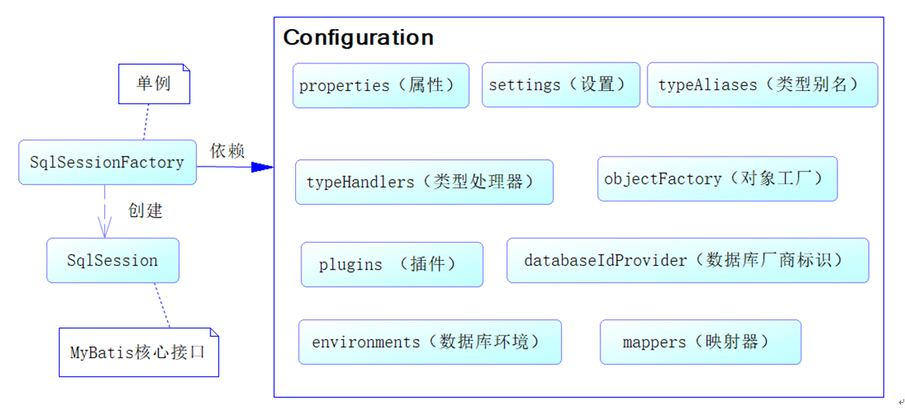
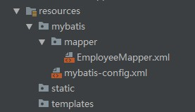
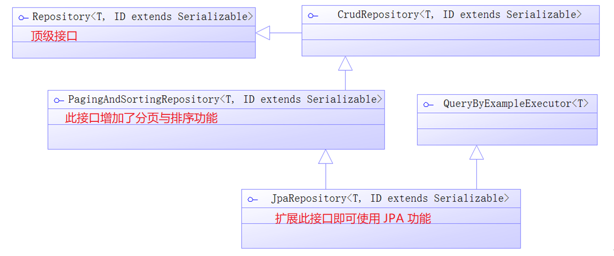

[TOC]

## Spring Boot数据访问

### 1、JDBC

```xml
<dependency>
	<groupId>org.springframework.boot</groupId>
	<artifactId>spring-boot-starter-jdbc</artifactId>
</dependency>
<dependency>
	<groupId>mysql</groupId>
	<artifactId>mysql-connector-java</artifactId>
	<scope>runtime</scope>
</dependency>
```

```yaml
# yaml配置数据源
spring:
  datasource:
    username: root
    password: 123456
    url: jdbc:mysql://192.168.15.22:3306/jdbc
    driver-class-name: com.mysql.jdbc.Driver
```

```java
// 测试
@RunWith(SpringRunner.class)
@SpringBootTest
@Slf4j
public class DataBaseTest {
    // 注入配置的数据源
    @Autowired
    DataSource dataSource;

    @Test
    public void testDbConnection() throws SQLException {
        log.info(dataSource.getClass() + "");
        Connection connection = dataSource.getConnection();
        log.info(connection + "");
        connection.close();
    }
}
```


效果：

​	默认是用org.apache.tomcat.jdbc.pool.DataSource作为数据源；

​	数据源的相关配置都在DataSourceProperties里面；

**自动配置原理**：

org.springframework.boot.autoconfigure.jdbc：

1、参考**DataSourceConfiguration**，根据配置**创建数据源**，默认使用**Tomcat连接池**；可以使用**spring.datasource.type**指定自定义的数据源类型；

2、SpringBoot默认可以支持；

```
org.apache.tomcat.jdbc.pool.DataSource、HikariDataSource、dbcp.BasicDataSource、
```

3、==自定义数据源类型==

```java
/**
 * Generic DataSource configuration.
 */
@ConditionalOnMissingBean(DataSource.class)
@ConditionalOnProperty(name = "spring.datasource.type")
static class Generic {

   @Bean
   public DataSource dataSource(DataSourceProperties properties) {
       // 使用DataSourceBuilder创建数据源，利用反射创建响应type的数据源，并且绑定相关属性
      return properties.initializeDataSourceBuilder().build();
   }

}
```

4、**DataSourceInitializer：ApplicationListener**(监听器)；

​	作用：

​		1）、runSchemaScripts();运行**建表语句**；

​		2）、runDataScripts();运行插入数据的sql语句；

默认只需要将**文件命名**为：

```properties
schema-*.sql、data-*.sql
# 即创建下列名称的文件放在resource文件夹之下，这种命名方式的SQL文件会被spring boot默认加载
默认规则：schema.sql，schema-all.sql；		

# 也可以在配置文件中使用  department.sql也是放在resource文件夹之下
spring:
  datasource:
    username: root
    password: 123456
    url: jdbc:mysql://120.79.59.125:3305/nano
    driver-class-name: com.mysql.jdbc.Driver
    schema:
      - classpath:department.sql	
    # 指定位置
```

5、操作数据库：如果有数据源就会自动配置**JdbcTemplate**操作数据库。

```java
    /**
     * 配置了数据源Spring Boot就会往容器中注入jdbcTemplate
     */
    @Autowired
    JdbcTemplate jdbcTemplate;

    @Test
    public Map<String, Object> map(){
        List<Map<String, Object>> list = jdbcTemplate.queryForList("select * from department");
        return list.get(0);
    }
```


#### 使用 JdbcTemplate 操作数据库

配置数据源后，已经自动配置好了 JdbcTemplate 类。可以直接使用。

定义服务接口

```java
public interface JdbcTmplUserService {
	
	public User getUser(Long id);

	public List<User> findUsers(String userName, String note);

	public int insertUser(User user);

	public int updateUser(User user);

	public int deleteUser(Long id);
	
	public User getUser2(Long id);
	
	public User getUser3(Long id);
}
```

实现该接口

```java
@Service
public class JdbcTmplUserServiceImpl implements JdbcTmplUserService {

    // 自动注入
	@Autowired
	private JdbcTemplate jdbcTemplate = null;

	// 获取映射关系
	private RowMapper<User> getUserMapper() {
		// 使用Lambda表达式创建用户映射关系
		RowMapper<User> userRowMapper = (ResultSet rs, int rownum) -> {
			User user = new User();
			user.setId(rs.getLong("id"));
			user.setUserName(rs.getString("user_name"));
			int sexId = rs.getInt("sex");
			SexEnum sex = SexEnum.getEnumById(sexId);
			user.setSex(sex);
			user.setNote(rs.getString("note"));
			return user;
		};
		return userRowMapper;
	}

	// 获取对象
	@Override
	public User getUser(Long id) {
		// 执行的SQL
		String sql = " select id, user_name, sex, note from t_user where id = ?";
		// 参数
		Object[] params = new Object[] { id };
		User user = jdbcTemplate.queryForObject(sql, params, getUserMapper());
		return user;
	}

	// 查询用户列表
	@Override
	public List<User> findUsers(String userName, String note) {
		// 执行的SQL
		String sql = " select id, user_name, sex, note from t_user " + "where user_name like concat('%', ?, '%') "
				+ "and note like concat('%', ?, '%')";
		// 参数
		Object[] params = new Object[] { userName, note };
		// 使用匿名类实现
		List<User> userList = jdbcTemplate.query(sql, params, getUserMapper());
		return userList;
	}

	// 插入数据库
	@Override
	public int insertUser(User user) {
		String sql = " insert into t_user (user_name, sex, note) values( ? , ?, ?)";
		return jdbcTemplate.update(sql, user.getUserName(), user.getSex().getId(), user.getNote());
	}

	// 更新数据库
	@Override
	public int updateUser(User user) {
		// 执行的SQL
		String sql = " update t_user set user_name = ?, sex = ?, note = ?  " + " where id = ?";
		return jdbcTemplate.update(sql, user.getUserName(), user.getSex().getId(), user.getNote(), user.getId());
	}

	// 删除数据
	@Override
	public int deleteUser(Long id) {
		// 执行的SQL
		String sql = " delete from t_user where id = ?";
		return jdbcTemplate.update(sql, id);
	}
	
}
```

对 JdbcTemplate 的映射关系需要开发者自己实现 RowMapper 接口，以完成数据库到POJO对象的映射。

JdbcTemplate 每调用一次就会进行一次数据库连接，两条语句就会产生两次连接，不推荐。

有时需要执行多条SQL 时，可以使用 StatementCallback 接口或 ConnectionCallback 接口，如下所示。

```java
	public User getUser2(Long id) {
	    // 通过Lambda表达式使用 StatementCallback
	    User result = this.jdbcTemplate.execute((Statement stmt) -> {
	        String sql1 = "select count(*) total from t_user where id= " + id;
	        ResultSet rs1 = stmt.executeQuery(sql1);
	        while (rs1.next()) {
	            int total = rs1.getInt("total");
	            System.out.println(total);
	        }
	        // 执行的SQL
	        String sql2 = " select id, user_name, sex, note from t_user"
	                + " where id = " + id;
	        ResultSet rs2 = stmt.executeQuery(sql2);
	        User user = null;
	        while (rs2.next()) {
	            int rowNum = rs2.getRow();
	            user= getUserMapper().mapRow(rs2, rowNum);
	        }
	        return user;
	    });
	    return result;
	}

	public User getUser3(Long id) {
	    // 通过Lambda表达式使用 ConnectionCallback 接口
	    return this.jdbcTemplate.execute((Connection conn) -> {
	        String sql1 = " select count(*) as total from t_user"
	                + " where id = ?";
	        PreparedStatement ps1 = conn.prepareStatement(sql1);
	        ps1.setLong(1, id);
	        ResultSet rs1 = ps1.executeQuery();
	        while (rs1.next()) {
	            System.out.println(rs1.getInt("total"));
	        }
	        String sql2 = " select id, user_name, sex, note from t_user "
	                + "where id = ?";
	        PreparedStatement ps2 = conn.prepareStatement(sql2);
	        ps2.setLong(1, id);
	        ResultSet rs2 = ps2.executeQuery();
	        User user = null;
	        while (rs2.next()) {
	            int rowNum = rs2.getRow();
	            user= getUserMapper().mapRow(rs2, rowNum);
	        }
	        return user;
	    });
	}
```


### 2、数据源

#### 配置数据源

- 使用 spring-boot-starter-jpa 之后默认使用内存数据库，如 h2, hqldb, Derby 等。

##### 使用默认数据源

依赖如下

```xml
<dependency>
	<groupId>org.springframework.boot</groupId>
	<artifactId>spring-boot-starter-data-jpa</artifactId>
</dependency>
<dependency>
	<groupId>com.h2database</groupId>
	<artifactId>h2</artifactId>
	<scope>runtime</scope>
</dependency>
```

此时使用的是 h2 内嵌数据库。


##### 自定义数据源

删除 h2 的依赖，添加MySQL的依赖。

```xml
<dependency>
	<groupId>mysql</groupId>
	<artifactId>mysql-connector-java</artifactId>
</dependency>
<dependency>
	<groupId>org.springframework.boot</groupId>
	<artifactId>spring-boot-starter-jdbc</artifactId>
</dependency>

<dependency>
	<groupId>org.springframework.boot</groupId>
	<artifactId>spring-boot-starter-data-jpa</artifactId>
</dependency>
```

在配置文件 application.properties 中修改配置即可配置数据源。

```properties
spring.datasource.url = jdbc:mysql://localhost:3306/chapter5
spring.datasource.username = root
spring.datasource.password = 123456
#spring.datasource.driver-class-name = com.mysql.jdbc.Driver

# 使用Tomcat 自带的数据库连接池
spring.datasource.tomcat.max-idle = 10
spring.datasource.tomcat.max-active = 50
spring.datasource.tomcat.max-wait = 10000
spring.datasource.tomcat.initial-size = 5
```

如果使用 DBCP 数据源需要加依赖

```xml
<dependency>
	<groupId>org.apache.commons</groupId>
	<artifactId>commons-dbcp2</artifactId>
</dependency>
```

同时配置如下

```properties
spring.datasource.url = jdbc:mysql://localhost:3306/spring_boot_chapter5
spring.datasource.username = root
spring.datasource.password = 123456
 
spring.datasource.type = org.apache.commons.dbcp2.BasicDataSource
spring.datasource.dbcp2.max-idle = 10
spring.datasource.dbcp2.max-total = 50
spring.datasource.dbcp2.max-wait-millis = 10000
spring.datasource.dbcp2.initial-size = 5
```

也可以使用 Druid 连接池。

查看数据库连接池类型

```java
@Component
// 实现Spring Bean生命周期接口ApplicationContextAware
public class DataSourceShow implements ApplicationContextAware {

	ApplicationContext applicationContext = null;

	// Spring容器会自动调用这个方法，注入Spring IoC容器
	@Override
	public void setApplicationContext(ApplicationContext applicationContext) throws BeansException {
		this.applicationContext = applicationContext;
		DataSource dataSource = applicationContext.getBean(DataSource.class);
		System.out.println("--------------------------------");
		System.out.println(dataSource.getClass().getName());
		System.out.println("--------------------------------");
	}

}
```

**操作数据库准备**

创建用户表

```mysql
CREATE TABLE t_user(
    id INT(12) NOT NULL,
    user_name VARCHAR(60) NOT NULL,
    sex INT(3) NOT NULL DEFAULT 1 CHECK (sex IN(1, 2)),
    note VARCHAR(128),
    PRIMARY KEY (id)
);
```

创建用户 User 类 POJO

```java
public class User {
 
	private Long id = null;
 
	private String userName = null;

	private String note = null;
 
	private SexEnum sex = null;

	// Getter and Setters
}
```

性别转换的枚举类

```java
public enum SexEnum {
    MALE(1, "男"),
    FEMALE(2, "女");
    
    private int id ;
    private String name;
    SexEnum(int id, String name) {
        this.id = id;
        this.name= name;
    }
    
    public static SexEnum getEnumById(int id) {
        for (SexEnum sex : SexEnum.values()) {
            if (sex.getId() == id) {
                return sex;
            }
        }
        return null;
    }
	
    // Getters and Setters
}
```

#### 整合Druid

```properties
spring:
  # 数据源基本配置
  datasource:
    username: root
    password: 123456
    url: jdbc:mysql://120.79.59.125:3305/nano?characterEncoding=utf8&useSSL=true
    driver-class-name: com.mysql.jdbc.Driver
    type: com.alibaba.druid.pool.DruidDataSource  # 使用type指定数据源 不使用默认数据源

  # 数据源其他配置 需要写个配置类配置一下 不然下面的配置不会生效 因为DataSourceProperties类中不会生效
    initialSize: 5
    minIdle: 5
    maxActive: 20
    maxWait: 60000
    timeBetweenEvictionRunsMillis: 60000
    minEvictableIdleTimeMillis: 300000
    validationQuery: SELECT 1 FROM DUAL
    testWhileIdle: true
    testOnBorrow: false
    testOnReturn: false
    poolPreparedStatements: true
    #   配置监控统计拦截的filters，去掉后监控界面sql无法统计，'wall'用于防火墙
    #filters: stat,wall,log4j  不要配置这条不然打不开不知道为啥
    maxPoolPreparedStatementPerConnectionSize: 20
    useGlobalDataSourceStat: true
    connectionProperties: druid.stat.mergeSql=true;druid.stat.slowSqlMillis=500

```

yml文件中配置了上述的参数，还需要自定义一个配置类来进行额外的设置，不然有的配置不能生效。

```java
导入druid数据源
@Configuration
public class DruidConfig {
	
    // 创建自己的数据源并加入到容器中	
    @ConfigurationProperties(prefix = "spring.datasource")
    @Bean
    public DataSource druid(){
       return  new DruidDataSource();
    }

    // 配置Druid的监控
    // 1、配置一个管理后台的Servlet
    @Bean
    public ServletRegistrationBean statViewServlet(){
        ServletRegistrationBean bean = new ServletRegistrationBean(new StatViewServlet(), "/druid/*");
        Map<String,String> initParams = new HashMap<>();
	    // 配置后台管理登录信息
        initParams.put("loginUsername","admin");
        initParams.put("loginPassword","123456");
        // 默认就是允许所有访问
        initParams.put("allow","");
        // 配置拒绝访问IP
        initParams.put("deny","192.168.15.21");

        bean.setInitParameters(initParams);
        return bean;
    }


    /**
     * 2、配置一个web监控的filter
     * @return Filter
     */
    @Bean
    public FilterRegistrationBean webStatFilter(){
        FilterRegistrationBean bean = new FilterRegistrationBean();
        bean.setFilter(new WebStatFilter());

        Map<String,String> initParams = new HashMap<>();
        // 排除拦截
        initParams.put("exclusions","*.js,*.css,/druid/*");
        bean.setInitParameters(initParams);
        bean.setUrlPatterns(Arrays.asList("/*"));

        return  bean;
    }
}

```

此时登录localhost:8080/druid/即可访问管理页面，登录账户上面配置类有设置。

### 3、整合MyBatis

```xml
<!-- https://mvnrepository.com/artifact/org.mybatis.spring.boot/mybatis-spring-boot-starter 去Maven仓库找依赖-->
<dependency>
    <groupId>org.mybatis.spring.boot</groupId>
    <artifactId>mybatis-spring-boot-starter</artifactId>
    <version>1.3.2</version>
</dependency>
```

下图是依赖关系


步骤：

​	1）、配置**数据源**相关属性（见上一节Druid）

​	2）、给数据库建表

​	3）、创建JavaBean


#### MyBatis的配置

MyBatis 是一个基于 SqlSessionFactory 构建的框架。SqlSessionFactory 的作用是生成 SqlSession 接口对象，它是操作MyBatis 的核心。

SqlSessionFactory 的作用是单一的，因此应该仅有一个这个对象，往往是只有一个SqlSessionFactory 对象，其构建是通过配置类（Configuration）完成的。

如下是 Configuration 可以配置的内容。



- properties：属性，属性文件一般通过 Spring 配置，而不是 MyBatis。
- settings：设置。可以改变 MyBatis 的底层行为，可以配置映射规则等。
- typeAlias：类型别名。
- mappers：映射器。开发的重点。
- typeHandlers：类型处理器。处理类型变化，多用于在枚举类型上。


#### 	注解版

```java
/**
* 指定这是一个操作数据库的mapper
*/
@Mapper
public interface DepartmentMapper {

    @Select("select * from department where id = #{id}")
    public Department getDeptById(Integer id);

    @Delete("delete from department where id = #{id}")
    public int deleteDeptById(Integer id);

    // 使用@Options注解能够返回得到自增主键ID
    @Options(useGeneratedKeys = true, keyProperty = "id")
    @Insert("insert into department(departmentName) values(#{departmentName})")
    public int insertDept(Department department);

    @Update("update department set departmentName = #{departmentName} where id = #{id}")
    public int updateDept(Department department);
}
```

问题：没有配置文件的时候JavaBean的属性名称需要与数据库表列名一致，驼峰和下划线是不能转换的，除非额外定义。如下。

**自定义MyBatis的配置规则**；给容器中添加一个**ConfigurationCustomizer**；

```java
@org.springframework.context.annotation.Configuration
public class MyBatisConfig {

    @Bean
    public ConfigurationCustomizer configurationCustomizer(){
        return new ConfigurationCustomizer(){
		   // 启用驼峰映射规则，默认不是驼峰映射规则	
            @Override
            public void customize(Configuration configuration) {
                configuration.setMapUnderscoreToCamelCase(true);
            }
        };
    }
}
```


```java
// 使用MapperScan批量扫描所有的Mapper接口；此时改包下的接口相当于自动添加了@Mapper注解
@MapperScan(value = "com.atguigu.springboot.mapper")
@SpringBootApplication
public class SpringBoot06DataMybatisApplication {
	public static void main(String[] args) {
		SpringApplication.run(SpringBoot06DataMybatisApplication.class, args);
	}
}
```

#### 配置文件版

配置文件在项目中的路径如下



也需要指定一个接口

```java
@Mapper
public interface EmployeeMapper {
    public Employee getEmpById(Integer id);
    public void insertEmp(Employee employee);
}
```

对应的配置文件如下 EmployeeMapper.xml

```xml
<?xml version="1.0" encoding="UTF-8" ?>
<!DOCTYPE mapper PUBLIC "-//mybatis.org//DTD Mapper 3.0//EN"
        "http://mybatis.org/dtd/mybatis-3-mapper.dtd">

<!--namespace与全类名接口绑定-->
<mapper namespace="com.example.demo.mapper.EmployeeMapper">
  
    <!--id与Mapper接口中的方法对应  resultType返回类型使用全类名-->
    <select id="getEmpById" resultType="com.example.demo.bean.Employee">
        SELECT * FROM employee WHERE id=#{id}
    </select>
  
    <insert id="insertEmp">
        INSERT INTO employee(lastName, email, gender, d_id) VALUES (#{lastName}, #{email}, #{gender}, #{dId})
    </insert>
</mapper>
```

全局配置文件 mybatis-config.xml

```xml
<?xml version="1.0" encoding="UTF-8" ?>

<!DOCTYPE configuration
        PUBLIC "-//mybatis.org//DTD Config 3.0//EN"
        "http://mybatis.org/dtd/mybatis-3-config.dtd">
<!--Mybatis全局配置文件-->

<configuration>
    <!--配置驼峰映射规则 其他设置去官网查-->
    <settings>
        <setting name="mapUnderscoreToCamelCase" value="true"/>
    </settings>
</configuration>
```

```yaml
# application.yml中的配置
mybatis:
  # 指定全局配置文件的位置
  config-location: classpath:mybatis/mybatis-config.xml 
  # 指定sql映射文件的位置
  mapper-locations: classpath:mybatis/mapper/*.xml  
```

更多使用参照

http://www.mybatis.org/spring-boot-starter/mybatis-spring-boot-autoconfigure/


### 4、整合SpringData JPA

#### 1）、SpringData简介


#### 2）、整合SpringData JPA

##### 概述

JPA 即 Java Persistence API， Java持久化 API，是定义了对象关系映射（ORM）以及实体对象持久化的标准接口。

JPA维护的核心是实体，它是通过一个持久化上下文维持。持久化上下文包括三个部分：

- 对象关系映射（ORM）
- 实体操作API
- 查询语言

JPA:ORM（Object Relational Mapping）；

1）、编写一个**实体类（bean）和数据表进行映射，并且配置好映射关系**；

```java
// 标明是一个实体类
@Entity(name = "user")
// 定义映射的表
@Table(name = "t_user")
public class User {
	// 标明主键
	@Id
	// 主键生成策略，递增
	@GeneratedValue(strategy = GenerationType.IDENTITY)
	private Long id = null;

	// 定义属性和表的映射关系 有时候数据库表名与类字段名对应不上就可以用这个
	@Column(name = "user_name")
	private String userName = null;

	private String note = null;
 
	// 定义转换器 将枚举类转换成数据库存储的类型
	@Convert(converter = SexConverter.class)
	private SexEnum sex = null;

	// Getters and Setters
}
```

以下是性别转换器，用于转换性别枚举。

```java
public class SexConverter implements AttributeConverter<SexEnum, Integer>{

    // 将枚举转换为数据库列
    @Override
    public Integer convertToDatabaseColumn(SexEnum sex) {
        return sex.getId();
    }

    // 将数据库列转换为枚举
    @Override
    public SexEnum convertToEntityAttribute(Integer id) {
        return SexEnum.getEnumById(id);
    }
}
```

2）、编写一个Dao接口来操作实体类对应的数据表（Repository）

接着可以 JPA接口进行操作。Spring 的 JPA 接口设计如下。



定义 JPA接口，不需要任何实现类，只需要扩展这个接口即可有默认的实现。第一个泛型参数为 User，是 DAO的实体类，第二个泛型参数是主键的类型，传入 Long 型。****

```java
public interface JpaUserRepository extends JpaRepository<User, Long> {
	
}
```

3）、基本的配置 JpaProperties

```yaml
# application.yml中
spring:  
 jpa:
    hibernate:
    # 更新或者创建数据表结构 如果没有数据表就创建 有就更新 使用这种方式都不需要创建数据库 可以自动根据实体类创建数据表
      ddl-auto: update
    # 允许控制台显示SQL
    show-sql: true
```

4）、测试类

开发控制器

```java
@Controller
@RequestMapping("/jpa")
public class JpaController {
    
	// 注入JPA接口，这里不需要使用实现类
	@Autowired
	private JpaUserRepository jpaUserRepository = null;

	@RequestMapping("/getUser")
	@ResponseBody
	public User getUser(Long id) {
		// 使用JPA接口查询对象
		User user = jpaUserRepository.findById(id).get();
		return user;
	}
}
```

配置类标注实体扫描,下列的注解非必须的，只要加了 jpa 的 starter 就会自动扫描。

```java
// 定义JPA接口扫描包路径
@EnableJpaRepositories(basePackages = "com.springboot.chapter5.dao")
// 定义实体Bean扫描包路径
@EntityScan(basePackages = "com.springboot.chapter5.pojo")
```

如果满足不了需求还可以使用 @Query 注解自定义查询语句。

```java
@Query("from user where user_name like concat('%', ?1, '%') " 
    + "and note like concat('', ?2, '%')")
public List<User> findUsers(String userName, String note);
```


**JPA命名规则**

同时满足一定的命名规则的方法还可以不写任何代码实现查询，如下

|      关键字       |          方法命名           |       sql where字句        |
| :---------------: | :-------------------------: | :------------------------: |
|        And        |      findByNameAndPwd       |  where name= ? and pwd =?  |
|        Or         |       findByNameOrSex       |   where name= ? or sex=?   |
|     Is,Equals     |   findById,findByIdEquals   |        where id= ?         |
|      Between      |       findByIdBetween       |  where id between ? and ?  |
|     LessThan      |      findByIdLessThan       |        where id < ?        |
|  LessThanEquals   |   findByIdLessThanEquals    |       where id <= ?        |
|    GreaterThan    |     findByIdGreaterThan     |        where id > ?        |
| GreaterThanEquals |  findByIdGreaterThanEquals  |       where id > = ?       |
|       After       |        findByIdAfter        |        where id > ?        |
|      Before       |       findByIdBefore        |        where id < ?        |
|      IsNull       |      findByNameIsNull       |     where name is null     |
| isNotNull,NotNull |      findByNameNotNull      |   where name is not null   |
|       Like        |       findByNameLike        |     where name like ?      |
|      NotLike      |      findByNameNotLike      |   where name not like ?    |
|   StartingWith    |   findByNameStartingWith    |    where name like '?%'    |
|    EndingWith     |    findByNameEndingWith     |    where name like '%?'    |
|    Containing     |    findByNameContaining     |   where name like '%?%'    |
|      OrderBy      |    findByIdOrderByXDesc     | where id=? order by x desc |
|        Not        |        findByNameNot        |      where name <> ?       |
|        In         | findByIdIn(Collection<?> c) |      where id in (?)       |
|       NotIn       |        findByNameNot        |      where name <> ?       |
|       True        |        findByAaaTue         |      where aaa = true      |
|       False       |       findByAaaFalse        |     where aaa = false      |
|    IgnoreCase     |    findByNameIgnoreCase     | where UPPER(name)=UPPER(?) |
|        top        |         findTop100          |  top 10/where ROWNUM <=10  |

如

```java
/**
 * 按用户名称模糊查询
 * @param userName 用户名
 * @return 用户列表
 */
List<User> findByUserNameLike(String userName);

/**
 * 根据主键查询
 * @param id -- 主键
 * @return 用户
 */
User getUserById(Long id);

/**
 * 按照用户名称或者备注进行模糊查询
 * @param userName 用户名
 * @param note 备注
 * @return 用户列表
 */
List<User> findByUserNameLikeOrNoteLike(String userName, String note);
```

##### 3. 如何使用JPA在数据库中非持久化一个字段？

假如我们有有下面一个类：

```java
Entity(name="USER")
public class User {
    
    @Id
    @GeneratedValue(strategy = GenerationType.AUTO)
    @Column(name = "ID")
    private Long id;
    
    @Column(name="USER_NAME")
    private String userName;
    
    @Column(name="PASSWORD")
    private String password;
  
    private String secrect;
  
}
```

如果我们想让`secrect` 这个字段不被持久化，也就是不被数据库存储怎么办？我们可以采用下面几种方法：

```java
static String transient1; // not persistent because of static
final String transient2 = “Satish”; // not persistent because of final
transient String transient3; // not persistent because of transient
@Transient
String transient4; // not persistent because of @Transient
```

一般使用后面两种方式比较多，我个人使用注解的方式比较多。