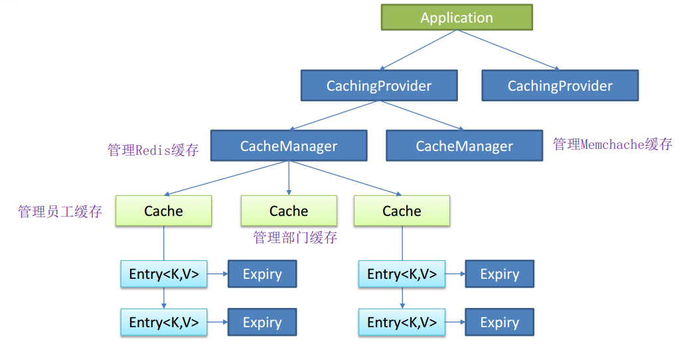
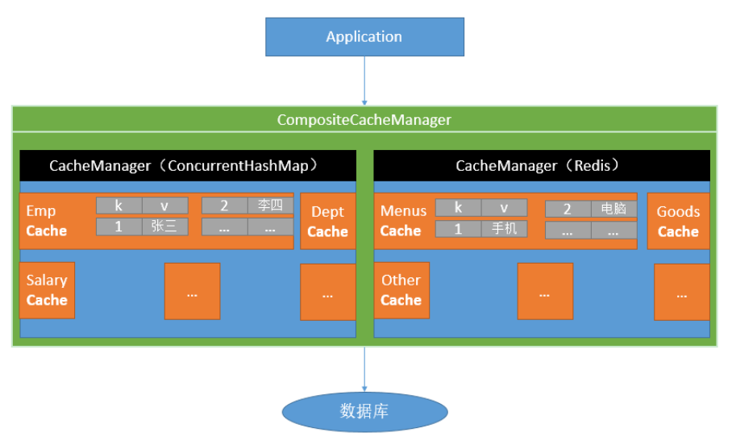

[TOC]

[TOC]

## Spring Boot 与缓存

可以存取一下临时性的数据，如发送给用户的三分钟有效的验证码之类。


### JSR-107

Java Caching定义了5个核心接口，分别是CachingProvider, CacheManager, Cache, Entry和 Expiry。

- **CachingProvider ** 定义了创建、配置、获取、管理和控制多个CacheManager。一个应用可以在运行期访问多个CachingProvider。
- **CacheManager** 定义了创建、配置、获取、管理和控制多个唯一命名的Cache，这些Cache存在于CacheManager的上下文中。一个CacheManager仅被一个CachingProvider所拥有。
- **Cache ** 是一个类似Map的数据结构并临时存储以Key为索引的值。一个Cache仅被一个CacheManager所拥有。
- **Entry**  是一个存储在Cache中的key-value对。
- **Expiry** 每一个存储在Cache中的条目有一个定义的有效期。一旦超过这个时间，条目为过期的状态。一旦过期，条目将不可访问、更新和删除。缓存有效期可以通过ExpiryPolicy设置。 

用得少。



---

### Spring 缓存抽象

Spring从3.1开始定义了org.springframework.cache.**Cache**
和org.springframework.cache.**CacheManager**接口来统一不同的缓存技术；并支持使用JCache（JSR-107）注解简化我们开发； 

- Cache接口为缓存的组件规范定义，包含缓存的各种操作集合；
- Cache接口下Spring提供了各种xxxCache的实现；如RedisCache， EhCacheCache ,ConcurrentMapCache等； 



几个重要的缓存组件


-----

### Spring Boot整合缓存

##### 环境准备

1.配置好数据库 数据源 数据表之类

2.创建JavaBean与数据库表对应

3.整合MyBatis

##### 使用缓存

1.开启基于注解的缓存。

2.标注缓存注解即可。

---

### Spring Boot整合 Redis

依赖

```xml
<!--引入缓存依赖-->
<dependency>
	<groupId>org.springframework.boot</groupId>
	<artifactId>spring-boot-starter-cache</artifactId>
</dependency>
<!--没有引入Redis就使用默认的缓存机制-->
<dependency>
	<groupId>org.springframework.boot</groupId>
	<artifactId>spring-boot-starter-data-redis</artifactId>
</dependency>
```

JavaBean

```java
// 一定要实现Serializable接口否则Redis会出错
@Data
public class Employee implements Serializable {
    private Integer id;

    private String lastName;
    
    private Integer gender;

    private String email;

    private Integer dId;
}
```

Spring Boot默认往容器中注入了StringRedisTemplate 和 RedisTemplate。使用的时候直接注入即可。

docker装Redis，端口映射直接定义好即可。

```yml
# application.yml中配置Redis服务器地址
spring:
  redis:
    host: 120.79.59.125
```


