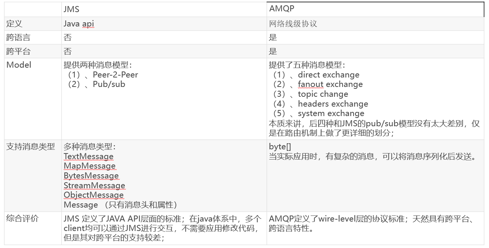
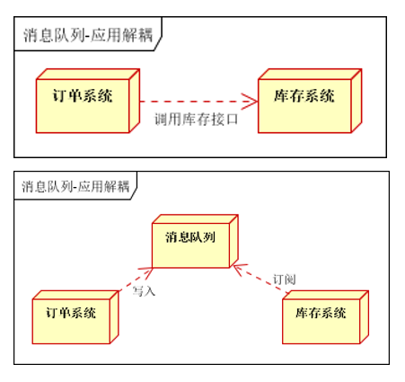
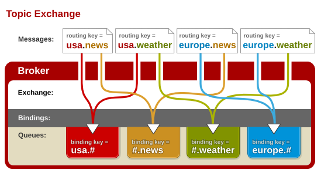
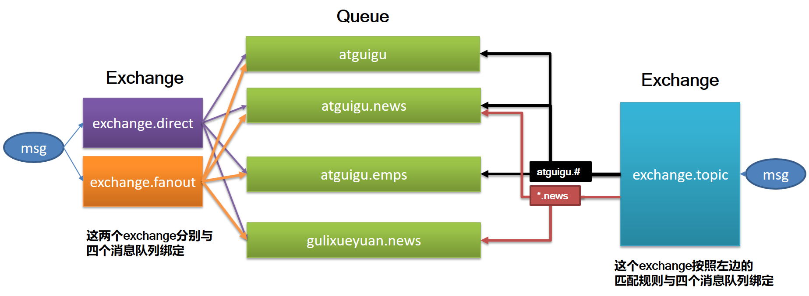
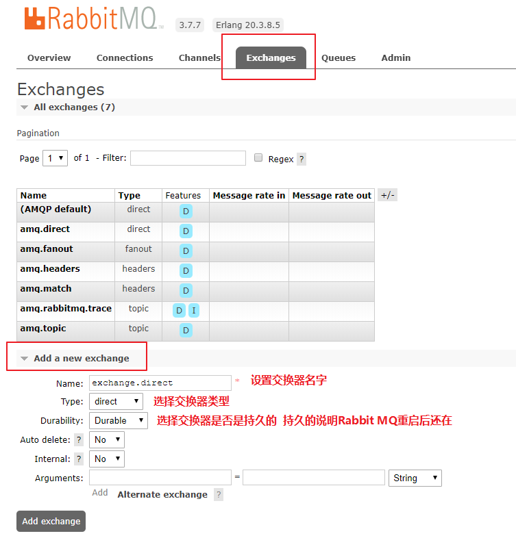
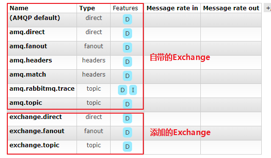
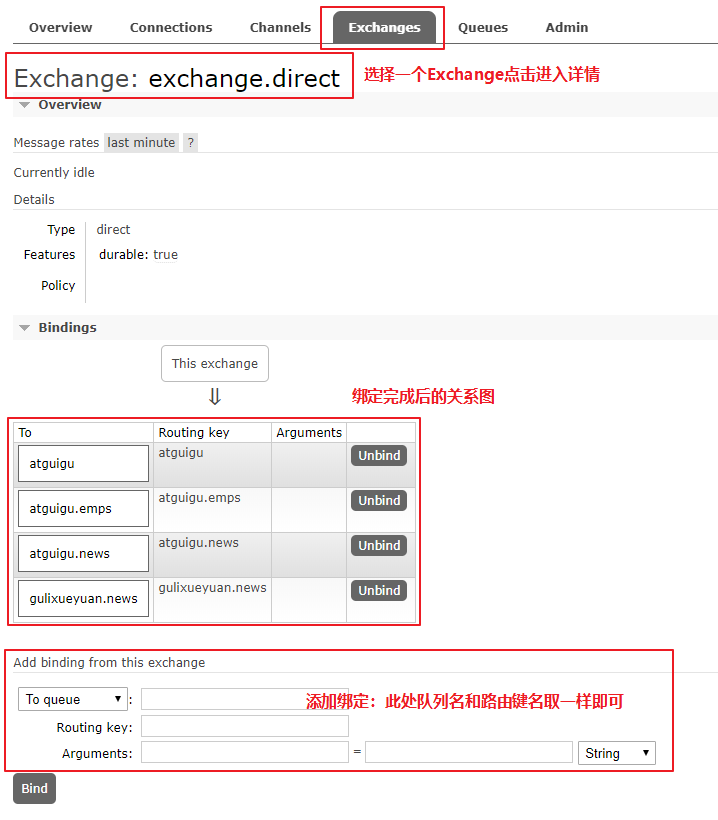
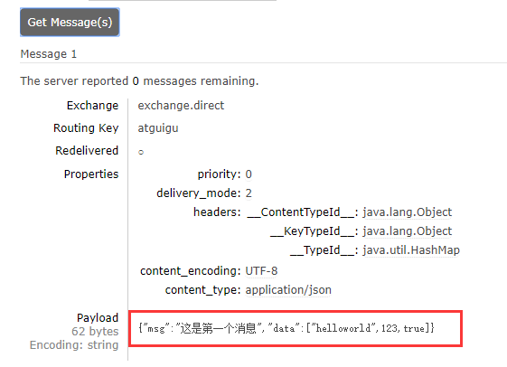

[TOC]

[TOC]

## Spring Boot与消息

### 概述

1.大多应用中，可通过消息服务中间件来提升系统异步通信、扩展解耦能力

2.消息服务中两个重要概念：

​       消息代理（message broker）和目的地（destination）

当消息发送者发送消息以后，将由消息代理接管，消息代理保证消息传递到指定目的地。消息代理就相当于消息服务器。

3.消息队列主要有两种形式的目的地

- **队列（queue）**：点对点消息通信（point-to-point）

- **主题（topic）**：发布（publish）/订阅（subscribe）消息通信

4.点对点式：

- 消息发送者发送消息，消息代理将其放入一个队列中，消息接收者从队列中获取消息内容，消息读取后被移出队列

- 消息只有唯一的发送者和接受者，但并不是说只能有一个接收者。一旦消费就会被删除。

5.发布订阅式：

- 发送者（发布者）发送消息到主题，多个接收者（订阅者）监听（订阅）这个主题，那么就会在消息到达时同时收到消息

6.JMS（Java Message Service）JAVA消息服务：

- 基于JVM消息代理的规范。ActiveMQ、HornetMQ是JMS实现。

7.AMQP（Advanced Message Queuing Protocol）

- 高级消息队列协议，也是一个消息代理的规范，兼容JMS

- RabbitMQ是AMQP的实现
- JMS与AMQP对比表



8.Spring支持

- spring-jms提供了对JMS的支持

- spring-rabbit提供了对AMQP的支持

- 需要ConnectionFactory的实现来连接消息代理

- 提供JmsTemplate、RabbitTemplate来发送消息

- @JmsListener（JMS）、@RabbitListener（AMQP）注解在方法上监听消息代理发布的消息

- @EnableJms、@EnableRabbit开启支持

9.Spring Boot自动配置

- JmsAutoConfiguration

- RabbitAutoConfiguration

#### 消息的作用

##### 异步消息


完成注册之后发邮件和发短信，之前注册完成就发邮件和短信，耗时150毫秒，第二种方式是注册完后开现场同时发邮件和短信，耗时100毫秒；采用消息中间件则注册完成之后写到消息队列，之后慢慢发送，因为发短信和邮件并不是需要及时的，只需要55毫秒。

##### 应用解耦



##### 流量削峰


----

### RabbitMQ

**RabbitMQ**简介：

​	RabbitMQ是一个由erlang开发的AMQP(Advanved Message Queue Protocol)的开源实现。


----

#### **核心**概念

**1. Message**

消息，消息是不具名的，它由**消息头和消息体**组成。消息体是不透明的，而消息头则由一系列的可选属性组成，这些属性包括routing-key（路由键）、priority（相对于其他消息的优先权）、delivery-mode（指出该消息可能需要持久性存储）等。

**2. Publisher**

消息的**生产者**，也是一个向交换器发布消息的客户端应用程序。

**3. Exchange**

**交换器**，用来接收生产者发送的消息并将这些消息路由给服务器中的队列。

Exchange有4种类型：direct(默认)，fanout, topic, 和headers，不同类型的Exchange转发消息的策略有所区别。交换器决定消息发往何处。 

**4. Queue**

**消息队列**，用来保存消息直到发送给消费者。它是消息的**容器**，也是消息的终点。一个消息可投入一个或多个队列。消息一直在队列里面，等待消费者连接到这个队列将其取走。

**5. Binding**

绑定，用于**消息队列和交换器**之间的关联。一个绑定就是基于路由键将交换器和消息队列连接起来的路由规则，所以可以将交换器理解成一个由绑定构成的**路由表**。

Exchange 和Queue的绑定可以是**多对多**的关系。

**6. Connection**

网络连接，比如一个TCP连接。

**7. Channel**

**信道**，多路复用连接中的一条独立的双向数据流通道。信道是建立在真实的**TCP连接**内的虚拟连接，AMQP 命令都是通过信道发出去的，不管是发布消息、订阅队列还是接收消息，这些动作都是通过**信道**完成。因为对于操作系统来说建立和销毁 TCP 都是非常昂贵的开销，所以引入了信道的概念，以**复用一条 TCP 连接**。

**8. Consumer**

消息的消费者，表示一个从消息队列中取得消息的客户端应用程序。

**9. Virtual Host**

虚拟主机，表示**一批交换器、消息队列和相关对象**。虚拟主机是共享相同的身份认证和加密环境的独立服务器域。每个 vhost 本质上就是一个 mini 版的 RabbitMQ 服务器，拥有自己的队列、交换器、绑定和权限机制。vhost 是 AMQP 概念的基础，必须在**连接时指定**，RabbitMQ 默认的 vhost 是 ==/== 。

**10. Broker**

表示消息队列**服务器**实体。


消息生产者发给服务器，服务器发给虚拟主机，虚拟主机将消息发给交换器，然后通过绑定规则发送给消息队列。消费者与消息队列取消息，通过管道进行消息获取。

----

#### RabbitMQ运行机制

##### AMQP 中的消息路由

AMQP 中消息的路由过程和 Java 开发者熟悉的 JMS 存在一些差别，AMQP 中增加了 **Exchange** 和 **Binding** 的角色。生产者把消息发布到 Exchange 上，消息最终到达队列并被消费者接收，而 Binding 决定交换器的消息应该发送到那个队列。


服务器中有许多交换器和队列。


##### Exchange类型

**Exchange**分发消息时根据类型的不同分发策略有区别，目前共四种类型：**direct、fanout、topic**、headers 。headers 匹配 AMQP 消息的 header 而不是路由键， headers 交换器和 direct 交换器完全一致，但性能差很多，目前几乎用不到了，所以直接看另外三种类。

1. **Direct Exchange**

消息中的路由键（routing key）如果和 Binding 中的 binding key 一致，
交换器就将消息发到对应的队列中。路由键与队列名==完全匹配==，如果一个队列绑定到交换机要求路由键为“dog”，则只转发 routing key 标记为“dog”的消息，不会转发“dog.puppy”，也不会转发“dog.guard”等等。它是**完全匹配、单播的模式**。


2. **Fanout Exchange**


每个发到 fanout 类型交换器的消息都会分到**所有绑定的队列**上去。fanout
交换器**不处理路由键**，只是简单的将队列绑定到交换器上，每个发送到交换器的消息都会被转发到与该交换器绑定的所有队列上。很像子网广播，每台子网内的主机都获得了一份复制的消息。fanout类型转发消息是最快的。类似于==广播模式==。


3. **Topic Exchange**



topic 交换器通过**模式匹配**分配消息的路由键属性，将路由键和某个模式进行匹配，此时队列需要绑定到一个模式上。它将路由键和绑定键的字符串切分成单词，这些**单词之间用点隔开**。它同样也会识别两个通配符：符号“#”和符号“**”**。==**#**匹配**0**个或多个单词，* 匹配一个单词==。类似于选择性的广播，**匹配才广播**。

----

#### 安装Rabbit MQ


测试用的Exchange和Queue如下图




参考Docker相关内容。进入Web界面。添加一个Exchange。



继续添加其他Exchange交换器，得到如下的。




创建消息队列Queue


将Exchange与Queue进行绑定



此处exchange.direct分别与四个Queue进行了绑定。

注意exchange.topic与Queue的绑定中的路由键写法。


此时绑定完毕。既可以在Web管理台中发送测试消息。


模式就是按照上述的Exchange类型进行发送的。

----

#### Spring Boot整合Rabbit MQ

依赖

```xml
<!--整合Rabbit MQ-->
<dependency>
	<groupId>org.springframework.boot</groupId>
	<artifactId>spring-boot-starter-amqp</artifactId>
</dependency>
```

上述的依赖默认引入的依赖如下

```xml
<dependencies>
    <dependency>
      <groupId>org.springframework.boot</groupId>
      <artifactId>spring-boot-starter</artifactId>
      <version>2.1.6.RELEASE</version>
      <scope>compile</scope>
    </dependency>
    <dependency>
      <groupId>org.springframework</groupId>
      <artifactId>spring-messaging</artifactId>
      <version>5.1.8.RELEASE</version>
      <scope>compile</scope>
    </dependency>
    <dependency>
      <groupId>org.springframework.amqp</groupId>
      <artifactId>spring-rabbit</artifactId>
      <version>2.1.7.RELEASE</version>
      <scope>compile</scope>
      <exclusions>
        <exclusion>
          <artifactId>http-client</artifactId>
          <groupId>com.rabbitmq</groupId>
        </exclusion>
      </exclusions>
    </dependency>
</dependencies>
```

自动配置

1. RabbitAutoConfiguration类定义了自动配置的信息。

2. 有自动配置了连接工厂ConnectionFactory；
3. RabbitProperties 封装了 RabbitMQ的配置 可以根据此类来在配置文件中修改相关的配置。
4. RabbitTemplate ：给RabbitMQ发送和接受消息；这个对象是自动注入到容器中的，因此可以直接从容器中获取。
5. AmqpAdmin ： RabbitMQ系统管理功能组件;创建和删除 Queue，Exchange，Binding。自动配置也已经自动注入了这个类。可以直接Autowired注入。
6. @EnableRabbit +  @RabbitListener 监听消息队列的内容

```java
@EnableRabbit  // 开启基于注解的RabbitMQ模式
@SpringBootApplication
public class Springboot02AmqpApplication {
	public static void main(String[] args) {
		SpringApplication.run(Springboot02AmqpApplication.class, args);
	}
}
```

测试发送消息给消息队列

```java
@RunWith(SpringRunner.class)
@SpringBootTest
public class Springboot02AmqpApplicationTests {

	@Autowired
	RabbitTemplate rabbitTemplate;

	/**
	 * 1、测试单播（点对点）
	 */
	@Test
	public void testSingleBroadcast() {
		// Message需要自己构造一个;定义消息体内容和消息头
		// rabbitTemplate.send(exchage, routeKey, message);

		// object默认当成消息体，只需要传入要发送的对象，自动序列化发送给rabbitmq；
		// rabbitTemplate.convertAndSend(exchage, routeKey, object);
        
		Map<String,Object> map = new HashMap<>();
		map.put("msg","这是第一个消息");
		map.put("data", Arrays.asList("helloworld", 123, true));
		// 对象被默认序列化以后发送出去 exchange.direct是交换器名称，atguigu是路由键 直接传入map消息体
		rabbitTemplate.convertAndSend("exchange.direct", "atguigu", map);
	}

	/**
	* 测试接受数据,如何将数据自动的转为json发送出去 接收只后消息队列中数据就没了
	*/
	@Test
	public void receive(){
		Object o = rabbitTemplate.receiveAndConvert("atguigu");
		System.out.println(o.getClass());
		System.out.println(o);
	}

	/**
	 * 广播
	 */
	@Test
	public void sendMsg(){
		rabbitTemplate.convertAndSend("exchange.fanout","",new Book("红楼梦","曹雪芹"));
	}

}
```

测试单播方式只会可以从Rabbit MQ服务器看到如下接收到的消息。


上述服务器接收到的是序列号之后的数据很乱，可以自定义一个转换器注入容器，如下

```java
@Configuration
public class MyAMQPConfig {

    /**
     * 接收数据转换JSON输出
     * @return 自定义的converter注入容器
     */
    @Bean
    public MessageConverter messageConverter(){
        return new Jackson2JsonMessageConverter();
    }
}
```

之后再次发送消息到服务器就会显示成为JSON数据格式了。如下图。



从消息队列接收数据

```java
	/**
	 * 接受数据,如何将数据自动的转为json发送出去
	 * 从消息队列里面接收消息
	 * 由于定义了JSON转换器，此时本地接收到的数据也是反序列化之后得到的数据形式
	 */
	@Test
	public void receive(){
		Object o = rabbitTemplate.receiveAndConvert("atguigu");
		System.out.println(o.getClass());	// class java.util.HashMap
		System.out.println(o.toString());	// {msg=这是第一个消息, data=[helloworld, 123, true]}
	}
```

发送广播数据

```java
	/**
	 * 广播
	 * 直接发送给广播类型的Exchange交换器
	 * exchange.fanout是Exchange 不指定路由键
	 */
	@Test
	public void sendMsg(){
		rabbitTemplate.convertAndSend("exchange.fanout","", "123124");
	}
```

消息监听器

```java
import org.springframework.amqp.core.Message;
import org.springframework.amqp.rabbit.annotation.RabbitListener;
import org.springframework.stereotype.Service;
import java.util.HashMap;
import java.util.Map;

/**
 *  Rabbit MQ监听消息队列
 *  @author cz
 */
@Service
public class RabbitMqService {

    /**
     * 监听atguigu.news队列中的消息
     * @param map 预期的消息类型 可以自定义Bean
     * 这种方式是消息直接反序列成对象接收
     */
    @RabbitListener(queues = "atguigu.news")
    public void receive(Map<String,Object> map){

        System.out.println("收到消息：" + map.toString());
    }

    /**
     * 监听消息队列并且传入特定的Message对象可以获取到更多信息
     * @param message org.springframework.amqp.core.Message;类型
     */
    @RabbitListener(queues = "atguigu")
    public void receive02(Message message){
        // 获取消息
        System.out.println(message.getBody());
        // 获取消息头等信息
        System.out.println(message.getMessageProperties());
    }

}
```

当消息队列中有消息即可。


前面是在Web管理界面创建Exchange、Queue和绑定规则。可以在程序中实现。如下。

```java
    /**
	 * 管理本地创Exchange和Queue的操作
	 */
	@Autowired
	AmqpAdmin amqpAdmin;

	@Test
	public void createExchange(){

		// 创建一个Exchange 指定名字，也可以指定是否Durable，看构造方法
		amqpAdmin.declareExchange(new DirectExchange("amqpadmin.exchange"));
		System.out.println("创建完成");

		// 创建一个队列，设置为Durable持久化
		amqpAdmin.declareQueue(new Queue("amqpadmin.queue",true));

		// 创建绑定规则 传入参数具体看构造方法
		amqpAdmin.declareBinding(new Binding("amqpadmin.queue", Binding.DestinationType.QUEUE, "amqpadmin.exchange","amqp.haha",null));

		// 删除操作
		amqpAdmin.deleteExchange("amqpadmin.exchange");
		amqpAdmin.deleteQueue("amqpadmin.queue");
	}
```


