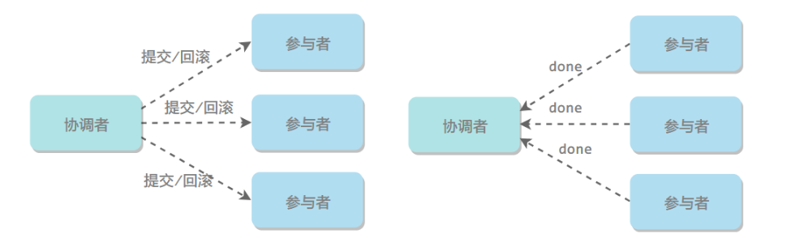
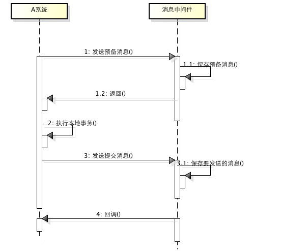
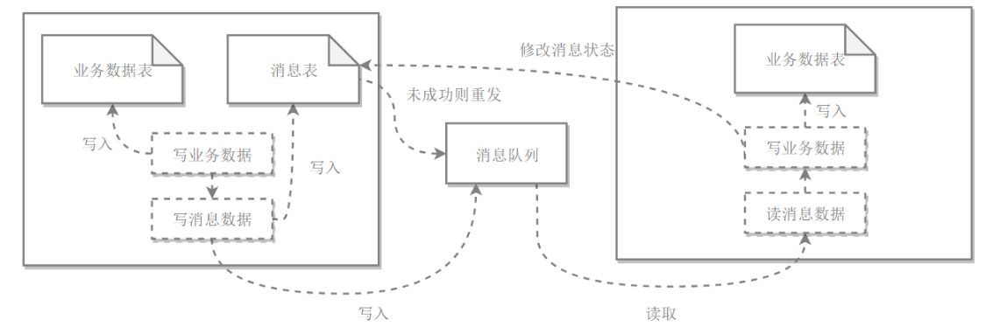

[TOC]

## 分布式基础理论

### 基础理论

#### CAP理论

分布式系统不可能同时满足一致性（C：Consistency）、可用性（A：Availability）和分区容忍性（P：Partition Tolerance），最多只能同时满足其中两项。


##### 1. 一致性Consistency

一致性指的是多个数据副本是否能保持一致的特性，在一致性的条件下，系统在执行数据更新操作之后能够从一致性状态转移到另一个一致性状态。

对系统的一个数据更新成功之后，如果所有用户都能够读取到最新的值，该系统就被认为具有强一致性。

##### 2. 可用性Availability

可用性指分布式系统在面对各种异常时可以提供正常服务的能力，可以用系统可用时间占总时间的比值来衡量，4 个 9 的可用性表示系统 99.99% 的时间是可用的。

在可用性条件下，要求系统提供的服务一直处于可用的状态，对于用户的每一个操作请求总是能够在有限的时间内返回结果。

##### 3. 分区容忍性Partion Tolerance

网络分区指分布式系统中的节点被划分为多个区域，每个区域内部可以通信，但是区域之间无法通信。

在分区容忍性条件下，分布式系统在遇到任何网络分区故障的时候，仍然需要能对外提供一致性和可用性的服务，除非是整个网络环境都发生了故障。

##### 4. 权衡

在分布式系统中，分区容忍性必不可少，因为需要总是假设网络是不可靠的。因此，CAP 理论实际上是要在**可用性和一致性**之间做权衡。

**当发生网络分区（P）的时候，如果我们要继续服务，那么强一致性和可用性只能 2 选 1。也就是说当网络分区之后 P 是前提，决定了 P 之后才有 C 和 A 的选择。也就是说分区容错性（Partition tolerance）我们是必须要实现的。**

可用性和一致性往往是冲突的，很难使它们同时满足。在多个节点之间进行数据同步时，

- 为了保证一致性（CP），不能访问未同步完成的节点，也就失去了部分可用性；
- 为了保证可用性（AP），允许读取所有节点的数据，但是数据可能不一致。


#### BASE理论

BASE 是基本可用（Basically Available）、软状态（Soft State）和最终一致性（Eventually Consistent）三个短语的缩写。

BASE 理论是对 CAP 中一致性和可用性权衡的结果，它的核心思想是：即使无法做到强一致性，但每个应用都可以根据自身业务特点，采用适当的方式来使系统达到最终一致性。

即使无法做到强一致性，但每个应用都可以根据自身业务特点，采用**适当的方式来使系统达到最终一致性**。也就是牺牲数据的一致性来满足系统的高可用性，系统中一部分数据不可用或者不一致时，仍需要保持系统整体“主要可用”。

针对数据库领域，BASE 思想的主要实现是对**业务数据进行拆分**，让不同的数据分布在不同的机器上，以提升系统的可用性，当前主要有以下两种做法：

- 按功能划分数据库。
- 分片（如开源的Mycat、Amoeba等）。

由于拆分后会涉及分布式事务问题，所以 eBay 在该 BASE 论文中提到了如何用最终一致性的思路来实现高性能的分布式事务。

##### 1. 基本可用

指分布式系统在出现故障的时候，保证核心可用，允许损失部分可用性。

例如，电商在做促销时，为了保证购物系统的稳定性，部分消费者可能会被引导到一个降级的页面。

##### 2. 软状态

指允许系统中的数据存在中间状态，并认为该中间状态不会影响系统整体可用性，即允许系统不同节点的数据副本之间进行同步的过程存在时延。

##### 3. 最终一致性

最终一致性强调的是系统中所有的数据副本，在经过一段时间的同步后，最终能达到一致的状态。

ACID 要求强一致性，通常运用在传统的数据库系统上。而 BASE 要求最终一致性，通过牺牲强一致性来达到可用性，通常运用在大型分布式系统中。

在实际的分布式场景中，不同业务单元和组件对一致性的要求是不同的，因此 ACID 和 BASE 往往会结合在一起使用。


### 分布式锁

在单机场景下，可以使用语言的内置锁来实现进程同步。但是在分布式场景下，需要同步的进程可能位于不同的节点上，那么就需要使用分布式锁。

阻塞锁通常使用互斥量来实现：

- 互斥量为 0 表示有其它进程在使用锁，此时处于锁定状态；
- 互斥量为 1 表示未锁定状态。

1 和 0 可以用一个整型值表示，也可以用某个数据是否存在表示。

#### 数据库的唯一索引

获得锁时向表中插入一条记录，释放锁时删除这条记录。唯一索引可以保证该记录只被插入一次，那么就可以用这个记录是否存在来判断是否存于锁定状态。

存在以下几个问题：

- 锁没有失效时间，解锁失败的话其它进程无法再获得该锁。
- 只能是非阻塞锁，插入失败直接就报错了，无法重试。
- 不可重入，已经获得锁的进程也必须重新获取锁。

#### Redis的SETNX指令

使用 SETNX（set if not exist）指令插入一个键值对，如果 Key 已经存在，那么会返回 False，否则插入成功并返回 True。

SETNX 指令和数据库的唯一索引类似，保证了只存在一个 Key 的键值对，那么可以用一个 Key 的键值对是否存在来判断是否存于锁定状态。

EXPIRE 指令可以为一个键值对设置一个过期时间，从而避免了数据库唯一索引实现方式中释放锁失败的问题。

#### Redis的RedLock算法

使用了多个 Redis 实例来实现分布式锁，这是为了保证在发生单点故障时仍然可用。

- 尝试从 N 个互相独立 Redis 实例获取锁；
- 计算获取锁消耗的时间，只有当这个时间小于锁的过期时间，并且从大多数（N / 2 + 1）实例上获取了锁，那么就认为锁获取成功了；
- 如果锁获取失败，就到每个实例上释放锁。

#### Zookeeper的有序节点

##### 1. Zookeeper抽象模型

Zookeeper 提供了一种树形结构的命名空间，/app1/p_1 节点的父节点为 /app1。


##### 2. 节点类型

- 永久节点：不会因为会话结束或者超时而消失；
- 临时节点：如果会话结束或者超时就会消失；
- 有序节点：会在节点名的后面加一个数字后缀，并且是有序的，例如生成的有序节点为 /lock/node-0000000000，它的下一个有序节点则为 /lock/node-0000000001，以此类推。

##### 3. 监听器

为一个节点注册监听器，在节点状态发生改变时，会给客户端发送消息。

##### 4. 分布式锁实现

- 创建一个锁目录 /lock；
- 当一个客户端需要获取锁时，在 /lock 下创建临时的且有序的子节点；
- 客户端获取 /lock 下的子节点列表，判断自己创建的子节点是否为当前子节点列表中序号最小的子节点，如果是则认为获得锁；否则监听自己的前一个子节点，获得子节点的变更通知后重复此步骤直至获得锁；
- 执行业务代码，完成后，删除对应的子节点。

##### 5. 会话超时

如果一个已经获得锁的会话超时了，因为创建的是临时节点，所以该会话对应的临时节点会被删除，其它会话就可以获得锁了。可以看到，Zookeeper 分布式锁不会出现数据库的唯一索引实现的分布式锁释放锁失败问题。

##### 6. 羊群效应

一个节点未获得锁，只需要监听自己的前一个子节点，这是因为如果监听所有的子节点，那么任意一个子节点状态改变，其它所有子节点都会收到通知（羊群效应），而我们只希望它的后一个子节点收到通知。


### 分布式事务

指事务的操作位于不同的节点上，需要保证事务的 ACID 特性。

例如在下单场景下，库存和订单如果不在同一个节点上，就涉及分布式事务。

分布式事务就是指事务的参与者、支持事务的服务器、资源服务器以及事务管理器分别位于不同的分布式系统的不同节点之上。以上是百度百科的解释，简单的说，就是一次大的操作由不同的小操作组成，这些小的操作分布在不同的服务器上，且属于不同的应用，分布式事务需要保证这些小操作要么全部成功，要么全部失败。本质上来说，分布式事务就是为了保证不同数据库的数据一致性。

#### 概述

##### 1. 引入

在说分布式事务之前，我们先从数据库事务说起。 数据库事务可能大家都很熟悉，在开发过程中也会经常使用到。但是即使如此，可能对于一些细节问题，很多人仍然不清楚。比如很多人都知道数据库事务的几个特性：原子性(Atomicity )、一致性( Consistency )、隔离性或独立性 ( Isolation)和持久性(Durabilily)，简称就是 **ACID**。但是再往下比如问到隔离性指的是什么的时候可能就不知道了，或者是知道隔离性是什么但是再问到数据库实现隔离的都有哪些级别，或者是每个级别他们有什么区别的时候可能就不知道了。

假如数据库在提交事务的时候突然断电，那么它是怎么样恢复的？ 为什么要提到这个知识点呢？ 因为**分布式系统的核心就是处理各种异常情况，这也是分布式系统复杂的地方**，因为分布式的网络环境很复杂，这种“断电”故障要比单机多很多，所以我们在做分布式系统的时候，最先考虑的就是这种情况。这些异常可能有 **机器宕机、网络异常、消息丢失、消息乱序、数据错误、不可靠的TCP、存储数据丢失、其他异常**等等。

接着说本地事务数据库断电的这种情况，它是怎么保证数据一致性的呢？我们使用 SQL Server 来举例，我们知道我们在使用 SQL Server 数据库是由**两个文件**组成的，一个**数据库文件和一个日志文件**，通常情况下，日志文件都要比数据库文件大很多。数据库进行任何写入操作的时候都是要**先写日志**的，同样的道理，我们在执行事务的时候数据库首先会记录下这个事务的 redo 操作日志，然后**才开始真正操作数据库**，在操作之前首先会把**日志文件写入磁盘**，那么当突然断电的时候，即使操作没有完成，在重新启动数据库时候，数据库会根据当前数据的情况进行 undo 回滚或者是 redo 前滚，这样就保证了数据的强一致性。

接着，我们就说一下分布式事务。

当我们的**单个数据库**的性能产生瓶颈的时候，我们可能会对**数据库进行分区**，这里所说的分区指的是物理分区，分区之后可能不同的库就处于不同的服务器上了，这个时候单个数据库的 ACID 已经**不能适应**这种情况了，而在这种 ACID 的集群环境下，再想保证集群的 ACID 几乎是很难达到，或者即使能达到那么效率和性能会大幅下降，最为关键的是再很难扩展新的分区了，这个时候如果再追求集群的 ACID 会导致我们的系统变得很差，这时我们就需要引入一个**新的理论**原则来适应这种集群的情况，就是 CAP 定理。

这个时候有人可能会把数据库的2PC（两阶段提交）搬出来说话了。OK，我们就来看一下数据库的两阶段提交。

对数据库分布式事务有了解的同学一定知道数据库支持的 2PC，又叫做 XA Transactions。

```
MySQL从5.5版本开始支持，SQL Server 2005 开始支持，Oracle 7 开始支持。
```

其中，**XA 是一个两阶段提交协议**，该协议分为以下两个阶段：

- **第一阶段**：事务协调器要求每个涉及到事务的数据库预提交(precommit)此操作，并反映是否可以提交。
- **第二阶段**：事务协调器要求每个数据库提交数据。

其中，如果有任何一个数据库否决此次提交，那么所有数据库都会被要求**回滚**它们在此事务中的那部分信息。这样做的缺陷是什么呢? 咋看之下我们可以在**数据库分区之间获得一致性**。

如果 CAP 定理是对的，那么它**一定会影响到可用性**。

如果说系统的可用性代表的是执行某项操作相关所有组件的可用性的和。那么在两阶段提交的过程中，可用性就代表了涉及到的每一个数据库中可用性的和。我们假设两阶段提交的过程中每一个数据库都具有 99.9% 的可用性，那么如果两阶段提交涉及到两个数据库，这个结果就是 99.8%。根据系统可用性计算公式，假设每个月 43200 分钟，99.9% 的可用性就是 43157 分钟, 99.8% 的可用性就是 43114 分钟，相当于每个月的宕机时间增加了 43 分钟。

以上，可以验证出来，CAP 定理从理论上来讲是正确的，CAP 我们先看到这里，等会再接着说。

在分布式系统中，我们往往追求的是可用性，它的重要程序比一致性要高，那么如何实现高可用性呢？ 前人已经给我们提出来了另外一个理论，就是 **BASE 理论**，它是用来对 CAP 定理进行进一步扩充的。

BASE理论是对CAP中的一致性和可用性进行一个权衡的结果，理论的核心思想就是：**我们无法做到强一致，但每个应用都可以根据自身的业务特点，采用适当的方式来使系统达到最终一致性**（Eventual consistency）。

有了以上理论之后，我们来看一下分布式事务的问题。

##### 2. 分布式事务的应用场景

###### ① 支付

最经典的场景就是支付了，一笔支付，是对买家账户进行扣款，同时对卖家账户进行加钱，这些操作必须在一个事务里执行，要么全部成功，要么全部失败。而对于买家账户属于买家中心，对应的是买家数据库，而卖家账户属于卖家中心，对应的是卖家数据库，对不同数据库的操作必然需要引入分布式事务。

###### ② 在线下单

买家在电商平台下单，往往会涉及到两个动作，一个是扣库存，第二个是更新订单状态，库存和订单一般属于不同的数据库，需要使用分布式事务保证数据一致性。

在分布式系统中，要实现分布式事务，**解决方案**有下面几种。

#### 2PC

**两阶段提交**（Two-phase Commit，2PC），通过引入协调者（Coordinator）来协调参与者的行为，并最终决定这些参与者是否要真正执行事务。

和上一节中提到的数据库 XA 事务一样，两阶段提交就是使用 **XA 协议**的原理。2PC 基于 XA 协议的两阶段提交。

##### 1. 运行过程

XA 是一个分布式事务协议，由 Tuxedo 提出。XA 中大致分为两部分：**事务管理器和本地资源管理器**。其中本地资源管理器往往由数据库实现，比如 Oracle、DB2 这些商业数据库都实现了 XA 接口，而事务管理器作为全局的调度者，负责各个本地资源的提交和回滚。XA 实现分布式事务的原理如下：


总的来说，XA 协议比较简单，而且一旦商业数据库实现了 XA 协议，使用分布式事务的成本也比较低。但是，XA 也有致命的缺点，那就是性能不理想，特别是在交易下单链路，往往并发量很高，XA 无法满足高并发场景。XA 目前在商业数据库支持的比较理想，在 mysql 数据库中支持的不太理想，mysql 的 XA 实现，没有记录 prepare 阶段日志，主备切换回导致主库与备库数据不一致。许多 nosql 也没有支持 XA，这让 XA 的应用场景变得非常狭隘。

###### 1.1 准备阶段

协调者询问参与者事务是否执行成功，参与者发回事务执行结果。


###### 1.2 提交阶段

如果事务在每个参与者上都执行成功，事务协调者发送通知让参与者提交事务；否则，协调者发送通知让参与者回滚事务。

需要注意的是，在准备阶段，参与者执行了事务，但是还未提交。只有在提交阶段接收到协调者发来的通知后，才进行提交或者回滚。



##### 2. 存在的问题

两阶段提交这种解决方案属于牺牲了一部分可用性来换取的一致性。

###### 2.1 同步阻塞

所有事务参与者在等待其它参与者响应的时候都处于同步阻塞状态，无法进行其它操作。

###### 2.2 单点问题

协调者在 2PC 中起到非常大的作用，发生故障将会造成很大影响。特别是在阶段二发生故障，所有参与者会一直等待，无法完成其它操作。

###### 2.3 数据不一致

在阶段二，如果协调者只发送了部分 Commit 消息，此时网络发生异常，那么只有部分参与者接收到 Commit 消息，也就是说只有部分参与者提交了事务，使得系统数据不一致。

###### 2.4 太过保守

任意一个节点失败就会导致整个事务失败，没有完善的容错机制。


#### 消息事务+最终一致性

所谓的消息事务就是基于消息中间件的两阶段提交，本质上是对消息中间件的一种特殊利用，它是将本地事务和发消息放在了一个分布式事务里，保证要么本地操作成功成功并且对外发消息成功，要么两者都失败，开源的 RocketMQ 就支持这一特性，具体原理如下：



1、A 系统向消息中间件发送一条预备消息。
2、消息中间件保存预备消息并返回成功。
3、A 执行本地事务。
4、A 发送提交消息给消息中间件。

通过以上 4 步完成了一个消息事务。对于以上的 4 个步骤，每个步骤都可能产生错误，下面一一分析：

- 步骤一出错，则整个事务失败，不会执行 A 的本地操作。
- 步骤二出错，则整个事务失败，不会执行 A 的本地操作。
- 步骤三出错，这时候需要回滚预备消息，怎么回滚？答案是 A 系统实现一个消息中间件的回调接口，消息中间件会去不断执行回调接口，检查 A 事务执行是否执行成功，如果失败则回滚预备消息。
- 步骤四出错，这时候 A 的本地事务是成功的，那么消息中间件要回滚 A 吗？答案是不需要，其实通过回调接口，消息中间件能够检查到 A 执行成功了，这时候其实不需要 A 发提交消息了，消息中间件可以自己对消息进行提交，从而完成整个消息事务。

基于消息中间件的两阶段提交往往用在高并发场景下，将一个分布式事务拆成一个消息事务（A 系统的本地操作+发消息）+ B 系统的本地操作，其中 B 系统的操作由消息驱动，只要消息事务成功，那么 A 操作一定成功，消息也一定发出来了，这时候 B 会收到消息去执行本地操作，如果本地操作失败，消息会重投，直到 B 操作成功，这样就变相地实现了 A 与 B 的分布式事务。原理如下：


虽然上面的方案能够完成 A 和 B 的操作，但是 A 和 B 并不是严格一致的，而是最终一致的，我们在这里牺牲了一致性，换来了性能的大幅度提升。当然，这种玩法也是有风险的，如果B一直执行不成功，那么一致性会被破坏，具体要不要玩，还是得看业务能够承担多少风险。


#### 补偿事务TCC

所谓的 TCC 编程模式，也是两阶段提交的一个变种。TCC 提供了一个编程框架，将整个业务逻辑分为三块：Try、Confirm和 Cancel 三个操作。以在线下单为例，Try 阶段会去扣库存，Confirm 阶段则是去更新订单状态，如果更新订单失败，则进入 Cancel 阶段，会去恢复库存。总之，TCC 就是通过代码人为实现了两阶段提交，不同的业务场景所写的代码都不一样，复杂度也不一样，因此，这种模式并不能很好地被复用。

TCC 其实就是采用的补偿机制，其核心思想是：**针对每个操作，都要注册一个与其对应的确认和补偿（撤销）操作**。它分为三个阶段：

- Try 阶段主要是对业务系统做检测及资源预留。
- Confirm 阶段主要是对业务系统做确认提交，Try 阶段执行成功并开始执行 Confirm 阶段时，默认 Confirm 阶段是不会出错的。即：只要 Try 成功，Confirm 一定成功。
- Cancel 阶段主要是在业务执行错误，需要回滚的状态下执行的业务取消，预留资源释放。

举个例子，假入 Bob 要向 Smith 转账，思路大概是：
我们有一个本地方法，里面依次调用。
1、首先在 Try 阶段，要先调用远程接口把 Smith 和 Bob 的钱给冻结起来。
2、在 Confirm 阶段，执行远程调用的转账的操作，转账成功进行解冻。
3、如果第 2 步执行成功，那么转账成功，如果第二步执行失败，则调用远程冻结接口对应的解冻方法 (Cancel)。

**优点：** 跟 2PC 比起来，实现以及流程相对简单了一些，但数据的一致性比 2PC 也要差一些。

**缺点：** 缺点还是比较明显的，在 2, 3 步中都有可能失败。TCC 属于应用层的一种补偿方式，所以需要程序员在实现的时候多写很多补偿的代码，在一些场景中，一些业务流程可能用 TCC 不太好定义及处理。


#### 本地消息表（异步确保）

本地消息表与业务数据表处于**同一个数据库**中，这样就能利用本地事务来保证在对这两个表的操作满足事务特性，并且使用了消息队列来保证最终一致性。

本地消息表这种实现方式应该是**业界使用最多**的，其核心思想是**将分布式事务拆分成本地事务进行处理**，这种思路是来源于 ebay。

1. 在分布式事务操作的一方完成写业务数据的操作之后向本地消息表发送一个消息，本地事务能保证这个消息一定会被写入本地消息表中。
2. 之后将本地消息表中的消息转发到消息队列中，如果转发成功则将消息从本地消息表中删除，否则继续重新转发。
3. 在分布式事务操作的另一方从消息队列中读取一个消息，并执行消息中的操作。



基本思路就是：

消息生产方，需要额外建一个消息表，并记录消息发送状态。消息表和业务数据要在一个事务里提交，也就是说他们要在一个数据库里面。然后消息会经过 MQ 发送到消息的消费方。如果消息发送失败，会进行重试发送。

消息消费方，需要处理这个消息，并完成自己的业务逻辑。此时如果本地事务处理成功，表明已经处理成功了，如果处理失败，那么就会重试执行。如果是业务上面的失败，可以给生产方发送一个业务补偿消息，通知生产方进行回滚等操作。

生产方和消费方定时扫描本地消息表，把还没处理完成的消息或者失败的消息再发送一遍。如果有靠谱的自动对账补账逻辑，这种方案还是非常实用的。

这种方案遵循 BASE 理论，采用的是最终一致性，笔者认为是这几种方案里面比较适合实际业务场景的，即不会出现像 2PC 那样复杂的实现(当调用链很长的时候，2PC 的可用性是非常低的)，也不会像 TCC 那样可能出现确认或者回滚不了的情况。

**优点：** 一种非常经典的实现，避免了分布式事务，实现了最终一致性。在 .NET 中 有现成的解决方案。

**缺点：** 消息表会耦合到业务系统中，如果没有封装好的解决方案，会有很多杂活需要处理。

#### MQ事务消息

有一些**第三方的 MQ 是支持事务消息**的，比如 **RocketMQ**，他们支持事务消息的方式也是**类似于采用的二阶段提交**，但是市面上一些主流的 MQ 都是不支持事务消息的，比如 **RabbitMQ 和 Kafka 都不支持**。

以阿里的 RocketMQ 中间件为例，其思路大致为：

- 第一阶段 Prepared 消息，会拿到消息的地址。
- 第二阶段执行本地事务，第三阶段通过第一阶段拿到的地址去访问消息，并修改状态。

也就是说在业务方法内要想消息队列提交两次请求，一次发送消息和一次确认消息。如果确认消息发送失败了 RocketMQ 会定期扫描消息集群中的事务消息，这时候发现了 Prepared 消息，它会向消息发送者确认，所以生产方需要实现一个 check 接口，RocketMQ 会根据发送端设置的策略来决定是回滚还是继续发送确认消息。这样就保证了消息发送与本地事务同时成功或同时失败。

**优点：** 实现了最终一致性，不需要依赖本地数据库事务。

**缺点：** 实现难度较大。


#### 总结

分布式事务，本质上是对多个数据库的事务进行统一控制，按照控制力度可以分为：不控制、部分控制和完全控制。不控制就是不引入分布式事务，部分控制就是各种变种的两阶段提交，包括上面提到的消息事务+最终一致性、TCC 模式，而完全控制就是完全实现两阶段提交。部分控制的好处是并发量和性能很好，缺点是数据一致性减弱了，完全控制则是牺牲了性能，保障了一致性，具体用哪种方式，最终还是取决于业务场景。


### 分布式存储

**分布式存储系统将数据分散存储在多台独立的设备上**。传统的网络存储系统采用集中的存储服务器存放所有数据，存储服务器成为系统性能的瓶颈，也是可靠性和安全性的焦点，不能满足大规模存储应用的需要。分布式网络存储系统采用可扩展的系统结构，利用多台存储服务器分担存储负荷，利用位置服务器定位存储信息，它不但提高了系统的可靠性、可用性和存取效率，还易于扩展。 


### 分布式计算

**Hadoop：**离线分析框架，适合离线的复杂的大数据处理。

**Spark：**内存计算框架，适合在线、离线快速的大数据处理。

**Storm：**流式计算框架，适合在线的实时的大数据处理