[TOC]

## 分布式系统一致性

早在1900年就诞生了著名的 **Paxos经典算法** （**Zookeeper就采用了Paxos算法的近亲兄弟Zab算法**），但由于Paxos算法非常难以理解、实现、排错。所以不断有人尝试简化这一算法，直到2013年才有了重大突破：斯坦福的Diego Ongaro、John Ousterhout以易懂性为目标设计了新的一致性算法—— **Raft算法** ，并发布了对应的论文《In Search of an Understandable Consensus Algorithm》，到现在有十多种语言实现的 Raft 算法框架，较为出名的有以 Go 语言实现的Etcd，它的功能类似于 Zookeeper，但采用了更为主流的 Rest 接口。

### Paxos

用于达成共识性问题，即对多个节点产生的值，该算法能保证只选出唯一一个值。

主要有三类节点：

- 提议者（Proposer）：提议一个值；
- 接受者（Acceptor）：对每个提议进行投票；
- 告知者（Learner）：被告知投票的结果，不参与投票过程。

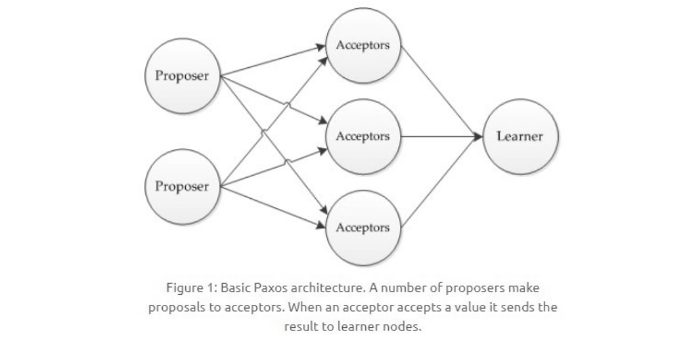

#### 执行过程

规定一个提议包含两个字段：[n, v]，其中 n 为序号（具有唯一性），v 为提议值。

##### 1. Prepare 阶段

下图演示了两个 Proposer 和三个 Acceptor 的系统中运行该算法的初始过程，每个 Proposer 都会向所有 Acceptor 发送 Prepare 请求。

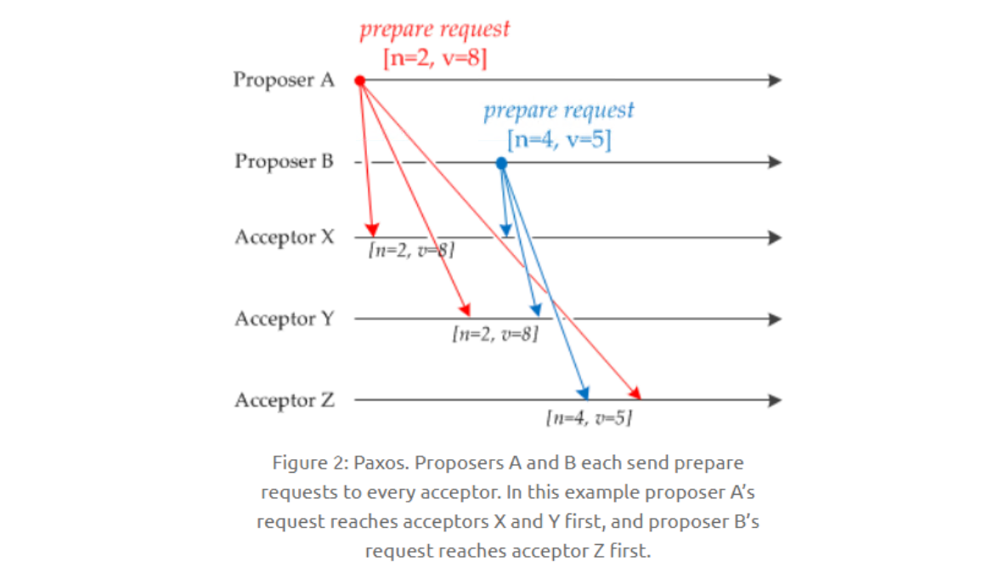

当 Acceptor 接收到一个 Prepare 请求，包含的提议为 [n1, v1]，并且之前还未接收过 Prepare 请求，那么发送一个 Prepare 响应，设置当前接收到的提议为 [n1, v1]，并且保证以后不会再接受序号小于 n1 的提议。

如下图，Acceptor X 在收到 [n=2, v=8] 的 Prepare 请求时，由于之前没有接收过提议，因此就发送一个 [no previous] 的 Prepare 响应，设置当前接收到的提议为 [n=2, v=8]，并且保证以后不会再接受序号小于 2 的提议。其它的 Acceptor 类似。

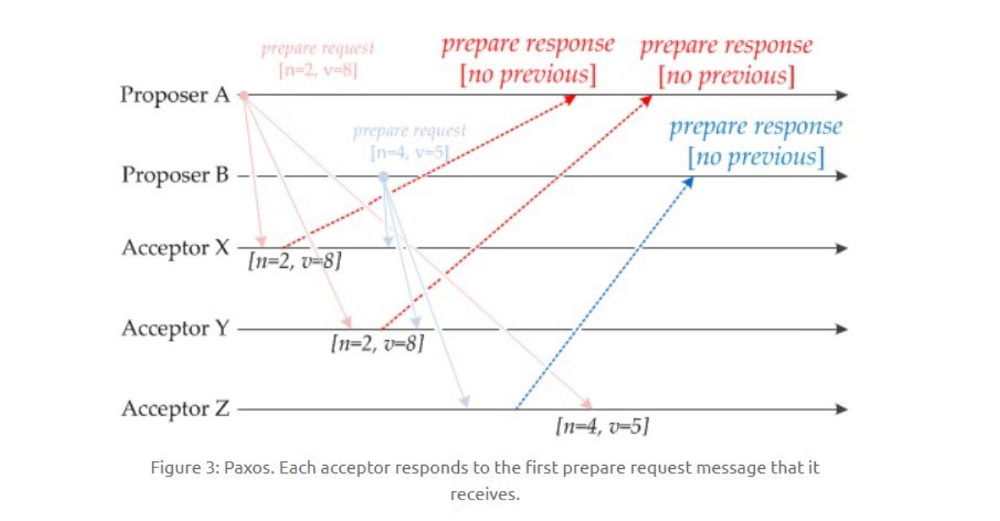

如果 Acceptor 接收到一个 Prepare 请求，包含的提议为 [n2, v2]，并且之前已经接收过提议 [n1, v1]。如果 n1 > n2，那么就丢弃该提议请求；否则，发送 Prepare 响应，该 Prepare 响应包含之前已经接收过的提议 [n1, v1]，设置当前接收到的提议为 [n2, v2]，并且保证以后不会再接受序号小于 n2 的提议。

如下图，Acceptor Z 收到 Proposer A 发来的 [n=2, v=8] 的 Prepare 请求，由于之前已经接收过 [n=4, v=5] 的提议，并且 n > 2，因此就抛弃该提议请求；Acceptor X 收到 Proposer B 发来的 [n=4, v=5] 的 Prepare 请求，因为之前接收到的提议为 [n=2, v=8]，并且 2 <= 4，因此就发送 [n=2, v=8] 的 Prepare 响应，设置当前接收到的提议为 [n=4, v=5]，并且保证以后不会再接受序号小于 4 的提议。Acceptor Y 类似。

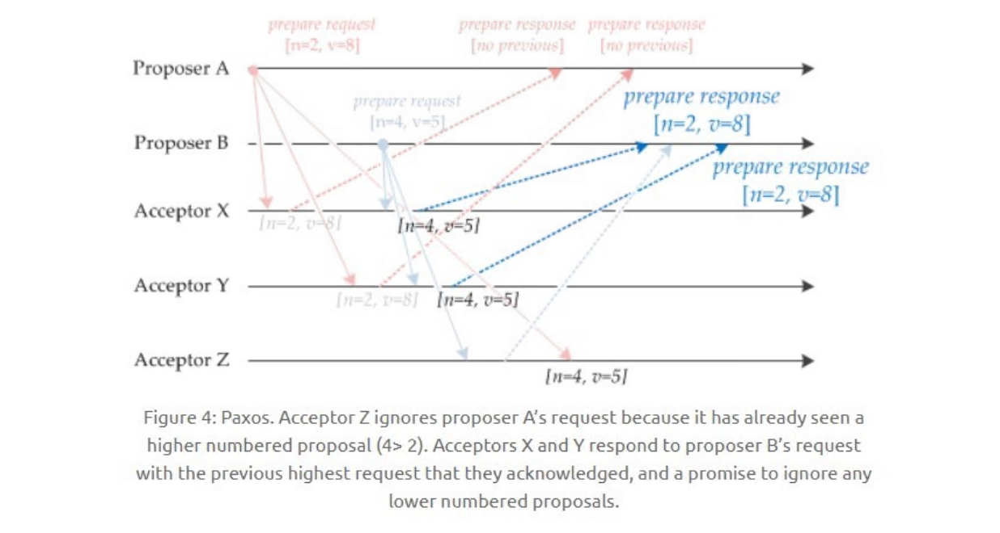

##### 2. Accept 阶段

当一个 Proposer 接收到超过一半 Acceptor 的 Prepare 响应时，就可以发送 Accept 请求。

Proposer A 接收到两个 Prepare 响应之后，就发送 [n=2, v=8] Accept 请求。该 Accept 请求会被所有 Acceptor 丢弃，因为此时所有 Acceptor 都保证不接受序号小于 4 的提议。

Proposer B 过后也收到了两个 Prepare 响应，因此也开始发送 Accept 请求。需要注意的是，Accept 请求的 v 需要取它收到的最大提议编号对应的 v 值，也就是 8。因此它发送 [n=4, v=8] 的 Accept 请求。

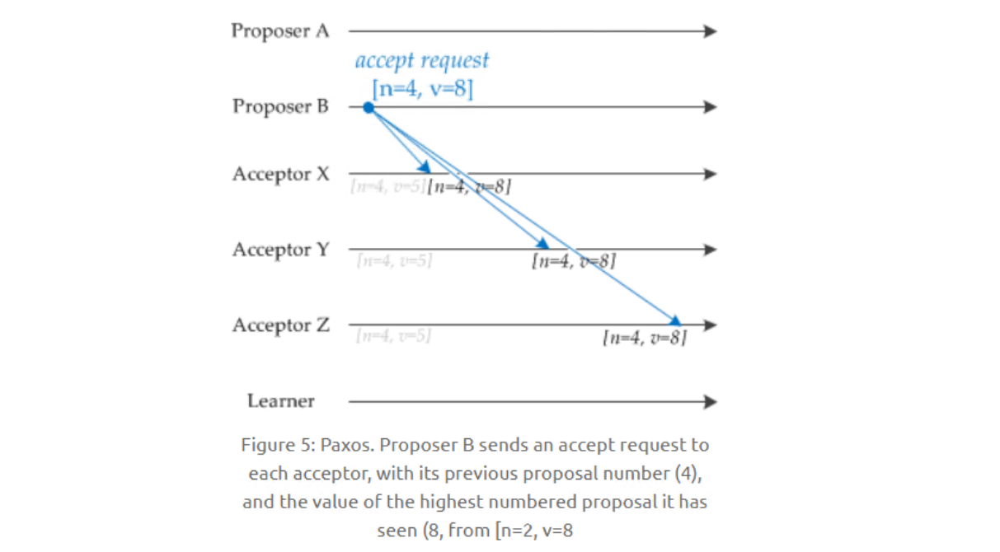

##### 3. Learn 阶段

Acceptor 接收到 Accept 请求时，如果序号大于等于该 Acceptor 承诺的最小序号，那么就发送 Learn 提议给所有的 Learner。当 Learner 发现有大多数的 Acceptor 接收了某个提议，那么该提议的提议值就被 Paxos 选择出来。

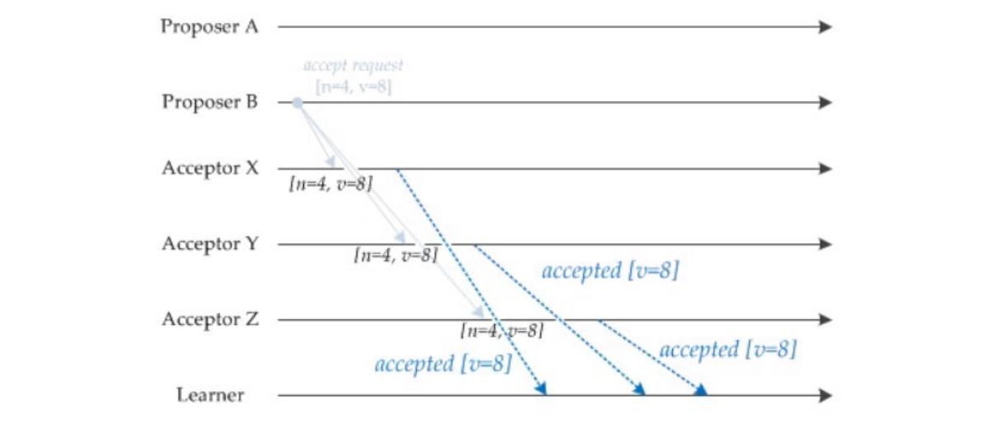

#### 约束条件

##### 1\. 正确性

指只有一个提议值会生效。

因为 Paxos 协议要求每个生效的提议被多数 Acceptor 接收，并且 Acceptor 不会接受两个不同的提议，因此可以保证正确性。

##### 2\. 可终止性

指最后总会有一个提议生效。

Paxos 协议能够让 Proposer 发送的提议朝着能被大多数 Acceptor 接受的那个提议靠拢，因此能够保证可终止性。

### RAFT协议

RAFT 是一个通俗易懂，更容易落地的分布式协议。

#### **节点的状态**

每个节点有**三个状态**，他们会在这三个状态之间进行变换。**客户端只能从主节点写数据，从节点里读数据**。

#### 流程分析

##### 1. **选主流程**

初始是 **Follwer 状态节点**，等 100-300MS 没有收到 LEADER 节点的心跳就**变候选人**。候选人给大家发选票，候选人获得大多数节点的选票就变成了 LEADER 节点。

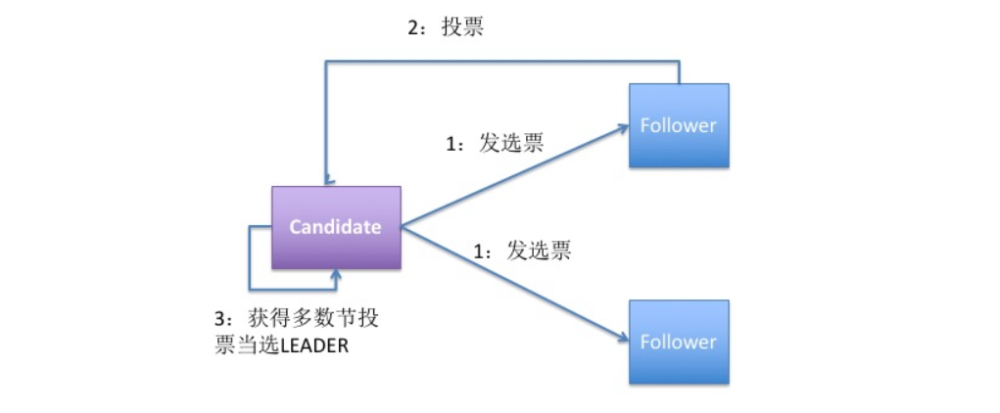

##### 2. **日志复制流程**

每次改变数据先记录日志，日志未提交不能改节点的数值。然后 LEADER 会复制数据给其他 follower 节点，并等大多数节点写日志成功再提交数据。

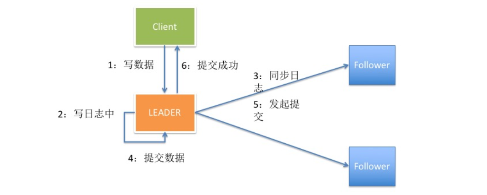

##### 3. **选举超时**

每个节点随机等 150 到 300MS，如果时间到了就开始发选票，因为有的节点等的时间短，所以它会先发选票，从而当选成主节点。但是如果两个候选人获得的票一样多，它们之间就要打加时赛，这个时候又会重新随机等 150 到 300MS，然后发选票，直到获得最多票当选成主节点。

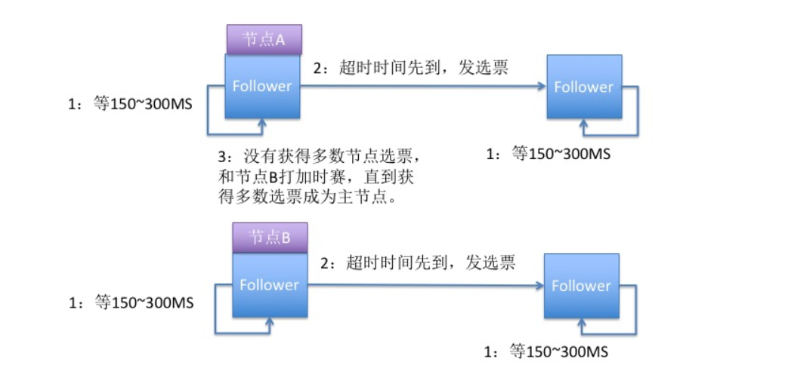

##### 4. **心跳超时**

每个节点会记录主节点是谁，并且和主节点之间维持一个心跳超时时间，如果没有收到主节点回复，从节点就要重新选举候选人节点。

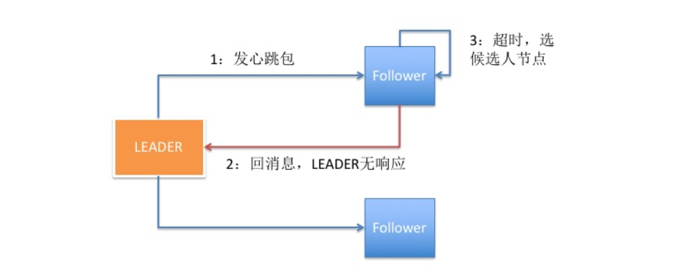

##### 5. **集群中断**

当集群之间的部分节点失去通讯时，主节点的日志不能复制给多个从节点就不能进行提交。

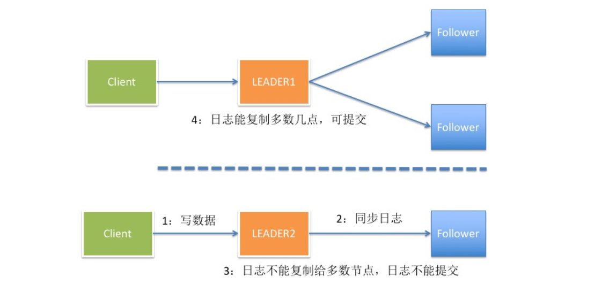

##### 6. **集群恢复**

当集群恢复之后，原来的主节点发现自己不是选票最多的节点，就会变成从节点，并回滚自己的日志，最后主节点会同步日志给从节点，保持主从数据的一致性。

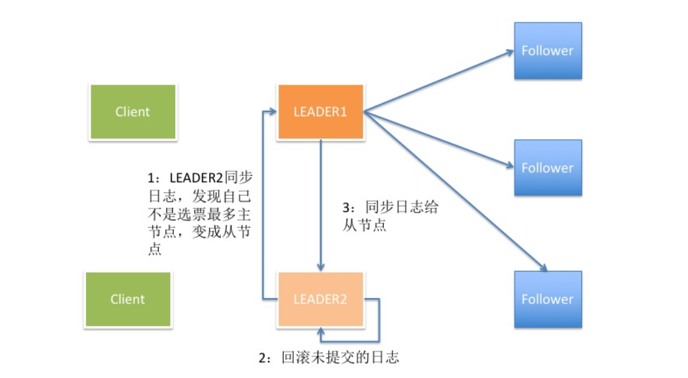

### ZAB协议

详见：[Zookeeper ZAB 协议分析](https://dbaplus.cn/news-141-1875-1.html)