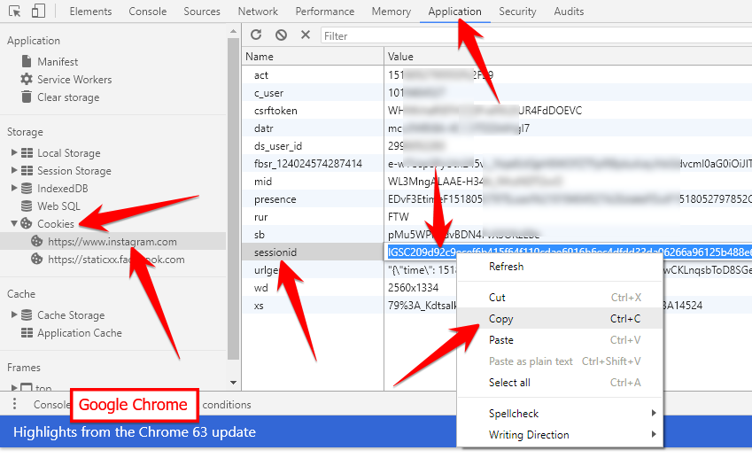
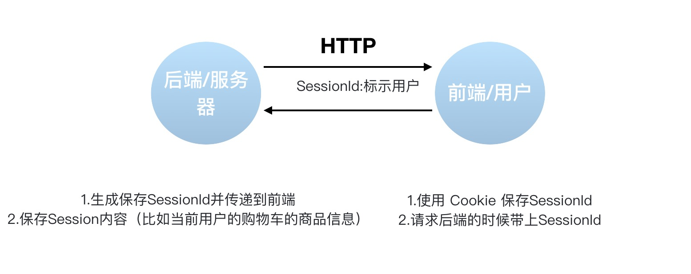
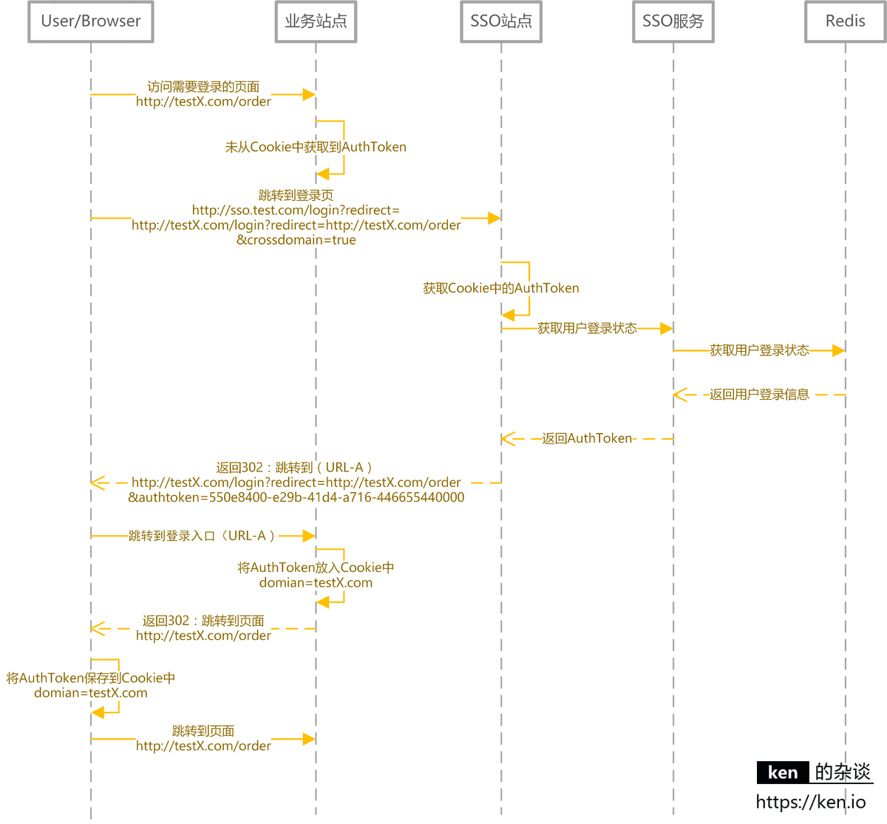
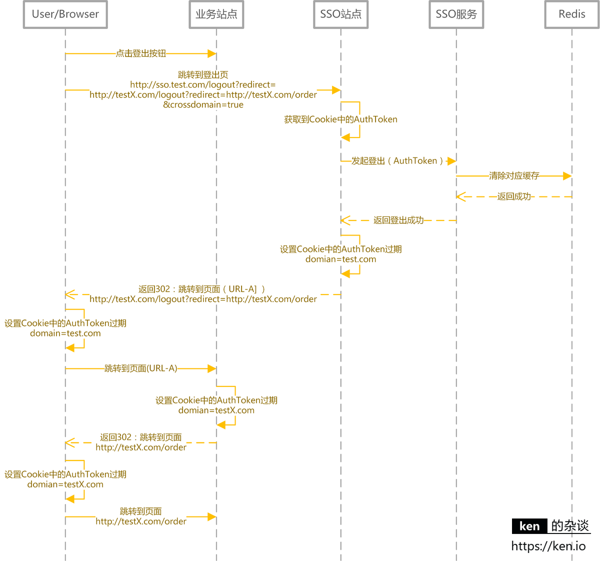

[TOC]

## 用户认证与授权

### 认证 (Authentication) 与授权 (Authorization)

简单点说。

- **认证 (Authentication)：**  你是谁。

- **授权 (Authorization)：** 你有权限干什么。

稍微正式点（啰嗦点）的说法就是：

- **Authentication（认证）** 是验证您的身份的凭据（例如用户名/用户 ID 和密码），通过这个凭据，系统得以知道你就是你，也就是说系统存在你这个用户。所以，**Authentication** 被称为身份/用户验证。
- **Authorization（授权）** 发生在 **Authentication（认证）** 之后。授权嘛，光看意思大家应该就明白，它主要掌管我们访问系统的权限。比如有些特定资源只能具有特定权限的人才能访问比如 admin，有些对系统资源操作比如删除、添加、更新只能特定人才具有。

这两个一般在我们的系统中被结合在一起使用，目的就是为了保护我们系统的安全性。

### Cookie与Session

#### 概述

什么是 Cookie ? Cookie 的作用是什么? 如何在服务端使用 Cookie ?



Cookie 和 Session 都是用来**跟踪浏览器用户身份**的会话方式，但是两者的应用场景不太一样。

维基百科是这样定义 Cookie 的：Cookies 是某些网站为了辨别用户身份而储存在**用户本地终端**上的数据（通常经过加密）。简单来说： **Cookie 存放在==客户端==，一般用来保存用户信息**。

下面是 Cookie 的一些应用案例：

1. 我们在 Cookie 中保存已经**登录过的用户信息**，下次访问网站的时候页面可以自动帮你登录的一些基本信息给填了。除此之外，Cookie 还能保存用户首选项，主题和其他设置信息。
2. 使用 Cookie **保存 session 或者 token** ，向后端发送请求的时候带上 Cookie，这样后端就能取到 session 或者 token 了。这样就能记录用户当前的状态了，因为 HTTP 协议是无状态的。
3. Cookie 还可以用来记录和分析用户行为。举个简单的例子你在网上购物的时候，因为 HTTP 协议是没有状态的，如果服务器想要获取你在某个页面的停留状态或者看了哪些商品，一种常用的实现方式就是将这些信息存放在 Cookie。

#### 服务端使用Cookie

这部分内容参考：https://attacomsian.com/blog/cookies-spring-boot，更多如何在Spring Boot中使用Cookie 的内容可以查看这篇文章。

**1) 设置 cookie 返回给客户端**

```java
@GetMapping("/change-username")
public String setCookie(HttpServletResponse response) {
    // 创建一个 cookie
    Cookie cookie = new Cookie("username", "Jovan");
    //设置 cookie过期时间
    cookie.setMaxAge(7 * 24 * 60 * 60); // expires in 7 days
    //添加到 response 中
    response.addCookie(cookie);
    return "Username is changed!";
}
```

**2) 使用 Spring 框架提供的`@CookieValue`注解获取特定的 cookie 的值**

```java
@GetMapping("/")
public String readCookie(@CookieValue(value = "username", defaultValue = "Atta") String username) {
    return "Hey! My username is " + username;
}
```

**3) 读取所有的 Cookie 值**

```java
@GetMapping("/all-cookies")
public String readAllCookies(HttpServletRequest request) {

    Cookie[] cookies = request.getCookies();
    if (cookies != null) {
        return Arrays.stream(cookies)
            .map(c -> c.getName() + "=" + c.getValue())
            .collect(Collectors.joining(", "));
    }
    return "No cookies";
}
```

#### Cookie与Session区别

**Cookie 和 Session 有什么区别？如何使用 Session 进行身份验证？**

**Session 的主要作用就是通过服务端记录用户的状态。** 典型的场景是购物车，当你要添加商品到购物车的时候，系统不知道是哪个用户操作的，因为 HTTP 协议是无状态的。服务端给特定的用户创建特定的 Session 之后就可以标识这个用户并且跟踪这个用户了。

**Cookie 数据保存在客户端(浏览器端)，Session 数据保存在服务器端。相对来说 Session 安全性更高。如果使用 Cookie 的一些敏感信息不要写入 Cookie 中，最好能将 Cookie 信息加密然后使用到的时候再去服务器端解密。**

**那么，如何使用 Session 进行身份验证？**

很多时候我们都是通过 SessionID 来实现特定的用户，SessionID 一般会选择存放在 Redis 中。举个例子：用户成功登陆系统，然后返回给客户端具有 SessionID 的 Cookie，当用户向后端发起请求的时候会把 SessionID 带上，这样后端就知道你的身份状态了。关于这种认证方式更详细的过程如下：


1. 用户向服务器发送用户名和密码用于登陆系统。
2. 服务器验证通过后，服务器为用户创建一个 Session，并将 Session 信息存储起来。
3. 服务器向用户返回一个 SessionID，写入用户的 Cookie。
4. 当用户保持登录状态时，Cookie 将与每个后续请求一起被发送出去。
5. 服务器可以将存储在 Cookie 上的 Session ID 与存储在内存中或者数据库中的 Session 信息进行比较，以验证用户的身份，返回给用户客户端响应信息的时候会附带用户当前的状态。

使用 Session 的时候需要注意下面几个点：

1. 依赖 Session 的关键业务一定要确保客户端开启了 Cookie。
2. 注意 Session 的过期时间。

简单总结了一下 Session 认证涉及的一些东西。



另外，Spring Session 提供了一种跨多个应用程序或实例管理用户会话信息的机制。如果想详细了解可以查看下面几篇很不错的文章：

- [Getting Started with Spring Session](https://codeboje.de/spring-session-tutorial/)
- [Guide to Spring Session](https://www.baeldung.com/spring-session)
- [Sticky Sessions with Spring Session & Redis](https://medium.com/@gvnix/sticky-sessions-with-spring-session-redis-bdc6f7438cc3)

#### 面试题

##### 1. 如果没有Cookie的话Session还能用吗？

这是一道经典的面试题！

一般是通过 **Cookie 来保存 SessionID** ，假如你使用了 Cookie 保存 SessionID 的方案的话， 如果客户端禁用了 Cookie，那么 Seesion 就无法正常工作。

但是，并不是没有 Cookie 之后就不能用 Session 了，比如你**可以将 SessionID 放在请求的 url 里面。**`https://javaguide.cn/?session_id=xxx` 。

这种方案的话可行，但是安全性和用户体验感降低。当然，为了你也可以对  SessionID 进行一次加密之后再传入后端。

##### 2. 为什么Cookie无法防止CSRF攻击，而token可以？

**CSRF（Cross Site Request Forgery）**一般被翻译为 **跨站请求伪造** 。那么什么是 **跨站请求伪造** 呢？说简单用你的身份去发送一些对你不友好的请求。举个简单的例子：

小壮登录了某网上银行，他来到了网上银行的帖子区，看到一个帖子下面有一个链接写着“科学理财，年盈利率过万”，小壮好奇的点开了这个链接，结果发现自己的账户少了 10000 元。这是这么回事呢？原来黑客在链接中藏了一个请求，这个请求直接利用小壮的身份给银行发送了一个转账请求,也就是通过你的 Cookie 向银行发出请求。

```xml
<a src=http://www.mybank.com/Transfer?bankId=11&money=10000>科学理财，年盈利率过万</>
```

上面也提到过，进行 Session 认证的时候，我们一般使用 Cookie 来存储 SessionId，当我们登陆后后端生成一个 SessionId 放在 **Cookie** 中返回给客户端，服务端通过 Redis 或者其他存储工具记录保存着这个 Sessionid，客户端登录以后每次请求都会**带上这个 SessionId**，服务端通过这个 SessionId 来标示你这个人。如果别人通过 cookie 拿到了 SessionId 后就可以代替你的身份访问系统了。

Session 认证中 **Cookie 中的 SessionId 是由浏览器**发送到服务端的，借助这个特性，攻击者就可以通过**让用户误点攻击链接**，达到攻击效果。

但是，我们使用 **token** 的话就不会存在这个问题，在我们登录成功获得 token 之后，一般**会选择存放在 local storage** 中。然后我们在前端通过某些方式会给每个发到后端的请求**加上这个 token**，这样就不会出现 CSRF 漏洞的问题。因为，即使有个你点击了非法链接发送了请求到服务端，这个**非法请求是不会携带 token** 的，所以这个请求将是**非法**的。

**需要注意的是不论是 Cookie 还是 token 都无法避免跨站脚本攻击（Cross Site Scripting）XSS。**

> **跨站脚本攻击（Cross Site Scripting）缩写为 CSS 但这会与层叠样式表（Cascading Style Sheets，CSS）的缩写混淆。因此，有人将跨站脚本攻击缩写为XSS。**

XSS 中攻击者会用各种方式将**恶意代码**注入到其他用户的页面中。就可以通过脚本盗用信息比如 cookie。

推荐阅读：

1. [如何防止CSRF攻击？—美团技术团队](https://tech.meituan.com/2018/10/11/fe-security-csrf.html)


### JWT与Token

#### 概述

我们在上一个问题中探讨了使用 Session 来鉴别用户的身份，并且给出了几个 Spring Session 的案例分享。 我们知道 Session  信息需要保存一份在服务器端。这种方式会带来一些麻烦，比如需要我们保证保存  Session  信息服务器的可用性、不适合移动端（依赖Cookie）等等。

有没有一种不需要自己存放 Session  信息就能实现身份验证的方式呢？使用 **Token** 即可！**JWT （JSON Web Token）** 就是这种方式的实现，通过这种方式服务器端就不需要保存 Session 数据了，只用在客户端保存服务端返回给客户的 Token 就可以了，扩展性得到提升。

**JWT 本质上就一段==签名的 JSON 格式==的数据。由于它是带有签名的，因此接收者便可以验证它的真实性。**

JWT 由 3 部分构成:

1. **Header**：描述 JWT 的元数据。定义了生成签名的算法以及 Token 的类型。
2. **Payload**（负载）：用来存放实际需要传递的数据
3. **Signature**（签名）：服务器通过`Payload`、`Header`和一个密钥(`secret`)使用 Header 里面指定的签名算法（默认是 HMAC SHA256）生成。

在基于 Token 进行身份验证的的应用程序中，服务器通过 `Payload`、`Header`和一个密钥(`secret`)创建令牌（`Token`）并将 `Token` 发送给客户端，客户端将 `Token` **保存在 Cookie 或者 localStorage 里面**，以后客户端发出的所有请求都会携带这个令牌。你可以把它放在 Cookie 里面自动发送，但是**这样不能跨域**，所以更好的做法是放在 HTTP  Header 的  **Authorization** 字段中：` Authorization: Bearer Token`。


1. 用户向服务器发送用户名和密码用于登陆系统。
2. 身份验证服务响应并返回了签名的 JWT，上面包含了用户是谁的内容。
3. 用户以后每次向后端发请求都在 Header 中带上 JWT。
4. 服务端检查 JWT 并从中获取用户相关信息。


推荐阅读：

- [JWT (JSON Web Tokens) Are Better Than Session Cookies](https://dzone.com/articles/jwtjson-web-tokens-are-better-than-session-cookies)
- [JSON Web Tokens (JWT) 与 Sessions](https://juejin.im/entry/577b7b56a3413100618c2938)
- [JSON Web Token 入门教程](https://www.ruanyifeng.com/blog/2018/07/json_web_token-tutorial.html)
- [彻底理解Cookie，Session，Token](https://mp.weixin.qq.com/s?__biz=Mzg2OTA0Njk0OA==&mid=2247485603&idx=1&sn=c8d324f44d6102e7b44554733da10bb7&chksm=cea24768f9d5ce7efe7291ddabce02b68db34073c7e7d9a7dc9a7f01c5a80cebe33ac75248df&token=844918801&lang=zh_CN#rd)

#### Token认证的优势

 相比于 Session 认证的方式来说，使用 token 进行身份认证主要有下面三个优势：

##### 1. 无状态

token 自身包含了身份验证所需要的所有信息，使得我们的服务器**不需要存储 Session 信息**，这显然增加了系统的可用性和伸缩性，大大减轻了服务端的压力。但是，也正是由于 token 的无状态，也导致了它最大的缺点：当后端在 token 有效期内废弃一个 token 或者更改它的权限的话，不会立即生效，一般需要等到有效期过后才可以。另外，当用户 Logout 的话，token 也还有效。除非，我们在后端增加额外的处理逻辑。

##### 2. 有效避免了CSRF攻击

**CSRF（Cross Site Request Forgery）**一般被翻译为 **跨站请求伪造**，属于网络攻击领域范围。

**那为什么 token 不会存在这种问题呢？**

一般情况下我们使用 JWT 的话，在我们登录成功获得 token 之后，一般会选择存放在  local storage 中。然后我们在前端通过某些方式会给每个发到后端的请求加上这个 token,这样就不会出现 CSRF 漏洞的问题。因为，即使有个你点击了非法链接发送了请求到服务端，这个非法请求是不会携带 token 的，所以这个请求将是非法的。

但是这样会存在  XSS 攻击中被盗的风险，为了避免 XSS 攻击，你可以选择将 token 存储在标记为`httpOnly`  的cookie 中。但是，这样又导致了你必须自己提供CSRF保护。

具体采用上面哪两种方式存储 token 呢，大部分情况下存放在  local storage 下都是最好的选择，某些情况下可能需要存放在标记为`httpOnly`  的cookie 中会更好。

##### 3. 适合移动端应用

使用 Session 进行身份认证的话，需要保存一份信息在**服务器端**，而且这种方式会**依赖到 Cookie**（需要 Cookie 保存 SessionId），所以不适合移动端。

但是，使用 token 进行身份认证就不会存在这种问题，因为只要 token 可以被客户端存储就能够使用，而且 token 还可以跨语言使用。

##### 4. 单点登录友好

使用 Session 进行身份认证的话，实现单点登录，需要我们把用户的 Session 信息保存在一台电脑上，并且还会遇到常见的 Cookie 跨域的问题。但是，使用 token 进行认证的话， token 被保存在客户端，不会存在这些问题。

#### Token认证常见问题以及解决办法

##### 1. 注销登录等场景下token还有效

与之类似的具体相关场景有：

1. 退出登录;
2. 修改密码;
3. 服务端修改了某个用户具有的权限或者角色；
4. 用户的帐户被删除/暂停。
5. 用户由管理员注销；

这个问题**不存在于 Session  认证方式**中，因为在  Session  认证方式中，遇到这种情况的话服务端**删除对应的 Session 记录即可**。但是，使用 token 认证的方式就不好解决了。我们也说过了，token 一旦派发出去，如果后端不增加其他逻辑的话，它在失效之前都是有效的。那么，我们如何解决这个问题呢？查阅了很多资料，总结了下面几种方案：

- **将 token 存入内存数据库**：将 token 存入 DB 中，Redis 内存数据库在这里是是不错的选择。如果需要让某个 token 失效就直接从 redis 中删除这个 token 即可。但是，这样会导致每次使用 token 发送请求都要先从 DB 中查询 token 是否存在的步骤，而且违背了 JWT 的无状态原则。
- **黑名单机制**：和上面的方式类似，使用内存数据库比如 redis 维护一个黑名单，如果想让某个 token 失效的话就直接将这个 token 加入到 **黑名单** 即可。然后，每次使用 token 进行请求的话都会先判断这个 token 是否存在于黑名单中。
- **修改密钥 (Secret)** : 我们为每个用户都创建一个专属密钥，如果我们想让某个 token 失效，我们直接修改对应用户的密钥即可。但是，这样相比于前两种引入内存数据库带来了危害更大，比如：1. 如果服务是分布式的，则每次发出新的 token 时都必须在多台机器同步密钥。为此，你需要将必须将机密存储在数据库或其他外部服务中，这样和 Session 认证就没太大区别了。2. 如果用户同时在两个浏览器打开系统，或者在手机端也打开了系统，如果它从一个地方将账号退出，那么其他地方都要重新进行登录，这是不可取的。
- **保持令牌的有效期限短并经常轮换** ：很简单的一种方式。但是，会导致用户登录状态不会被持久记录，而且需要用户经常登录。

对于修改密码后 token 还有效问题的解决还是比较容易的，说一种我觉得比较好的方式：**使用用户的密码的哈希值对 token 进行签名。因此，如果密码更改，则任何先前的令牌将自动无法验证。**

##### 2. token的续签问题

token 有效期一般都建议设置的不太长，那么 token 过期后如何认证，如何**实现动态刷新 token**，避免用户经常需要重新登录？

我们先来看看在 Session 认证中一般的做法：**假如 session 的有效期 30 分钟，如果 30 分钟内用户有访问，就把 session 有效期被延长 30 分钟。**

1. **类似于 Session 认证中的做法**：这种方案满足于大部分场景。假设服务端给的 token 有效期设置为30分钟，服务端每次进行校验时，如果发现 token 的有效期马上快过期了，服务端就重新生成 token 给客户端。客户端每次请求都检查新旧 token，如果不一致，则更新本地的 token。这种做法的问题是仅仅在快过期的时候请求才会更新 token ,对客户端不是很友好。
2. **每次请求都返回新 token** :这种方案的的思路很简单，但是，很明显，**开销会比较大**。
3. **token 有效期设置到半夜** ：这种方案是一种折衷的方案，保证了大部分用户白天可以正常登录，适用于对安全性要求不高的系统。
4. **用户登录返回两个 token** ：第一个是 **acessToken** ，它的**过期时间 token 本身的过期时间比如半个小时**，另外一个是 **refreshToken** 它的过期时间更长一点比如为 1 天。客户端登录后，将 accessToken和refreshToken 保存在本地，每次访问将 accessToken 传给服务端。服务端校验 accessToken 的**有效性**，如果过期的话，就将 refreshToken 传给服务端。如果有效，服务端就生成新的 accessToken 给客户端。否则，客户端就重新登录即可。该方案的不足是：1. 需要客户端来配合；2. 用户注销的时候需要同时保证两个  token 都无效；3. 重新请求获取 token  的过程中会有短暂 token 不可用的情况（可以通过在客户端设置定时器，当 accessToken 快过期的时候，提前去通过 refreshToken 获取新的 accessToken）。

参考资料

- [JWT 超详细分析](https://learnku.com/articles/17883?order_by=vote_count&)
- https://medium.com/devgorilla/how-to-log-out-when-using-jwt-a8c7823e8a6
- https://medium.com/@agungsantoso/csrf-protection-with-json-web-tokens-83e0f2fcbcc
- [Invalidating JSON Web Tokens](https://stackoverflow.com/questions/21978658/invalidating-json-web-tokens)

### OAuth2.0

OAuth 是一个行业的标准授权协议，主要用来**授权第三方应用获取有限的权限**。而 OAuth2.0 是对 OAuth1.0 的完全重新设计，OAuth2.0 更快，更容易实现。

实际上它就是一种**授权机制**，它的最终目的是**为第三方应用颁发一个有时效性的令牌 token**，使得第三方应用能够**通过该令牌获取相关的资源**。

OAuth 2.0 比较常用的场景就是**第三方登录**，当你的网站接入了**第三方登录**的时候一般就是使用的 OAuth 2.0 协议。

另外，现在 OAuth2.0 也常见于**支付场景（微信支付、支付宝支付）和开发平台（微信开放平台、阿里开放平台等等）**。

微信支付账户相关参数：


**推荐阅读：**

- [OAuth 2.0 的一个简单解释](http://www.ruanyifeng.com/blog/2019/04/oauth_design.html)
- [10 分钟理解什么是 OAuth 2.0 协议](https://deepzz.com/post/what-is-oauth2-protocol.html)
- [OAuth 2.0 的四种方式](http://www.ruanyifeng.com/blog/2019/04/oauth-grant-types.html)
- [GitHub OAuth 第三方登录示例教程](http://www.ruanyifeng.com/blog/2019/04/github-oauth.html)


### 单点登录SSO

#### 概述

SSO(Single Sign On) 即**单点登录**说的是用户**登陆多个子系统的其中一个就有权访问与其相关的其他系统**。举个例子我们在登陆了京东金融之后，我们同时也成功登陆京东的京东超市、京东家电等子系统。

例如访问在网易账号中心（http://reg.163.com/ ）登录之后，访问以下站点都是登录状态。

- 网易直播 [http://v.163.com](http://v.163.com/)
- 网易博客 [http://blog.163.com](http://blog.163.com/)
- 网易花田 [http://love.163.com](http://love.163.com/)
- 网易考拉 [https://www.kaola.com](https://www.kaola.com/)
- 网易Lofter http://www.lofter.com

##### 1. SSO与OAuth2.0的区别

OAuth 是一个行业的标准授权协议，主要用来授权第三方应用获取有限的权限。SSO解决的是一个公司的多个相关的自系统的之间的登陆问题比如京东旗下相关子系统京东金融、京东超市、京东家电等等。

##### 2. 单点登录系统的好处

1. **用户角度** :用户能够做到一次登录多次使用，无需记录多套用户名和密码，省心。
2. **系统管理员角度** : 管理员只需维护好一个统一的账号中心就可以了，方便。
3. **新系统开发角度:** 新系统开发时只需直接对接统一的账号中心即可，简化开发流程，省时。

##### 3. 核心功能

- 单点登录
- 单点登出
- 支持跨域单点登录
- 支持跨域单点登出

#### SSO系统设计与实现

##### 1. 核心应用与依赖


|  应用/模块/对象   |                说明                 |
| :---------------: | :---------------------------------: |
|     前台站点      |           需要登录的站点            |
|   SSO 站点-登录   |           提供登录的页面            |
|   SSO 站点-登出   |         提供注销登录的入口          |
|   SSO 服务-登录   |            提供登录服务             |
| SSO 服务-登录状态 | 提供登录状态校验/登录信息查询的服务 |
|   SSO 服务-登出   |       提供用户注销登录的服务        |
|      数据库       |          存储用户账户信息           |
|       缓存        |  存储用户的登录信息，通常使用Redis  |

##### 2. 用户登录状态的存储与校验

常见的 Web 框架对于 Session 的实现都是生成一个 SessionId 存储在浏览器 Cookie 中。然后将 Session 内容存储在服务器端内存中，这个 ken.io 在之前 Session工作原理中也提到过。整体也是借鉴这个思路。
用户登录成功之后，生成 AuthToken 交给客户端保存。如果是浏览器，就保存在 Cookie 中。如果是手机 App 就保存在 App 本地缓存中。本篇主要探讨基于 Web 站点的 SSO。
用户在浏览需要登录的页面时，客户端将 AuthToken 提交给 SSO 服务校验登录状态/获取用户登录信息。

对于登录信息的存储，建议采用 Redis，使用 Redis 集群来存储登录信息，既可以保证高可用，又可以线性扩充。同时也可以让 SSO 服务满足负载均衡/可伸缩的需求。

|   对象    |                             说明                             |
| :-------: | :----------------------------------------------------------: |
| AuthToken | 直接使用 UUID/GUID 即可，如果有验证 AuthToken 合法性需求，可以将 UserName +时间戳加密生成，服务端解密之后验证合法性 |
| 登录信息  |              通常是将 UserId，UserName 缓存起来              |

##### 3. 用户登录/登录校验

- **登录时序图**


按照上图，用户登录后 Authtoken 保存在 **Cookie** 中。 domian= test. com。
浏览器会将 domain 设置成 .test.com，
这样访问所有 *.test.com 的 web 站点，都会将 **Authtoken** 携带到服务器端。
然后通过 SSO 服务，完成对用户状态的校验/用户登录信息的获取。

- **登录信息获取/登录状态校验**


##### 4. 用户登出

用户登出时要做的事情很简单：

1. 服务端清除缓存（Redis）中的登录状态
2. 客户端清除存储的 AuthToken

- **登出时序图**


##### 5. 跨域登录、登出

前面提到过，核心思路是**客户端存储 AuthToken**，服务器端通过 **Redis** 存储登录信息。由于客户端是将 AuthToken 存储在 Cookie 中的。所以**跨域要解决的**问题，就是如何解决 Cookie 的跨域读写问题。

**Cookie 是不能跨域的** ，比如一个解决跨域的核心思路就是：

- 登录完成之后通过**回调**的方式，将 AuthToken 传递给主域名之外的站点，该站点自行将 AuthToken 保存在当前域下的 Cookie 中。
- 登出完成之后通过**回调**的方式，调用非主域名站点的登出页面，完成设置 Cookie 中的 AuthToken 过期的操作。
- 跨域登录（主域名已登录）



- **跨域登录（主域名未登录）**


- **跨域登出**



##### 6. 说明

- 关于方案

这次设计方案更多是提供实现思路。如果涉及到 APP 用户登录等情况，在访问 SSO 服务时，增加对 APP 的**签名验证**就好了。当然，如果有无线网关，验证签名不是问题。

- 关于时序图

时序图中并没有包含所有场景，ken.io 只列举了核心/主要场景，另外对于一些不影响理解思路的消息能省就省了。


#### 参考资料

- https://medium.com/@sherryhsu/session-vs-token-based-authentication-11a6c5ac45e4
- https://www.varonis.com/blog/what-is-oauth/
- https://tools.ietf.org/html/rfc6749