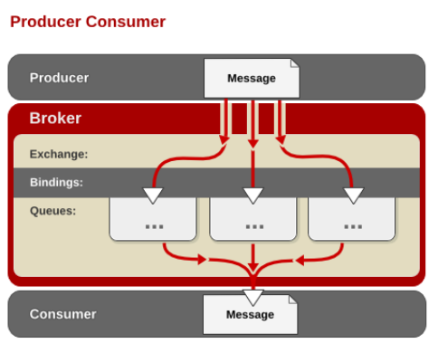
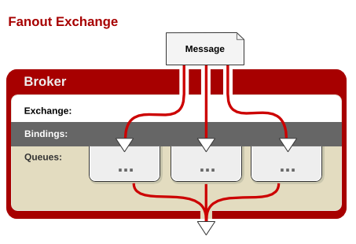

[TOC]

## Spring Boot日志

### 1、日志框架

 小张；开发一个大型系统；

​		1、System.out.println("")；将关键数据打印在控制台；去掉？写在一个文件？

​		2、框架来记录系统的一些运行时信息；日志框架 ；  zhanglogging.jar；

​		3、高大上的几个功能？异步模式？自动归档？xxxx？  zhanglogging-good.jar？

​		4、将以前框架卸下来？换上新的框架，重新修改之前相关的API；zhanglogging-prefect.jar；

​		5、JDBC---数据库驱动；

​			写了一个统一的接口层；日志门面（日志的一个抽象层）；logging-abstract.jar；

​			给项目中导入具体的日志实现就行了；我们之前的日志框架都是实现的抽象层；


**市面上的日志框架；**

JUL、JCL、Jboss-logging、logback、log4j、log4j2、slf4j....

| 日志门面  （日志的抽象层）                                   | 日志实现                                             |
| ------------------------------------------------------------ | ---------------------------------------------------- |
| ~~JCL（Jakarta  Commons Logging）~~    SLF4j（Simple  Logging Facade for Java）    **~~jboss-logging~~** | Log4j  JUL（java.util.logging）  Log4j2  **Logback** |

左边选一个门面（抽象层）、右边来选一个实现；

日志门面：  SLF4J；

日志实现：Logback；


SpringBoot：底层是Spring框架，Spring框架默认是用JCL；‘

​	**==SpringBoot选用 SLF4j和logback；==**


### 2、SLF4j使用

#### 1、如何在系统中使用SLF4j   https://www.slf4j.org

以后开发的时候，日志记录方法的调用，不应该来直接调用日志的实现类，而是调用日志抽象层里面的方法；

给系统里面导入slf4j的jar和  logback的实现jar

```java
import org.slf4j.Logger;
import org.slf4j.LoggerFactory;

public class HelloWorld {
  public static void main(String[] args) {
    Logger logger = LoggerFactory.getLogger(HelloWorld.class);
    logger.info("Hello World");
  }
}
```

图示；


每一个日志的实现框架都有自己的配置文件。使用slf4j以后，**配置文件还是做成日志实现框架自己本身的配置文件；**

#### 2、遗留问题

a（slf4j+logback）: Spring（commons-logging）、Hibernate（jboss-logging）、MyBatis、xxxx

统一日志记录，即使是别的框架和我一起统一使用slf4j进行输出？


**如何让系统中所有的日志都统一到slf4j；**

==1、将系统中其他日志框架先排除出去；==

==2、用中间包来替换原有的日志框架；==

==3、我们导入slf4j其他的实现==


### 3、SpringBoot日志关系

```xml
		<dependency>
			<groupId>org.springframework.boot</groupId>
			<artifactId>spring-boot-starter</artifactId>
		</dependency>
```


SpringBoot使用它来做日志功能；

```xml
	<dependency>
			<groupId>org.springframework.boot</groupId>
			<artifactId>spring-boot-starter-logging</artifactId>
		</dependency>
```

底层依赖关系


总结：

​	1）、SpringBoot底层也是使用slf4j+logback的方式进行日志记录

​	2）、SpringBoot也把其他的日志都替换成了slf4j；

​	3）、中间替换包？

```java
@SuppressWarnings("rawtypes")
public abstract class LogFactory {

    static String UNSUPPORTED_OPERATION_IN_JCL_OVER_SLF4J = "http://www.slf4j.org/codes.html#unsupported_operation_in_jcl_over_slf4j";

    static LogFactory logFactory = new SLF4JLogFactory();
```


​	4）、如果我们要引入其他框架？一定要把这个框架的默认日志依赖移除掉？

​			Spring框架用的是commons-logging；

```xml
		<dependency>
			<groupId>org.springframework</groupId>
			<artifactId>spring-core</artifactId>
			<exclusions>
				<exclusion>
					<groupId>commons-logging</groupId>
					<artifactId>commons-logging</artifactId>
				</exclusion>
			</exclusions>
		</dependency>
```

**==SpringBoot能自动适配所有的日志，而且底层使用slf4j+logback的方式记录日志，引入其他框架的时候，只需要把这个框架依赖的日志框架排除掉即可；==**

### 4、日志使用；

#### 1、默认配置

SpringBoot默认帮我们配置好了日志；

```java
	//记录器
	Logger logger = LoggerFactory.getLogger(getClass());
	@Test
	public void contextLoads() {
		//System.out.println();

		//日志的级别；
		//由低到高   trace<debug<info<warn<error
		//可以调整输出的日志级别；日志就只会在这个级别以以后的高级别生效
		logger.trace("这是trace日志...");
		logger.debug("这是debug日志...");
		//SpringBoot默认给我们使用的是info级别的，没有指定级别的就用SpringBoot默认规定的级别；root级别
		logger.info("这是info日志...");
		logger.warn("这是warn日志...");
		logger.error("这是error日志...");


	}
```


        日志输出格式：
    		%d表示日期时间，
    		%thread表示线程名，
    		%-5level：级别从左显示5个字符宽度
    		%logger{50} 表示logger名字最长50个字符，否则按照句点分割。 
    		%msg：日志消息，
    		%n是换行符
        -->
        %d{yyyy-MM-dd HH:mm:ss.SSS} [%thread] %-5level %logger{50} - %msg%n

SpringBoot修改日志的默认配置

```properties
logging.level.com.atguigu=trace


#logging.path=
# 不指定路径在当前项目下生成springboot.log日志
# 可以指定完整的路径；
#logging.file=G:/springboot.log

# 在当前磁盘的根路径下创建spring文件夹和里面的log文件夹；使用 spring.log 作为默认文件
logging.path=/spring/log

#  在控制台输出的日志的格式
logging.pattern.console=%d{yyyy-MM-dd} [%thread] %-5level %logger{50} - %msg%n
# 指定文件中日志输出的格式
logging.pattern.file=%d{yyyy-MM-dd} === [%thread] === %-5level === %logger{50} ==== %msg%n
```

| logging.file | logging.path | Example  | Description                        |
| ------------ | ------------ | -------- | ---------------------------------- |
| (none)       | (none)       |          | 只在控制台输出                     |
| 指定文件名   | (none)       | my.log   | 输出日志到my.log文件               |
| (none)       | 指定目录     | /var/log | 输出到指定目录的 spring.log 文件中 |

#### 2、指定配置

给类路径下放上每个日志框架自己的配置文件即可；SpringBoot就不使用他默认配置的了

| Logging System          | Customization                                                |
| ----------------------- | ------------------------------------------------------------ |
| Logback                 | `logback-spring.xml`, `logback-spring.groovy`, `logback.xml` or `logback.groovy` |
| Log4j2                  | `log4j2-spring.xml` or `log4j2.xml`                          |
| JDK (Java Util Logging) | `logging.properties`                                         |

logback.xml：直接就被日志框架识别了；

**logback-spring.xml**：日志框架就不直接加载日志的配置项，由SpringBoot解析日志配置，可以使用SpringBoot的高级Profile功能

```xml
<springProfile name="staging">
    <!-- configuration to be enabled when the "staging" profile is active -->
  	可以指定某段配置只在某个环境下生效
</springProfile>

```

如：

```xml
<appender name="stdout" class="ch.qos.logback.core.ConsoleAppender">
        <!--
        日志输出格式：
			%d表示日期时间，
			%thread表示线程名，
			%-5level：级别从左显示5个字符宽度
			%logger{50} 表示logger名字最长50个字符，否则按照句点分割。 
			%msg：日志消息，
			%n是换行符
        -->
        <layout class="ch.qos.logback.classic.PatternLayout">
            <springProfile name="dev">
                <pattern>%d{yyyy-MM-dd HH:mm:ss.SSS} ----> [%thread] ---> %-5level %logger{50} - %msg%n</pattern>
            </springProfile>
            <springProfile name="!dev">
                <pattern>%d{yyyy-MM-dd HH:mm:ss.SSS} ==== [%thread] ==== %-5level %logger{50} - %msg%n</pattern>
            </springProfile>
        </layout>
    </appender>
```


如果使用logback.xml作为日志配置文件，还要使用profile功能，会有以下错误

 `no applicable action for [springProfile]`

### 5、切换日志框架

可以按照slf4j的日志适配图，进行相关的切换；

slf4j+log4j的方式；

```xml
<dependency>
  <groupId>org.springframework.boot</groupId>
  <artifactId>spring-boot-starter-web</artifactId>
  <exclusions>
    <exclusion>
      <artifactId>logback-classic</artifactId>
      <groupId>ch.qos.logback</groupId>
    </exclusion>
    <exclusion>
      <artifactId>log4j-over-slf4j</artifactId>
      <groupId>org.slf4j</groupId>
    </exclusion>
  </exclusions>
</dependency>

<dependency>
  <groupId>org.slf4j</groupId>
  <artifactId>slf4j-log4j12</artifactId>
</dependency>

```


切换为log4j2

```xml
   <dependency>
            <groupId>org.springframework.boot</groupId>
            <artifactId>spring-boot-starter-web</artifactId>
            <exclusions>
                <exclusion>
                    <artifactId>spring-boot-starter-logging</artifactId>
                    <groupId>org.springframework.boot</groupId>
                </exclusion>
            </exclusions>
        </dependency>

<dependency>
  <groupId>org.springframework.boot</groupId>
  <artifactId>spring-boot-starter-log4j2</artifactId>
</dependency>
```


## Spring Boot任务调度

### 异步任务

在Java应用中，绝大多数情况下都是通过同步的方式来实现交互处理的；但是在处理与第三方系统交互的时候，容易造成响应迟缓的情况，之前大部分都是使用多线程来完成此类任务，其实，在Spring 3.x之后，就已经内置了@Async来完美解决这个问题。

两个注解：

**@EnableAysnc、@Aysnc**

```java
@SpringBootApplication
@EnableAsync	// 开启异步注解功能
public class DemoApplication {

	public static void main(String[] args) {
		SpringApplication.run(DemoApplication.class, args);
	}
}
```

定义一个异步任务

```java
@Service
public class AsyncService {

    /**
     * 告诉Spring这是一个异步方法
     */
    @Async
    public void hello(){
        try {
            Thread.sleep(3000);
        } catch (InterruptedException e) {
            e.printStackTrace();
        }
        System.out.println("处理数据中...");
    }
}
```

写一个Controller

```java
@RestController
public class AsyncController {

    @Autowired
    AsyncService asyncService;

    @GetMapping("/asyn")
    public String hello(){
        asyncService.hello();
        return "success";
    }
}
```

如果Service中不加@Async注解，那么请求Controller时会等待3秒才有结果，而注解@Async之后且用@EnableAsync开启异步注解功能之后请求Controller时会立即响应。


### 定时任务

项目开发中经常需要执行一些定时任务，比如需要在每天凌晨时候，分析一次前一天的日志信息。Spring为我们提供了异步执行任务调度的方式，提供TaskExecutor 、TaskScheduler 接口。

**两个注解：@EnableScheduling、@Scheduled**

#### cron表达式

用于构建定时任务表达式

| **字段** | **允许值**              | **允许的特殊字符** |
| -------- | ----------------------- | ------------------ |
| 秒       | 0-59                    | , -   * /          |
| 分       | 0-59                    | , -   * /          |
| 小时     | 0-23                    | , -   * /          |
| 日期     | 1-31                    | , -   * ? / L W C  |
| 月份     | 1-12                    | , -   * /          |
| 星期     | 0-7或SUN-SAT   0,7是SUN | , -   * ? / L C #  |

| **特殊字符** | **代表含义**               |
| ------------ | -------------------------- |
| ,            | 枚举                       |
| -            | 区间                       |
| *            | 任意                       |
| /            | 步长                       |
| ?            | 日/星期冲突匹配            |
| L            | 最后                       |
| W            | 工作日                     |
| C            | 和calendar联系后计算过的值 |
| #            | 星期，4#2，第2个星期四     |

测试

```java
@SpringBootApplication
@EnableScheduling	// 开启基于注解的定时任务功能
public class DemoApplication {

	public static void main(String[] args) {
		SpringApplication.run(DemoApplication.class, args);
	}

}
```

```java
@Service
public class ScheduledService {
	
    /**
     * second(秒), minute（分）, hour（时）, day of month（日）, month（月）, day of week（周几）.
     * 0 * * * * MON-FRI
     *  【0 0/5 14,18 * * ?】 每天14点整，和18点整，每隔5分钟执行一次
     *  【0 15 10 ? * 1-6】 每个月的周一至周六10:15分执行一次
     *  【0 0 2 ? * 6L】每个月的最后一个周六凌晨2点执行一次
     *  【0 0 2 LW * ?】每个月的最后一个工作日凌晨2点执行一次
     *  【0 0 2-4 ? * 1#1】每个月的第一个周一凌晨2点到4点期间，每个整点都执行一次；
     */
    // @Scheduled(cron = "0 * * * * MON-SAT") 
    // @Scheduled(cron = "0,1,2,3,4 * * * * MON-SAT")  枚举
    // @Scheduled(cron = "0-4 * * * * MON-SAT") 区间
    
    @Scheduled(cron = "0/4 * * * * MON-SAT")  // 每4秒执行一次
    public void hello(){
        System.out.println("hello ... ");
    }
}
```


## Spring Boot与消息

### 概述

1.大多应用中，可通过消息服务中间件来提升系统异步通信、扩展解耦能力

2.消息服务中两个重要概念：

​       消息代理（message broker）和目的地（destination）

当消息发送者发送消息以后，将由消息代理接管，消息代理保证消息传递到指定目的地。消息代理就相当于消息服务器。

3.消息队列主要有两种形式的目的地

- **队列（queue）**：点对点消息通信（point-to-point）

- **主题（topic）**：发布（publish）/订阅（subscribe）消息通信

4.点对点式：

- 消息发送者发送消息，消息代理将其放入一个队列中，消息接收者从队列中获取消息内容，消息读取后被移出队列

- 消息只有唯一的发送者和接受者，但并不是说只能有一个接收者。一旦消费就会被删除。

5.发布订阅式：

- 发送者（发布者）发送消息到主题，多个接收者（订阅者）监听（订阅）这个主题，那么就会在消息到达时同时收到消息

6.JMS（Java Message Service）JAVA消息服务：

- 基于JVM消息代理的规范。ActiveMQ、HornetMQ是JMS实现。

7.AMQP（Advanced Message Queuing Protocol）

- 高级消息队列协议，也是一个消息代理的规范，兼容JMS

- RabbitMQ是AMQP的实现
- JMS与AMQP对比表


8.Spring支持

- spring-jms提供了对JMS的支持

- spring-rabbit提供了对AMQP的支持

- 需要ConnectionFactory的实现来连接消息代理

- 提供JmsTemplate、RabbitTemplate来发送消息

- @JmsListener（JMS）、@RabbitListener（AMQP）注解在方法上监听消息代理发布的消息

- @EnableJms、@EnableRabbit开启支持

9.Spring Boot自动配置

- JmsAutoConfiguration

- RabbitAutoConfiguration

#### 消息的作用

##### 异步消息


完成注册之后发邮件和发短信，之前注册完成就发邮件和短信，耗时150毫秒，第二种方式是注册完后开现场同时发邮件和短信，耗时100毫秒；采用消息中间件则注册完成之后写到消息队列，之后慢慢发送，因为发短信和邮件并不是需要及时的，只需要55毫秒。

##### 应用解耦


##### 流量削峰


----

### RabbitMQ

**RabbitMQ**简介：

​	RabbitMQ是一个由erlang开发的AMQP(Advanved Message Queue Protocol)的开源实现。


----

#### **核心**概念

**1. Message**

消息，消息是不具名的，它由**消息头和消息体**组成。消息体是不透明的，而消息头则由一系列的可选属性组成，这些属性包括routing-key（路由键）、priority（相对于其他消息的优先权）、delivery-mode（指出该消息可能需要持久性存储）等。

**2. Publisher**

消息的**生产者**，也是一个向交换器发布消息的客户端应用程序。

**3. Exchange**

**交换器**，用来接收生产者发送的消息并将这些消息路由给服务器中的队列。

Exchange有4种类型：direct(默认)，fanout, topic, 和headers，不同类型的Exchange转发消息的策略有所区别。交换器决定消息发往何处。 

**4. Queue**

**消息队列**，用来保存消息直到发送给消费者。它是消息的**容器**，也是消息的终点。一个消息可投入一个或多个队列。消息一直在队列里面，等待消费者连接到这个队列将其取走。

**5. Binding**

绑定，用于**消息队列和交换器**之间的关联。一个绑定就是基于路由键将交换器和消息队列连接起来的路由规则，所以可以将交换器理解成一个由绑定构成的**路由表**。

Exchange 和Queue的绑定可以是**多对多**的关系。

**6. Connection**

网络连接，比如一个TCP连接。

**7. Channel**

**信道**，多路复用连接中的一条独立的双向数据流通道。信道是建立在真实的**TCP连接**内的虚拟连接，AMQP 命令都是通过信道发出去的，不管是发布消息、订阅队列还是接收消息，这些动作都是通过**信道**完成。因为对于操作系统来说建立和销毁 TCP 都是非常昂贵的开销，所以引入了信道的概念，以**复用一条 TCP 连接**。

**8. Consumer**

消息的消费者，表示一个从消息队列中取得消息的客户端应用程序。

**9. Virtual Host**

虚拟主机，表示**一批交换器、消息队列和相关对象**。虚拟主机是共享相同的身份认证和加密环境的独立服务器域。每个 vhost 本质上就是一个 mini 版的 RabbitMQ 服务器，拥有自己的队列、交换器、绑定和权限机制。vhost 是 AMQP 概念的基础，必须在**连接时指定**，RabbitMQ 默认的 vhost 是 ==/== 。

**10. Broker**

表示消息队列**服务器**实体。


消息生产者发给服务器，服务器发给虚拟主机，虚拟主机将消息发给交换器，然后通过绑定规则发送给消息队列。消费者与消息队列取消息，通过管道进行消息获取。

----

#### RabbitMQ运行机制

##### AMQP 中的消息路由

AMQP 中消息的路由过程和 Java 开发者熟悉的 JMS 存在一些差别，AMQP 中增加了 **Exchange** 和 **Binding** 的角色。生产者把消息发布到 Exchange 上，消息最终到达队列并被消费者接收，而 Binding 决定交换器的消息应该发送到那个队列。



服务器中有许多交换器和队列。


##### Exchange类型

**Exchange**分发消息时根据类型的不同分发策略有区别，目前共四种类型：**direct、fanout、topic**、headers 。headers 匹配 AMQP 消息的 header 而不是路由键， headers 交换器和 direct 交换器完全一致，但性能差很多，目前几乎用不到了，所以直接看另外三种类。

1. **Direct Exchange**

消息中的路由键（routing key）如果和 Binding 中的 binding key 一致，
交换器就将消息发到对应的队列中。路由键与队列名==完全匹配==，如果一个队列绑定到交换机要求路由键为“dog”，则只转发 routing key 标记为“dog”的消息，不会转发“dog.puppy”，也不会转发“dog.guard”等等。它是**完全匹配、单播的模式**。


2. **Fanout Exchange**



每个发到 fanout 类型交换器的消息都会分到**所有绑定的队列**上去。fanout
交换器**不处理路由键**，只是简单的将队列绑定到交换器上，每个发送到交换器的消息都会被转发到与该交换器绑定的所有队列上。很像子网广播，每台子网内的主机都获得了一份复制的消息。fanout类型转发消息是最快的。类似于==广播模式==。


3. **Topic Exchange**


topic 交换器通过**模式匹配**分配消息的路由键属性，将路由键和某个模式进行匹配，此时队列需要绑定到一个模式上。它将路由键和绑定键的字符串切分成单词，这些**单词之间用点隔开**。它同样也会识别两个通配符：符号“#”和符号“**”**。==**#**匹配**0**个或多个单词，* 匹配一个单词==。类似于选择性的广播，**匹配才广播**。

----

#### 安装Rabbit MQ


测试用的Exchange和Queue如下图


参考Docker相关内容。进入Web界面。添加一个Exchange。


继续添加其他Exchange交换器，得到如下的。


创建消息队列Queue


将Exchange与Queue进行绑定


此处exchange.direct分别与四个Queue进行了绑定。

注意exchange.topic与Queue的绑定中的路由键写法。


此时绑定完毕。既可以在Web管理台中发送测试消息。


模式就是按照上述的Exchange类型进行发送的。

----

#### Spring Boot整合Rabbit MQ

依赖

```xml
<!--整合Rabbit MQ-->
<dependency>
	<groupId>org.springframework.boot</groupId>
	<artifactId>spring-boot-starter-amqp</artifactId>
</dependency>
```

上述的依赖默认引入的依赖如下

```xml
<dependencies>
    <dependency>
      <groupId>org.springframework.boot</groupId>
      <artifactId>spring-boot-starter</artifactId>
      <version>2.1.6.RELEASE</version>
      <scope>compile</scope>
    </dependency>
    <dependency>
      <groupId>org.springframework</groupId>
      <artifactId>spring-messaging</artifactId>
      <version>5.1.8.RELEASE</version>
      <scope>compile</scope>
    </dependency>
    <dependency>
      <groupId>org.springframework.amqp</groupId>
      <artifactId>spring-rabbit</artifactId>
      <version>2.1.7.RELEASE</version>
      <scope>compile</scope>
      <exclusions>
        <exclusion>
          <artifactId>http-client</artifactId>
          <groupId>com.rabbitmq</groupId>
        </exclusion>
      </exclusions>
    </dependency>
</dependencies>
```

自动配置

1. RabbitAutoConfiguration类定义了自动配置的信息。

2. 有自动配置了连接工厂ConnectionFactory；
3. RabbitProperties 封装了 RabbitMQ的配置 可以根据此类来在配置文件中修改相关的配置。
4. RabbitTemplate ：给RabbitMQ发送和接受消息；这个对象是自动注入到容器中的，因此可以直接从容器中获取。
5. AmqpAdmin ： RabbitMQ系统管理功能组件;创建和删除 Queue，Exchange，Binding。自动配置也已经自动注入了这个类。可以直接Autowired注入。
6. @EnableRabbit +  @RabbitListener 监听消息队列的内容

```java
@EnableRabbit  // 开启基于注解的RabbitMQ模式
@SpringBootApplication
public class Springboot02AmqpApplication {
	public static void main(String[] args) {
		SpringApplication.run(Springboot02AmqpApplication.class, args);
	}
}
```

测试发送消息给消息队列

```java
@RunWith(SpringRunner.class)
@SpringBootTest
public class Springboot02AmqpApplicationTests {

	@Autowired
	RabbitTemplate rabbitTemplate;

	/**
	 * 1、测试单播（点对点）
	 */
	@Test
	public void testSingleBroadcast() {
		// Message需要自己构造一个;定义消息体内容和消息头
		// rabbitTemplate.send(exchage, routeKey, message);

		// object默认当成消息体，只需要传入要发送的对象，自动序列化发送给rabbitmq；
		// rabbitTemplate.convertAndSend(exchage, routeKey, object);
        
		Map<String,Object> map = new HashMap<>();
		map.put("msg","这是第一个消息");
		map.put("data", Arrays.asList("helloworld", 123, true));
		// 对象被默认序列化以后发送出去 exchange.direct是交换器名称，atguigu是路由键 直接传入map消息体
		rabbitTemplate.convertAndSend("exchange.direct", "atguigu", map);
	}

	/**
	* 测试接受数据,如何将数据自动的转为json发送出去 接收只后消息队列中数据就没了
	*/
	@Test
	public void receive(){
		Object o = rabbitTemplate.receiveAndConvert("atguigu");
		System.out.println(o.getClass());
		System.out.println(o);
	}

	/**
	 * 广播
	 */
	@Test
	public void sendMsg(){
		rabbitTemplate.convertAndSend("exchange.fanout","",new Book("红楼梦","曹雪芹"));
	}

}
```

测试单播方式只会可以从Rabbit MQ服务器看到如下接收到的消息。


上述服务器接收到的是序列号之后的数据很乱，可以自定义一个转换器注入容器，如下

```java
@Configuration
public class MyAMQPConfig {

    /**
     * 接收数据转换JSON输出
     * @return 自定义的converter注入容器
     */
    @Bean
    public MessageConverter messageConverter(){
        return new Jackson2JsonMessageConverter();
    }
}
```

之后再次发送消息到服务器就会显示成为JSON数据格式了。如下图。


从消息队列接收数据

```java
	/**
	 * 接受数据,如何将数据自动的转为json发送出去
	 * 从消息队列里面接收消息
	 * 由于定义了JSON转换器，此时本地接收到的数据也是反序列化之后得到的数据形式
	 */
	@Test
	public void receive(){
		Object o = rabbitTemplate.receiveAndConvert("atguigu");
		System.out.println(o.getClass());	// class java.util.HashMap
		System.out.println(o.toString());	// {msg=这是第一个消息, data=[helloworld, 123, true]}
	}
```

发送广播数据

```java
	/**
	 * 广播
	 * 直接发送给广播类型的Exchange交换器
	 * exchange.fanout是Exchange 不指定路由键
	 */
	@Test
	public void sendMsg(){
		rabbitTemplate.convertAndSend("exchange.fanout","", "123124");
	}
```

消息监听器

```java
import org.springframework.amqp.core.Message;
import org.springframework.amqp.rabbit.annotation.RabbitListener;
import org.springframework.stereotype.Service;
import java.util.HashMap;
import java.util.Map;

/**
 *  Rabbit MQ监听消息队列
 *  @author cz
 */
@Service
public class RabbitMqService {

    /**
     * 监听atguigu.news队列中的消息
     * @param map 预期的消息类型 可以自定义Bean
     * 这种方式是消息直接反序列成对象接收
     */
    @RabbitListener(queues = "atguigu.news")
    public void receive(Map<String,Object> map){

        System.out.println("收到消息：" + map.toString());
    }

    /**
     * 监听消息队列并且传入特定的Message对象可以获取到更多信息
     * @param message org.springframework.amqp.core.Message;类型
     */
    @RabbitListener(queues = "atguigu")
    public void receive02(Message message){
        // 获取消息
        System.out.println(message.getBody());
        // 获取消息头等信息
        System.out.println(message.getMessageProperties());
    }

}
```

当消息队列中有消息即可。


前面是在Web管理界面创建Exchange、Queue和绑定规则。可以在程序中实现。如下。

```java
    /**
	 * 管理本地创Exchange和Queue的操作
	 */
	@Autowired
	AmqpAdmin amqpAdmin;

	@Test
	public void createExchange(){

		// 创建一个Exchange 指定名字，也可以指定是否Durable，看构造方法
		amqpAdmin.declareExchange(new DirectExchange("amqpadmin.exchange"));
		System.out.println("创建完成");

		// 创建一个队列，设置为Durable持久化
		amqpAdmin.declareQueue(new Queue("amqpadmin.queue",true));

		// 创建绑定规则 传入参数具体看构造方法
		amqpAdmin.declareBinding(new Binding("amqpadmin.queue", Binding.DestinationType.QUEUE, "amqpadmin.exchange","amqp.haha",null));

		// 删除操作
		amqpAdmin.deleteExchange("amqpadmin.exchange");
		amqpAdmin.deleteQueue("amqpadmin.queue");
	}
```


### 整合Swagger

依赖

```xml
<!--引入swagger-->
<dependency>
	<groupId>io.springfox</groupId>
	<artifactId>springfox-swagger2</artifactId>
	<version>2.9.2</version>
</dependency>
<dependency>
	<groupId>io.springfox</groupId>
	<artifactId>springfox-swagger-ui</artifactId>
	<version>2.9.2</version>
</dependency>
```

配置类

```java
import org.springframework.context.annotation.Bean;
import org.springframework.context.annotation.Configuration;
import springfox.documentation.builders.ApiInfoBuilder;
import springfox.documentation.builders.PathSelectors;
import springfox.documentation.builders.RequestHandlerSelectors;
import springfox.documentation.service.ApiInfo;
import springfox.documentation.service.Contact;
import springfox.documentation.spi.DocumentationType;
import springfox.documentation.spring.web.plugins.Docket;
import springfox.documentation.swagger2.annotations.EnableSwagger2;

/**
 * Swagger 配置类
 * @author cz
 */
@Configuration
@EnableSwagger2
public class SwaggerConfig {

    @Bean
    public Docket createRestApi() {
        return new Docket(DocumentationType.SWAGGER_2)
                .apiInfo(apiInfo())
                .select()
                // swagger要扫描的包路径
                .apis(RequestHandlerSelectors.basePackage("com.example.demo.controller"))
                .paths(PathSelectors.any())
                .build();
    }

	// 配置API信息
    private ApiInfo apiInfo() {
        return new ApiInfoBuilder()
                .title("API Doc")
                .description("Api description of the rest api.")
                .termsOfServiceUrl("localhost:8080/api")
                .contact(new Contact("联系我","http://localhost:8080/swagger-ui.html","1174520425@qq.com"))
                .version("1.0")
                .build();
    }
}
```

在Controller上标注API信息

```java
@RestController
public class UserController {

    @Autowired
    UserRepository userRepository;

    @ApiOperation(value = "获取用户", notes = "根据id查询用户信息")
    @ApiImplicitParam(name = "id", value = "用户id", required = true, dataType = "Integer")
    @GetMapping("/user/{id}")
    public User getUser(@PathVariable("id") Integer id){
        User user = userRepository.findById(id).get();
        return user;
    }
}    
```

其他常见的注解如下

```java
@Api：表示标识这个类是swagger的资源 
@ApiOperation：描述针对特定路径的操作或HTTP方法
@ApiImplicitParam：表示API操作中的单个参数
@ApiImplicitParams：允许多个ApiImplicitParam对象列表的包装器
@ApiModel：提供关于Swagger模型的额外信息
@ApiModelProperty：添加和操作模型属性的数据
@ApiParam：为操作参数添加额外的元数据
@ApiResponse：描述一个操作的可能响应
@ApiResponses：允许多个ApiResponse对象列表的包装器
@ResponseHeader：表示可以作为响应的一部分提供的标头
@Authorization：声明要在资源或操作上使用的授权方案
@AuthorizationScope：描述OAuth2授权范围
```

访问   http://localhost:8080/swagger-ui.html


## 1 Spring Boot部署

#### Spring Boot热部署

依赖

```xml
<dependency>
	<groupId>org.springframework.boot</groupId>
	<artifactId>spring-boot-starter-devtools</artifactId>
    <optional>true</optional>
</dependency>
```

修改后 使用Ctrl + F9 进行快捷编译即可。


## 3 Spring Boot监控

通过引入spring-boot-starter-actuator，可以使用Spring Boot为我们提供的准生产环境下的应用监控和管理功能。我们可以通过HTTP，JMX，SSH协议来进行操作，自动得到审计、健康及指标信息等

步骤：

- 引入spring-boot-starter-actuator

- 通过http方式访问监控端点

- 可进行shutdown（POST 提交，此端点默认关闭）

#### 监控和管理端点

| **端点名**   | **描述**                    |
| ------------ | --------------------------- |
| *autoconfig* | 所有自动配置信息            |
| auditevents  | 审计事件                    |
| beans        | 所有Bean的信息              |
| configprops  | 所有配置属性                |
| dump         | 线程状态信息                |
| env          | 当前环境信息                |
| health       | 应用健康状况                |
| info         | 当前应用信息                |
| metrics      | 应用的各项指标              |
| mappings     | 应用@RequestMapping映射路径 |
| shutdown     | 关闭当前应用（默认关闭）    |
| trace        | 追踪信息（最新的http请求）  |


## Spring Boot邮件

#### 邮件任务

利用 Spring Boot 发送邮件，先发送到 QQ 服务器再转发给其他的。


依赖

```xml
<dependency>
    <groupId>org.springframework.boot</groupId>
    <artifactId>spring-boot-starter-mail</artifactId>
</dependency>
```

配置信息

```properties
spring.mail.host=smtp.servie.com
spring.mail.username=用户名  // 发送方的邮箱
spring.mail.password=密码    // 对于qq邮箱而言 密码指的就是发送方的授权码 需要去邮箱申请
spring.mail.port=465
spring.mail.protocol=smtp
spring.mail.properties.mail.smtp.auth=true
# 是否用启用加密传送的协议验证项
spring.mail.properties.mail.smtp.ssl.enable=true
# 注意：在spring.mail.password处的值是需要在邮箱设置里面生成的授权码，这个不是真实的密码。
```

实现

```java
import org.springframework.beans.factory.annotation.Autowired;
import org.springframework.core.io.FileSystemResource;
import org.springframework.mail.javamail.JavaMailSender;
import org.springframework.mail.javamail.MimeMessageHelper;
import org.springframework.stereotype.Component;
import javax.mail.MessagingException;
import javax.mail.internet.MimeMessage;
import java.io.File;

@Component("emailtool")
public class EmailTool {
    @Autowired
    private JavaMailSender javaMailSender;
    
    @Autowired
    private JavaMailSender mailSender;

    /**
    * 发送简单信息
    */
    @Override
    public void sendSimpleMail(String to, String subject, String content) throws MailException {
        SimpleMailMessage message = new SimpleMailMessage();
        message.setFrom(from); // 邮件发送者
        message.setTo(to); // 邮件接受者
        message.setSubject(subject); // 主题
        message.setText(content); // 内容

        mailSender.send(message);
    }
    
    /**
    * 发送复杂邮件信息 可带附件啥的
    */
    public void sendSimpleMail(){
        MimeMessage message = null;
        try {
            message = javaMailSender.createMimeMessage();
            MimeMessageHelper helper = new MimeMessageHelper(message, true);
            helper.setFrom("jiajinhao@dbgo.cn");
            helper.setTo("653484166@qq.com");
            helper.setSubject("标题：发送Html内容");

            StringBuffer sb = new StringBuffer();
            sb.append("<h1>大标题-h1</h1>")
                    .append("<p style='color:#F00'>红色字</p>")
                    .append("<p style='text-align:right'>右对齐</p>");
            helper.setText(sb.toString(), true);
            FileSystemResource fileSystemResource=new FileSystemResource(new File("D:\76678.pdf"))
            helper.addAttachment("电子发票"，fileSystemResource);
            javaMailSender.send(message);
        } catch (MessagingException e) {
            e.printStackTrace();
        }
    }

}
```


