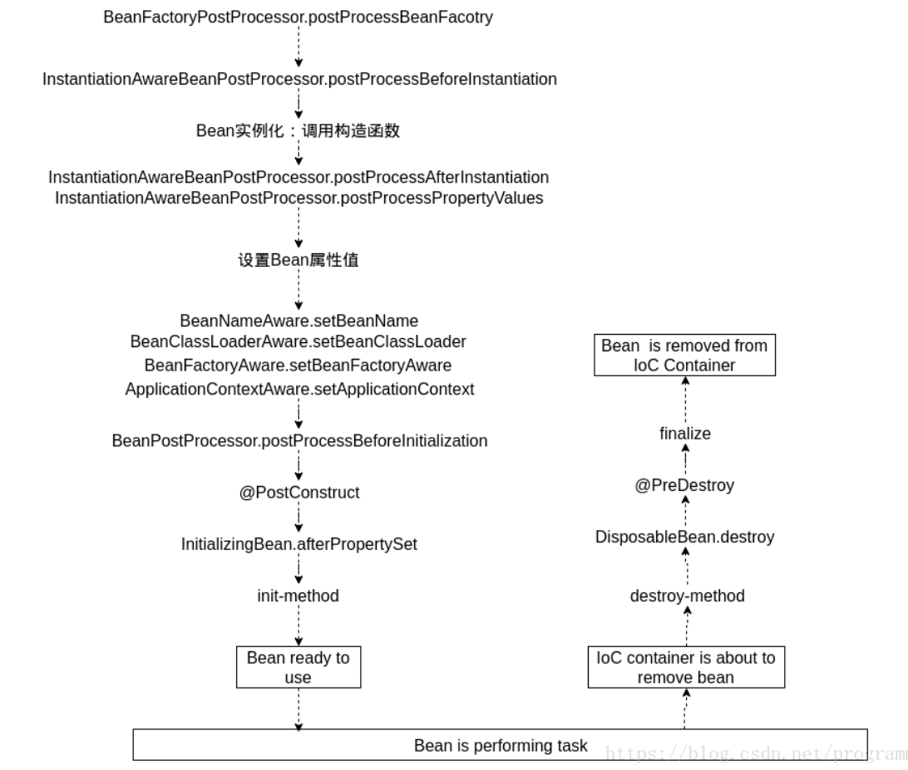
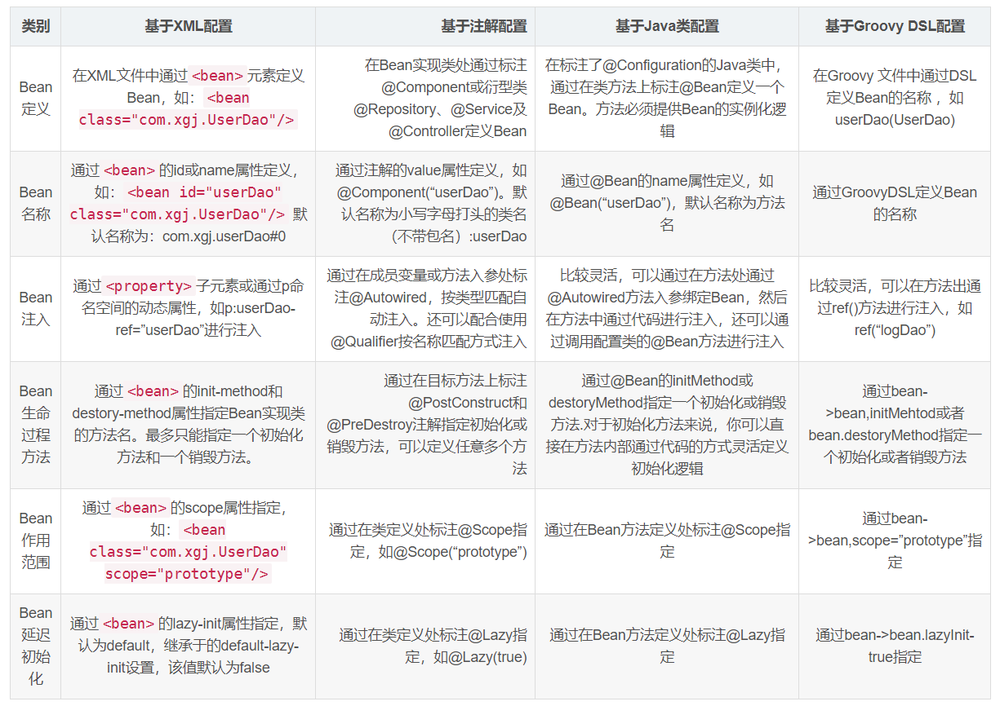
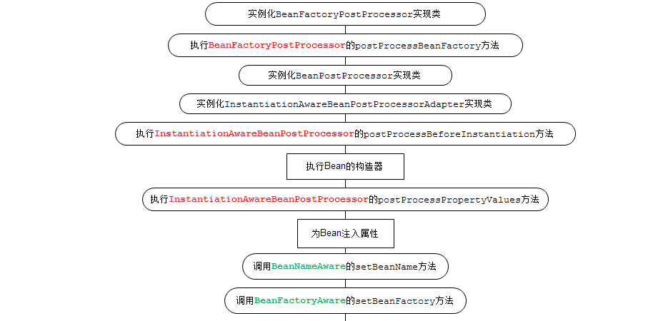
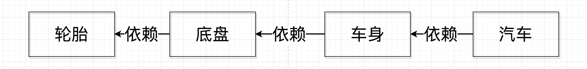

[TOC]

## Spring IoC

### Spring Bean

在 Spring 中，那些组成应用程序的主体及由 Spring IOC 容器所管理的对象，被称之为 bean。简单地讲，bean 就是由 IOC 容器初始化、装配及管理的对象，除此之外，bean 就与应用程序中的其他对象没有什么区别了。而 bean 的定义以及 bean 相互间的依赖关系将通过配置元数据来描述。

#### Bean Scope

Scope 用来声明容器中的对象所应该处的限定场景或者说该对象的存活时间，即容器在对象进入其相应的 scope之前，生成并装配这些对象，在该对象不再处于这些 scope 的限定之后，容器通常会销毁 Spring 的 IoC 容器这些对象。

如果你不指定 bean 的 scope，**singleton** 便是容器**默认**的 scope.

- **singleton**: 在 Spring 的 IoC 容器中只存在**一个实例**，所有对该对象的引用将**共享**这个实例。该实例从容器启动，并因为第一次被请求而初始化之后，将一直存活到容器退出，也就是说，它与 IoC 容器“几乎”拥有相同的“寿命”。标记为 singleton 的 bean是由容器来保证这种类型的 bean 在**同一个容器中**只存在一个共享实例；而 Singleton 模式则是保证在同一个 **Classloader** **中**只存在一个这种类型的实例。

- **propertype**: 针对声明为拥有 prototype scope 的 bean 定义，容器在接到该类型对象的请求的时候，会每次都**重新生成一个新的对象实例**给请求方。虽然这种类型的对象的实例化以及属性设置等工作都是由容器负责的，但是只要准备完毕，并且对象实例返回给请求方之后，**容器就不再拥有当前返回对象的引用**，请求方需要自己负责当前返回对象的后继生命周期的管理工作，包括该对象的销毁。
    对于那些请求方不能共享使用的对象类型，应该将其 bea n定义的 scope 设置为 prototype。这样每个请求方可以得到自己对应的一个对象实例。通常，声明为 prototype 的 scope 的 bean 定义类型，都是==**一些有状态的**==，比如保存每个顾客信息的对象。

另外三种 scope 类型，即 request、session 和 global session 类型,只有在支持 Web 应用的 **ApplicationContext **中才能使用这三个 scope。

- **request**: 为每一个 **HTTP** 请求创建一个全新的 bean，当请求结束之后，该对象的生命周期即告结束。
- **session**: 为每一个独立的 **session** 创建一个全新的 bean 对象，session 结束之后，该 bean 对象的生命周期即告结束。
- **global session**: global session只有应用在基于 portlet的Web应用程序中才有意义，它映射到portlet的global范围的 session。用得少。

注意：singleton 的对象在 IOC 容器创建的时候就会创建。在不指定 @Scope 的情况下，所有的 bean 都是**单实例**的 bean, 而且是**饿汉加载**（容器启动实例就创建好了）。

指定 @Scope 为 **prototype** 表示为**多实例**的，而且还是**懒汉模式**加载（IOC 容器启动的时候，并不会创建对象，而是在第一次使用的时候才会创建。

如果对 singleton 的 bean 指定为 **@Lazy 懒加载**，那么会在第一次使用时创建。Bean 的懒加载 @Lazy (主要针对**单实例**的bean 容器启动的时候，不创建对象，在第一次使用的时候才会创建该对象)  。

````java
@Bean
@Lazy
public Person person() {
    return new Person();
}
````


#### Bean生命周期

Spring 容器将对其所管理的对象全部给予**统一的生命周期**管理，这些被管理的对象完全摆脱了原来那种“new 完后被使用，脱离作用域后即被回收”的命运。

  

**==什么时候创建Bean？==**

容器启动之后，并不会马上就实例化相应的 bean 定义。容器现在仅仅拥有所有对象的 **BeanDefinition** 来保存**实例化**阶段将要用的必要信息。只有当请求方通过 **BeanFactory** 的 **getBean**() 方法来请求某个**对象实例**的时候，才**有可能触发** Bean实例化阶段的活动。BeanFactory 的 getBean() 方法可以被客户端对象显式调用，也可以在容器**内部隐式**地被调用。

隐式调用有如下两种情况:

- **BeanFactory** 来说，对象实例化默认采用**延迟初始化**。通常情况下，当对象 A 被请求而需要第一次实例化的时候，如果它所依赖的对象 B 之前同样没有被实例化，那么容器会先实例化对象 A 所依赖的对象。这时容器内部就会首先实例化对象 B，以及对象 A 依赖的其他还没有实例化的对象。这种情况是容器内部调用**getBean**()，对于本次请求的请求方是隐式的。
- **ApplicationContext** 启动之后会**实例化所有单例 bean** 定义。但 ApplicationContext 在实现的过程中依然遵循 Spring 容器实现流程的两个阶段，只不过它会在启动阶段的活动完成之后，紧接着调用注册到该容器的所有 bean 定义的实例化方法 getBean()。这就是为什么当你得到 ApplicationContext 类型的容器引用时，容器内所有对象已经被**全部实例化**完成。 ApplicationContext 会利用反射机制自动识别出配置文件中定义的 BeanPostProcessor、InstantiationAwareBeanPostProcessor 和 BeanFactoryPostProcessor，并将它们自动注册到应用上下文中，而 BeanFactory 需要手工调用 addBeanPostProcessor() 方法进行注册。ApplicationContext 在启动时，将首先为配置文件中的每个 \<bean> 生成一个 **BeanDefinition** 对象，它是这个 Bean 在Spring 容器中的内部表示。

​       之所以说 getBean() 方法是有可能触发 Bean 实例化阶段的活动，是因为只有当对应某个  bean 定义的getBean() 方法第一次被调用时，不管是显式的还是隐式的，Bean实例化阶段的活动才会被触发，第二次被调用则会直接返回容器**缓存**的第一次实例化完的 **singleton** 对象实例（prototype 类型 bean 除外）。当 getBean() 方法内部发现该 bean 定义之前还没有被实例化之后，会通过 createBean() 方法来进行具体的对象实例化。


#### BeanFactory与FactoryBean

 两个特别像，但是功能却千差万别。有关于 **BeanFactory**，我们都知道，这是 Spring **容器的基础实现类**，它负责生产和管理 Bean 的一个**工厂**。当然 BeanFactory 只是一个**接口**，它的常用实现有 XmlBeanFactory、DefaultListableBeanFactory、**ApplicationContext **等。


FactoryBean 是一个**接口**，具体方法如下： 

```java
public interface FactoryBean<T> {
 	// 返回由 FactoryBean 创建的Bean实例
	T getObject() throws Exception;
 	// 返回 FactoryBean 创建Bean的类型
	Class<?> getObjectType();
 	// 返回是否是 singleton
	boolean isSingleton();
}
```

**我们常规的 Bean 都是使用 Class 的反射获取具体实例，如果 Bean 的获取过程比较==复杂==，那么常规的 xml 配置需要配置大量属性值，这个时候我们就可以使用 FactoryBean，实现这个接口，在其 getObject() 方法中初始化这个 bean。** 

FactoryBean 使用实例：

```java
public class StudentFactoryBean implements FactoryBean {
 
    @Override
    public Object getObject() throws Exception {
        Student student = new Student();
        student.setAge(22);
        student.setName("jj");
        student.setId(10);
        return student;
    }
 
    // 对象具体类型
    @Override
    public Class<?> getObjectType() {
        return Student.class;
    }
 
    // 是否单例
    @Override
    public boolean isSingleton() {
        return true;
    }
}
```

 在 SpringConfiguration 中添加该 bean 

```java
@Configuration
public class SpringConfiguration {
    // 添加Bean
    @Bean
    public StudentFactoryBean studentFactoryBean(){
        return new StudentFactoryBean();
    }
}
```

测试

```java
@Test
public void testStudentFactoryBean(){
    AnnotationConfigApplicationContext applicationContext
        = new AnnotationConfigApplicationContext(SpringConfiguration.class);
    Student student = (Student) applicationContext.getBean("studentFactoryBean");
    System.out.println(student);
}
// res
Student(id=10, name=test:jj, age=22)
```

小结：

- **BeanFactory：工厂类接口，Spring 容器的核心接口，实例化 bean、配置 bean 之间的依赖关系**

- **FactoryBean：实例化 bean 过程比较复杂时可以考虑使用**


#### Bean配置方式

 对于 Spring 来讲，为实现 Bean 的信息定义，提供了基于 XML、基于注解、基于 JAVA 类、基于 Groovy 这 4 种选项，同事还允许各种配置方式复合共存。 

几种配置方式对比：




#### 容器内部工作机制

AbstractApplicationContext 是 ApplicationContext 的抽象实现类，该类的 refresh() 方法定义了 Spring 容器在加载配置文件后的各项处理过程，refresh() 方法的源码如下。

```java
public void refresh() throws BeansException, IllegalStateException {
        synchronized (this.startupShutdownMonitor) {
            // 做refresh之前的初始化工作，包括设定此context的状态等
            prepareRefresh();

            // 留给子类的两个模板方法，用于子类真正实现刷新和返回其内置BeanFactory
            ConfigurableListableBeanFactory beanFactory = obtainFreshBeanFactory();

            // 设置BeanFactory的各个域值
            prepareBeanFactory(beanFactory);

            try {
                // Allows post-processing of the bean factory in context subclasses.
                postProcessBeanFactory(beanFactory);

                // 注册工厂后处理器
                invokeBeanFactoryPostProcessors(beanFactory);

                // 注册Bean后处理器
                registerBeanPostProcessors(beanFactory);

                // 初始化消息源
                initMessageSource();

                // 初始化应用上下文事件广播器
                initApplicationEventMulticaster();

                // 初始化其他特殊的bean
                onRefresh();

                // 注册事件监听器
                registerListeners();

                // 初始化所有单实例的bean
                finishBeanFactoryInitialization(beanFactory);

                // 完成刷新并发布容器刷新事件
                finishRefresh();
            }

            catch (BeansException ex) {
                if (logger.isWarnEnabled()) {
                    logger.warn("Exception encountered during context initialization - " +
                            "cancelling refresh attempt: " + ex);
                }

                // Destroy already created singletons to avoid dangling resources.
                destroyBeans();

                // Reset 'active' flag.
                cancelRefresh(ex);

                // Propagate exception to caller.
                throw ex;
            }

            finally {
                // Reset common introspection caches in Spring's core, since we
                // might not ever need metadata for singleton beans anymore...
                resetCommonCaches();
            }
        }
}
```


#### IOC容器

所有IOC容器都需要实现接口BeanFactory或其子接口，它是一个顶级容器接口。


##### BeanFactory源码分析

```java
package org.springframework.beans.factory;

/**
BeanFactory接口源码
*/
public interface BeanFactory {

    /**
     * 用来引用一个实例，或把它和工厂产生的Bean区分开，就是说，如果一个FactoryBean的名字为a，那么，&a会得到那个Factory
     */
    String FACTORY_BEAN_PREFIX = "&";       // 前缀

    /*
     * 四个不同形式的getBean方法，获取实例
     */
    Object getBean(String name) throws BeansException;

    <T> T getBean(String name, Class<T> requiredType) throws BeansException;

    <T> T getBean(Class<T> requiredType) throws BeansException;

    Object getBean(String name, Object... args) throws BeansException;

    boolean containsBean(String name);      // 是否包含Bean

    boolean isSingleton(String name) throws NoSuchBeanDefinitionException;      // 是否为单实例

    boolean isPrototype(String name) throws NoSuchBeanDefinitionException;      // 是否为原型（多实例）

    boolean isTypeMatch(String name, Class<?> targetType) throws NoSuchBeanDefinitionException;   // 名称、类型是否匹配

    Class<?> getType(String name) throws NoSuchBeanDefinitionException;     // 获取类型

    String[] getAliases(String name);       // 根据实例的名字获取实例的别名

}
```

- bean默认单例存在。getBean方法返回的是同一个bean对象。
- 允许我们按名称或类型获取bean。
- ApplicationContext 是 BeanFactory 的子接口。
- AnnotationConfigApplicationContext 是一个基于注解的IOC容器。都包含上述的这些方法。


**Spring IoC容器的接口设计**


#### Bean的装配

##### 基于Config的装配

定义一个普通的POJO类。

```java
/**
* 普通的User类 没有任何注解
*/
public class User {

	private Long id;
	private String userName;
    private String note;
    // Getter and setters
}
```

再自定义一个AppConfig类。

- **@Configuration** 标注指明类为配置类
- @Bean 将getDevDataSource()方法返回的POJO装配到IOC容器中 标注有 @Configuration 的类被认为为配置类，Spring自动根据其生成IoC容器来装配bean。

```java
/**
* 自定义的配置类
*/
@Configuration      // 标注指明类为配置类
public class AppConfig {
	// 指明Bean名称为user，否则使用方法名作为bean的名称
    @Bean(name = "user")
    public User initUser() {
        User user = new User();
        user.setId(1L);
        user.setUserName("Tom");
        user.setNote("Note 1");
        return user;
    }
}
```

以下通过AnnotationConfigApplicationContext容器来获取bean。此处AnnotationConfigApplicationContext是BeanFactory接口的子接口，也具有getBean方法来得到bean。此处比较适合第三方bean的装配，如上述的数据库连接bean的装配。

```java
public class IoCTest{
    public static void main(String[] args){
        // 传入配置类
        ApplicationContext ctx = new AnnotationConfigApplicationContext(AppConfig.class);
        User user = ctx.getBean(User.class);
        System.out.println(user.getId());
    }
}
```

再看关于数据源的Bean装配，另外再定义AppConfig类。添加了不少注解。

- @Configuration 说明为一个配置类
- @ComponentScan 标明采用何种策略去**扫描装配** Bean，默认扫描AppConfig类当前所在的包及其子包。可以自定义扫描路径如下所示。配置项：basePackages 定义扫描的包名；basePackageClasses定义扫描的类；includeFilters定义满足条件的才扫描；excludeFIlters则是排除过滤器条件的bean，这两个需要@Filter注解去定义，它有一个type类型去定义条件。lazyInit 配置项配置是否延迟初始化。

```java
@Configuration
@ComponentScan(basePackages = "com.springboot.chapter3.*") // 此处的包名即为上述User类所在的包
@ImportResource(value = {"classpath:spring-other.xml"})
public class AppConfig {
	
	@Bean(name = "dataSource", destroyMethod = "close")
	@Profile("dev")
	public DataSource getDevDataSource() {
		Properties props = new Properties();
		props.setProperty("driver", "com.mysql.jdbc.Driver");
		props.setProperty("url", "jdbc:mysql://localhost:3306/dev_spring_boot");
		props.setProperty("username", "root");
		props.setProperty("password", "123456");
		DataSource dataSource = null;
		try {
			dataSource = BasicDataSourceFactory.createDataSource(props);
		} catch (Exception e) {
			e.printStackTrace();
		}
		return dataSource;
	}
}
```

其他的扫描路径方法示意。

```java
@ComponentScan("com.springboot.chapter3.*") 	// 此处的包名即为上述User类所在的包
@ComponentScan(basePackages = {"com.springboot.chapter3.*"}) 	// 此处的包名即为上述User类所在的包
@ComponentScan(basePackageClasses = {User.class}) 	// 根据类名扫描
@ComponentScan(basePackages = "com.springboot.chapter3.*", excludeFilters = {@Filter(classes = {User.class})}) 		// 自定义排除扫描条件 
```


##### 基于注解的装配

定义一个POJO类，这次的类带注解。直接在此类里面注入属性。注意与上面的User类对比。

- @Component 标明哪个类被扫描到容器中
- @Value 字段中注入属性值

```java
import org.springframework.beans.factory.annotation.Value;
import org.springframework.stereotype.Component;

/**
* User类
*/
@Component("user")      // 指定user为bean名称 如果不指定则把类名首字母小写当做类名称
public class User {

	@Value("1")         // @Value注入属性值
	private Long id;
	@Value("user_name_1")
	private String userName;
	@Value("note_1")
	private String note;

	// Getters and Setters
}
```


#### 依赖注入

所谓依赖注入，就是把底层类作为参数传入上层类，实现上层类对下层类的控制。DI依赖注入，向类里面属性注入值 ，依赖注入不能单独存在，需要在IOC基础上完成操作。

注入方式：

- 使用set方法注入 
- 使用有参构造注入 
- 使用接口注入
- 注解注入(@Autowire) 

##### 注解@Autowired

getBean() 方法支持根据类型和名称来获取对应的 bean。@Autowired 注解首先根据类型去**寻找对应的 bean**，找不到再根据**属性名称和 bean 名称**来寻找 bean。默认必须找到对应 Bean，否则报错（可以使用 required = false 关闭必须装配）。

可以标注在**属性**上，也可以标注在方法上，还可以标注在入参上。

```java
@Autowired	
private Animal animal = null;
```

```java
@Override
@Autowired
public void setAnimal(Animal animal) {
    this.animal = animal;
}
```

```java
public BussinessPerson(@Autowired Animal animal) {
    this.animal = animal;
}
```

##### 使用@Primary与@Qualifier消除歧义问题

两个接口：动物与人接口。

```java
public interface Person {
	
	public void service();
	
	public void setAnimal(Animal animal);
	
}
```

```java
public interface Animal {
	public void use();
}
```

实现接口

**狗类**

```java
@Component
public class Dog implements Animal {

	@Override
	public void use() {
		System.out.println("狗【" + Dog.class.getSimpleName()+"】是看门用的。");
	}
}
```

```java
@Component
public class BussinessPerson implements Person{
    // 自动注入实现了动物接口的类
    @Autowired	
    private Animal animal = null;

    @Override
    public void service() {
        this.animal.use();
    }

    @Override
    public void setAnimal(Animal animal) {
        this.animal = animal;
    }
}
```

上述 BussinessPerson 中自动注入实现了动物接口的类，此时容器中实现了 Animal 接口的**只有 Dog 类**，因此注入 Dog 的实例。

如果再实现一个动物类。

**猫类**

```java
@Component
public class Cat implements Animal {

	@Override
	public void use() {
		System.out.println("猫【" + Cat.class.getSimpleName()+"】是抓老鼠。");
	}
}
```

此时同时有 Dog 类和 Cat 类实现了 Animal 接口。

此时 BussinessPerson 的自动注入会报错，因为**不知道注入哪一个**实例。产生注入失败是因为**按类型查找**，动物 Animal 接口有多个类型，这就是存在歧义。

###### @Primary 与 @Qualifier 注解

注解 @Primary 可以修改**优先权**。比如在 Cat 类上使用此注解。

```java
@Component
@Primary
public class Cat implements Animal {...}
```

此时容器会优先注入 Cat 实例到 Animal 中。

@Primary 也可以用在多个类上，此时也会有歧义，可以使用 **@Qualifier 注解**。

@Qualifier 注解的配置项 **value** 需要一个字符串去定义，它可以与 @Autowired 一起去通过**类型域名称一起寻找 Bean**。如下。此时注入的就是 Dog 类的实例。

```java
@Autowired
@Qualifier("dog")
Animal animal = null;
```


#### DI（依赖注入）

##### 什么是依赖注入

在依赖注入的模式下，创建被调用者得工作不再由调用者来完成，创建被调用者实例的工作通常由Spring容器完成，然后注入调用者。**创建对象时，向类里的属性设置值**

##### 为什么使用依赖注入

为了实现代码/模块之间松耦合。

##### 为什么要实现松耦合

上层调用下层，上层依赖于下层，当下层剧烈变动时上层也要跟着变动，这就会导致模块的复用性降低而且大大提高了开发的成本。

一般情况下抽象的变化概率很小，让用户程序依赖于抽象，实现的细节也依赖于抽象。即使实现细节不断变动，只要抽象不变，客户程序就不需要变化。这大大降低了客户程序与实现细节的耦合度。

##### IOC和DI区别

1. IOC控制反转，把对象创建交给Spring配置 
2. DI依赖注入，向类里面属性注入值 
3. 关系，依赖注入不能单独存在，需要在IOC基础上完成操作

##### 依赖注入方式

1. 使用set方法注入 

2. 使用有参构造注入 

3. 使用接口注入

说明：Spring框架中支持前两种方式

###### （1）使用set方法注入

```xml
<bean id="person" class="cn.wang.property.Person">
<!--set方法注入属性
    name属性值：类中定义的属性名称
    value属性值：设置具体的值
-->
        <property name="pname" value="zs"></property>
</bean>1234567
```

###### （2）使用有参构造注入

```java
public class Person {
    private String pname;

    public void setPname(String pname) {
        this.pname = pname;
    }
}
```

```xml
<bean id="user" class="cn.wang.ioc.User">
        <!--构造方法注入属性-->
        <constructor-arg name="pname" value="Tony"></constructor-arg>
</bean>
```

###### （3）注入对象类型属性

- 创建service和dao类，在service中得到dao 

具体实现过程 

- 在service中把dao作为属性，生成dao的set方法

```java
public class UserService {
    // 1.定义UserDao类型属性
    private UserDao userDao;

    // 2.生成set方法
    public void setUserDao(UserDao userDao) {
        this.userDao = userDao;
    }
}
```

1. 配置文件注入关系

```java
<bean id="userDao" class="cn.wang.property.UserDao">
        <property name="name" value="Tom"></property>
    </bean>
    <bean id="userService" class="cn.wang.property.UserService">
        <!--name属性值：UserService类里的属性名称-->
        <!--ref属性:UserDao类配置bean标签中的id值-->
        <property name="userDao" ref="userDao"></property>
    </bean>12345678
```

###### （4）p名称空间注入


###### （5）注入复杂类型属性

```xml
<!-- 注入复杂类型属性值 -->
<!-- 
    String pname;
String[] arrs;
List<String> list;
Map<String, String> map;
Properties props; 
-->
<bean id="person" class="cn.wang.property.Person">
    <property name="pname" value="zs"></property>
    <property name="arrs">
        <list>
            <value>aaa</value>
            <value>bbb</value>
            <value>ccc</value>
        </list>
    </property>
    <property name="list">
        <list>
            <value>qqq</value>
            <value>www</value>
            <value>eee</value>
        </list>
    </property>
    <property name="map">
        <map>
            <entry key="001" value="Tom"></entry>
            <entry key="002" value="Amy"></entry>
            <entry key="003" value="Jim"></entry>
        </map>
    </property>
    <property name="props">
        <props>
            <prop key="username">admin</prop>
            <prop key="passwprd">admin</prop>
        </props>
    </property>
</bean>
```


#### IOC初始化过程


 IOC容器的初始化分为三个过程实现：

- 第一个过程是Resource资源定位。这个Resouce指的是BeanDefinition的资源定位。这个过程就是容器找数据的过程，就像水桶装水需要先找到水一样。
- 第二个过程是BeanDefinition的载入过程。这个载入过程是把用户定义好的Bean表示成Ioc容器内部的数据结构，而这个容器内部的数据结构就是BeanDefition。
- 第三个过程是向IOC容器注册这些BeanDefinition的过程，这个过程就是将前面的BeanDefition保存到HashMap中的过程。


更详细说明请阅读：[2 IOC容器初始化过程 - CSDN博客](


#### Bean的生命周期

- Bean定义、Bean初始化、Bean生存期、Bean销毁。

##### 1. Spring初始化Bean流程

- 资源定位(例如 @ComponentScan 所定义的扫描包)
- Bean定义(将 Bean 的定义保存到 BeanDefinition 的实例中)
- 发布 Bean 定义( IOC 容器装载 Bean 的定义)
- 实例化(创建 Bean 的实例对象)
- 依赖注入(例如 @Autowired 类的各类资源)


##### 2. Spring Bean的生命周期


- Bean 容器找到配置文件中 Spring Bean 的定义。
- Bean 容器利用 Java Reflection API 创建一个 Bean 的**实例**。
- 如果涉及到一些属性值 利用 set 方法设置一些属性值。
- 如果Bean实现了 BeanNameAware 接口，调用 setBeanName() 方法，传入 Bean 的名字。
- 如果 Bean 实现了 BeanClassLoaderAware 接口，调用 setBeanClassLoader() 方法，传入 ClassLoader 对象的实例。
- 如果 Bean 实现了 **BeanFactoryAware** 接口，调用 setBeanFactory() 方法，传入 BeanFactory 对象的实例。
- 与上面的类似，如果实现了**其他 *Aware 接口**，就调用相应的方法。
- 如果有和加载这个 Bean 的 Spring 容器相关的 **BeanPostProcessor** 对象，执行 postProcessBeforeInitialization()方法。
- 如果 Bean 实现了 **InitializingBean** 接口，执行 afterPropertiesSet() 方法。
- 如果 Bean 在配置文件中的定义包含 init-method 属性，执行指定的方法。
- 如果有和加载这个 Bean 的 Spring 容器相关的 **BeanPostProcessor** 对象，执行 postProcessAfterInitialization() 方法
- 当要销毁 Bean 的时候，如果 Bean 实现了 **DisposableBean** 接口，执行 destroy() 方法。
- 当要销毁 Bean 的时候，如果 Bean 在配置文件中的定义包含 destroy-method 属性，执行指定的方法。




若容器注册了以上各种接口，程序那么将会按照以上的流程进行。下面将仔细讲解各接口作用。

##### 3. 各个接口方法分类

Bean 的完整生命周期经历了各种方法调用，这些方法可以划分为以下几类：

- Bean自身的方法：这个包括了 Bean 本身调用的方法和通过配置文件中 **\<bean>** 的 **init-method** 和 **destroy-method** 指定的方法。

- Bean 级生命周期接口方法：这个包括了 BeanNameAware、BeanFactoryAware、InitializingBean 和DiposableBean 这些接口的方法。

- 容器级生命周期接口方法：这个包括了 **InstantiationAwareBeanPostProcessor** 和 **BeanPostProcessor** 这两个接口实现，一般称它们的实现类为“**后处理器**”。

- 工厂后处理器接口方法：这个包括了 AspectJWeavingEnabler, ConfigurationClassPostProcessor, CustomAutowireConfigurer 等等非常有用的**工厂后处理器接口**的方法。工厂后处理器也是**容器级**的。在应用上下文装配配置文件之后立即调用。

##### 4. initialization和destroy

有时我们需要在 Bean 属性值 set 好之后和 Bean 销毁之前做一些事情，比如检查 Bean 中某个属性是否被正常的设置好值了。Spring 框架提供了多种方法让我们可以在 Spring Bean 的生命周期中执行 initialization 和 pre-destroy 方法。

**1. 实现InitializingBean和DisposableBean接口**

这两个接口都只包含**一个方法**。通过实现 **InitializingBean** 接口的 afterPropertiesSet() 方法可以在 Bean 属性值设置好之后做一些操作，实现 DisposableBean 接口的 destroy() 方法可以在销毁 Bean 之前做一些操作。

例子如下：

```java
public class GiraffeService implements InitializingBean,DisposableBean {
    @Override
    public void afterPropertiesSet() throws Exception {
        System.out.println("执行InitializingBean接口的afterPropertiesSet方法");
    }
    @Override
    public void destroy() throws Exception {
        System.out.println("执行DisposableBean接口的destroy方法");
    }
}
```

这种方法比较简单，但是**不建议使用**。因为这样会将 Bean 的实现和 Spring 框架**耦合在一起**。

**2. 在bean的配置文件中指定init-method和destroy-method方法**

Spring允许我们创建自己的 init 方法和 destroy 方法，只要在 Bean 的配置文件中指定 init-method 和 destroy-method 的值就可以在 Bean 初始化时和销毁之前执行一些操作。

例子如下：

```java
public class GiraffeService {
    //通过<bean>的destroy-method属性指定的销毁方法
    public void destroyMethod() throws Exception {
        System.out.println("执行配置的destroy-method");
    }
    //通过<bean>的init-method属性指定的初始化方法
    public void initMethod() throws Exception {
        System.out.println("执行配置的init-method");
    }
}
```

配置文件中的配置：

```
<bean name="giraffeService" class="com.giraffe.spring.service.GiraffeService" init-method="initMethod" destroy-method="destroyMethod">
</bean>
```

需要注意的是自定义的init-method和post-method方法可以抛异常但是不能有参数。

这种方式比较推荐，因为可以自己创建方法，无需将Bean的实现直接依赖于spring的框架。

**3. 使用@PostConstruct和@PreDestroy注解**

除了xml配置的方式，Spring 也支持用 `@PostConstruct`和 `@PreDestroy`注解来指定 `init` 和 `destroy` 方法。这两个注解均在`javax.annotation` 包中。为了注解可以生效，需要在配置文件中定义org.springframework.context.annotation.**CommonAnnotationBeanPostProcessor** 或 context:annotation-config

例子如下：

```java
public class GiraffeService {
    @PostConstruct
    public void initPostConstruct(){
        System.out.println("执行PostConstruct注解标注的方法");
    }
    @PreDestroy
    public void preDestroy(){
        System.out.println("执行preDestroy注解标注的方法");
    }
}
```

配置文件：

```xml
<bean class="org.springframework.context.annotation.CommonAnnotationBeanPostProcessor" />
```

##### 5. 实现*Aware接口在Bean中使用Spring框架的一些对象

有些时候我们需要在 **Bean 的初始化**中使用 **Spring ==框架自身==的一些对象**来执行一些操作，比如获取 ServletContext 的一些参数，获取 ApplicaitionContext 中的 BeanDefinition 的名字，获取 Bean 在容器中的名字等等。**==为了让 Bean 可以获取到框架自身的一些对象，Spring 提供了一组名为 *Aware 的接口。==**

这些接口均继承于 `org.springframework.beans.factory.Aware ` 标记接口，并提供一个将**由 Bean 实现的 set* 方法，** Spring 通过基于 setter 的**依赖注入方式使相应的对象可以被 Bean 使用**。

介绍一些**重要的 Aware 接口**：

- **ApplicationContextAware**：获得 **ApplicationContext** 对象，可以用来获取所有 BeanDefinition 的名字。
- **BeanFactoryAware**：获得 **BeanFactory** 对象，可以用来检测 Bean 的作用域。
- **BeanNameAware**：获得 Bean 在**配置文件**中定义的名字。
- **ResourceLoaderAware**：获得 ResourceLoader 对象，可以获得 **classpath** 中某个文件。
- **ServletContextAware**：在一个 MVC 应用中可以获取 **ServletContext** 对象，可以读取 context 中的参数。
- **ServletConfigAware**：在一个 MVC 应用中可以获取 **ServletConfig** 对象，可以读取 config 中的参数。

以下是实现上述接口的例子。

```java
public class GiraffeService implements ApplicationContextAware,
ApplicationEventPublisherAware, BeanClassLoaderAware, BeanFactoryAware,
BeanNameAware, EnvironmentAware, ImportAware, ResourceLoaderAware{
    @Override
    public void setBeanClassLoader(ClassLoader classLoader) {
        System.out.println("执行setBeanClassLoader,ClassLoader Name = " + classLoader.getClass().getName());
    }
    @Override
    public void setBeanFactory(BeanFactory beanFactory) throws BeansException {
        System.out.println("执行setBeanFactory,setBeanFactory:: giraffe bean singleton=" +  beanFactory.isSingleton("giraffeService"));
    }
    @Override
    public void setBeanName(String s) {
        System.out.println("执行setBeanName:: Bean Name defined in context=" + s);
    }
    @Override
    public void setApplicationContext(ApplicationContext applicationContext) throws BeansException {
        System.out.println("执行setApplicationContext:: Bean Definition Names="
         + Arrays.toString(applicationContext.getBeanDefinitionNames()));
    }
    @Override
    public void setApplicationEventPublisher(ApplicationEventPublisher applicationEventPublisher) {
        System.out.println("执行setApplicationEventPublisher");
    }
    @Override
    public void setEnvironment(Environment environment) {
        System.out.println("执行setEnvironment");
    }
    @Override
    public void setResourceLoader(ResourceLoader resourceLoader) {
        Resource resource = resourceLoader.getResource("classpath:spring-beans.xml");
        System.out.println("执行setResourceLoader:: Resource File Name="
                           + resource.getFilename());
    }
    @Override
    public void setImportMetadata(AnnotationMetadata annotationMetadata) {
        System.out.println("执行setImportMetadata");
    }
}
```

##### 6. BeanPostProcessor

上面的 ***Aware** 接口是针对**==某个==实现这些接口的 Bean 定制初始化**的过程，Spring 同样可以针对容器中的所有 Bean，或者**==某些== Bean** 定制初始化过程，只需**提供一个实现 BeanPostProcessor 接口的类**即可。 该接口中包含两个方法， postProcessBeforeInitialization 和 postProcessAfterInitialization。 

```java
public interface BeanPostProcessor {
    @Nullable
    default Object postProcessBeforeInitialization(Object bean, String beanName) throws BeansException {
        return bean;
    }

    @Nullable
    default Object postProcessAfterInitialization(Object bean, String beanName) throws BeansException {
        return bean;
    }
}
```

postProcessBeforeInitialization 方法会在容器中的 **Bean 初始化之前执行，** postProcessAfterInitialization 方法在容器中的 **Bean 初始化之后**执行。

例子如下：

```java
public class CustomerBeanPostProcessor implements BeanPostProcessor {
    @Override
    public Object postProcessBeforeInitialization(Object bean, String beanName) throws BeansException {
        System.out.println("执行BeanPostProcessor的postProcessBeforeInitialization方法,beanName=" + beanName);
        return bean;
    }
    @Override
    public Object postProcessAfterInitialization(Object bean, String beanName) throws BeansException {
        System.out.println("执行BeanPostProcessor的postProcessAfterInitialization方法,beanName=" + beanName);
        return bean;
    }
}
```

要将 BeanPostProcessor 的 Bean 像其他 Bean 一样定义在配置文件中

```xml  
<bean class="com.giraffe.spring.service.CustomerBeanPostProcessor"/>
```

##### 7. 单例与非单例对象管理

**其实很多时候我们并不会真的去实现上面说描述的那些接口，那么下面我们就除去那些接口，针对bean的单例和非单例来描述下bean的生命周期：**

###### ① 单例管理的对象

当scope=”singleton”，即默认情况下，会在启动容器时（即实例化容器时）时实例化。但我们可以指定Bean节点的lazy-init=”true”来延迟初始化bean，这时候，只有在第一次获取bean时才会初始化bean，即第一次请求该bean时才初始化。如下配置：

```xml
<bean id="ServiceImpl" class="cn.csdn.service.ServiceImpl" lazy-init="true"/>  
```

如果想对所有的默认单例bean都应用延迟初始化，可以在根节点beans设置default-lazy-init属性为true，如下所示：

```xml
<beans default-lazy-init="true" …>
```

默认情况下，Spring 在读取 xml 文件的时候，就会创建对象。在创建对象的时候先调用构造器，然后调用 init-method 属性值中所指定的方法。对象在被销毁的时候，会调用 destroy-method 属性值中所指定的方法（例如调用Container.destroy()方法的时候）。写一个测试类，代码如下：

```java
public class LifeBean {
    private String name;  

    public LifeBean(){  
        System.out.println("LifeBean()构造函数");  
    }  
    public String getName() {  
        return name;  
    }  

    public void setName(String name) {  
        System.out.println("setName()");  
        this.name = name;  
    }  

    public void init(){  
        System.out.println("this is init of lifeBean");  
    }  

    public void destory(){  
        System.out.println("this is destory of lifeBean " + this);  
    }  
}
```

　life.xml配置如下：

```xml
<bean id="life_singleton" class="com.bean.LifeBean" scope="singleton" 
            init-method="init" destroy-method="destory" lazy-init="true"/>
```

测试代码：

```java
public class LifeTest {
    @Test 
    public void test() {
        AbstractApplicationContext container = 
        new ClassPathXmlApplicationContext("life.xml");
        LifeBean life1 = (LifeBean)container.getBean("life");
        System.out.println(life1);
        container.close();
    }
}
```

运行结果：

```
LifeBean()构造函数
this is init of lifeBean
com.bean.LifeBean@573f2bb1
……
this is destory of lifeBean com.bean.LifeBean@573f2bb1
```

###### ② 非单例管理的对象

当`scope=”prototype”`时，容器也会延迟初始化 bean，Spring 读取xml 文件的时候，并不会立刻创建对象，而是在第一次请求该 bean 时才初始化（如调用getBean方法时）。在第一次请求每一个 prototype 的bean 时，Spring容器都会调用其构造器创建这个对象，然后调用`init-method`属性值中所指定的方法。对象销毁的时候，Spring 容器不会帮我们调用任何方法，因为是非单例，这个类型的对象有很多个，Spring容器一旦把这个对象交给你之后，就不再管理这个对象了。

为了测试prototype bean的生命周期life.xml配置如下：

```xml
<bean id="life_prototype" class="com.bean.LifeBean" scope="prototype" init-method="init" destroy-method="destory"/>
```

测试程序：

```java
public class LifeTest {
    @Test 
    public void test() {
        AbstractApplicationContext container = new ClassPathXmlApplicationContext("life.xml");
        LifeBean life1 = (LifeBean)container.getBean("life_singleton");
        System.out.println(life1);

        LifeBean life3 = (LifeBean)container.getBean("life_prototype");
        System.out.println(life3);
        container.close();
    }
}
```

运行结果：

```
LifeBean()构造函数
this is init of lifeBean
com.bean.LifeBean@573f2bb1
LifeBean()构造函数
this is init of lifeBean
com.bean.LifeBean@5ae9a829
……
this is destory of lifeBean com.bean.LifeBean@573f2bb1
```

可以发现，对于作用域为 prototype 的 bean ，其`destroy`方法并没有被调用。**如果 bean 的 scope 设为prototype时，当容器关闭时，`destroy` 方法不会被调用。对于 prototype 作用域的 bean，有一点非常重要，那就是 Spring不能对一个 prototype bean 的整个生命周期负责：容器在初始化、配置、装饰或者是装配完一个prototype实例后，将它交给客户端，随后就对该prototype实例不闻不问了。** 不管何种作用域，容器都会调用所有对象的初始化生命周期回调方法。但对prototype而言，任何配置好的析构生命周期回调方法都将不会被调用。**清除prototype作用域的对象并释放任何prototype bean所持有的昂贵资源，都是客户端代码的职责**（让Spring容器释放被prototype作用域bean占用资源的一种可行方式是，通过使用bean的后置处理器，该处理器持有要被清除的bean的引用）。谈及prototype作用域的bean时，在某些方面你可以将Spring容器的角色看作是Java new操作的替代者，任何迟于该时间点的生命周期事宜都得交由客户端来处理。

**Spring 容器可以管理 singleton 作用域下 bean 的生命周期，在此作用域下，Spring 能够精确地知道bean何时被创建，何时初始化完成，以及何时被销毁。而对于 prototype 作用域的bean，Spring只负责创建，当容器创建了 bean 的实例后，bean 的实例就交给了客户端的代码管理，Spring容器将不再跟踪其生命周期，并且不会管理那些被配置成prototype作用域的bean的生命周期。**

##### 8. demo

参考这个：https://www.cnblogs.com/zrtqsk/p/3735273.html


#### 使用属性文件

##### application.properties

是默认的配置文件，yml 文件也是类似的效果。

```properties
# application.properties中
database.url = jdbc:mysql://localhost:3306/test_db
database.username = root
database.password = 123456
```

可以在类中注入属性文件中的值

```java
@Component
public class DatabaseProperties{
    
    @Value("${database.url}")   // 此处引用配置文件中的属性并注入
    private String url = null;
}
```

如果都用上述的方法可能需要写很多次，因此可以用如下方法直接指定属性文件中的值，如database，然后用全限定名去定位值，如database.url。

```java
@Component
@ConfigurationProperties("database")    // 使用此注解传入字符串database，会去配置文件寻找对应的属性自动注入
public class DatabaseProperties{
    
    private String url = null;
    
    // Getters and Setters
}
```

##### 自定义属性文件

如把数据库连接信息放入 jdbc.properties 中，然后使用 @PropertySource 去定义对应的属性文件, @PropertySource 注解需要在配置类中标注，value 值可以有多个。ignoreResourceNotFound 指示找不到文件就忽略。

```java
@SpringBootApplication
@ComponentScan(basePackages = {"com.springboot.chapter"})
@PropertySource(value = {"classpath:jdbc.properties"}, ignoreResourceNotFound = ture)  // 寻找配置文件
public class IoCTest{
    public static void main(String[] args){
        SpringApplication.run(IoCTest.class, args);
    }
}
```


#### 条件装配Bean

满足一定条件才装配 Bean，否则不装配，比如数据库配置信息不全就不装配。

##### @Conditional 注解

用于条件装配 Bean，需要配合 Condition 接口使用。

```java
@Configuration
@ComponentScan(basePackages = "com.springboot.chapter3.*")
@ImportResource(value = {"classpath:spring-other.xml"})
public class AppConfig {
	
	@Bean(name = "dataSource", destroyMethod = "close")
	@Conditional(DatabaseConditional.class)     // 传入的类需实现Condition接口 
	public DataSource getDataSource(            // 使用@Value去取配置文件中的值并注入
			@Value("${database.driverName}") String driver,
			@Value("${database.url}") String url,
			@Value("${database.username}") String username, 
			@Value("${database.password}") String password
			) {
		Properties props = new Properties();
		props.setProperty("driver", driver);
		props.setProperty("url", url);
		props.setProperty("username", username);
		props.setProperty("password", password);
		DataSource dataSource = null;
		try {
			dataSource = BasicDataSourceFactory.createDataSource(props);
		} catch (Exception e) {
			e.printStackTrace();
		}
		return dataSource;
	}
}	
```

上述的

> @Conditional(DatabaseConditional.class)

传入了DatabaseConditional 类，传入 @Conditional 注解的类需要实现 Condition 接口。

```java
import org.springframework.context.annotation.Condition;
import org.springframework.context.annotation.ConditionContext;
import org.springframework.core.env.Environment;
import org.springframework.core.type.AnnotatedTypeMetadata;

public class DatabaseConditional implements Condition {

    /**
	 * 数据库装配条件 不符合条件的就不装配
	 * @param context 条件上下文
	 * @param 
	 */
	@Override
	public boolean matches(ConditionContext context, AnnotatedTypeMetadata metadata) {
		Environment env = context.getEnvironment();
        // 此处是判断条件
		return env.containsProperty("database.driverName") && env.containsProperty("database.url") 
				&& env.containsProperty("database.username") && env.containsProperty("database.password");
	}
}
```

只有满足了**上述的条件**，才会**装配** DataSource 。


#### Bean的作用域

**Spring 中的 bean 默认都是单例的，这些单例 Bean 在多线程程序下如何保证线程安全呢？** 例如对于 Web 应用来说， Web 容器对于每个用户请求都创建一个**单独的 Sevlet 线程**来处理请求，引入 Spring 框架之后，每个 Action 都是**单例**的，那么对于 Spring 托管的单例 Service Bean，如何保证其安全呢？ **Spring 的单例是基于 BeanFactory 也就是 Spring 容器的，单例 Bean 在此容器内==只有一个==，Java 的单例是基于 JVM，每个 JVM 内只有一个实例。**

在大多数情况下。单例 bean 是很理想的方案。不过，有时候你可能会发现你所使用的类是易变的，它们**会保持一些状态**，因此重用是不安全的。在这种情况下，将 class 声明为单例的就不是那么明智了。因为对象会被污染，稍后重用的时候会出现意想不到的问题。所以 Spring 定义了多种作用域的bean。

##### 1. 作用域分类

|     Scope      |                         Description                          |
| :------------: | :----------------------------------------------------------: |
| **singleton**  | （默认的）在每个Spring IoC容器中，一个bean定义对应只会有唯一的一个bean实例 |
| **prototype**  |                一个bean定义可以有多个bean实例                |
|  **request**   | 一个 bean 定义对应于单个 HTTP 请求的生命周期，仅适用于WebApplicationContext环境。 |
|  **session**   |      一个 bean 定义对应于单个 HTTP Session 的生命周期。      |
| global session |           仅仅在基于 portlet 的 web 应用中才有意义           |

五种作用域中，**request、session** 和 **global session** 三种作用域仅在基于 web 的应用中使用（不必关心你所采用的是什么 web 应用框架），只能用在基于 web 的 Spring ApplicationContext 环境。

##### 2. singleton

唯一 bean 实例。

**当一个 bean 的作用域为 singleton，那么Spring IoC容器中只会存在一个共享的 bean 实例，并且所有对 bean 的请求，只要 id 与该 bean 定义相匹配，则只会返回bean的同一实例。** singleton 是单例类型(对应于单例模式)，就是在创建起容器时就同时自动创建了一个bean的对象，不管你是否使用，但我们可以指定Bean节点的 `lazy-init=”true”` 来延迟初始化bean，这时候，只有在第一次获取bean时才会初始化bean，即第一次请求该bean时才初始化。 每次获取到的对象都是同一个对象。注意，singleton 作用域是Spring中的缺省作用域。要在XML中将 bean 定义成 singleton ，可以这样配置：

```xml
<bean id="ServiceImpl" class="cn.csdn.service.ServiceImpl" scope="singleton">
```

也可以通过 `@Scope` 注解（它可以显示指定bean的作用范围。）的方式

```java
@Service
@Scope("singleton")
public class ServiceImpl{

}
```

##### 3. prototype

每次请求都会创建一个新的 bean 实例。

**当一个bean的作用域为 prototype，表示一个 bean 定义对应多个对象实例。** **prototype 作用域的 bean 会导致在每次对该 bean 请求**（将其注入到另一个 bean 中，或者以程序的方式调用容器的 getBean() 方法**）时都会创建一个新的 bean 实例。prototype 是原型类型，它在我们创建容器的时候并没有实例化，而是当我们获取bean的时候才会去创建一个对象，而且我们每次获取到的对象都不是同一个对象。根据经验，对有状态的 bean 应该使用 prototype 作用域，而对无状态的 bean 则应该使用 singleton 作用域。**  在 XML 中将 bean 定义成 prototype ，可以这样配置：

```java
<bean id="account" class="com.foo.DefaultAccount" scope="prototype"/>  
 或者
<bean id="account" class="com.foo.DefaultAccount" singleton="false"/> 
```

通过 `@Scope` 注解的方式实现就不做演示了。

##### 4. request

每一次 HTTP 请求都会产生一个新的 bean，该 bean 仅在当前 HTTP request 内有效。

**request只适用于Web程序，每一次 HTTP 请求都会产生一个新的bean，同时该bean仅在当前HTTP request内有效，当请求结束后，该对象的生命周期即告结束。** 在 XML 中将 bean 定义成 request ，可以这样配置：

```java
<bean id="loginAction" class=cn.csdn.LoginAction" scope="request"/>
```

##### 5. session

每一次 HTTP 请求都会产生一个新的 bean，该 bean 仅在当前 HTTP session 内有效。

**session只适用于Web程序，session 作用域表示该针对每一次 HTTP 请求都会产生一个新的 bean，同时该 bean 仅在当前 HTTP session 内有效.与request作用域一样，可以根据需要放心的更改所创建实例的内部状态，而别的 HTTP session 中根据 userPreferences 创建的实例，将不会看到这些特定于某个 HTTP session 的状态变化。当HTTP session最终被废弃的时候，在该HTTP session作用域内的bean也会被废弃掉。**

```xml
<bean id="userPreferences" class="com.foo.UserPreferences" scope="session"/>
```

##### 6. globalSession

global session 作用域类似于标准的 HTTP session 作用域，不过仅仅在基于 portlet 的 web 应用中才有意义。Portlet 规范定义了全局 Session 的概念，它被所有构成某个 portlet web 应用的各种不同的 portle t所共享。在global session 作用域中定义的 bean 被限定于全局portlet Session的生命周期范围内。

```xml
<bean id="user" class="com.foo.Preferences "scope="globalSession"/>
```

##### 7. @Scope 注解

如下所示为一个POJO类使用 @Scope 注解。使用 ConfigurableBeanFactory 只能提供单例 (SCOPE_SINGLETON)和原型 (SCOPE_PROTOTYPE)。在MVC中，还可以使用 WebApplicationContext 去提供MVC下特有的作用域形式，如请求（SCOPE_REQUEST），会话（SCOPE_SESSION）。

```java
import org.springframework.beans.factory.config.ConfigurableBeanFactory;
import org.springframework.context.annotation.Profile;
import org.springframework.context.annotation.Scope;
import org.springframework.stereotype.Component;

@Component
@Scope(ConfigurableBeanFactory.SCOPE_SINGLETON)  	// 设置bean类型
// @Scope(WebApplicationContext.SCOPE_REQUSET)  	// 设置bean类型(For MVC)
public class ScopeBean {
}
```


#### 环境切换

##### @Profile注解

使用Profile机制，在各个环境之间转换。使用 @Profile 注解可以实现不同环境下配置参数的切换，如生产环境与开发环境。任何@Component或@Configuration注解的类都可以使用@Profile注解。 如

```java
@Configuration
@ComponentScan(basePackages = "com.springboot.chapter3.*")
@ImportResource(value = {"classpath:spring-other.xml"})
public class AppConfig {
	
	// 生产环境中使用的数据库连接
	@Bean(name = "dataSource", destroyMethod = "close")
	@Profile("dev")
	public DataSource getDevDataSource() {
		Properties props = new Properties();
		props.setProperty("driver", "com.mysql.jdbc.Driver");
		props.setProperty("url", "jdbc:mysql://localhost:3306/dev_spring_boot");
		props.setProperty("username", "root");
		props.setProperty("password", "123456");
		DataSource dataSource = null;
		try {
			dataSource = BasicDataSourceFactory.createDataSource(props);
		} catch (Exception e) {
			e.printStackTrace();
		}
		return dataSource;
	}
	
	// 测试环境中使用的数据库连接
	@Bean(name = "dataSource", destroyMethod = "close")
	@Profile("test")
	public DataSource getTestDataSource() {
		Properties props = new Properties();
		props.setProperty("driver", "com.mysql.jdbc.Driver");
		props.setProperty("url", "jdbc:mysql://localhost:3306/test_spring_boot");
		props.setProperty("username", "root");
		props.setProperty("password", "123456");
		DataSource dataSource = null;
		try {
			dataSource = BasicDataSourceFactory.createDataSource(props);
		} catch (Exception e) {
			e.printStackTrace();
		}
		return dataSource;
	}
}
```

在Java启动项目中，可以使用如下配置开启Profile机制。

```
JAVA_OPTS="-Dspring.profiles.active=dev"
```


#### 使用Spring EL

```java
import org.springframework.beans.factory.annotation.Value;
import org.springframework.stereotype.Component;
 
@Component("customerBean")
public class Customer {
 
    @Value("#{'lei'.toUpperCase()}")        	// Spring EL
    private String name;
 
    @Value("#{priceBean.getSpecialPrice()}")    // Spring EL
    private double amount;
    
    @Value("${database.driverName}")        	// Spring EL
    String driver = null;
    
    // getter and setter...省略
 
    @Override
    public String toString() {
        return "Customer [name=" + name + ", amount=" + amount + "]";
    }
 
}
```

- @Value中的 ${...} 代表占位符，它会读取上下文的属性值装配到属性中, 如属性文件中的值。
- \#{...}  代表启用Spring表达式，它将具有运算的功能。


#### 添加组件的注解

往 IOC 容器**添加组件**的注解。

① 通过 @CompentScan +@Controller @Service @Respository @compent

适用场景: 针对我们**自己写的组件**可以通过该方式来进行加载到容器中。

② 通过 @Bean 的方式来导入组件(适用于导入**第三方组件**的类)。

③ 通过 @Import 来**导入组件** （导入组件的 id 为全类名路径）。也可以导入**第三方**组件。

```java
@Configuration
@Import(value = {Person.class, Car.class})
public class MainConfig {
}
```

通过 @Import 的 ImportSeletor 类实现组件的导入 (导入组件的 id 为全类名路径)  。**自动装配**原理经常使用。

```java
public class TulingImportSelector implements ImportSelector {
    // 可以获取导入类的注解信息
    @Override
    public String[] selectImports(AnnotationMetadata importingClassMetadata) {
        return new String[]{"com.tuling.testimport.compent.Dog"};
    }
}   
```

使用这个 TulingImportSelector。

```java
@Configuration
@Import(value = {Person.class, Car.class, TulingImportSelector.class})
public class MainConfig {
}
```

通过 @Import 的 **ImportBeanDefinitionRegister** 导入组件 (可以指定 bean 的名称）。Bean **定义注册器**。

```java
public class TulingBeanDefinitionRegister implements ImportBeanDefinitionRegistrar {
    @Override
    public void registerBeanDefinitions(AnnotationMetadata importingClassMetadata, BeanDefinitionRegistry registry) {
        // 创建一个bean定义对象
        RootBeanDefinition rootBeanDefinition = new RootBeanDefinition(Cat.class);
        // 把bean定义对象导入到容器中
        registry.registerBeanDefinition("cat", rootBeanDefinition);
    }
}
```

```java
@Configuration
//@Import(value = {Person.class, Car.class})
//@Import(value = {Person.class, Car.class, TulingImportSelector.class})
@Import(value = {Person.class, Car.class, TulingImportSelector.class, TulingBeanDefinitionRegister.class})
public class MainConfig {
}
```

④ 通过实现 **FacotryBean 接口**来实现添加组件。整合第三方的复杂初始化对象。典型的是 SqlSessionFactoryBean 组件。

```java
public class CarFactoryBean implements FactoryBean<Car> {
    // 返回bean的对象
    @Override
    public Car getObject() throws Exception {
        return new Car();
    } 
    // 返回bean的类型
    @Override
    public Class<?> getObjectType() {
        return Car.class;
    } 
    // 是否为单例
    @Override
    public boolean isSingleton() {
        return true;
    }
}
```

注入这个组件。

```java
@Configuration
@ImportResource(locations = {"classpath:beans.xml"})
public class MainConfig {

    @Bean
    public CarFactoryBean carFactoryBean() {
        return new CarFactoryBean();
    }
}
```


#### 属性值的设置

通过 @Value +@PropertySource 来给组件赋值。

先来个 properties 文件。

```java
person.lastName=Jack
```

```java
public class Person {
    // 通过普通的方式
    @Value("Tom")
    private String firstName;
    // spel方式来赋值
    @Value("#{28-8}")
    private Integer age;
    // 通过读取外部配置文件的值
    @Value("${person.lastName}")
    private String lastName;
}
```

这里需要把配置文件加载到容器中。

```java
@Configuration
@PropertySource(value = {"classpath:person.properties"}) // 指定外部配置文件的位置
public class MainConfig {
    @Bean
    public Person person() {
        return new Person();
    }
}
```


#### BeanFactory和ApplicationContext的区别

##### 1. BeanFactory

是Spring里面最低层的接口，提供了最简单的容器的功能，只提供了实例化对象和拿对象的功能。

##### 2. 两者装载bean的区别

- **BeanFactory**：在启动的时候不会去实例化Bean，中有从容器中拿Bean的时候才会去实例化；
- **ApplicationContext**：在启动的时候就把所有的Bean全部实例化了。它还可以为Bean配置lazy-init=true来让Bean延迟实例化；

##### 3. 我们该用BeanFactory还是ApplicationContent

**BeanFactory** 延迟实例化的优点：

应用启动的时候占用资源很少，对资源要求较高的应用，比较有优势；

缺点：速度会相对来说慢一些。而且有可能会出现空指针异常的错误，而且通过bean工厂创建的bean生命周期会简单一些

**ApplicationContext** 不延迟实例化的优点：

- 所有的Bean在启动的时候都加载，系统运行的速度快；
- 在启动的时候所有的Bean都加载了，我们就能在系统启动的时候，尽早的发现系统中的配置问题
- 建议web应用，在启动的时候就把所有的Bean都加载了。

缺点：把费时的操作放到系统启动中完成，所有的对象都可以预加载，缺点就是消耗服务器的内存

##### 4. ApplicationContext其他特点

除了提供BeanFactory所支持的所有功能外，ApplicationContext还有额外的功能

- 默认初始化所有的Singleton，也可以通过配置取消预初始化。
- 继承MessageSource，因此支持国际化。
- 资源访问，比如访问URL和文件（ResourceLoader）；
- 事件机制，（有继承关系）上下文 ，使得每一个上下文都专注于一个特定的层次，比如应用的web层；
- 同时加载多个配置文件。
- 消息发送、响应机制（ApplicationEventPublisher）；
- 以声明式方式启动并创建Spring容器。

由于ApplicationContext会预先初始化所有的Singleton Bean，于是在系统创建前期会有较大的系统开销，但一旦ApplicationContext初始化完成，程序后面获取Singleton Bean实例时候将有较好的性能。

也可以为bean设置lazy-init属性为true，即Spring容器将不会预先初始化该bean。


#### ApplicationContext上下文的生命周期

PS：可以借鉴Servlet的生命周期，实例化、初始init、接收请求service、销毁destroy;

Spring上下文中的Bean也类似，【Spring上下文的生命周期】

1. 实例化一个Bean，也就是我们通常说的new；
2. 按照Spring上下文对实例化的Bean进行配置，也就是IOC注入
3. 如果这个Bean实现了BeanNameAware接口，会调用它实现的setBeanName(String beanId)方法，此处传递的是Spring配置文件中Bean的ID；
4. 如果这个Bean实现了BeanFactoryAware接口，会调用它实现的setBeanFactory()，传递的是Spring工厂本身（可以用这个方法获取到其他Bean）；
5. 如果这个Bean实现了ApplicationContextAware接口，会调用setApplicationContext(ApplicationContext)方法，传入Spring上下文，该方式同样可以实现步骤4，但比4更好，以为ApplicationContext是BeanFactory的子接口，有更多的实现方法；
6. 如果这个Bean关联了BeanPostProcessor接口，将会调用postProcessBeforeInitialization(Object obj, String s)方法，BeanPostProcessor经常被用作是Bean内容的更改，并且由于这个是在Bean初始化结束时调用After方法，也可用于内存或缓存技术；
7. 如果这个Bean在Spring配置文件中配置了init-method属性会自动调用其配置的初始化方法；
8. 如果这个Bean关联了BeanPostProcessor接口，将会调用postAfterInitialization(Object obj, String s)方法；

注意：以上工作完成以后就可以用这个Bean了，那这个Bean是一个single的，所以一般情况下我们调用同一个ID的Bean会是在内容地址相同的实例

1. 当Bean不再需要时，会经过清理阶段，如果Bean实现了DisposableBean接口，会调用其实现的destroy方法
2. 最后，如果这个Bean的Spring配置中配置了destroy-method属性，会自动调用其配置的销毁方法

以上10步骤可以作为面试或者笔试的模板，另外这里描述的是应用Spring上下文Bean的生命周期，如果应用Spring的工厂也就是BeanFactory的话去掉第5步就Ok了；


#### Spring中autowire和resourse关键字的区别

@Resource和@Autowired都是做bean的注入时使用，其实@Resource并不是Spring的注解，它的包是javax.annotation.Resource，需要导入，但是Spring支持该注解的注入。 

1、共同点

两者都可以写在字段和setter方法上。两者如果都写在字段上，那么就不需要再写setter方法。

2、不同点

**（1）@Autowired**

@Autowired为Spring提供的注解，需要导入包org.springframework.beans.factory.annotation.Autowired;只按照byType注入。

```java
public class TestServiceImpl {
    // 下面两种@Autowired只要使用一种即可
    @Autowired
    private UserDao userDao; // 用于字段上
    
    @Autowired
    public void setUserDao(UserDao userDao) { // 用于属性的方法上
        this.userDao = userDao;
    }
}
```

@Autowired注解是按照类型（byType）装配依赖对象，默认情况下它要求依赖对象必须存在，如果允许null值，可以设置它的required属性为false。如果我们想使用按照名称（byName）来装配，可以结合@Qualifier注解一起使用。如下：

```java
public class TestServiceImpl {
    @Autowired
    @Qualifier("userDao")
    private UserDao userDao; 
}
```

**（2）@Resource**

@Resource默认按照ByName自动注入，由J2EE提供，需要导入包javax.annotation.Resource。@Resource有两个重要的属性：name和type，而Spring将@Resource注解的name属性解析为bean的名字，而type属性则解析为bean的类型。所以，如果使用name属性，则使用byName的自动注入策略，而使用type属性时则使用byType自动注入策略。如果既不制定name也不制定type属性，这时将通过反射机制使用byName自动注入策略。

```javascript
public class TestServiceImpl {
    // 下面两种@Resource只要使用一种即可
    @Resource(name="userDao")
    private UserDao userDao; // 用于字段上
    
    @Resource(name="userDao")
    public void setUserDao(UserDao userDao) { // 用于属性的setter方法上
        this.userDao = userDao;
    }
}
```

注：最好是将@Resource放在setter方法上，因为这样更符合面向对象的思想，通过set、get去操作属性，而不是直接去操作属性。

@Resource装配顺序：

1. 如果同时指定了name和type，则从Spring上下文中找到唯一匹配的bean进行装配，找不到则抛出异常。

2. 如果指定了name，则从上下文中查找名称（id）匹配的bean进行装配，找不到则抛出异常。

3. 如果指定了type，则从上下文中找到类似匹配的唯一bean进行装配，找不到或是找到多个，都会抛出异常。
4. 如果既没有指定name，又没有指定type，则自动按照byName方式进行装配；如果没有匹配，则回退为一个原始类型进行匹配，如果匹配则自动装配。

@Resource的作用相当于@Autowired，只不过@Autowired按照byType自动注入。


#### 面试题

##### 1. 谈谈对IOC的理解？

IoC（Inverse of Control:控制反转）是一种**设计思想**，就是 **将原本在程序中手动创建对象的控制权，交由Spring框架来管理。**  IoC 在其他语言中也有应用，并非 Spring 特有。 **IoC 容器是 Spring 用来实现 IoC 的载体，  IoC 容器实际上就是个Map（key，value）,Map 中存放的是各种对象。**

IoC （Inversion of control ）控制反转/反转控制。它是一种思想不是一个技术实现。描述的是：Java 开发领域对象的创建以及管理的问题。

例如：现有类 A 依赖于类 B

- **传统的开发方式** ：往往是在类 A 中手动通过 new 关键字来 new 一个 B 的对象出来
- **使用 IoC 思想的开发方式** ：不通过 new 关键字来创建对象，而是通过 IoC 容器(Spring 框架) 来帮助我们实例化对象。我们需要哪个对象，直接从 IoC 容器里面过去即可。

从以上两种开发方式的对比来看：我们 “丧失了一个权力” (创建、管理对象的权力)，从而也得到了一个好处（不用再考虑对象的创建、管理等一系列的事情）

**我的理解**

- 正常的情况下，比如有一个类，在类里面有方法（不是静态的方法），调用类里面的方法，创建类的对象，使用对象调用方法，创建类对象的过程，需要new出来对象
- 通过控制反转，把对象的创建不是通过new方式实现，而是交给Spring配置创建类对象
- IOC的意思是控件反转也就是由容器控制程序之间的关系，这也是spring的优点所在，把控件权交给了外部容器，之前的写法，由程序代码直接操控，而现在控制权由应用代码中转到了外部容器，控制权的转移是所谓反转。换句话说之前用new的方式获取对象，现在由spring给你至于怎么给你就是di了。

> 为什么叫控制反转？

- **控制** ：指的是对象创建（实例化、管理）的权力

- **反转** ：控制权交给外部环境（Spring 框架、IoC 容器）

将对象之间的相互依赖关系交给 IoC 容器来管理，并由 IoC 容器完成对象的注入。这样可以很大程度上简化应用的开发，把应用从复杂的依赖关系中解放出来。  **IoC 容器就像是一个工厂一样，当我们需要创建一个对象的时候，只需要配置好配置文件/注解即可，完全不用考虑对象是如何被创建出来的。** 在实际项目中一个 Service 类可能有几百甚至上千个类作为它的底层，假如我们需要实例化这个 Service，你可能要每次都要搞清这个 Service 所有底层类的构造函数，这可能会把人逼疯。如果利用 IoC 的话，你只需要配置好，然后在需要的地方引用就行了，这大大增加了项目的可维护性且降低了开发难度。

Spring 时代我们一般通过 XML 文件来配置 Bean，后来开发人员觉得 XML 文件来配置不太好，于是 SpringBoot 注解配置就慢慢开始流行起来。

推荐阅读：https://www.zhihu.com/question/23277575/answer/169698662

**Spring IoC的初始化过程：** 


> 什么是IOC

IoC(Inversion of Control)，意为控制反转，不是什么技术，而是一种设计思想。Ioc意味着**将你设计好的对象交给容器控制，而不是传统的在你的对象内部直接控制**。

如何理解好Ioc呢？理解好Ioc的关键是要明确“谁控制谁，控制什么，为何是反转（有反转就应该有正转了），哪些方面反转了”，那我们来深入分析一下：

- **谁控制谁，控制什么**：传统Java SE程序设计，我们直接在对象内部通过new进行创建对象，是程序主动去创建依赖对象；而IoC是有专门一个容器来创建这些对象，即由Ioc容器来控制对 象的创建；谁控制谁？当然是IoC 容器控制了对象；控制什么？那就是主要控制了外部资源获取（不只是对象包括比如文件等）。
- **为何是反转，哪些方面反转了**：有反转就有正转，传统应用程序是由我们自己在对象中主动控制去直接获取依赖对象，也就是正转；而反转则是由容器来帮忙创建及注入依赖对象；为何是反转？因为由容器帮我们查找及注入依赖对象，对象只是被动的接受依赖对象，所以是反转；哪些方面反转了？依赖对象的获取被反转了。

**简单来说**

> 正转：比如有一个类，在类里面有方法（不是静态的方法），调用类里面的方法，创建类的对象，使用对象调用方法，创建类对象的过程，需要new出来对象
>
> 反转：把对象的创建不是通过new方式实现，而是交给Spring配置创建类对象

> IOC带来了什么好处？

IoC 的思想就是两方之间不互相依赖，由第三方容器来管理相关资源。这样有什么好处呢？

1. 对象之间的耦合度或者说依赖程度降低；
2. 资源变的容易管理；比如你用 Spring 容器提供的话很容易就可以实现一个单例。

使用 IoC 的思想，我们将对象的控制权（创建、管理）交有 IoC 容器去管理，我们在使用的时候直接向 IoC 容器 “要” 就可以了。

> IOC与DI的关系？

IoC（Inverse of Control:控制反转）是一种**设计思想** 或者说是某种模式。这个设计思想就是 **将原本在程序中手动创建对象的控制权，交由 Spring 框架来管理。** IoC 在其他语言中也有应用，并非 Spring 特有。**IoC 容器是 Spring 用来实现 IoC 的载体， IoC 容器实际上就是个 Map（key，value）,Map 中存放的是各种对象。**

**IoC 最常见以及最合理的实现方式叫做依赖注入（Dependency Injection，简称 DI）。**DI(Dependecy Inject,依赖注入)是实现控制反转的一种设计模式，依赖注入就是将实例变量传入到一个对象中去。

> **Spring IOC实现原理** 

- 创建xml配置文件，配置要创建的对象类
- 通过反射创建实例； 
- 获取需要注入的接口实现类并将其赋值给该接口。 

> IOC能做什么

IoC 不是一种技术，只是一种思想，一个重要的面向对象编程的法则，它能指导我们如何设计出松耦合、更优良的程序。传统应用程序都是由我们在类内部主动创建依赖对象，从而导致类与类之间高耦合，难于测试；有了IoC容器后，把创建和查找依赖对象的控制权交给了容器，由容器进行注入组合对象，所以对象与对象之间是松散耦合，这样也方便测试，利于功能复用，更重要的是使得程序的整个体系结构变得非常灵活。

其实IoC对编程带来的最大改变不是从代码上，而是从思想上，发生了“主从换位”的变化。应用程序原本是老大，要获取什么资源都是主动出击，但是在IoC/DI思想中，应用程序就变成被动的了，被动的等待IoC容器来创建并注入它所需要的资源了。

IoC很好的体现了面向对象设计法则之一—— 好莱坞法则：“别找我们，我们找你”；即由IoC容器帮对象找相应的依赖对象并注入，而不是由对象主动去找。

> IOC与DI

**DI—Dependency Injection，即“依赖注入”**：组件之间依赖关系由容器在运行期决定，形象的说，即由容器动态的将某个依赖关系注入到组件之中。依赖注入的目的并非为软件系统带来更多功能，而是为了提升组件重用的频率，并为系统搭建一个灵活、可扩展的平台。通过依赖注入机制，我们只需要通过简单的配置，而无需任何代码就可指定目标需要的资源，完成自身的业务逻辑，而不需要关心具体的资源来自何处，由谁实现。

理解DI的关键是：“**谁依赖谁，为什么需要依赖，谁注入谁，注入了什么**”，那我们来深入分析一下：

- **谁依赖于谁：** 当然是应用程序依赖于IoC容器；
- **为什么需要依赖：** 应用程序需要IoC容器来提供对象需要的外部资源；
- **谁注入谁：** 很明显是IoC容器注入应用程序某个对象，应用程序依赖的对象；
- **注入了什么：** 就是注入某个对象所需要的外部资源（包括对象、资源、常量数据）。

IoC和DI由什么关系呢？其实它们是同一个概念的不同角度描述，由于控制反转概念比较含糊（可能只是理解为容器控制对象这一个层面，很难让人想到谁来维护对象关系），所以2004年大师级人物Martin Fowler又给出了一个新的名字：“依赖注入”，相对IoC 而言，**“依赖注入”**明确描述了**“被注入对象依赖IoC容器配置依赖对象”**。

对于Spring Ioc这个核心概念，我相信每一个学习Spring的人都会有自己的理解。这种概念上的理解没有绝对的标准答案，仁者见仁智者见智。 理解了IoC和DI的概念后，一切都将变得简单明了，剩下的工作只是在框架中堆积木而已，下一节来看看Spring是怎么用的

##### 2. Spring中的单例bean的线程安全问题了解吗？

大部分时候我们并没有在系统中使用多线程，所以很少有人会关注这个问题。单例 bean 存在线程问题，主要是因为当多个线程操作同一个对象的时候，对这个对象的非静态成员变量的写操作会存在线程安全问题。

常见的有两种解决办法：

1. 在 Bean 对象中尽量避免定义可变的成员变量（不太现实）。

2. 在类中定义一个 **ThreadLocal** 成员变量，将需要的可变成员变量保存在 ThreadLocal 中（推荐的一种方式）。

##### 3. @Component和@Bean的区别是什么？

1. 作用对象不同: `@Component` 注解作用于类，而 `@Bean` 注解作用于方法。
2. `@Component` 通常是通过类路径扫描来自动侦测以及自动装配到 Spring 容器中（我们可以使用 `@ComponentScan` 注解定义要扫描的路径从中找出标识了需要装配的类自动装配到 Spring 的 bean 容器中）。`@Bean` 注解通常是我们在标有该注解的方法中定义产生这个 bean,`@Bean`告诉了 Spring 这是某个类的示例，当我需要用它的时候还给我。
3. `@Bean` 注解比 `Component` 注解的自定义性更强，而且很多地方我们只能通过 `@Bean` 注解来注册 bean。比如当我们引用第三方库中的类需要装配到 `Spring` 容器时，则只能通过 `@Bean`来实现。

##### 4. 将一个类声明为Spring的bean的注解有哪些?

我们一般使用 `@Autowired` 注解自动装配 bean，要想把类标识成可用于 `@Autowired` 注解自动装配的 bean 的类,采用以下注解可实现：

- @**Component** ：通用的注解，可标注任意类为 Spring 组件。如果一个Bean不知道属于哪个层，可以使用@Component 注解标注。
- @**Repository** : 对应持久层即 Dao 层，主要用于数据库相关操作。
- @**Service** : 对应服务层，主要涉及一些复杂的逻辑，需要用到 Dao层。
- @**Controller** : 对应 Spring MVC 控制层，主要用户接受用户请求并调用 Service 层返回数据给前端页面。

##### 5. 深入浅出IOC

要了解**控制反转( Inversion of Control )**, 我觉得有必要先了解软件设计的一个重要思想：**依赖倒置原则（Dependency Inversion Principle ）**。

###### 什么是依赖倒置原则

假设我们设计一辆汽车：先设计轮子，然后根据轮子大小设计底盘，接着根据底盘设计车身，最后根据车身设计好整个汽车。这里就出现了一个“依赖”关系：汽车依赖车身，车身依赖底盘，底盘依赖轮子。



这样的设计看起来没问题，但是可维护性却很低。假设设计完工之后，上司却突然说根据市场需求的变动，要我们把车子的轮子设计都改大一码。这下我们就蛋疼了：因为我们是根据轮子的尺寸设计的底盘，轮子的尺寸一改，底盘的设计就得修改；同样因为我们是根据底盘设计的车身，那么车身也得改，同理汽车设计也得改——整个设计几乎都得改！

我们现在换一种思路。我们先设计汽车的大概样子，然后根据汽车的样子来设计车身，根据车身来设计底盘，最后根据底盘来设计轮子。这时候，依赖关系就倒置过来了：轮子依赖底盘， 底盘依赖车身， 车身依赖汽车。


这时候，上司再说要改动轮子的设计，我们就只需要改动轮子的设计，而不需要动底盘，车身，汽车的设计了。

这就是依赖倒置原则——把原本的高层建筑依赖底层建筑“倒置”过来，变成底层建筑依赖高层建筑。高层建筑决定需要什么，底层去实现这样的需求，但是高层并不用管底层是怎么实现的。这样就不会出现前面的“牵一发动全身”的情况。


###### 控制反转和依赖注入

**控制反转（Inversion of Control）** 就是依赖倒置原则的一种代码设计的思路。具体采用的方法就是所谓的**依赖注入（Dependency Injection）**。其实这些概念初次接触都会感到云里雾里的。说穿了，这几种概念的关系大概如下：


为了理解这几个概念，我们还是用上面汽车的例子。只不过这次换成代码。我们先定义四个Class，**车，车身，底盘，轮胎**。然后初始化这辆车，最后跑这辆车。代码结构如下：


这样，就相当于上面第一个例子，上层建筑依赖下层建筑——每一个类的构造函数都直接调用了底层代码的构造函数。假设我们需要改动一下轮胎（Tire）类，把它的尺寸变成动态的，而不是一直都是30。我们需要这样改：


由于我们修改了轮胎的定义，为了让整个程序正常运行，我们需要做以下改动：


由此我们可以看到，仅仅是为了修改轮胎的构造函数，这种设计却需要**修改整个上层所有类的构造函数**！在软件工程中，**这样的设计几乎是不可维护的**——在实际工程项目中，有的类可能会是几千个类的底层，如果每次修改这个类，我们都要修改所有以它作为依赖的类，那软件的维护成本就太高了。

所以我们需要进行控制反转（IoC），及上层控制下层，而不是下层控制着上层。我们用依赖注入（Dependency Injection）这种方式来实现控制反转。**所谓依赖注入，就是把底层类作为参数传入上层类，实现上层类对下层类的“控制**”。这里我们用**构造方法传递的依赖注入方式**重新写车类的定义：


这里我们再把轮胎尺寸变成动态的，同样为了让整个系统顺利运行，我们需要做如下修改：


看到没？这里 **我只需要修改轮胎类就行了，不用修改其他任何上层类。** 这显然是更容易维护的代码。不仅如此，在实际的工程中，这种设计模式还有利于**不同组的协同合作和单元测试：**比如开发这四个类的分别是四个不同的组，那么只要定义好了接口，四个不同的组可以同时进行开发而不相互受限制；而对于单元测试，如果我们要写Car类的单元测试，就只需要Mock（ 模拟）一下Framework类传入Car就行了，而不用把Framework, Bottom, Tire全部new一遍再来构造Car。

这里我们是采用的**构造函数传入**的方式进行的依赖注入。其实还有另外两种方法：**Setter传递**和**接口传递**。这里就不多讲了，核心思路都是一样的，都是为了实现**控制反转**。


###### 控制反转的好处

看到这里你应该能理解什么控制反转和依赖注入了。那什么是 **控制反转容器(IoC Container)** 呢？其实上面的例子中，对车类进行初始化的那段代码发生的地方，就是控制反转容器。


显然你也应该观察到了，因为采用了依赖注入，在初始化的过程中就不可避免的会写大量的new。这里IoC容器就解决了这个问题。**这个容器可以自动对你的代码进行初始化，你只需要维护一个Configuration（可以是xml可以是一段代码），而不用每次初始化一辆车都要亲手去写那一大段初始化的代码**。这是引入IoC Container的第一个好处。

IoC Container的第二个好处是：**我们在创建实例的时候不需要了解其中的细节。**在上面的例子中，我们自己手动创建一个车instance时候，是从底层往上层new的：


这个过程中，我们需要了解整个Car/Framework/Bottom/Tire类构造函数是怎么定义的，才能一步一步new/注入。

而IoC Container在进行这个工作的时候是反过来的，它先从最上层开始往下找依赖关系，到达最底层之后再往上一步一步new（有点像深度优先遍历）：


这里IoC Container可以直接隐藏具体的创建实例的细节，在我们来看它就像一个工厂：


我们就像是工厂的客户。我们只需要向工厂请求一个Car实例，然后它就给我们按照Config创建了一个Car实例。我们完全不用管这个Car实例是怎么一步一步被创建出来。

###### 总结

实际项目中，有的Service Class可能是十年前写的，有几百个类作为它的底层。假设我们新写的一个API需要实例化这个Service，我们总不可能回头去搞清楚这几百个类的构造函数吧？IoC Container的这个特性就很完美的解决了这类问题——**因为这个架构要求你在写class的时候需要写相应的Config文件，所以你要初始化很久以前的Service类的时候，前人都已经写好了Config文件，你直接在需要用的地方注入这个Service就可以了**。这大大增加了项目的可维护性且降低了开发难度。

这里只是很粗略的讲了一下我自己对IoC和DI的理解。主要的目的是在于**最大限度避免晦涩难懂的专业词汇，用尽量简洁，通俗，直观的例子**来解释这些概念。如果让大家能有一个类似“哦！原来就是这么个玩意嘛！”的印象，我觉得就OK了。想要深入了解的话，可以上网查阅一些更权威的资料。这里推荐一下 [Dependency injection ](https://link.zhihu.com/?target=https%3A//en.wikipedia.org/wiki/Dependency_injection) 和 [Inversion of Control Containers and the Dependency Injection pattern](https://link.zhihu.com/?target=https%3A//martinfowler.com/articles/injection.html) 这两篇文章，讲的很好很详细。


#### 参考资料

- https://blog.csdn.net/fuzhongmin05/article/details/73389779
- https://yemengying.com/2016/07/14/spring-bean-life-cycle/