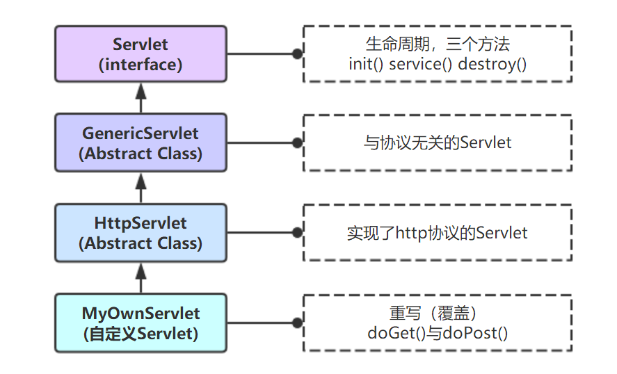

[TOC]

### J2EE

#### Servlet总结

##### 1. 什么是Servlet

Servlet 是在服务器上运行的小程序。一个 servlet 就是一个 Java 类，并且可以通过 “请求—响应” 编程模式来访问的这个驻留在服务器内存里的 servlet 程序。  

类的继承关系如下：



Servlet 三种实现方式：

- 实现javax.servlet.Servlet接口

- 继承javax.servlet.GenericServlet类
- 继承javax.servlet.http.HttpServlet类

　　通常会去继承HttpServlet类来完成Servlet。

在Java Web程序中，**Servlet**主要负责接收用户请求 `HttpServletRequest`,在`doGet()`,`doPost()`中做相应的处理，并将回应`HttpServletResponse`反馈给用户。**Servlet** 可以设置初始化参数，供Servlet内部使用。一个Servlet类只会有一个实例，在它初始化时调用`init()`方法，销毁时调用`destroy()`方法**。**Servlet需要在web.xml中配置（MyEclipse中创建Servlet会自动配置），**一个Servlet可以设置多个URL访问**。**Servlet不是线程安全**，因此要谨慎使用类变量。

##### 阐述Servlet和CGI的区别?

###### CGI的不足之处:

1，需要为每个请求启动一个操作 CGI 程序的系统进程。如果请求频繁，这将会带来很大的开销。

2，需要为每个请求加载和运行一个 CGI 程序，这将带来很大的开销

3，需要重复编写处理网络协议的代码以及编码，这些工作都是非常耗时的。

#### Servlet的优点:

1，只需要启动一个操作系统进程以及加载一个 JVM，大大降低了系统的开销

2，如果多个请求需要做同样处理的时候，这时候只需要加载一个类，这也大大降低了开销

3，所有动态加载的类可以实现对网络协议以及请求解码的共享，大大降低了工作量。

4，Servlet能直接和Web服务器交互，而普通的CGI程序不能。Servlet还能在各个程序之间共享数据，使数据库连接池之类的功能很容易实现。

补充：Sun Microsystems公司在1996年发布Servlet技术就是为了和CGI进行竞争，Servlet是一个特殊的Java程序，一个基于Java的Web应用通常包含一个或多个Servlet类。Servlet不能够自行创建并执行，它是在Servlet容器中运行的，容器将用户的请求传递给Servlet程序，并将Servlet的响应回传给用户。通常一个Servlet会关联一个或多个JSP页面。以前CGI经常因为性能开销上的问题被诟病，然而Fast CGI早就已经解决了CGI效率上的问题，所以面试的时候大可不必信口开河的诟病CGI，事实上有很多你熟悉的网站都使用了CGI技术。


#### Tomcat容器等级

Tomcat的容器分为4个等级，Servlet的容器管理Context容器，一个Context对应一个Web工程。


#### Servlet接口中有哪些方法及Servlet生命周期探秘

Servlet接口定义了5个方法，其中**前三个方法与Servlet生命周期相关**：

- `void init(ServletConfig config) throws ServletException`
- `void service(ServletRequest req, ServletResponse resp) throws ServletException, java.io.IOException`
- `void destroy()`
- `java.lang.String getServletInfo()`
- `ServletConfig getServletConfig()`

**生命周期：** **Web容器加载Servlet并将其实例化后，Servlet生命周期开始**，容器运行其**init()方法**进行Servlet的初始化；请求到达时调用Servlet的**service()方法**，service()方法会根据需要调用与请求对应的**doGet或doPost**等方法；当服务器关闭或项目被卸载时服务器会将Servlet实例销毁，此时会调用Servlet的**destroy()方法**。**init方法和destroy方法只会执行一次，service方法客户端每次请求Servlet都会执行**。Servlet中有时会用到一些需要初始化与销毁的资源，因此可以把初始化资源的代码放入init方法中，销毁资源的代码放入destroy方法中，这样就不需要每次处理客户端的请求都要初始化与销毁资源。

Servlet 类由自己编写，但对象由服务器来创建，并由服务器来调用相应的方法　

服务器启动时 ( web.xml中配置`load-on-startup=1`，默认为0 ) 或者第一次请求该 servlet 时，就会初始化一个 Servlet 对象，也就是会执行初始化方法 init(ServletConfig conf)

该 servlet 对象去处理所有客户端请求，在 `service(ServletRequest req，ServletResponse res)` 方法中执行

最后服务器关闭时，才会销毁这个 servlet 对象，执行 destroy() 方法。


**总结（面试会问）：**　　　

1）Servlet何时创建

	默认第一次访问servlet时创建该对象（调用init()方法）

2）Servlet何时销毁

	服务器关闭servlet就销毁了(调用destroy()方法)

3）每次访问必须执行的方法

	public void service(ServletRequest arg0, ServletResponse arg1)


#### Tomcat装载Servlet的三种情况

1. Servlet容器启动时自动装载某些Servlet，实现它只需要在web.xml文件中的 `<servlet></servlet>` 之间添加以下代码：

```xml
<load-on-startup>1</load-on-startup>
```

　　其中，数字越小表示优先级越高。

　　例如：我们在 web.xml 中设置 TestServlet2 的优先级为 1，而 TestServlet1 的优先级为 2，启动和关闭Tomcat：优先级高的先启动也先关闭。　　

2. 客户端首次向某个Servlet发送请求

3. Servlet 类被修改后，Tomcat 容器会重新装载 Servlet。


#### get和post请求的区别

get和post请求实际上是没有区别，大家可以自行查询相关文章（参考文章：https://www.cnblogs.com/logsharing/p/8448446.html，知乎对应的问题链接：[get和post区别？](https://www.zhihu.com/question/28586791)）！

可以把 get 和 post 当作两个不同的行为，两者并没有什么本质区别，**底层都是 TCP 连接**。 get请求用来从服务器上获得资源，而post是用来向服务器提交数据。比如你要获取人员列表可以用 get 请求，你需要创建一个人员可以用 post 。这也是 Restful API 最基本的一个要求。

推荐阅读：

- https://www.zhihu.com/question/28586791
- https://mp.weixin.qq.com/s?__biz=MzI3NzIzMzg3Mw==&mid=100000054&idx=1&sn=71f6c214f3833d9ca20b9f7dcd9d33e4#rd

#### 什么情况下调用doGet()和doPost()

Form 标签里的 **method** 的属性为 get 时调用 doGet()，为 post 时调用 doPost()。

#### 转发(Forward)和重定向(Redirect)的区别

**转发是服务器行为，重定向是客户端行为。**

**转发（Forward）** 通过RequestDispatcher对象的forward（HttpServletRequest request,HttpServletResponse response）方法实现的。RequestDispatcher可以通过HttpServletRequest 的getRequestDispatcher()方法获得。例如下面的代码就是跳转到login_success.jsp页面。

```
     request.getRequestDispatcher("login_success.jsp").forward(request, response);
```

**重定向（Redirect）** 是利用服务器返回的状态码来实现的。客户端浏览器请求服务器的时候，服务器会返回一个状态码。服务器通过 `HttpServletResponse` 的 `setStatus(int status)` 方法设置状态码。如果服务器返回301或者302，则浏览器会到新的网址重新请求该资源。

1. **从地址栏显示来说**

forward是服务器请求资源,服务器直接访问目标地址的URL,把那个URL的响应内容读取过来,然后把这些内容再发给浏览器.浏览器根本不知道服务器发送的内容从哪里来的,所以它的地址栏还是原来的地址. redirect是服务端根据逻辑,发送一个状态码,告诉浏览器重新去请求那个地址.所以地址栏显示的是新的URL.

1. **从数据共享来说**

forward:转发页面和转发到的页面可以共享request里面的数据. redirect:不能共享数据.

1. **从运用地方来说**

forward:一般用于用户登陆的时候,根据角色转发到相应的模块. redirect:一般用于用户注销登陆时返回主页面和跳转到其它的网站等

1. 从效率来说

forward:高. redirect:低.


#### forward和redirect

*本节参考：《Java程序员面试笔试宝典》P172*

　　在设计 Web 应用程序时，经常需要把一个系统进行结构化设计，即按照模块进行划分，让不同的 Servlet 来实现不同的功能，例如可以让其中一个 Servlet 接收用户的请求，另外一个 Servlet 来处理用户的请求。为了实现这种程序的模块化，就需要保证在不同的 Servlet 之间可以相互跳转，而 Servlet 中主要有两种实现跳转的方式：forward 与 redirect 方式。

　　forward 是服务器内部的重定向，服务器直接访问目标地址的 URL，把那个 URL 的响应内容读取过来，而客户端并不知道，因此在客户端浏览器的地址栏中不会显示转向后的地址，还是原来的地址。由于在整个定向的过程中用的是同一个 Request，因此 forward 会将 Request 的信息带到被定向的 JSP 或 Servlet 中使用。

　　redirect 则是客户端的重定向，是完全的跳转，即客户端浏览器会获取到跳转后的地址，然后重新发送请求，因此浏览器中会显示跳转后的地址。同事，由于这种方式比 forward 方式多了一次网络请求，因此其效率要低于 forward 方式。需要注意的是，客户端的重定向可以通过设置特定的 HTTP 头或改写 JavaScript 脚本实现。

　　下图可以更好的说明二者的区别：


　　鉴于以上的区别，一般当 forward 方式可以满足需求时，尽可能地使用 forward 方式。但在有些情况下，例如，需要跳转到下一个其他服务器上的资源，则必须使用 redirect 方式。

引申：filter的作用是什么？主要实现什么方法？

filter 使用户可以改变一个 request 并且修改一个 response。filter 不是一个 Servlet，它不能产生一个 response，但它能够在一个 request 到达 Servlet 之前预处理 request，也可以在离开 Servlet 时处理 response。filter 其实是一个 “Servlet Chaining” (Servler 链)。

一个 filter 的作用包括以下几个方面：

1）在 Servlet 被调用之前截获

2）在 Servlet 被调用之前检查 Servlet Request

3）根据需要修改 Request 头和 Request 数据

4）根据需要修改 Response 头和 Response 数据

5）在 Servlet 被调用之后截获


#### 自动刷新(Refresh)

自动刷新不仅可以实现一段时间之后自动跳转到另一个页面，还可以实现一段时间之后自动刷新本页面。Servlet中通过HttpServletResponse对象设置Header属性实现自动刷新例如：

```
Response.setHeader("Refresh","5;URL=http://localhost:8080/servlet/example.htm");
```

其中5为时间，单位为秒。URL指定就是要跳转的页面（如果设置自己的路径，就会实现每过5秒自动刷新本页面一次）

#### Servlet与线程安全

**Servlet不是线程安全的，多线程并发的读写会导致数据不同步的问题。** 解决的办法是尽量不要定义name属性，而是要把name变量分别定义在doGet()和doPost()方法内。虽然使用synchronized(name){}语句块可以解决问题，但是会造成线程的等待，不是很科学的办法。 注意：多线程的并发的读写Servlet类属性会导致数据不同步。但是如果只是并发地读取属性而不写入，则不存在数据不同步的问题。因此Servlet里的只读属性最好定义为final类型的。

参考：《javaweb整合开发王者归来》P92


#### tomcat和Servlet的联系

　　Tomcat是Web应用服务器，是一个Servlet/JSP容器。Tomcat 作为 Servlet 容器，负责处理客户请求，把请求传送给Servlet，并将Servlet的响应传送回给客户。而 Servlet 是一种运行在支持 Java 语言的服务器上的组件。Servlet最常见的用途是扩展 Java Web 服务器功能，提供非常安全的，可移植的，易于使用的CGI替代品。

　　从 http 协议中的请求和响应可以得知，浏览器发出的请求是一个请求文本，而浏览器接收到的也应该是一个响应文本。但是在上面这个图中，并不知道是如何转变的，只知道浏览器发送过来的请求也就是 request，我们响应回去的就用 response。忽略了其中的细节，现在就来探究一下。


① Tomcat 将 http 请求文本接收并解析，然后封装成 HttpServletRequest 类型的 request 对象，所有的 HTTP 头数据读可以通过 request 对象调用对应的方法查询到。

② Tomcat 同时会要响应的信息封装为 HttpServletResponse 类型的 response 对象，通过设置 response 属性就可以控制要输出到浏览器的内容，然后将 response 交给 tomcat，tomcat 就会将其变成响应文本的格式发送给浏览器

Java Servlet API 是 Servlet 容器(tomcat) 和 servlet 之间的接口，它定义了 serlvet 的各种方法，还定义了 Servlet 容器传送给 Servlet 的对象类，其中最重要的就是 ServletRequest 和 ServletResponse。所以说我们在编写 servlet 时，需要实现 Servlet 接口，按照其规范进行操作。


#### JSP和Servlet是什么关系

其实这个问题在上面已经阐述过了，Servlet是一个特殊的Java程序，它运行于服务器的JVM中，能够依靠服务器的支持向浏览器提供显示内容。JSP本质上是Servlet的一种简易形式，JSP会被服务器处理成一个类似于Servlet的Java程序，可以简化页面内容的生成。Servlet和JSP最主要的不同点在于，Servlet的应用逻辑是在Java文件中，并且完全从表示层中的HTML分离开来。而JSP的情况是Java和HTML可以组合成一个扩展名为.jsp的文件。有人说，Servlet就是在Java中写HTML，而JSP就是在HTML中写Java代码，当然这个说法是很片面且不够准确的。JSP侧重于视图，Servlet更侧重于控制逻辑，在MVC架构模式中，JSP适合充当视图（view）而Servlet适合充当控制器（controller）。


#### Jsp和Servlet的区别

**1、不同之处在哪？**

- Servlet 在 Java 代码中通过 HttpServletResponse 对象动态输出 HTML 内容
- JSP 在静态 HTML 内容中嵌入 Java 代码，Java 代码被动态执行后生成 HTML 内容

**2、各自的特点**

- Servlet 能够很好地组织业务逻辑代码，但是在 Java 源文件中通过字符串拼接的方式生成动态 HTML 内容会导致代码维护困难、可读性差
- JSP 虽然规避了 Servlet 在生成 HTML 内容方面的劣势，但是在 HTML 中混入大量、复杂的业务逻辑同样也是不可取的

**3、通过MVC双剑合璧**

既然 JSP 和 Servlet 都有自身的适用环境，那么能否扬长避短，让它们发挥各自的优势呢？答案是肯定的——MVC(Model-View-Controller)模式非常适合解决这一问题。

MVC模式（Model-View-Controller）是软件工程中的一种软件架构模式，把软件系统分为三个基本部分：模型（Model）、视图（View）和控制器（Controller）：

- Controller——负责转发请求，对请求进行处理
- View——负责界面显示
- Model——业务功能编写（例如算法实现）、数据库设计以及数据存取操作实现


在 JSP/Servlet 开发的软件系统中，这三个部分的描述如下所示：


1. Web 浏览器发送 HTTP 请求到服务端，被 Controller(Servlet) 获取并进行处理（例如参数解析、请求转发）
2. Controller(Servlet) 调用核心业务逻辑——Model部分，获得结果
3. Controller(Servlet) 将逻辑处理结果交给 View（JSP），动态输出 HTML 内容
4. 动态生成的 HTML 内容返回到浏览器显示

MVC 模式在 Web 开发中的好处是非常明显，它规避了 JSP 与 Servlet 各自的短板，Servlet 只负责业务逻辑而不会通过 out.append() 动态生成 HTML 代码；JSP 中也不会充斥着大量的业务代码。这大大提高了代码的可读性和可维护性。


#### JSP工作原理

JSP是一种Servlet，但是与HttpServlet的工作方式不太一样。HttpServlet是先由源代码编译为class文件后部署到服务器下，为先编译后部署。而JSP则是先部署后编译。JSP会在客户端第一次请求JSP文件时被编译为HttpJspPage类（接口Servlet的一个子类）。该类会被服务器临时存放在服务器工作目录里面。下面通过实例给大家介绍。 工程JspLoginDemo下有一个名为login.jsp的Jsp文件，把工程第一次部署到服务器上后访问这个Jsp文件，我们发现这个目录下多了下图这两个东东。 .class文件便是JSP对应的Servlet。编译完毕后再运行class文件来响应客户端请求。以后客户端访问login.jsp的时候，Tomcat将不再重新编译JSP文件，而是直接调用class文件来响应客户端请求。 [](https://camo.githubusercontent.com/5b077d70058831d1e226f188c245f262684fc434/68747470733a2f2f6d792d626c6f672d746f2d7573652e6f73732d636e2d6265696a696e672e616c6979756e63732e636f6d2f323031392d362f312e706e67) 由于JSP只会在客户端第一次请求的时候被编译 ，因此第一次请求JSP时会感觉比较慢，之后就会感觉快很多。如果把服务器保存的class文件删除，服务器也会重新编译JSP。

开发Web程序时经常需要修改JSP。Tomcat能够自动检测到JSP程序的改动。如果检测到JSP源代码发生了改动。Tomcat会在下次客户端请求JSP时重新编译JSP，而不需要重启Tomcat。这种自动检测功能是默认开启的，检测改动会消耗少量的时间，在部署Web应用的时候可以在web.xml中将它关掉。

参考：《javaweb整合开发王者归来》P97

#### JSP有哪些内置对象、作用分别是什么

[JSP内置对象 - CSDN博客](http://blog.csdn.net/qq_34337272/article/details/64310849)

JSP有9个内置对象：

- request：封装客户端的请求，其中包含来自GET或POST请求的参数；
- response：封装服务器对客户端的响应；
- pageContext：通过该对象可以获取其他对象；
- session：封装用户会话的对象；
- application：封装服务器运行环境的对象；
- out：输出服务器响应的输出流对象；
- config：Web应用的配置对象；
- page：JSP页面本身（相当于Java程序中的this）；
- exception：封装页面抛出异常的对象。

#### Request对象的主要方法有哪些

- setAttribute(String name,Object)：设置名字为name的request 的参数值
- getAttribute(String name)：返回由name指定的属性值
- getAttributeNames()：返回request 对象所有属性的名字集合，结果是一个枚举的实例
- getCookies()：返回客户端的所有 Cookie 对象，结果是一个Cookie 数组
- getCharacterEncoding() ：返回请求中的字符编码方式 = getContentLength() ：返回请求的 Body的长度
- getHeader(String name) ：获得HTTP协议定义的文件头信息
- getHeaders(String name) ：返回指定名字的request Header 的所有值，结果是一个枚举的实例
- getHeaderNames() ：返回所以request Header 的名字，结果是一个枚举的实例
- getInputStream() ：返回请求的输入流，用于获得请求中的数据
- getMethod() ：获得客户端向服务器端传送数据的方法
- getParameter(String name) ：获得客户端传送给服务器端的有 name指定的参数值
- getParameterNames() ：获得客户端传送给服务器端的所有参数的名字，结果是一个枚举的实例
- getParameterValues(String name)：获得有name指定的参数的所有值
- getProtocol()：获取客户端向服务器端传送数据所依据的协议名称
- getQueryString() ：获得查询字符串
- getRequestURI() ：获取发出请求字符串的客户端地址
- getRemoteAddr()：获取客户端的 IP 地址
- getRemoteHost() ：获取客户端的名字
- getSession([Boolean create]) ：返回和请求相关 Session
- getServerName() ：获取服务器的名字
- getServletPath()：获取客户端所请求的脚本文件的路径
- getServerPort()：获取服务器的端口号
- removeAttribute(String name)：删除请求中的一个属性

#### request.getAttribute()和 request.getParameter()有何区别

**从获取方向来看：**

`getParameter()`是获取 POST/GET 传递的参数值；

`getAttribute()`是获取对象容器中的数据值；

**从用途来看：**

`getParameter()`用于客户端重定向时，即点击了链接或提交按扭时传值用，即用于在用表单或url重定向传值时接收数据用。

`getAttribute()` 用于服务器端重定向时，即在 sevlet 中使用了 forward 函数,或 struts 中使用了 mapping.findForward。 getAttribute 只能收到程序用 setAttribute 传过来的值。

另外，可以用 `setAttribute()`,`getAttribute()` 发送接收对象.而 `getParameter()` 显然只能传字符串。 `setAttribute()` 是应用服务器把这个对象放在该页面所对应的一块内存中去，当你的页面服务器重定向到另一个页面时，应用服务器会把这块内存拷贝另一个页面所对应的内存中。这样`getAttribute()`就能取得你所设下的值，当然这种方法可以传对象。session也一样，只是对象在内存中的生命周期不一样而已。`getParameter()`只是应用服务器在分析你送上来的 request页面的文本时，取得你设在表单或 url 重定向时的值。

**总结：**

`getParameter()`返回的是String,用于读取提交的表单中的值;（获取之后会根据实际需要转换为自己需要的相应类型，比如整型，日期类型啊等等）

`getAttribute()`返回的是Object，需进行转换,可用`setAttribute()`设置成任意对象，使用很灵活，可随时用

#### include指令include的行为的区别

**include指令：** JSP可以通过include指令来包含其他文件。被包含的文件可以是JSP文件、HTML文件或文本文件。包含的文件就好像是该JSP文件的一部分，会被同时编译执行。 语法格式如下： <%@ include file="文件相对 url 地址" %>

i**nclude动作：** ``动作元素用来包含静态和动态的文件。该动作把指定文件插入正在生成的页面。语法格式如下： <jsp:include page="相对 URL 地址" flush="true" />

#### JSP九大内置对象，七大动作，三大指令

[JSP九大内置对象，七大动作，三大指令总结](http://blog.csdn.net/qq_34337272/article/details/64310849)

#### 讲解JSP中的四种作用域

JSP中的四种作用域包括page、request、session和application，具体来说：

- **page**代表与一个页面相关的对象和属性。
- **request**代表与Web客户机发出的一个请求相关的对象和属性。一个请求可能跨越多个页面，涉及多个Web组件；需要在页面显示的临时数据可以置于此作用域。
- **session**代表与某个用户与服务器建立的一次会话相关的对象和属性。跟某个用户相关的数据应该放在用户自己的session中。
- **application**代表与整个Web应用程序相关的对象和属性，它实质上是跨越整个Web应用程序，包括多个页面、请求和会话的一个全局作用域。

#### 如何实现JSP或Servlet的单线程模式

对于JSP页面，可以通过page指令进行设置。 `<%@page isThreadSafe="false"%>`

对于Servlet，可以让自定义的Servlet实现SingleThreadModel标识接口。

说明：如果将JSP或Servlet设置成单线程工作模式，会导致每个请求创建一个Servlet实例，这种实践将导致严重的性能问题（服务器的内存压力很大，还会导致频繁的垃圾回收），所以通常情况下并不会这么做。

#### 实现会话跟踪的技术有哪些

1. **使用Cookie**

向客户端发送Cookie

```
Cookie c =new Cookie("name","value"); //创建Cookie 
c.setMaxAge(60*60*24); //设置最大时效，此处设置的最大时效为一天
response.addCookie(c); //把Cookie放入到HTTP响应中
```

从客户端读取Cookie

```
String name ="name"; 
Cookie[]cookies =request.getCookies(); 
if(cookies !=null){ 
   for(int i= 0;i<cookies.length;i++){ 
    Cookie cookie =cookies[i]; 
    if(name.equals(cookis.getName())) 
    //something is here. 
    //you can get the value 
    cookie.getValue(); 
       
   }
 }
```

**优点:** 数据可以持久保存，不需要服务器资源，简单，基于文本的Key-Value

**缺点:** 大小受到限制，用户可以禁用Cookie功能，由于保存在本地，有一定的安全风险。

1. URL 重写

在URL中添加用户会话的信息作为请求的参数，或者将唯一的会话ID添加到URL结尾以标识一个会话。

**优点：** 在Cookie被禁用的时候依然可以使用

**缺点：** 必须对网站的URL进行编码，所有页面必须动态生成，不能用预先记录下来的URL进行访问。

3.隐藏的表单域

```
<input type="hidden" name ="session" value="..."/>
```

**优点：** Cookie被禁时可以使用

**缺点：** 所有页面必须是表单提交之后的结果。

1. HttpSession

在所有会话跟踪技术中，HttpSession对象是最强大也是功能最多的。当一个用户第一次访问某个网站时会自动创建 HttpSession，每个用户可以访问他自己的HttpSession。可以通过HttpServletRequest对象的getSession方 法获得HttpSession，通过HttpSession的setAttribute方法可以将一个值放在HttpSession中，通过调用 HttpSession对象的getAttribute方法，同时传入属性名就可以获取保存在HttpSession中的对象。与上面三种方式不同的 是，HttpSession放在服务器的内存中，因此不要将过大的对象放在里面，即使目前的Servlet容器可以在内存将满时将HttpSession 中的对象移到其他存储设备中，但是这样势必影响性能。添加到HttpSession中的值可以是任意Java对象，这个对象最好实现了 Serializable接口，这样Servlet容器在必要的时候可以将其序列化到文件中，否则在序列化时就会出现异常。

#### Cookie和Session的的区别

Cookie 和 Session都是用来跟踪浏览器用户身份的会话方式，但是两者的应用场景不太一样。

**Cookie 一般用来保存用户信息** 比如①我们在 Cookie 中保存已经登录过得用户信息，下次访问网站的时候页面可以自动帮你登录的一些基本信息给填了；②一般的网站都会有保持登录也就是说下次你再访问网站的时候就不需要重新登录了，这是因为用户登录的时候我们可以存放了一个 Token 在 Cookie 中，下次登录的时候只需要根据 Token 值来查找用户即可(为了安全考虑，重新登录一般要将 Token 重写)；③登录一次网站后访问网站其他页面不需要重新登录。**Session 的主要作用就是通过服务端记录用户的状态。** 典型的场景是购物车，当你要添加商品到购物车的时候，系统不知道是哪个用户操作的，因为 HTTP 协议是无状态的。服务端给特定的用户创建特定的 Session 之后就可以标识这个用户并且跟踪这个用户了。

Cookie 数据保存在客户端(浏览器端)，Session 数据保存在服务器端。

Cookie 存储在客户端中，而Session存储在服务器上，相对来说 Session 安全性更高。如果使用 Cookie 的一些敏感信息不要写入 Cookie 中，最好能将 Cookie 信息加密然后使用到的时候再去服务器端解密。

类似这种面试题，实际上都属于“开放性”问题，你扯到哪里都可以。不过如果我是面试官的话，我还是希望对方能做到一点——不要混淆 session 和 session 实现。

本来 session 是一个抽象概念，开发者为了实现中断和继续等操作，将 user agent 和 server 之间一对一的交互，抽象为“会话”，进而衍生出“会话状态”，也就是 session 的概念。

而 cookie 是一个实际存在的东西，http 协议中定义在 header 中的字段。可以认为是 session 的一种后端无状态实现。

而我们今天常说的 “session”，是为了绕开 cookie 的各种限制，通常借助 cookie 本身和后端存储实现的，一种更高级的会话状态实现。

所以 cookie 和 session，你可以认为是同一层次的概念，也可以认为是不同层次的概念。具体到实现，session 因为 session id 的存在，通常要借助 cookie 实现，但这并非必要，只能说是通用性较好的一种实现方案。


**引申**

1. 由于 HTTP 协议是无状态的协议，所以服务端需要记录用户的状态时，就需要用某种机制来识具体的用户，这个机制就是 Session。典型的场景比如购物车，当你点击下单按钮时，由于 HTTP 协议无状态，所以并不知道是哪个用户操作的，所以服务端要为特定的用户创建了特定的 Session，用用于标识这个用户，并且跟踪用户，这样才知道购物车里面有几本书。这个 Session 是保存在服务端的，有一个唯一标识。在服务端保存Session 的方法很多，内存、数据库、文件都有。集群的时候也要考虑 Session 的转移，在大型的网站，一般会有专门的 Session 服务器集群，用来保存用户会话，这个时候 Session 信息都是放在内存的，使用一些缓存服务比如 Memcached 之类的来放 Session。

2. 思考一下服务端如何识别特定的客户？

    这个时候 Cookie 就登场了。每次 HTTP 请求的时候，客户端都会发送相应的 Cookie 信息到服务端。实际上大多数的应用都是用 Cookie 来实现 Session 跟踪的，第一次创建 Session 的时候，服务端会在 HTTP 协议中告诉客户端，需要在 Cookie 里面记录一个Session ID，以后每次请求把这个会话 ID 发送到服务器，我就知道你是谁了。有人问，如果客户端的浏览器禁用了 Cookie 怎么办？一般这种情况下，会使用一种叫做URL重写的技术来进行会话跟踪，即每次 HTTP 交互，URL后面都会被附加上一个诸如 sid=xxxxx 这样的参数，服务端据此来识别用户。

3. Cookie 其实还可以用在一些方便用户的场景下，设想你某次登陆过一个网站，下次登录的时候不想再次输入账号了，怎么办？这个信息可以写到 Cookie 里面，访问网站的时候，网站页面的脚本可以读取这个信息，就自动帮你把用户名给填了，能够方便一下用户。这也是 Cookie 名称的由来，给用户的一点甜头。

所以，总结一下：

- Session 是在服务端保存的一个数据结构，用来跟踪用户的状态，这个数据可以保存在集群、数据库、文件中；
- Cookie 是客户端保存用户信息的一种机制，用来记录用户的一些信息，也是实现 Session 的一种方式。