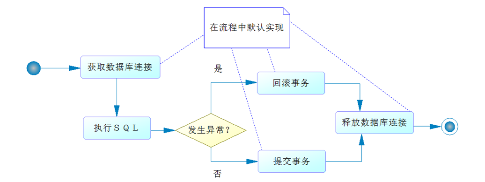
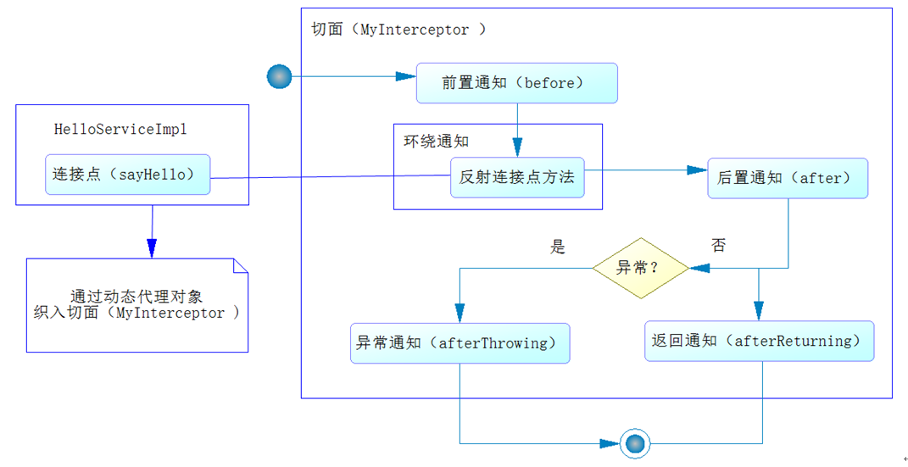
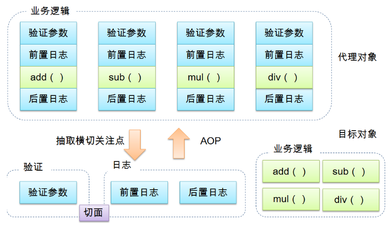
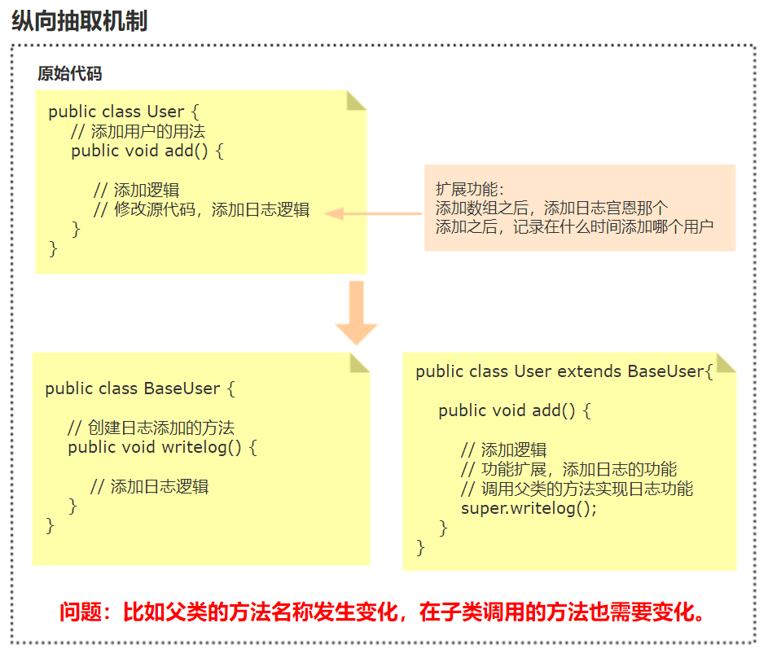
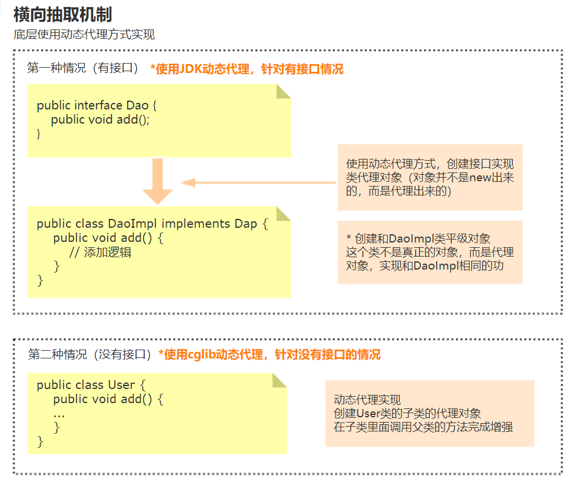

[TOC]

## Spring AOP

#### AOP 的概念

- 是一种约定流程的编程。
- 通过约定把对应的方法通过动态代理技织入约定的流程中。
- 核心：约定编程。作用：数据库事务、减少大量重复工作、对所有的web请求做切面来记录日志等。
- Spring AOP只能对方法进行拦截。

AOP(Aspect-Oriented Programming:面向切面编程)能够将那些与业务无关，**却为业务模块所共同调用的逻辑或责任（例如事务处理、日志管理、权限控制等）封装起来**，便于**减少系统的重复代码**，**降低模块间的耦合度**，并**有利于未来的可拓展性和可维护性**。

使用 AOP 之后我们可以把一些通用功能抽象出来，在需要用到的地方直接使用即可，这样大大简化了代码量。我们需要增加新功能时也方便，这样也提高了系统扩展性。日志功能、事务管理等等场景都用到了 AOP 。

**Spring AOP就是基于动态代理的**，如果要代理的对象，实现了某个接口，那么Spring AOP会使用**JDK Proxy**，去创建代理对象，而对于没有实现接口的对象，就无法使用 JDK Proxy 去进行代理了，这时候Spring AOP会使用 **Cglib** ，这时候Spring AOP会使用 **Cglib** 生成一个被代理对象的子类来作为代理

AOP 主要用来解决：在不改变原有业务逻辑的情况下，增强横切逻辑代码，根本上解耦合，避免横切逻辑代码重复。

AOP（Aspect Oriented Programming ）称为面向切面编程，扩展功能不是修改源代码实现，在程序开发中主要用来解决一些系统层面上的问题，比如日志，事务，权限等待，Struts2的拦截器设计就是基于AOP的思想，是个比较经典的例子。

**为什么使用AOP？**

以下是数据库操作的流程图。



其中大量的操作都是默认的操作流程，所以数据库的打开和关闭以及事物的提交和回滚都是可以通过默认的流程实现的，我们只需要关注SQL的编写。

Spring AOP 的**流程约定**如下







#### AOP名词

- 切面（Aspect）：一个关注点的模块化，这个关注点可能会横切多个对象。事务管理是J2EE应用中一个关于横切关注点的很好的例子。在Spring AOP中，切面可以使用基于模式或者基于@Aspect注解的方式来实现。
- 连接点（Joinpoint）：在程序执行过程中某个特定的点，比如某方法调用的时候或者处理异常的时候。在Spring AOP中，一个连接点总是表示一个方法的执行。
- 通知（Advice）：在切面的某个特定的连接点上执行的动作。其中包括了“around”、“before”和“after”等不同类型的通知（通知的类型将在后面部分进行讨论）。许多AOP框架（包括Spring）都是以拦截器做通知模型，并维护一个以连接点为中心的拦截器链。
- 切入点（Pointcut）：匹配连接点的断言。通知和一个切入点表达式关联，并在满足这个切入点的连接点上运行（例如，当执行某个特定名称的方法时）。切入点表达式如何和连接点匹配是AOP的核心：Spring缺省使用AspectJ切入点语法。
- 引入（Introduction）：用来给一个类型声明额外的方法或属性（也被称为连接类型声明（inter-type declaration））。Spring允许引入新的接口（以及一个对应的实现）到任何被代理的对象。例如，你可以使用引入来使一个bean实现IsModified接口，以便简化缓存机制。
- 目标对象（Target Object）：被一个或者多个切面所通知的对象。也被称做被通知（advised）对象。既然Spring AOP是通过运行时代理实现的，这个对象永远是一个被代理（proxied）对象。
- AOP代理（AOP Proxy）：AOP框架创建的对象，用来实现切面契约（例如通知方法执行等等）。在Spring中，AOP代理可以是JDK动态代理或者CGLIB代理。
- 织入（Weaving）：把切面连接到其它的应用程序类型或者对象上，并创建一个被通知的对象。这些可以在编译时（例如使用AspectJ编译器），类加载时和运行时完成。Spring和其他纯Java AOP框架一样，在运行时完成织入。


#### 使用 @AspectJ 注解实现AOP

Spring  AOP 只能对方法进行拦截。

##### 确定连接点

首先确定在什么地方使用AOP，确定**连接点(就是什么类的什么方法)**。 首先定义一个接口

```java
// 用户服务接口
public interface UserService {
	
	public void printUser();
	public void printUser(User user);
	public void manyAspects();
}
```

实现此接口

```java
// 用户服务接口实现类
@Service
public class UserServiceImpl implements UserService {
	
	private User user = null;

	@Override
	public void printUser(User user) {
		if (user == null) {
			throw new RuntimeException("检查用户参数是否为空......");
		}
		System.out.print("id =" + user.getId());
		System.out.print("\tusername =" + user.getUsername());
		System.out.println("\tnote =" + user.getNote());
	}

	@Override
	public void printUser() {
		if (user == null) {
			throw new RuntimeException("检查用户参数是否为空......");
		}
		System.out.print("id =" + user.getId());
		System.out.print("\tusername =" + user.getUsername());
		System.out.println("\tnote =" + user.getNote());
	}
	
    @Override
	public void manyAspects() {
		System.out.println("测试多个切面顺序");
	}
	// Getter and setter
	
}
```

所以将上述的printUser() 方法作为连接点。


##### 开发切面与定义切点

使用@Aspect 注解定义一个切面类。方法中的 @After、@Before、@AfterThrowing 等注解是定义流程中的方法。

```java
@Aspect
public class MyAspect {
	
    // 此方法为切点，下面的传入此方法名即可
	@Pointcut("execution(* com.springboot.chapter4.*.*.*.*.print(..)) && bean('userServiceImpl')")
	public void pointCut() {
	}
	
	@Before("pointCut() && args(user)")
	public void beforeParam( User user) {
		System.out.println("before ......");
	} 
	
	@Before("pointCut()")
	public void before() {
		System.out.println("before ......");
	}
	
	@After("pointCut()")
	public void after() {
		System.out.println("after ......");
	}
	
	
	@AfterReturning("pointCut()")
	public void afterReturning() {
		System.out.println("afterReturning ......");
	}
	
	@AfterThrowing("pointCut()")
	public void afterThrowing() {
		System.out.println("afterThrowing ......");
	}
	

	@Around("pointCut()")
	public void around(ProceedingJoinPoint jp) throws Throwable {
		System.out.println("around before......");
		jp.proceed();
		System.out.println("around after......");
	}
}
```

上述中

```java
@Pointcut("execution(* com.springboot.chapter4.*.*.*.*.print(..)) && bean('userServiceImpl')")
public void pointCut() {
}
```

@Pointcut 注解定义了一个切点， 使用一个方法名指代，如 pointCut()。后面的 @AfterThrowing("pointCut()") 等注解中传入此方法名即可。

@Pointcut 注解中定义一个正则式，用于拦截方法。

```java
execution(* com.springboot.chapter4.*.*.*.*.print(..)
```

- execution 表示执行的时候拦截里面的正则匹配的方法。
- \* 表示任意返回值的方法。
- com.springboot.chapter4.*.*.*.*.print 指定方法。
- (..) 表示任意参数进行匹配。


**配置文件**

```java
// 指定扫描包
@SpringBootApplication(scanBasePackages = { "com.springboot.chapter4.aspect" })
public class Chapter4Application {

	// 启动切面
	public static void main(String[] args) {
		SpringApplication.run(Chapter4Application.class, args);
	}

	// 定义切面
	@Bean(name = "myAspect")        // 与自定义的切面类对应
	public MyAspect initMyAspect() {
		return new MyAspect();	
	}
}
```


##### 测试AOP

在controller中调用对应的方法测试。

```java
// 定义控制器
@Controller
// 定义类请求路径
@RequestMapping("/user")
public class UserController {

	// 注入用户服务
	@Autowired
	private UserService userService = null;

	// 定义请求
	@RequestMapping("/print")
	// 返回json
	@ResponseBody
	public User printUser(Long id, String userName, String note) {
		User user = new User();
		user.setId(id);
		user.setUsername(userName);
		user.setNote(note);
		userService.printUser(user);  // 此处调用了printUser方法就会调用切面中的逻辑
		return user;
	}
}	
```


**环绕通知（Around）**

是最强大的通知，但也难以控制，使用场景是需要大幅度修改原有目标对象的服务逻辑时，否则尽量使用其他的通知。


##### 引入

引入是给接口引入新的方法以增强其功能，可以给接口引入新的接口。

如现在给 UserService接口 引入一个用户检测接口 UserValidator。

```java
// 用户检测接口
public interface UserValidator {	
	public boolean validate(User user);
}
```

实现类

```java
public class UserValidatorImpl implements UserValidator {

	@Override
	public boolean validate(User user) {
		System.out.println("引入新的接口："+ UserValidator.class.getSimpleName());
		// 检测用户是否合法
        return user != null;
	}
}
```

引入新的接口,即在上面的 MyAspect 切面类中添加引入新的接口。

```java
@Aspect	// 切面类
public class MyAspect {
    
	@DeclareParents(value = "com.springboot.chapter4.aspect.service.impl.UserServiceImpl+", defaultImpl = UserValidatorImpl.class)
	public UserValidator userValidator;
}
```

@DeclareParents 注解用于引入新的类来增强服务，必须要定义两个属性：

- value：指向需要增强的目标对象
- defaultImpl：引入增强功能的类


测试引入

```java
// 定义请求
@RequestMapping("/vp")
@ResponseBody
public User validateAndPrint(Long id, String userName, String note) {
    User user = new User();
    user.setId(id);
    user.setUsername(userName);
    user.setNote(note);
    // 强制转换 因为userService 也引入了 UserValidator 接口的功能， 所以可以强制转换
    UserValidator userValidator = (UserValidator) userService;
    // 验证用户是否为空
    if (userValidator.validate(user)) {
        userService.printUser(user);
    }
    return user;
}
```


##### 织入

织入是一个生成动态代理对象且将切面和目标对象方法编织成为约定流程的过程。

两种模式，一是接口 + 实现类。如上述的流程就是，是Spring 推荐的方式。二是不使用接口模式。Spring采用了 JDK 和 CGLIB 两种方式实现动态代理，但是 Spring的处理规则是当需要使用AOP的类拥有接口时，会以 JDK 动态代理运行，否则以 CGLIB 运行。因此如果不使用 接口模式就会使用 CGLIB 动态代理。


#### 底层原理



##### 第一种 JDK 自带的动态代理技术

JDK动态代理必须基于接口进行代理

作用：使用代理可以对目标对象进行性能监控（计算运行时间）、安全检查（是否具有权限）、 记录日志等。

注意：必须要有接口才能进行代理，代理后对象必须转换为接口类型


##### 第二种 CGLIB(CodeGenerationLibrary)是一个开源项目

Spring使用CGlib 进行AOP代理， hibernate 也是支持CGlib（默认使用 javassist ）需要下载cglib 的jar包（Spring 最新版本3.2 内部已经集成了cglib ，**无需下载cglib的jar** ）

**作用：可以为目标类，动态创建子类，对目标类方法进行代理（无需接口）**

原理：Spring AOP 底层，会判断用户是根据接口代理还是目标类代理，如果针对接口代理就使用JDK代理，如果针对目标类代理就使用Cglib代理。




####  多个切面

定义第一个切面类 实现Order接口

```java
@Aspect
public class MyAspect1 implements Ordered {     // 实现Order接口
	
	@Override
	public int getOrder() {
		return 1;
	}

	@Pointcut("execution(* com.springboot.chapter4.aspect.service.impl.UserServiceImpl.manyAspects(..))")
	public void manyAspects() {
	}

	@Before("manyAspects()")
	public void before() {
		System.out.println("MyAspect1 before ......");
	}

	@After("manyAspects()")
	public void after() {
		System.out.println("MyAspect1 after ......");
	}

	@After("manyAspects()")
	public void afterReturning() {
		System.out.println("MyAspect1 afterReturning ......");
	}

}
```

定义第二个切面类 使用@Order注解

```java
@Aspect
@Order(2)       // 使用@Order注解
public class MyAspect2 implements Ordered  {
	
	@Pointcut("execution(* com.springboot.chapter4.aspect.service.impl.UserServiceImpl.manyAspects(..))")
	public void manyAspects() {
	}

	@Before("manyAspects()")
	public void before() {
		System.out.println("MyAspect2 before ......");
	}

	@After("manyAspects()")
	public void after() {
		System.out.println("MyAspect2 after ......");
	}

	@After("manyAspects()")
	public void afterReturning() {
		System.out.println("MyAspect2 afterReturning ......");
	}

	@Override
	public int getOrder() {
		return 2;
	}
}
```

以下配置多个切面类。

```java
// 指定扫描包
@SpringBootApplication(scanBasePackages = { "com.springboot.chapter4.aspect" })
public class Chapter4Application {

	// 启动切面
	public static void main(String[] args) {
		SpringApplication.run(Chapter4Application.class, args);
	}

	// 定义切面
	@Bean(name = "myAspect")
	public MyAspect initMyAspect() {
		return new MyAspect();
	}

	// 定义切面
	@Bean(name = "myAspect2")
	public MyAspect2 initMyAspect2() {
		return new MyAspect2();
	}

	// 定义切面
	@Bean(name = "myAspect1")
	public MyAspect1 initMyAspect1() {
		return new MyAspect1();
	}

}
```

上述的多个切面可以是监控同一个方法，当调用方法时，使用 **@Order** 注解或者实现 Order接口 都能定义不同切面的执行顺序。推荐使用 **@Order** 注解。


#### Spring的AOP操作

- 在Spring里面进行Aop操作，使用aspectj实现
    - aspectj不是Spring的一部分，和Spring一起使用进行Aop操作 
    - Spring2.0以后新增了对aspectj的支持

- 使用aspectj实现aop有两种方式
    - 基于aspectj的xml配置
    - 基于aspectj的注解方式

##### （1）AOP准备操作

1、除了导入基本的jar包之外，还需要导入aop相关的jar包：

```
aopalliance-1.0.jar
aspectjweaver-1.8.7.jar
spring-aspects-5.0.4.RELEASE.jar
spring-aop-5.0.4.RELEASE.jar
```

2、创建Spring核心配置文件 
除了引入了约束spring-beans之外还需要引入新约束spring-aop

```xml
<?xml version="1.0" encoding="UTF-8"?>
<beans xmlns="http://www.springframework.org/schema/beans"
       xmlns:xsi="http://www.w3.org/2001/XMLSchema-instance"
       xsi:schemaLocation="
        http://www.springframework.org/schema/beans http://www.springframework.org/schema/beans/spring-beans.xsd
        http://www.springframework.org/schema/context http://www.springframework.org/schema/context/spring-aop.xsd">

</beans>12345678
```

##### （2）使用表达式配置切入点

1. 切入点：实际增强的方法
2. 常用的表达式
    execution(<访问修饰符>? <返回类型> <方法名>(<参数>)<异常>)
    （1）对包内的add方法进行增强
    `execution(* cn.blinkit.aop.Book.add(..))`
    （2）* 是对类里面的所有方法进行增强
    `execution(* cn.blinkit.aop.Book.*(..))`
    （3）*.* 是所有的类中的方法进行增强
    `execution(* *.*(..))`
    （4）匹配所有save开头的方法
    `execution(* save*(..))`


#### 3.5 使用xml实现AOP

**aop配置代码：** Book

```java
public class Book {
    public void add() {
        System.out.println("add......");
    }
}
```

MyBook

```java
public class MyBook {
    public void before1() {
        System.out.println("前置增强......");
    }

    public void after1() {
        System.out.println("后置增强......");
    }

    //环绕通知
    public void around1(ProceedingJoinPoint proceedingJoinPoint) throws Throwable {
        //方法之前
        System.out.println("方法之前.....");

        //执行被增强的方法
        proceedingJoinPoint.proceed();

        //方法之后
        System.out.println("方法之后......");

    }
}
```

xml配置

```xml
    <!--1. 配置对象-->
    <bean id="book" class="cn.blinkit.aop.Book"></bean>
    <bean id="myBook" class="cn.blinkit.aop.MyBook"></bean>

    <!--2. 配置aop操作-->
    <aop:config>
        <!--2.1 配置切入点-->
        <aop:pointcut id="pointcut1" expression="execution(* cn.blinkit.aop.Book.*(..))"></aop:pointcut>

        <!--2.2 配置切面
                把增强用到方法上面
        -->
        <aop:aspect ref="myBook">
            <!--
                aop:before   :前置通知
                aop:after    :后置通知
                aop:around   :环绕通知
                配置增强类型
                method : 增强类里面使用哪个方法作为前置
            -->
            <aop:before method="before1" pointcut-ref="pointcut1"></aop:before>
            <aop:after method="after1" pointcut-ref="pointcut1"></aop:after>
            <aop:around method="around1" pointcut-ref="pointcut1"></aop:around>
        </aop:aspect>
    </aop:config>
```

测试代码

```java
public class AOPTest {
    @Test
    public void testBook() {
        ApplicationContext context = new ClassPathXmlApplicationContext("cn/blinkit/aop/spring-aop.xml");
        Book book = (Book) context.getBean("book");
        book.add();

    }
}
```


#### 3.6 使用注解实现AOP

1. 创建对象
    (1)创建Book和MyBook **（增强类）** 对象

2. 在spring核心配置文件中，开启aop操作
    具体操作见xml配置文件代码：

    ```xml
    <?xml version="1.0" encoding="UTF-8"?>
    <beans xmlns="http://www.springframework.org/schema/beans"
           xmlns:xsi="http://www.w3.org/2001/XMLSchema-instance"
           xmlns:aop="http://www.springframework.org/schema/aop"
           xsi:schemaLocation="http://www.springframework.org/schema/beans http://www.springframework.org/schema/beans/spring-beans.xsd
            http://www.springframework.org/schema/aop http://www.springframework.org/schema/aop/spring-aop.xsd">
    
        <!-- 1.开启aop操作 -->
        <aop:aspectj-autoproxy></aop:aspectj-autoproxy>
    
        <!-- 2.配置对象 -->
        <bean id="book" class="com.jxs.aspectj.Book"></bean>
        <bean id="nbBook" class="com.jxs.aspectj.NBBook"></bean>
    
    </beans>
    ```

3. 在增强类上面使用注解完成aop操作
    （1）类上面加上`@Aspect`
    （2）方法上面加上
    `@Before(value = "execution(* cn.blinkit.aop.anno.Book.*(..))")`
    `@After(value = "表达式")`
    `@Around(value = "表达式")`等...

4. 

**Book**

```java
public class Book {
    public void add() {
        System.out.println("add...注解版本...");
    }
}
```

**MyBook增强类**

```java
@Aspect
public class MyBook {
    //在方法上面使用注解完成增强配置
    @Before(value = "execution(* cn.blinkit.aop.anno.Book.*(..))")
    public void before1() {
        System.out.println("前置增强...注解版本...");
    }

    @After(value = "execution(* cn.blinkit.aop.anno.Book.*(..))")
    public void after1() {
        System.out.println("后置增强...注解版本...");
    }

    //环绕通知
    @Around(value = "execution(* cn.blinkit.aop.anno.Book.*(..))")
    public void around1(ProceedingJoinPoint proceedingJoinPoint) throws Throwable {
        //方法之前
        System.out.println("方法之前...注解版本...");

        //执行被增强的方法
        proceedingJoinPoint.proceed();

        //方法之后
        System.out.println("方法之后...注解版本...");

    }
}
```

**xml配置**

```xml
<!--开启aop操作-->
    <aop:aspectj-autoproxy></aop:aspectj-autoproxy>

    <!--创建对象-->
    <bean id="book" class="cn.blinkit.aop.anno.Book"></bean>
    <bean id="myBook" class="cn.blinkit.aop.anno.MyBook"></bean>
```


#### 3.7 为什么需要代理模式？

假设需实现一个计算的类Math、完成加、减、乘、除功能，如下所示：  

```java
package com.zhangguo.Spring041.aop01;

public class Math {
    //加
    public int add(int n1,int n2){
        int result=n1+n2;
        System.out.println(n1+"+"+n2+"="+result);
        return result;
    }
    
    
    //减
    public int sub(int n1,int n2){
        int result=n1-n2;
        System.out.println(n1+"-"+n2+"="+result);
        return result;
    }
    
    //乘
    public int mut(int n1,int n2){
        int result=n1*n2;
        System.out.println(n1+"X"+n2+"="+result);
        return result;
    }
    
    //除
    public int div(int n1,int n2){
        int result=n1/n2;
        System.out.println(n1+"/"+n2+"="+result);
        return result;
    }
}
```

现在需求发生了变化，要求项目中所有的类在执行方法时输出执行耗时。最直接的办法是修改源代码，如下所示：  

```java
package com.zhangguo.Spring041.aop01;

import java.util.Random;

public class Math {
    //加
    public int add(int n1,int n2){
        //开始时间
        long start=System.currentTimeMillis();
        lazy();
        int result=n1+n2;
        System.out.println(n1+"+"+n2+"="+result);
        Long span= System.currentTimeMillis()-start;
        System.out.println("共用时："+span);
        return result;
    }
    
    //减
    public int sub(int n1,int n2){
        //开始时间
        long start=System.currentTimeMillis();
        lazy();
        int result=n1-n2;
        System.out.println(n1+"-"+n2+"="+result);
        Long span= System.currentTimeMillis()-start;
        System.out.println("共用时："+span);
        return result;
    }
    
    //乘
    public int mut(int n1,int n2){
        //开始时间
        long start=System.currentTimeMillis();
        lazy();
        int result=n1*n2;
        System.out.println(n1+"X"+n2+"="+result);
        Long span= System.currentTimeMillis()-start;
        System.out.println("共用时："+span);
        return result;
    }
    
    //除
    public int div(int n1,int n2){
        //开始时间
        long start=System.currentTimeMillis();
        lazy();
        int result=n1/n2;
        System.out.println(n1+"/"+n2+"="+result);
        Long span= System.currentTimeMillis()-start;
        System.out.println("共用时："+span);
        return result;
    }
    
    //模拟延时
    public void lazy()
    {
        try {
            int n=(int)new Random().nextInt(500);
            Thread.sleep(n);
        } catch (InterruptedException e) {
            e.printStackTrace();
        }
    }
}
```


缺点：

1. 工作量特别大，如果项目中有多个类，多个方法，则要修改多次。
2. 违背了设计原则：开闭原则（OCP），对扩展开放，对修改关闭，而为了增加功能把每个方法都修改了，也不便于维护。
3. 违背了设计原则：单一职责（SRP），每个方法除了要完成自己本身的功能，还要计算耗时、延时；每一个方法引起它变化的原因就有多种。
4. 违背了设计原则：依赖倒转（DIP），抽象不应该依赖细节，两者都应该依赖抽象。而在Test类中，Test与Math都是细节。

解决：

- 使用静态代理可以解决部分问题（请往下看...）


#### 3.8 静态代理

 1、定义抽象主题接口

```java
package com.zhangguo.Spring041.aop02;

/**
 * 接口
 * 抽象主题
 */
public interface IMath {
    //加
    int add(int n1, int n2);

    //减
    int sub(int n1, int n2);

    //乘
    int mut(int n1, int n2);

    //除
    int div(int n1, int n2);

}
```

2、主题类，算术类，实现抽象接口

```java
package com.zhangguo.Spring041.aop02;

/**
 * 被代理的目标对象
 *真实主题
 */
public class Math implements IMath {
    //加
    public int add(int n1,int n2){
        int result=n1+n2;
        System.out.println(n1+"+"+n2+"="+result);
        return result;
    }
    
    //减
    public int sub(int n1,int n2){
        int result=n1-n2;
        System.out.println(n1+"-"+n2+"="+result);
        return result;
    }
    
    //乘
    public int mut(int n1,int n2){
        int result=n1*n2;
        System.out.println(n1+"X"+n2+"="+result);
        return result;
    }
    
    //除
    public int div(int n1,int n2){
        int result=n1/n2;
        System.out.println(n1+"/"+n2+"="+result);
        return result;
    }
}
```

3、代理类 

```java
package com.zhangguo.Spring041.aop02;

import java.util.Random;

/**
 * 静态代理类
 */
public class MathProxy implements IMath {

    //被代理的对象
    IMath math=new Math();
    
    //加
    public int add(int n1, int n2) {
        //开始时间
        long start=System.currentTimeMillis();
        lazy();
        int result=math.add(n1, n2);
        Long span= System.currentTimeMillis()-start;
        System.out.println("共用时："+span);
        return result;
    }

    //减法
    public int sub(int n1, int n2) {
        //开始时间
        long start=System.currentTimeMillis();
        lazy();
        int result=math.sub(n1, n2);
        Long span= System.currentTimeMillis()-start;
        System.out.println("共用时："+span);
        return result;
    }

    //乘
    public int mut(int n1, int n2) {
        //开始时间
        long start=System.currentTimeMillis();
        lazy();
        int result=math.mut(n1, n2);
        Long span= System.currentTimeMillis()-start;
        System.out.println("共用时："+span);
        return result;
    }
    
    //除
    public int div(int n1, int n2) {
        //开始时间
        long start=System.currentTimeMillis();
        lazy();
        int result=math.div(n1, n2);
        Long span= System.currentTimeMillis()-start;
        System.out.println("共用时："+span);
        return result;
    }

    //模拟延时
    public void lazy()
    {
        try {
            int n=(int)new Random().nextInt(500);
            Thread.sleep(n);
        } catch (InterruptedException e) {
            e.printStackTrace();
        }
    }
}
```

4、测试运行 

```java
package com.zhangguo.Spring041.aop02;

public class Test {
    
    IMath math=new MathProxy();
    @org.junit.Test
    public void test01()
    {
        int n1=100,n2=5;
        math.add(n1, n2);
        math.sub(n1, n2);
        math.mut(n1, n2);
        math.div(n1, n2);
    }
}
```

5、小结 

通过静态代理，是否完全解决了上述的4个问题：

**已解决：**

- 解决了“开闭原则（OCP）”的问题，因为并没有修改Math类，而扩展出了MathProxy类。

- 解决了“依赖倒转（DIP）”的问题，通过引入接口。

- 解决了“单一职责（SRP）”的问题，Math类不再需要去计算耗时与延时操作，但从某些方面讲MathProxy还是存在该问题。

**未解决：**

- 如果项目中有多个类，则需要编写多个代理类，工作量大，不好修改，不好维护，不能应对变化。

如果要解决上面的问题，可以使用动态代理。


#### 3.9 动态代理，使用JDK内置的Proxy实现

只需要一个代理类，而不是针对每个类编写代理类。

在上一个示例中修改代理类MathProxy如下：

```java
package com.zhangguo.Spring041.aop03;

import java.lang.reflect.InvocationHandler;
import java.lang.reflect.Method;
import java.lang.reflect.Proxy;
import java.util.Random;

/**
 * 动态代理类
 */
public class DynamicProxy implements InvocationHandler {

    //被代理的对象
    Object targetObject;
    
    /**
     * 获得被代理后的对象
     * @param object 被代理的对象
     * @return 代理后的对象
     */
    public Object getProxyObject(Object object){
        this.targetObject=object;
        return Proxy.newProxyInstance(
                targetObject.getClass().getClassLoader(), //类加载器
                targetObject.getClass().getInterfaces(),  //获得被代理对象的所有接口
                this);  //InvocationHandler对象
        //loader:一个ClassLoader对象，定义了由哪个ClassLoader对象来生成代理对象进行加载
        //interfaces:一个Interface对象的数组，表示的是我将要给我需要代理的对象提供一组什么接口，如果我提供了一组接口给它，那么这个代理对象就宣称实现了该接口(多态)，这样我就能调用这组接口中的方法了
        //h:一个InvocationHandler对象，表示的是当我这个动态代理对象在调用方法的时候，会关联到哪一个InvocationHandler对象上，间接通过invoke来执行
    }
    
    
    /**
     * 当用户调用对象中的每个方法时都通过下面的方法执行，方法必须在接口
     * proxy 被代理后的对象
     * method 将要被执行的方法信息（反射）
     * args 执行方法时需要的参数
     */
    public Object invoke(Object proxy, Method method, Object[] args) throws Throwable {
        //被织入的内容，开始时间
        long start=System.currentTimeMillis();
        lazy();
        
        //使用反射在目标对象上调用方法并传入参数
        Object result=method.invoke(targetObject, args);
        
        //被织入的内容，结束时间
        Long span= System.currentTimeMillis()-start;
        System.out.println("共用时："+span);
        
        return result;
    }
    
    //模拟延时
    public void lazy()
    {
        try {
            int n=(int)new Random().nextInt(500);
            Thread.sleep(n);
        } catch (InterruptedException e) {
            e.printStackTrace();
        }
    }

}
```

测试运行：  

```java
package com.zhangguo.Spring041.aop03;

public class Test {
    
    //实例化一个MathProxy代理对象
    //通过getProxyObject方法获得被代理后的对象
    IMath math=(IMath)new DynamicProxy().getProxyObject(new Math());
    @org.junit.Test
    public void test01()
    {
        int n1=100,n2=5;
        math.add(n1, n2);
        math.sub(n1, n2);
        math.mut(n1, n2);
        math.div(n1, n2);
    }
    
    IMessage message=(IMessage) new DynamicProxy().getProxyObject(new Message());
    @org.junit.Test
    public void test02()
    {
        message.message();
    }
}
```

小结：

 JDK内置的Proxy动态代理可以在运行时动态生成字节码，而没必要针对每个类编写代理类。中间主要使用到了一个接口InvocationHandler与Proxy.newProxyInstance静态方法，参数说明如下：

使用内置的Proxy实现动态代理有一个问题：**被代理的类必须实现接口，未实现接口则没办法完成动态代理。**

如果项目中有些类没有实现接口，则不应该为了实现动态代理而刻意去抽出一些没有实例意义的接口，通过cglib可以解决该问题。


#### 3.10 动态代理，使用cglib实现

CGLIB(Code Generation Library)是一个开源项目,是一个强大的，高性能，高质量的Code生成类库，它可以在运行期扩展Java类与实现Java接口，通俗说cglib可以在运行时动态生成字节码。

1、引用cglib，通过maven

2、使用cglib完成动态代理，大概的原理是：cglib继承被代理的类，重写方法，织入通知，动态生成字节码并运行，因为是继承所以final类是没有办法动态代理的。具体实现如下：  

```java
package com.zhangguo.Spring041.aop04;

import java.lang.reflect.Method;
import java.util.Random;

import net.sf.cglib.proxy.Enhancer;
import net.sf.cglib.proxy.MethodInterceptor;
import net.sf.cglib.proxy.MethodProxy;

/*
 * 动态代理类
 * 实现了一个方法拦截器接口
 */
public class DynamicProxy implements MethodInterceptor {

    // 被代理对象
    Object targetObject;

    //Generate a new class if necessary and uses the specified callbacks (if any) to create a new object instance. 
    //Uses the no-arg constructor of the superclass.
    //动态生成一个新的类，使用父类的无参构造方法创建一个指定了特定回调的代理实例
    public Object getProxyObject(Object object) {
        this.targetObject = object;
        //增强器，动态代码生成器
        Enhancer enhancer=new Enhancer();
        //回调方法
        enhancer.setCallback(this);
        //设置生成类的父类类型
        enhancer.setSuperclass(targetObject.getClass());
        //动态生成字节码并返回代理对象
        return enhancer.create();
    }

    // 拦截方法
    public Object intercept(Object object, Method method, Object[] args, MethodProxy methodProxy) throws Throwable {
        // 被织入的横切内容，开始时间 before
        long start = System.currentTimeMillis();
        lazy();

        // 调用方法
        Object result = methodProxy.invoke(targetObject, args);

        // 被织入的横切内容，结束时间
        Long span = System.currentTimeMillis() - start;
        System.out.println("共用时：" + span);
        
        return result;
    }

    // 模拟延时
    public void lazy() {
        try {
            int n = (int) new Random().nextInt(500);
            Thread.sleep(n);
        } catch (InterruptedException e) {
            e.printStackTrace();
        }
    }

}
```

测试运行：  

```java
package com.zhangguo.Spring041.aop04;

public class Test {
    //实例化一个DynamicProxy代理对象
    //通过getProxyObject方法获得被代理后的对象
    Math math=(Math)new DynamicProxy().getProxyObject(new Math());
    @org.junit.Test
    public void test01()
    {
        int n1=100,n2=5;
        math.add(n1, n2);
        math.sub(n1, n2);
        math.mut(n1, n2);
        math.div(n1, n2);
    }
    //另一个被代理的对象,不再需要重新编辑代理代码
    Message message=(Message) new DynamicProxy().getProxyObject(new Message());
    @org.junit.Test
    public void test02()
    {
        message.message();
    }
}
```

**小结**

使用cglib可以实现动态代理，即使被代理的类没有实现接口，但被代理的类必须不是final类。


#### 面试题

##### 1. Spring AOP和AspectJ AOP有什么区别？

**Spring AOP 属于==运行时==增强，而 AspectJ 是==编译时==增强。** Spring AOP **基于代理**(Proxying)，而 AspectJ **基于字节码**操作(Bytecode Manipulation)。

Spring AOP 已经**集成了 AspectJ**  ，AspectJ  应该算的上是 Java 生态系统中最完整的 AOP 框架了。AspectJ  相比于 Spring AOP 功能更加强大，但是 Spring AOP 相对来说更简单，

如果我们的切面比较少，那么两者性能差异不大。但是，当切面太多的话，最好选择 AspectJ ，它比 Spring AOP 快很多。

##### 2. 对AOP的理解？

**我的理解**

- AOP（Aspect Oriented Programming ）称为面向切面编程，扩展功能不是修改源代码实现，在程序开发中主要用来解决一些系统层面上的问题，比如日志，事务，权限等待，Struts2的拦截器设计就是基于AOP的思想，是个比较经典的例子。
- 面向切面编程（aop）是对面向对象编程（oop）的补充 
- 面向切面编程提供声明式事务管理
- AOP就是典型的代理模式的体现

**Spring AOP实现原理** 

- 动态代理（利用**反射和动态编译**将代理模式变成动态的） 

- JDK的动态代理

    - JDK内置的Proxy动态代理可以在运行时动态生成字节码，而没必要针对每个类编写代理类
    - JDKProxy返回动态代理类，是目标类所实现接口的另一个实现版本，它实现了对目标类的代理（如同UserDAOProxy与UserDAOImp的关系） 

- cglib动态代理 

    - CGLibProxy返回的动态代理类，则是目标代理类的一个子类（代理类扩展了UserDaoImpl类） 
    - cglib继承被代理的类，重写方法，织入通知，动态生成字节码并运行

**优点**

- 各个步骤之间的良好隔离性 
- 源代码无关性
- 松耦合
- 易扩展
- 代码复用


AOP（Aspect Oriented Programming ）称为面向切面编程，扩展功能不是修改源代码实现，在程序开发中主要用来解决一些系统层面上的问题，比如日志，事务，权限等待，Struts2的拦截器设计就是基于AOP的思想，是个比较经典的例子。

- AOP：面向切面编程，扩展功能不修改源代码实现
- AOP采取**横向抽取机制**，取代了传统**纵向继承**体系重复性代码（性能监视、事务管理、安全检查、缓存）

**spring的底层采用两种方式进行增强**

         第一：Spring传统AOP 纯java实现，在运行期，对目标对象进行代理，织入增强代码
    
         第二：AspectJ第三方开源技术，Spring已经整合AspectJ，提供对AspectJ注解的支持，开发AOP程序 更加容易（企业主流）

