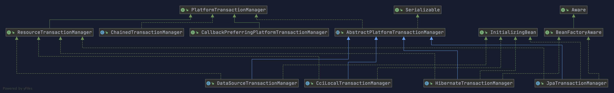
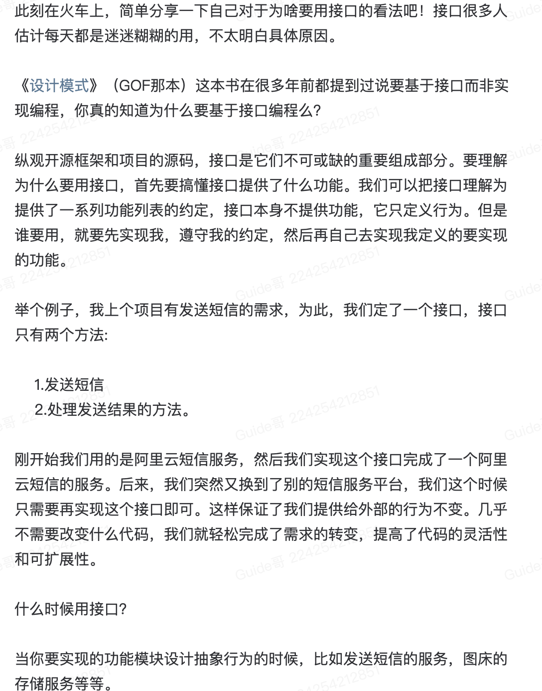
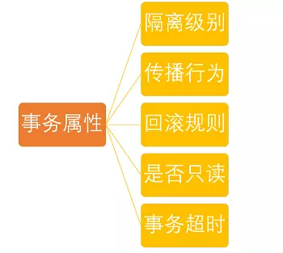
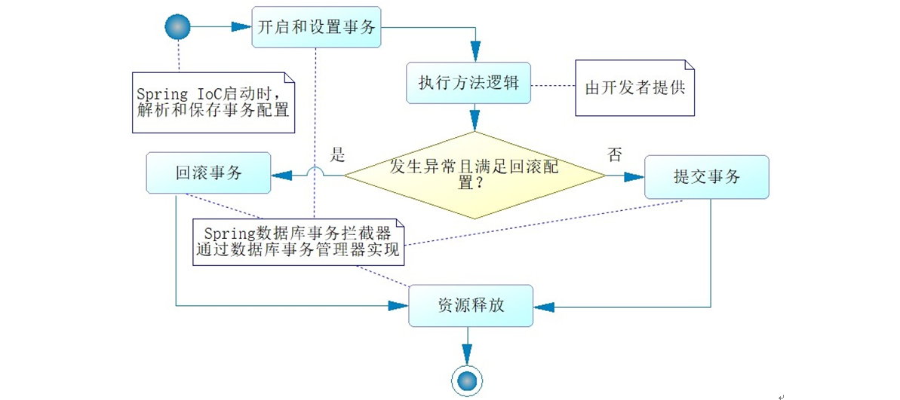

[TOC]

### Spring事务

#### 概述

##### 1. 谈谈Spring对事务的支持？

**再提醒一次：你的程序是否支持事务首先取决于数据库 ，比如使用 MySQL 的话，如果你选择的是 innodb 引擎，那么恭喜你，是可以支持事务的。但是，如果你的 MySQL 数据库使用的是 myisam 引擎的话，那不好意思，从根上就是不支持事务的。**

这里再多提一下一个非常重要的知识点： **MySQL 怎么保证原子性的？**

我们知道如果想要保证事务的原子性，就需要在异常发生时，对已经执行的操作进行**回滚**，在 MySQL 中，恢复机制是通过 **回滚日志（undo log）** 实现的，所有事务进行的修改都会先先记录到这个回滚日志中，然后再执行相关的操作。如果执行过程中遇到异常的话，我们直接利用 **回滚日志** 中的信息将数据回滚到修改之前的样子即可！并且，回滚日志会先于数据持久化到磁盘上。这样就保证了即使遇到数据库突然宕机等情况，当用户再次启动数据库的时候，数据库还能够通过查询回滚日志来回滚将之前未完成的事务。

数据库事务是通过 AOP 技术提供服务的。

Spring 数据库事务多采用声明式事务，编程式事务已经用的不多了。

AOP 将除去SQL之外公共的代码抽离出来单独实现。


#### Spring管理事务的方式有几种？

Spring对事务的支持有两种。

1. **编程式**事务，在代码中硬编码。(不推荐使用)
2. **声明式**事务，在配置文件中配置（**推荐**使用）

**声明式事务又分为两种：**

1. 基于 **XML** 的声明式事务
2. 基于**注解**的声明式事务

##### 1. 编程式事务管理

通过 `TransactionTemplate`或者`TransactionManager`手动管理事务，实际应用中很少使用，但是对于你理解 Spring 事务管理原理有帮助。

使用`TransactionTemplate` 进行编程式事务管理的示例代码如下：

```java
@Autowired
private TransactionTemplate transactionTemplate;
public void testTransaction() {

    transactionTemplate.execute(new TransactionCallbackWithoutResult() {
        @Override
        protected void doInTransactionWithoutResult(TransactionStatus transactionStatus) {
            try {
                // ....  业务代码
            } catch (Exception e){
                //回滚
                transactionStatus.setRollbackOnly();
            }

        }
    });
}
```

使用 `TransactionManager` 进行编程式事务管理的示例代码如下：

```java
@Autowired
private PlatformTransactionManager transactionManager;

public void testTransaction() {
    TransactionStatus status = transactionManager.getTransaction(new DefaultTransactionDefinition());
    try {
        // ...业务代码
        transactionManager.commit(status);
    } catch (Exception e) {
        transactionManager.rollback(status);
    }
}
```

##### 2. 声明式事务管理

推荐使用（代码侵入性最小），实际是通过 AOP 实现（基于`@Transactional` 的全注解方式使用最多）。

使用 `@Transactional`注解进行事务管理的示例代码如下：

```java
@Transactional(propagation=propagation.PROPAGATION_REQUIRED)
public void aMethod {
  //do something
  B b = new B();
  C c = new C();
  b.bMethod();
  c.cMethod();
}
```


#### Spring事务管理接口

Spring 框架中，事务管理相关最重要的 3 个接口如下：

- **`PlatformTransactionManager`**： （平台）事务管理器，Spring 事务策略的核心。
- **`TransactionDefinition`**： 事务定义信息(事务隔离级别、传播行为、超时、只读、回滚规则)。
- **`TransactionStatus`**： 事务运行状态。

我们可以把 **`PlatformTransactionManager`** 接口可以被看作是事务上层的管理者，而 **`TransactionDefinition`** 和 **`TransactionStatus`** 这两个接口可以看作是事物的描述。

**`PlatformTransactionManager`** 会根据 **`TransactionDefinition`** 的定义比如事务超时时间、隔离界别、传播行为等来进行事务管理 ，而 **`TransactionStatus`** 接口则提供了一些方法来获取事务相应的状态比如是否新事务、是否可以回滚等等。

##### 1. PlatformTransactionManager:事务管理接口

**Spring 并不直接管理事务，而是提供了多种事务管理器** 。Spring 事务管理器的接口是： **`PlatformTransactionManager`** 。

通过这个接口，Spring 为各个平台如 JDBC(`DataSourceTransactionManager`)、Hibernate(`HibernateTransactionManager`)、JPA(`JpaTransactionManager`)等都提供了对应的事务管理器，但是具体的实现就是各个平台自己的事情了。

**`PlatformTransactionManager` 接口的具体实现如下:**



`PlatformTransactionManager`接口中定义了三个方法：

```java
package org.springframework.transaction;

import org.springframework.lang.Nullable;

public interface PlatformTransactionManager {
    //获得事务
    TransactionStatus getTransaction(@Nullable TransactionDefinition var1) throws TransactionException;
    //提交事务
    void commit(TransactionStatus var1) throws TransactionException;
    //回滚事务
    void rollback(TransactionStatus var1) throws TransactionException;
}

```

**这里多插一嘴。为什么要定义或者说抽象出来`PlatformTransactionManager`这个接口呢？**

主要是因为要将事务管理行为抽象出来，然后不同的平台去实现它，这样我们可以保证提供给外部的行为不变，方便我们扩展。我前段时间分享过：**“为什么我们要用接口？”**



##### 2. TransactionDefinition:事务属性

事务管理器接口 **`PlatformTransactionManager`** 通过 **`getTransaction(TransactionDefinition definition)`** 方法来得到一个事务，这个方法里面的参数是 **`TransactionDefinition`** 类 ，这个类就定义了一些基本的事务属性。

那么什么是 **事务属性** 呢？

事务属性可以理解成事务的一些基本配置，描述了事务策略如何应用到方法上。

**事务属性包含了 5 个方面：**



`TransactionDefinition` 接口中定义了 5 个方法以及一些表示事务属性的常量比如隔离级别、传播行为等等。

```java
package org.springframework.transaction;

import org.springframework.lang.Nullable;

public interface TransactionDefinition {
    int PROPAGATION_REQUIRED = 0;
    int PROPAGATION_SUPPORTS = 1;
    int PROPAGATION_MANDATORY = 2;
    int PROPAGATION_REQUIRES_NEW = 3;
    int PROPAGATION_NOT_SUPPORTED = 4;
    int PROPAGATION_NEVER = 5;
    int PROPAGATION_NESTED = 6;
    int ISOLATION_DEFAULT = -1;
    int ISOLATION_READ_UNCOMMITTED = 1;
    int ISOLATION_READ_COMMITTED = 2;
    int ISOLATION_REPEATABLE_READ = 4;
    int ISOLATION_SERIALIZABLE = 8;
    int TIMEOUT_DEFAULT = -1;
    // 返回事务的传播行为，默认值为 REQUIRED。
    int getPropagationBehavior();
    //返回事务的隔离级别，默认值是 DEFAULT
    int getIsolationLevel();
    // 返回事务的超时时间，默认值为-1。如果超过该时间限制但事务还没有完成，则自动回滚事务。
    int getTimeout();
    // 返回是否为只读事务，默认值为 false
    boolean isReadOnly();

    @Nullable
    String getName();
}
```

##### 3. TransactionStatus:事务状态

`TransactionStatus`接口用来记录事务的状态 该接口定义了一组方法,用来获取或判断事务的相应状态信息。

**事务属性包含了 5 个方面：**


`PlatformTransactionManager.getTransaction(…)`方法返回一个 `TransactionStatus` 对象。

**TransactionStatus 接口接口内容如下：**

```java
public interface TransactionStatus{
    boolean isNewTransaction(); // 是否是新的事物
    boolean hasSavepoint(); // 是否有恢复点
    void setRollbackOnly();  // 设置为只回滚
    boolean isRollbackOnly(); // 是否为只回滚
    boolean isCompleted; // 是否已完成
}
```

#### 事务属性详解

_实际业务开发中，大家一般都是使用 `@Transactional` 注解来开启事务，很多人并不清楚这个参数里面的参数是什么意思，有什么用。为了更好的在项目中使用事务管理，强烈推荐好好阅读一下下面的内容。_

##### 1. 事务传播行为

传播行为是方法之间调用事务采取的策略问题。七种传播行为常用的三种。

**支持当前事务的情况：**

- **TransactionDefinition.PROPAGATION_REQUIRED：** 如果当前存在事务，则加入该事务；如果当前没有事务，则创建一个新的事务。
- **TransactionDefinition.PROPAGATION_SUPPORTS：** 如果当前存在事务，则加入该事务；如果当前没有事务，则以非事务的方式继续运行。
- **TransactionDefinition.PROPAGATION_MANDATORY：** 如果当前存在事务，则加入该事务；如果当前没有事务，则抛出异常。（mandatory：强制性）

**不支持当前事务的情况：**

- **TransactionDefinition.PROPAGATION_REQUIRES_NEW：** 创建一个新的事务，如果当前存在事务，则把当前事务挂起。
- **TransactionDefinition.PROPAGATION_NOT_SUPPORTED：** 以非事务方式运行，如果当前存在事务，则把当前事务挂起。
- **TransactionDefinition.PROPAGATION_NEVER：** 以非事务方式运行，如果当前存在事务，则抛出异常。

**其他情况：**

- **TransactionDefinition.PROPAGATION_NESTED：** 如果当前存在事务，则创建一个事务作为当前事务的嵌套事务来运行；如果当前没有事务，则该取值等价于TransactionDefinition.PROPAGATION_REQUIRED。

**事务传播行为是为了解决业务层方法之间互相调用的事务问题**。

当事务方法被另一个事务方法调用时，必须指定事务应该如何传播。例如：方法可能继续在现有事务中运行，也可能开启一个新事务，并在自己的事务中运行。

**举个例子！**

我们在 A 类的`aMethod（）`方法中调用了 B 类的 `bMethod()` 方法。这个时候就涉及到业务层方法之间互相调用的事务问题。如果我们的 `bMethod()`如果发生异常需要回滚，如何配置事务传播行为才能让 `aMethod()`也跟着回滚呢？这个时候就需要事务传播行为的知识了，如果你不知道的话一定要好好看一下。

```java
Class A {
    @Transactional(propagation=propagation.xxx)
    public void aMethod {
        //do something
        B b = new B();
        b.bMethod();
    }
}

Class B {
    @Transactional(propagation=propagation.xxx)
    public void bMethod {
       //do something
    }
}
```

在`TransactionDefinition`定义中包括了如下几个表示传播行为的常量：

```java
public interface TransactionDefinition {
    int PROPAGATION_REQUIRED = 0;
    int PROPAGATION_SUPPORTS = 1;
    int PROPAGATION_MANDATORY = 2;
    int PROPAGATION_REQUIRES_NEW = 3;
    int PROPAGATION_NOT_SUPPORTED = 4;
    int PROPAGATION_NEVER = 5;
    int PROPAGATION_NESTED = 6;
    ......
}
```

不过如此，为了方便使用，Spring 会相应地定义了一个枚举类：`Propagation`

```java
package org.springframework.transaction.annotation;

import org.springframework.transaction.TransactionDefinition;

public enum Propagation {

	REQUIRED(TransactionDefinition.PROPAGATION_REQUIRED),

	SUPPORTS(TransactionDefinition.PROPAGATION_SUPPORTS),

	MANDATORY(TransactionDefinition.PROPAGATION_MANDATORY),

	REQUIRES_NEW(TransactionDefinition.PROPAGATION_REQUIRES_NEW),

	NOT_SUPPORTED(TransactionDefinition.PROPAGATION_NOT_SUPPORTED),

	NEVER(TransactionDefinition.PROPAGATION_NEVER),

	NESTED(TransactionDefinition.PROPAGATION_NESTED);


	private final int value;

	Propagation(int value) {
		this.value = value;
	}

	public int value() {
		return this.value;
	}

}

```

**正确的事务传播行为可能的值如下** ：

**1.`TransactionDefinition.PROPAGATION_REQUIRED`**

使用的最多的一个事务传播行为，我们平时经常使用的`@Transactional`注解默认使用就是这个事务传播行为。如果当前存在事务，则加入该事务；如果当前没有事务，则创建一个新的事务。也就是说：

1. 如果外部方法没有开启事务的话，`Propagation.REQUIRED`修饰的内部方法会新开启自己的事务，且开启的事务相互独立，互不干扰。
2. 如果外部方法开启事务并且被`Propagation.REQUIRED`的话，所有`Propagation.REQUIRED`修饰的内部方法和外部方法均属于同一事务 ，只要一个方法回滚，整个事务均回滚。

举个例子：如果我们上面的`aMethod()`和`bMethod()`使用的都是`PROPAGATION_REQUIRED`传播行为的话，两者使用的就是同一个事务，只要其中一个方法回滚，整个事务均回滚。

```java
Class A {
    @Transactional(propagation=propagation.PROPAGATION_REQUIRED)
    public void aMethod {
        //do something
        B b = new B();
        b.bMethod();
    }
}

Class B {
    @Transactional(propagation=propagation.PROPAGATION_REQUIRED)
    public void bMethod {
       //do something
    }
}
```

**`2.TransactionDefinition.PROPAGATION_REQUIRES_NEW`**

创建一个新的事务，如果当前存在事务，则把当前事务挂起。也就是说不管外部方法是否开启事务，`Propagation.REQUIRES_NEW`修饰的内部方法会新开启自己的事务，且开启的事务相互独立，互不干扰。

举个例子：如果我们上面的`bMethod()`使用`PROPAGATION_REQUIRES_NEW`事务传播行为修饰，`aMethod`还是用`PROPAGATION_REQUIRED`修饰的话。如果`aMethod()`发生异常回滚，`bMethod()`不会跟着回滚，因为 `bMethod()`开启了独立的事务。但是，如果 `bMethod()`抛出了未被捕获的异常并且这个异常满足事务回滚规则的话,`aMethod()`同样也会回滚，因为这个异常被 `aMethod()`的事务管理机制检测到了。

```java
Class A {
    @Transactional(propagation=propagation.PROPAGATION_REQUIRED)
    public void aMethod {
        //do something
        B b = new B();
        b.bMethod();
    }
}

Class B {
    @Transactional(propagation=propagation.REQUIRES_NEW)
    public void bMethod {
       //do something
    }
}
```

**3.`TransactionDefinition.PROPAGATION_NESTED`**:

如果当前存在事务，则创建一个事务作为当前事务的嵌套事务来运行；如果当前没有事务，则该取值等价于`TransactionDefinition.PROPAGATION_REQUIRED`。也就是说：

1. 在外部方法未开启事务的情况下`Propagation.NESTED`和`Propagation.REQUIRED`作用相同，修饰的内部方法都会新开启自己的事务，且开启的事务相互独立，互不干扰。
2. 如果外部方法开启事务的话，`Propagation.NESTED`修饰的内部方法属于外部事务的子事务，外部主事务回滚的话，子事务也会回滚，而内部子事务可以单独回滚而不影响外部主事务和其他子事务。

这里还是简单举个例子：

如果 `aMethod()` 回滚的话，`bMethod()`和`bMethod2()`都要回滚，而`bMethod()`回滚的话，并不会造成 `aMethod()` 和`bMethod()`回滚。

```java
Class A {
    @Transactional(propagation=propagation.PROPAGATION_REQUIRED)
    public void aMethod {
        //do something
        B b = new B();
        b.bMethod();
        b.bMethod2();
    }
}

Class B {
    @Transactional(propagation=propagation.PROPAGATION_NESTED)
    public void bMethod {
       //do something
    }
    @Transactional(propagation=propagation.PROPAGATION_NESTED)
    public void bMethod2 {
       //do something
    }
}
```

**4.`TransactionDefinition.PROPAGATION_MANDATORY`**

如果当前存在事务，则加入该事务；如果当前没有事务，则抛出异常。（mandatory：强制性）

这个使用的很少，就不举例子来说了。

**若是错误的配置以下 3 种事务传播行为，事务将不会发生回滚，这里不对照案例讲解了，使用的很少。**

- **`TransactionDefinition.PROPAGATION_SUPPORTS`**: 如果当前存在事务，则加入该事务；如果当前没有事务，则以非事务的方式继续运行。
- **`TransactionDefinition.PROPAGATION_NOT_SUPPORTED`**: 以非事务方式运行，如果当前存在事务，则把当前事务挂起。
- **`TransactionDefinition.PROPAGATION_NEVER`**: 以非事务方式运行，如果当前存在事务，则抛出异常。

更多关于事务传播行为的内容请看这篇文章：[《太难了~面试官让我结合案例讲讲自己对 Spring 事务传播行为的理解。》](http://mp.weixin.qq.com/s?__biz=Mzg2OTA0Njk0OA==&mid=2247486668&idx=2&sn=0381e8c836442f46bdc5367170234abb&chksm=cea24307f9d5ca11c96943b3ccfa1fc70dc97dd87d9c540388581f8fe6d805ff548dff5f6b5b&token=1776990505&lang=zh_CN#rd)

##### 2. 事务隔离级别

`TransactionDefinition` 接口中定义了五个表示隔离级别的常量：

```java
public interface TransactionDefinition {
    ......
    int ISOLATION_DEFAULT = -1;
    int ISOLATION_READ_UNCOMMITTED = 1;
    int ISOLATION_READ_COMMITTED = 2;
    int ISOLATION_REPEATABLE_READ = 4;
    int ISOLATION_SERIALIZABLE = 8;
    ......
}
```

**TransactionDefinition 接口中定义了五个表示隔离级别的常量：**

- **TransactionDefinition.ISOLATION_DEFAULT:**  使用后端数据库默认的隔离级别，Mysql 默认采用的 REPEATABLE_READ隔离级别 Oracle 默认采用的 READ_COMMITTED隔离级别.
- **TransactionDefinition.ISOLATION_READ_UNCOMMITTED:** 最低的隔离级别，允许读取尚未提交的数据变更，**可能会导致脏读、幻读或不可重复读**
- **TransactionDefinition.ISOLATION_READ_COMMITTED:**   允许读取并发事务已经提交的数据，**可以阻止脏读，但是幻读或不可重复读仍有可能发生**
- **TransactionDefinition.ISOLATION_REPEATABLE_READ:**  对同一字段的多次读取结果都是一致的，除非数据是被本身事务自己所修改，**可以阻止脏读和不可重复读，但幻读仍有可能发生。**
- **TransactionDefinition.ISOLATION_SERIALIZABLE:**   最高的隔离级别，完全服从ACID的隔离级别。所有的事务依次逐个执行，这样事务之间就完全不可能产生干扰，也就是说，**该级别可以防止脏读、不可重复读以及幻读**。但是这将严重影响程序的性能。通常情况下也不会用到该级别。

和事务传播行为这块一样，为了方便使用，Spring 也相应地定义了一个枚举类：`Isolation`

```java
public enum Isolation {

	DEFAULT(TransactionDefinition.ISOLATION_DEFAULT),

	READ_UNCOMMITTED(TransactionDefinition.ISOLATION_READ_UNCOMMITTED),

	READ_COMMITTED(TransactionDefinition.ISOLATION_READ_COMMITTED),

	REPEATABLE_READ(TransactionDefinition.ISOLATION_REPEATABLE_READ),

	SERIALIZABLE(TransactionDefinition.ISOLATION_SERIALIZABLE);

	private final int value;

	Isolation(int value) {
		this.value = value;
	}

	public int value() {
		return this.value;
	}

}
```

下面我依次对每一种事务隔离级别进行介绍：

- **`TransactionDefinition.ISOLATION_DEFAULT`** :使用后端数据库默认的隔离级别，MySQL 默认采用的 `REPEATABLE_READ` 隔离级别 Oracle 默认采用的 `READ_COMMITTED` 隔离级别.
- **`TransactionDefinition.ISOLATION_READ_UNCOMMITTED`** :最低的隔离级别，使用这个隔离级别很少，因为它允许读取尚未提交的数据变更，**可能会导致脏读、幻读或不可重复读**
- **`TransactionDefinition.ISOLATION_READ_COMMITTED`** : 允许读取并发事务已经提交的数据，**可以阻止脏读，但是幻读或不可重复读仍有可能发生**
- **`TransactionDefinition.ISOLATION_REPEATABLE_READ`** : 对同一字段的多次读取结果都是一致的，除非数据是被本身事务自己所修改，**可以阻止脏读和不可重复读，但幻读仍有可能发生。**
- **`TransactionDefinition.ISOLATION_SERIALIZABLE`** : 最高的隔离级别，完全服从 ACID 的隔离级别。所有的事务依次逐个执行，这样事务之间就完全不可能产生干扰，也就是说，**该级别可以防止脏读、不可重复读以及幻读**。但是这将严重影响程序的性能。通常情况下也不会用到该级别。

因为平时使用 MySQL 数据库比较多，这里再多提一嘴！

MySQL InnoDB 存储引擎的默认支持的隔离级别是 **`REPEATABLE-READ`（可重读）**。我们可以通过`SELECT @@tx_isolation;`命令来查看，如下：

```
mysql> SELECT @@tx_isolation;
+-----------------+
| @@tx_isolation  |
+-----------------+
| REPEATABLE-READ |
+-----------------+
```

这里需要注意的是：与 SQL 标准不同的地方在于 InnoDB 存储引擎在 **`REPEATABLE-READ`（可重读）** 事务隔离级别下使用的是 Next-Key Lock 锁算法，因此可以避免幻读的产生，这与其他数据库系统(如 SQL Server)是不同的。所以说 InnoDB 存储引擎的默认支持的隔离级别是 **`REPEATABLE-READ`（可重读）** 已经可以完全保证事务的隔离性要求，即达到了 SQL 标准的 **`SERIALIZABLE`(可串行化)** 隔离级别。

因为隔离级别越低，事务请求的锁越少，所以大部分数据库系统的隔离级别都是 **`READ-COMMITTED`(读取提交内容)** :，但是你要知道的是 InnoDB 存储引擎默认使用 **`REPEATABLE-READ`（可重读）** 并不会什么任何性能上的损失。

更多关于事务隔离级别的内容请看：

1. [《一文带你轻松搞懂事务隔离级别(图文详解)》](https://mp.weixin.qq.com/s?__biz=Mzg2OTA0Njk0OA==&mid=2247485085&idx=1&sn=01e5c29c49f32886bc897af7632b34ba&chksm=cea24956f9d5c040a07e4d335219f11f888a2d32444c16cade3f69c294ae0a1e416bcd221fb6&token=1613452699&lang=zh_CN&scene=21#wechat_redirect)
2. [面试官：你说对 MySQL 事务很熟？那我问你 10 个问题](https://mp.weixin.qq.com/s?__biz=Mzg2OTA0Njk0OA==&mid=2247486625&idx=2&sn=e235dab2757739438b8f33d205a9327f&chksm=cea2436af9d5ca7c9a1a8db9d020f71205687beca23ac958f9c9a711ee0185cab30173ad2b1a&token=1776990505&lang=zh_CN#rd)

##### 3. 事务超时属性

所谓事务超时，就是指一个事务所允许执行的最长时间，如果超过该时间限制但事务还没有完成，则自动回滚事务。在 `TransactionDefinition` 中以 int 的值来表示超时时间，其单位是秒，默认值为-1。

##### 4. 事务只读属性

```java
package org.springframework.transaction;

import org.springframework.lang.Nullable;

public interface TransactionDefinition {
    ......
    // 返回是否为只读事务，默认值为 false
    boolean isReadOnly();

}
```

对于只有读取数据查询的事务，可以指定事务类型为 readonly，即只读事务。只读事务不涉及数据的修改，数据库会提供一些优化手段，适合用在有多条数据库查询操作的方法中。

很多人就会疑问了，为什么我一个数据查询操作还要启用事务支持呢？

拿 MySQL 的 innodb 举例子，根据官网 [https://dev.mysql.com/doc/refman/5.7/en/innodb-autocommit-commit-rollback.html](https://dev.mysql.com/doc/refman/5.7/en/innodb-autocommit-commit-rollback.html) 描述：

> MySQL 默认对每一个新建立的连接都启用了`autocommit`模式。在该模式下，每一个发送到 MySQL 服务器的`sql`语句都会在一个单独的事务中进行处理，执行结束后会自动提交事务，并开启一个新的事务。

但是，如果你给方法加上了`Transactional`注解的话，这个方法执行的所有`sql`会被放在一个事务中。如果声明了只读事务的话，数据库就会去优化它的执行，并不会带来其他的什么收益。

如果不加`Transactional`，每条`sql`会开启一个单独的事务，中间被其它事务改了数据，都会实时读取到最新值。

分享一下关于事务只读属性，其他人的解答：

1. 如果你一次执行单条查询语句，则没有必要启用事务支持，数据库默认支持 SQL 执行期间的读一致性；
2. 如果你一次执行多条查询语句，例如统计查询，报表查询，在这种场景下，多条查询 SQL 必须保证整体的读一致性，否则，在前条 SQL 查询之后，后条 SQL 查询之前，数据被其他用户改变，则该次整体的统计查询将会出现读数据不一致的状态，此时，应该启用事务支持

##### 5. 事务回滚规则

这些规则定义了哪些异常会导致事务回滚而哪些不会。默认情况下，事务只有遇到运行期异常（RuntimeException 的子类）时才会回滚，Error 也会导致事务回滚，但是，在遇到检查型（Checked）异常时不会回滚。


如果你想要回滚你定义的特定的异常类型的话，可以这样：

```java
@Transactional(rollbackFor= MyException.class)
```

###


#### Spring声明式事务的使用

Spring 数据库的事务约定如下：



##### @Transactional

对于声明式事务，Spring 通过注解 @Transactional 进行标注，告诉 Spring 在什么地方启用数据库事务功能。这个注解可以标注到类或方法上。 @Transactional 还可以配置隔离级别和传播行为等。

无论发生异常与否，Spring 都会释放事务。

@Transactional 可以放在接口或者实现类中，推荐放在实现类上。

**@Transactional 源码分析**

```java
package org.springframework.transaction.annotation;

import java.lang.annotation.Documented;
import java.lang.annotation.ElementType;
import java.lang.annotation.Inherited;
import java.lang.annotation.Retention;
import java.lang.annotation.RetentionPolicy;
import java.lang.annotation.Target;
import org.springframework.core.annotation.AliasFor;

@Target({ElementType.TYPE, ElementType.METHOD})
@Retention(RetentionPolicy.RUNTIME)
@Inherited
@Documented
public @interface Transactional {
    // 通过bean name指定事务管理器
    @AliasFor("transactionManager")
    String value() default "";

    // 同value属性
    @AliasFor("value")
    String transactionManager() default "";

    // 指定传播行为
    Propagation propagation() default Propagation.REQUIRED;

    // 指定隔离级别
    Isolation isolation() default Isolation.DEFAULT;

    // 指定超时时间
    int timeout() default -1;

    // 是否只读事务
    boolean readOnly() default false;

    // 下面是关于异常回滚的内容
    Class<? extends Throwable>[] rollbackFor() default {};

    String[] rollbackForClassName() default {};

    Class<? extends Throwable>[] noRollbackFor() default {};

    String[] noRollbackForClassName() default {};
}
```

使用注解，在实现类中使用。

```java
@Service
public class UserServiceImpl implements UserService {

	@Autowired
	private UserDao userDao = null;

	@Override
    // 定义了隔离级别和超时时间
	@Transactional(isolation = Isolation.READ_COMMITTED, timeout = 1)
	public int insertUser(User user) {
		return userDao.insertUser(user);
	}

	@Override
	@Transactional(isolation = Isolation.READ_COMMITTED, timeout = 1)
	public User getUser(Long id) {
		return userDao.getUser(id);
	}
}
```


##### Spring 事务管理器

事务流程都是由事务管理器完成的。其接口体系如图所示。


DataSourceTransactionManager 是比较常用的事务管理器。

如果依赖 mybatis-spring-boot-starter 之后，会自动创建一个 DataSourceTransactionManager 对象作为事务管理。

如果依赖 spring-boot-starter-jpa ，会自动穿件 JpaTransactionManager 对象作为事务管理器。

可以直接注入事务管理器类。

```java
@MapperScan(
    basePackages = "com.springboot.chapter6", 
    annotationClass = Repository.class)
@SpringBootApplication(scanBasePackages = "com.springboot.chapter6")
public class Chapter6Application {
    public static void main(String[] args) throws Exception {
        SpringApplication.run(Chapter6Application.class, args);
    }
    // 注入事务管理器，它由Spring Boot自动生成
    @Autowired
    PlatformTransactionManager transactionManager = null; 

    // 使用后初始化方法，观察自动生成的事务管理器
    @PostConstruct
    public void viewTransactionManager() {
        // 启动前加入断点观测
        System.out.println(transactionManager.getClass().getName());
    }
}
```


#### @Transactional注解使用详解

##### 1. @Transactional的作用范围

1. **方法** ：推荐将注解使用于方法上，不过需要注意的是：**该注解只能应用到 public 方法上，否则不生效。**
2. **类** ：如果这个注解使用在类上的话，表明该注解对该类中所有的 public 方法都生效。
3. **接口** ：不推荐在接口上使用。

##### 2. @Transactional的常用配置参数

`@Transactional`注解源码如下，里面包含了基本事务属性的配置：

```java
@Target({ElementType.TYPE, ElementType.METHOD})
@Retention(RetentionPolicy.RUNTIME)
@Inherited
@Documented
public @interface Transactional {

	@AliasFor("transactionManager")
	String value() default "";

	@AliasFor("value")
	String transactionManager() default "";

	Propagation propagation() default Propagation.REQUIRED;

	Isolation isolation() default Isolation.DEFAULT;

	int timeout() default TransactionDefinition.TIMEOUT_DEFAULT;

	boolean readOnly() default false;

	Class<? extends Throwable>[] rollbackFor() default {};

	String[] rollbackForClassName() default {};

	Class<? extends Throwable>[] noRollbackFor() default {};

	String[] noRollbackForClassName() default {};

}
```

**`@Transactional` 的常用配置参数总结（只列巨额 5 个我平时比较常用的）：**

|   属性名    |                             说明                             |
| :---------: | :----------------------------------------------------------: |
| propagation |   事务的传播行为，默认值为 REQUIRED，可选的值在上面介绍过    |
|  isolation  |   事务的隔离级别，默认值采用 DEFAULT，可选的值在上面介绍过   |
|   timeout   | 事务的超时时间，默认值为-1（不会超时）。如果超过该时间限制但事务还没有完成，则自动回滚事务。 |
|  readOnly   |           指定事务是否为只读事务，默认值为 false。           |
| rollbackFor | 用于指定能够触发事务回滚的异常类型，并且可以指定多个异常类型。 |

##### 3. @Transactional事务注解原理

面试中在问 AOP 的时候可能会被问到的一个问题。简单说下吧！

我们知道，**`@Transactional` 的工作机制是基于 AOP 实现的，AOP 又是使用动态代理实现的。如果目标对象实现了接口，默认情况下会采用 JDK 的动态代理，如果目标对象没有实现了接口,会使用 CGLIB 动态代理。**

多提一嘴：`createAopProxy()` 方法 决定了是使用 JDK 还是 Cglib 来做动态代理，源码如下：

```java
public class DefaultAopProxyFactory implements AopProxyFactory, Serializable {

    @Override
    public AopProxy createAopProxy(AdvisedSupport config) throws AopConfigException {
        if (config.isOptimize() || config.isProxyTargetClass() || hasNoUserSuppliedProxyInterfaces(config)) {
            Class<?> targetClass = config.getTargetClass();
            if (targetClass == null) {
                throw new AopConfigException("TargetSource cannot determine target class: " + "Either an interface or a target is required for proxy creation.");
            }
            if (targetClass.isInterface() || Proxy.isProxyClass(targetClass)) {
                return new JdkDynamicAopProxy(config);
            }
            return new ObjenesisCglibAopProxy(config);
        }
        else {
            return new JdkDynamicAopProxy(config);
        }
    }
    .......
}
```

如果一个类或者一个类中的 public 方法上被标注`@Transactional` 注解的话，Spring 容器就会在启动的时候为其创建一个代理类，在调用被`@Transactional` 注解的 public 方法的时候，实际调用的是，`TransactionInterceptor` 类中的 `invoke()`方法。这个方法的作用就是在目标方法之前开启事务，方法执行过程中如果遇到异常的时候回滚事务，方法调用完成之后提交事务。

> `TransactionInterceptor` 类中的 `invoke()`方法内部实际调用的是 `TransactionAspectSupport` 类的 `invokeWithinTransaction()`方法。由于新版本的 Spring 对这部分重写很大，而且用到了很多响应式编程的知识，这里就不列源码了。

##### 4. Spring AOP自调用问题

若同一类中的其他没有 `@Transactional` 注解的方法内部调用有 `@Transactional` 注解的方法，有`@Transactional` 注解的方法的事务会失效。

这是由于`Spring AOP`代理的原因造成的，因为只有当 `@Transactional` 注解的方法在类以外被调用的时候，Spring 事务管理才生效。

`MyService` 类中的`method1()`调用`method2()`就会导致`method2()`的事务失效。

```java
@Service
public class MyService {

private void method1() {
     method2();
     //......
}
@Transactional
 public void method2() {
     //......
  }
}
```

解决办法就是避免同一类中自调用或者使用 AspectJ 取代 Spring AOP 代理。

##### 5. @Transactional使用注意事项总结

1.  `@Transactional` 注解只有作用到 public 方法上事务才生效，不推荐在接口上使用；
2.  避免同一个类中调用 `@Transactional` 注解的方法，这样会导致事务失效；
3.  正确的设置 `@Transactional` 的 rollbackFor 和 propagation 属性，否则事务可能会回滚失败


#### 面试题

##### 1. @Transactional(rollbackFor = Exception.class)注解了解吗？

我们知道：Exception 分为运行时异常 RuntimeException 和非运行时异常。事务管理对于企业应用来说是至关重要的，即使出现异常情况，它也可以保证数据的一致性。

当 `@Transactional` 注解作用于类上时，该类的所有 public 方法将都具有该类型的事务属性，同时，我们也可以在方法级别使用该标注来覆盖类级别的定义。如果类或者方法加了这个注解，那么这个类里面的方法抛出异常，就会回滚，数据库里面的数据也会回滚。

在`@Transactional`注解中如果不配置`rollbackFor`属性,那么事物只会在遇到`RuntimeException`的时候才会回滚,加上`rollbackFor=Exception.class`,可以让事物在遇到非运行时异常时也回滚。

关于 `@Transactional ` 注解推荐阅读的文章：

- [透彻的掌握 Spring 中@transactional 的使用](https://www.ibm.com/developerworks/cn/java/j-master-spring-transactional-use/index.html)


#### 参考资料

- [总结]Spring 事务管理中@Transactional 的参数:[http://www.mobabel.net/spring 事务管理中 transactional 的参数/](http://www.mobabel.net/spring事务管理中transactional的参数/)
- Spring 官方文档：[https://docs.spring.io/spring/docs/4.2.x/spring-framework-reference/html/transaction.html](https://docs.spring.io/spring/docs/4.2.x/spring-framework-reference/html/transaction.html)
- 《Spring5 高级编程》
- 透彻的掌握 Spring 中@transactional 的使用: [https://www.ibm.com/developerworks/cn/java/j-master-spring-transactional-use/index.html](https://www.ibm.com/developerworks/cn/java/j-master-spring-transactional-use/index.html)
- Spring 事务的传播特性：[https://github.com/love-somnus/Spring/wiki/Spring 事务的传播特性](https://github.com/love-somnus/Spring/wiki/Spring事务的传播特性)
- [Spring 事务传播行为详解](https://segmentfault.com/a/1190000013341344) ：[https://segmentfault.com/a/1190000013341344](https://segmentfault.com/a/1190000013341344)
- 全面分析 Spring 的编程式事务管理及声明式事务管理：[https://www.ibm.com/developerworks/cn/education/opensource/os-cn-spring-trans/index.html](https://www.ibm.com/developerworks/cn/education/opensource/os-cn-spring-trans/index.html)


