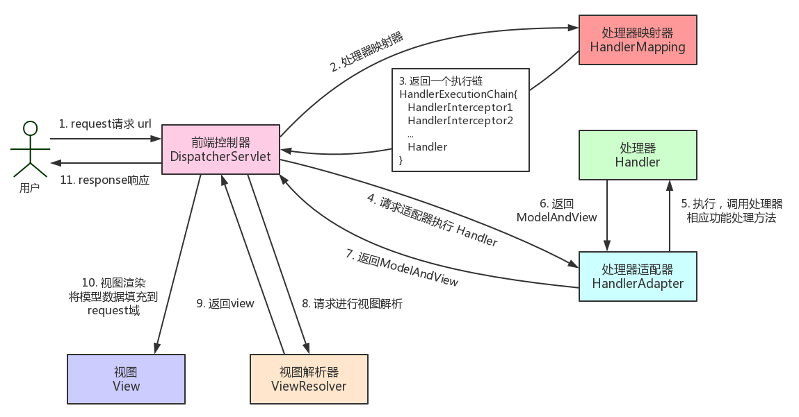
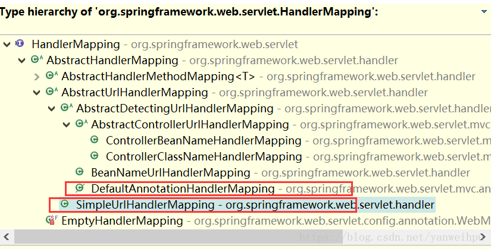
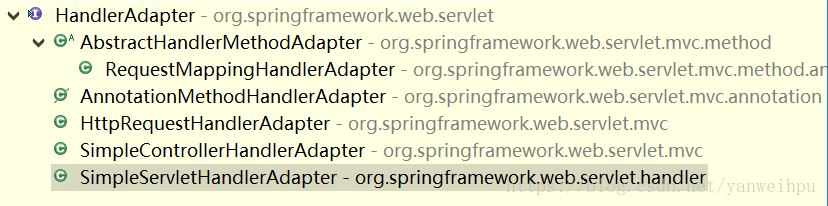
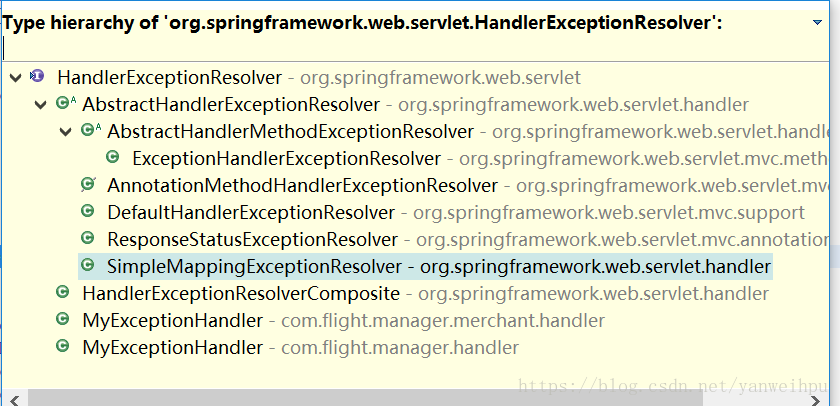
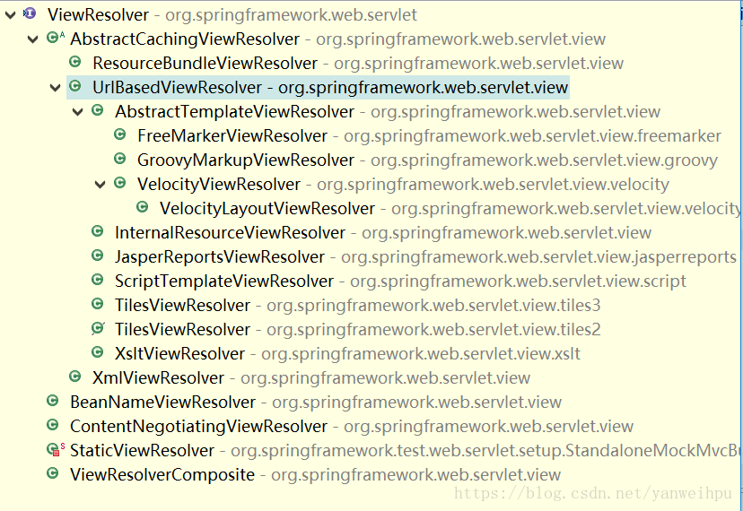

[TOC]

### Spring MVC

SpringMVC 框架是以请求为驱动，围绕 Servlet 设计，将请求发给控制器，然后通过模型对象，分派器来展示请求结果视图。其中核心类是 DispatcherServlet，它是一个 Servlet，顶层是实现的 Servlet 接口。

#### Spring MVC使用

需要在 **web.xml** 中配置 **DispatcherServlet** 。并且需要配置 Spring 监听器 ContextLoaderListener。

```xml
<listener>
    <listener-class>org.springframework.web.context.ContextLoaderListener
    </listener-class>
</listener>
<servlet>
    <servlet-name>springmvc</servlet-name>
    <servlet-class>org.springframework.web.servlet.DispatcherServlet
    </servlet-class>
    <!-- 如果不设置init-param标签，则必须在/WEB-INF/下创建xxx-servlet.xml文件，其中xxx是servlet-name中配置的名称。 -->
    <init-param>
        <param-name>contextConfigLocation</param-name>
        <param-value>classpath:spring/springmvc-servlet.xml</param-value>
    </init-param>
    <load-on-startup>1</load-on-startup>
</servlet>
<servlet-mapping>
    <servlet-name>springmvc</servlet-name>
    <url-pattern>/</url-pattern>
</servlet-mapping>

```

#### SpringMVC工作原理

**简单来说：**

客户端发送请求-> 前端控制器 DispatcherServlet 接受客户端请求 -> 找到处理器映射 HandlerMapping 解析请求对应的 Handler-> HandlerAdapter 会根据 Handler 来调用真正的处理器开处理请求，并处理相应的业务逻辑 -> 处理器返回一个模型视图 ModelAndView -> 视图解析器进行解析 -> 返回一个视图对象->前端控制器 DispatcherServlet 渲染数据（Moder）->将得到视图对象返回给用户

**如下图所示：**


**流程说明（重要）：**


- ① 客户端的所有请求都交给前端控制器DispatcherServlet来处理，它会负责调用系统的其他模块来真正处理用户的请求。  
- ② DispatcherServlet收到请求后，将根据请求的信息（包括URL、HTTP协议方法、请求头、请求参数、Cookie等）以及HandlerMapping的配置找到处理该请求的Handler（任何一个对象都可以作为请求的Handler）。  
- ③ 在这个地方Spring会通过HandlerAdapter对该处理进行封装。  
- ④ HandlerAdapter是一个适配器，它用统一的接口对各种Handler中的方法进行调用。  
- ⑤ Handler完成对用户请求的处理后，会返回一个ModelAndView对象给DispatcherServlet，ModelAndView顾名思义，包含了数据模型以及相应的视图的信息。  
- ⑥ ModelAndView的视图是逻辑视图，DispatcherServlet还要借助ViewResolver完成从逻辑视图到真实视图对象的解析工作。  
- ⑦ 当得到真正的视图对象后，DispatcherServlet会利用视图对象对模型数据进行渲染。  
- ⑧ 客户端得到响应，可能是一个普通的HTML页面，也可以是XML或JSON字符串，还可以是一张图片或者一个PDF文件。 


#### SpringMVC 重要组件

**1、前端控制器 DispatcherServlet（不需要工程师开发），由框架提供（重要）**

作用：**Spring MVC 的入口函数。接收请求，响应结果，相当于转发器，中央处理器。有了 DispatcherServlet 减少了其它组件之间的耦合度。用户请求到达前端控制器，它就相当于mvc模式中的c，DispatcherServlet是整个流程控制的中心，由它调用其它组件处理用户的请求，DispatcherServlet的存在降低了组件之间的耦合性。**

**2、处理器映射器 HandlerMapping(不需要工程师开发)，由框架提供**

作用：根据请求的url查找Handler。HandlerMapping负责根据用户请求找到Handler即处理器（Controller），SpringMVC提供了不同的映射器实现不同的映射方式，例如：配置文件方式，实现接口方式，注解方式等。

**3、处理器适配器 HandlerAdapter**

作用：按照特定规则（HandlerAdapter要求的规则）去执行Handler
通过HandlerAdapter对处理器进行执行，这是适配器模式的应用，通过扩展适配器可以对更多类型的处理器进行执行。

**4、处理器 Handler(需要工程师开发)**

注意：编写Handler时按照HandlerAdapter的要求去做，这样适配器才可以去正确执行Handler
Handler 是继DispatcherServlet前端控制器的后端控制器，在DispatcherServlet的控制下Handler对具体的用户请求进行处理。
由于Handler涉及到具体的用户业务请求，所以一般情况需要工程师根据业务需求开发Handler。

**5、视图解析器 View resolver(不需要工程师开发)，由框架提供**

作用：进行视图解析，根据逻辑视图名解析成真正的视图（view）
View Resolver负责将处理结果生成View视图，View Resolver首先根据逻辑视图名解析成物理视图名即具体的页面地址，再生成View视图对象，最后对View进行渲染将处理结果通过页面展示给用户。 springmvc框架提供了很多的View视图类型，包括：jstlView、freemarkerView、pdfView等。
一般情况下需要通过页面标签或页面模版技术将模型数据通过页面展示给用户，需要由工程师根据业务需求开发具体的页面。

**6、视图 View(需要工程师开发)**

View是一个接口，实现类支持不同的View类型（jsp、freemarker、pdf...）

**注意：处理器Handler（也就是我们平常说的Controller控制器）以及视图层view都是需要我们自己手动开发的。其他的一些组件比如：前端控制器DispatcherServlet、处理器映射器HandlerMapping、处理器适配器HandlerAdapter等等都是框架提供给我们的，不需要自己手动开发。**

#### DispatcherServlet详细解析

首先看下源码：

```java
package org.springframework.web.servlet;

@SuppressWarnings("serial")
public class DispatcherServlet extends FrameworkServlet {

    public static final String MULTIPART_RESOLVER_BEAN_NAME = "multipartResolver";
    public static final String LOCALE_RESOLVER_BEAN_NAME = "localeResolver";
    public static final String THEME_RESOLVER_BEAN_NAME = "themeResolver";
    public static final String HANDLER_MAPPING_BEAN_NAME = "handlerMapping";
    public static final String HANDLER_ADAPTER_BEAN_NAME = "handlerAdapter";
    public static final String HANDLER_EXCEPTION_RESOLVER_BEAN_NAME = "handlerExceptionResolver";
    public static final String REQUEST_TO_VIEW_NAME_TRANSLATOR_BEAN_NAME = "viewNameTranslator";
    public static final String VIEW_RESOLVER_BEAN_NAME = "viewResolver";
    public static final String FLASH_MAP_MANAGER_BEAN_NAME = "flashMapManager";
    public static final String WEB_APPLICATION_CONTEXT_ATTRIBUTE = DispatcherServlet.class.getName() + ".CONTEXT";
    public static final String LOCALE_RESOLVER_ATTRIBUTE = DispatcherServlet.class.getName() + ".LOCALE_RESOLVER";
    public static final String THEME_RESOLVER_ATTRIBUTE = DispatcherServlet.class.getName() + ".THEME_RESOLVER";
    public static final String THEME_SOURCE_ATTRIBUTE = DispatcherServlet.class.getName() + ".THEME_SOURCE";
    public static final String INPUT_FLASH_MAP_ATTRIBUTE = DispatcherServlet.class.getName() + ".INPUT_FLASH_MAP";
    public static final String OUTPUT_FLASH_MAP_ATTRIBUTE = DispatcherServlet.class.getName() + ".OUTPUT_FLASH_MAP";
    public static final String FLASH_MAP_MANAGER_ATTRIBUTE = DispatcherServlet.class.getName() + ".FLASH_MAP_MANAGER";
    public static final String EXCEPTION_ATTRIBUTE = DispatcherServlet.class.getName() + ".EXCEPTION";
    public static final String PAGE_NOT_FOUND_LOG_CATEGORY = "org.springframework.web.servlet.PageNotFound";
    private static final String DEFAULT_STRATEGIES_PATH = "DispatcherServlet.properties";
    protected static final Log pageNotFoundLogger = LogFactory.getLog(PAGE_NOT_FOUND_LOG_CATEGORY);
    private static final Properties defaultStrategies;
    static {
        try {
            ClassPathResource resource = new ClassPathResource(DEFAULT_STRATEGIES_PATH, DispatcherServlet.class);
            defaultStrategies = PropertiesLoaderUtils.loadProperties(resource);
        }
        catch (IOException ex) {
            throw new IllegalStateException("Could not load 'DispatcherServlet.properties': " + ex.getMessage());
        }
    }

    /** Detect all HandlerMappings or just expect "handlerMapping" bean? */
    private boolean detectAllHandlerMappings = true;

    /** Detect all HandlerAdapters or just expect "handlerAdapter" bean? */
    private boolean detectAllHandlerAdapters = true;

    /** Detect all HandlerExceptionResolvers or just expect "handlerExceptionResolver" bean? */
    private boolean detectAllHandlerExceptionResolvers = true;

    /** Detect all ViewResolvers or just expect "viewResolver" bean? */
    private boolean detectAllViewResolvers = true;

    /** Throw a NoHandlerFoundException if no Handler was found to process this request? **/
    private boolean throwExceptionIfNoHandlerFound = false;

    /** Perform cleanup of request attributes after include request? */
    private boolean cleanupAfterInclude = true;

    /** MultipartResolver used by this servlet */
    private MultipartResolver multipartResolver;

    /** LocaleResolver used by this servlet */
    private LocaleResolver localeResolver;

    /** ThemeResolver used by this servlet */
    private ThemeResolver themeResolver;

    /** List of HandlerMappings used by this servlet */
    private List<HandlerMapping> handlerMappings;

    /** List of HandlerAdapters used by this servlet */
    private List<HandlerAdapter> handlerAdapters;

    /** List of HandlerExceptionResolvers used by this servlet */
    private List<HandlerExceptionResolver> handlerExceptionResolvers;

    /** RequestToViewNameTranslator used by this servlet */
    private RequestToViewNameTranslator viewNameTranslator;

    private FlashMapManager flashMapManager;

    /** List of ViewResolvers used by this servlet */
    private List<ViewResolver> viewResolvers;

    public DispatcherServlet() {
        super();
    }

    public DispatcherServlet(WebApplicationContext webApplicationContext) {
        super(webApplicationContext);
    }
    @Override
    protected void onRefresh(ApplicationContext context) {
        initStrategies(context);
    }

    protected void initStrategies(ApplicationContext context) {
        initMultipartResolver(context);
        initLocaleResolver(context);
        initThemeResolver(context);
        initHandlerMappings(context);
        initHandlerAdapters(context);
        initHandlerExceptionResolvers(context);
        initRequestToViewNameTranslator(context);
        initViewResolvers(context);
        initFlashMapManager(context);
    }
}
```

DispatcherServlet 类中的属性 beans：

- HandlerMapping：用于 handlers 映射请求和一系列的对于拦截器的前处理和后处理，大部分用@Controller注解。
- HandlerAdapter：帮助DispatcherServlet处理映射请求处理程序的适配器，而不用考虑实际调用的是 哪个处理程序。- - - 
- ViewResolver：根据实际配置解析实际的View类型。
- ThemeResolver：解决Web应用程序可以使用的主题，例如提供个性化布局。
- MultipartResolver：解析多部分请求，以支持从HTML表单上传文件。- 
- FlashMapManager：存储并检索可用于将一个请求属性传递到另一个请求的input和output的FlashMap，通常用于重定向。

在 Web MVC 框架中，每个 DispatcherServlet 都拥自己的 **WebApplicationContext**，它继承了 ApplicationContext。 **WebApplicationContext** 包含了其上下文和 Servlet 实例之间共享的所有的基础框架 beans。

**HandlerMapping**



HandlerMapping接口处理请求的映射HandlerMapping接口的实现类：

- SimpleUrlHandlerMapping类通过配置文件把URL映射到Controller类。
- DefaultAnnotationHandlerMapping类通过注解把URL映射到Controller类。

**HandlerAdapter**




HandlerAdapter接口-处理请求映射

AnnotationMethodHandlerAdapter：通过注解，把请求URL映射到Controller类的方法上。

**HandlerExceptionResolver**




HandlerExceptionResolver接口-异常处理接口

- SimpleMappingExceptionResolver通过配置文件进行异常处理。
- AnnotationMethodHandlerExceptionResolver：通过注解进行异常处理。

**ViewResolver**



ViewResolver接口解析View视图。

UrlBasedViewResolver类 通过配置文件，把一个视图名交给到一个View来处理。