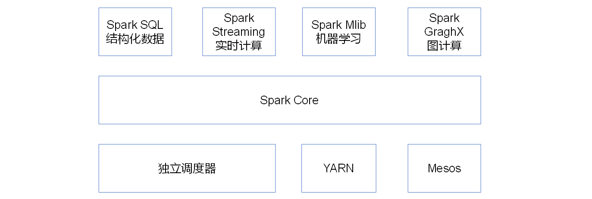
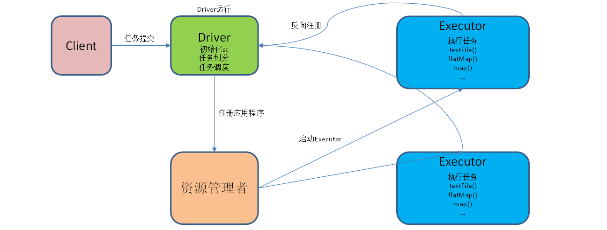

[TOC]

[TOC]

## Spark

### 1. 概述

Spark 内置模块



**Spark Core**：实现了 Spark 的基本功能，包含**任务调度、内存管理、错误恢复、与存储系统交互**等模块。Spark Core  中还包含了对**弹性分布式数据集**(Resilient Distributed DataSet，简称 RDD)的 API 定义。 

**Spark SQL**：是 Spark 用来操作结构化数据的程序包。通过 Spark SQL，我们可以使用 SQL 或者 Apache Hive 版本的 SQL 方言(HQL)来查询数据。Spark SQL 支持多种数据源，比如 Hive 表、Parquet 以及 JSON 等。 

**Spark Streaming**：是 Spark 提供的对**实时数据进行流式计算**的组件。提供了用来操作数据流的A PI，并且与Spark Core中的 RDD API高度对应。 

**Spark MLlib**：提供常见的**机器学习**(ML)功能的程序库。包括分类、回归、聚类、协同过滤等，还提供了模型评估、数据 导入等额外的支持功能。 

**集群管理器**：Spark 设计为可以高效地在一个计算节点到数千个计算节点之间伸缩计 算。为了实现这样的要求，同时获得最大灵活性，Spark 支持在各种**集群管理器**(Cluster Manager)上运行，包括Hadoop **YARN**、Apache Mesos，以及 Spark **自带**的一个简易调度器，叫作**独立调度器**。 


### 2. Spark 运行模式

#### 2.1 重要角色

##### 2.1.1 Driver（驱动器）

Spark 的**驱动器**是执行开发程序中的 **main** 方法的**进程**。它负责开发人员编写的用来**创建 SparkContext、创建RDD，以及进行RDD的转化操作和行动操作代码的执行**。如果你是用 spark shell，那么当你启动 Spark shell的时候，系统后台自启了一个 Spark 驱动器程序，就是在 Spark shell 中预加载的一个叫作 sc 的 **SparkContext** 对象。如果驱动器程序终止，那么 Spark 应用也就结束了。主要负责：

1）把用户程序转为作业（JOB）

2）跟踪 Executor 的运行状况

3）为执行器节点调度任务

4）UI 展示应用运行状况

##### 2.1.2 Executor（执行器）

Spark Executor 是一个**工作进程**，负责在 Spark 作业中运行任务，任务间**相互独立**。Spark 应用启动时，Executor 节点被**同时启动**，并且始终伴随着整个 Spark 应用的生命周期而存在。如果有 Executor 节点发生了故障或崩溃，Spark 应用也可以继续执行，会将**出错**节点上的任务调度到**其他** Executor 节点上**继续运行**。主要负责：

1）负责运行组成 Spark 应用的任务，并将结果返回给驱动器进程；

2）通过自身的块管理器（Block Manager）为用户程序中要求缓存的 RDD 提供内存式存储。RDD 是直接**缓存**在Executor 进程内的，因此任务可以在运行时充分利用缓存数据加速运算。


#### 2.2 Local 模式

 Local 模式就是运行在**一台**计算机上的模式，通常就是用于在本机上**练手和测试**。它可以通过以下集中方式设置Master。

- **local**: 所有计算都运行在**一个线程**当中，没有任何并行计算，通常我们在本机执行一些测试代码，或者练手，就用这种模式;
- **local[K]**: 指定使用**几个线程**来运行计算，比如 local[4] 就是运行 4 个 Worker 线程。通常我们的 CPU 有几个Core，就指定几个线程，最大化利用 CPU 的计算能力;
- **local[*]**: 这种模式直接帮你按照 CPU 最多 Cores来 设置线程数了。


### 3. 案例实操

**官方求PI的例子**

```bash
[atguigu@hadoop102 spark]$ bin/spark-submit \
--class org.apache.spark.examples.SparkPi \
--executor-memory 1G \
--total-executor-cores 2 \
./examples/jars/spark-examples_2.11-2.1.1.jar \
100
```

（1）基本语法

```bash
bin/spark-submit \
--class <main-class>
--master <master-url> \
--deploy-mode <deploy-mode> \
--conf <key>=<value> \
... # other options
<application-jar> \
[application-arguments]
```

（2）参数说明：

**--master**: 指定 Master 的地址，默认为 Local。

**--class**: 你的应用的**启动类** (如 org.apache.spark.examples.SparkPi)。

**--deploy-mode**: 是否发布你的驱动到 worker 节点(cluster) 或者作为一个本地客户端 (client) (default: client)*。

**--conf**: 任意的 Spark 配置属性， 格式 key = value. 如果值包含空格，可以加引号 “key = value” 。

**application-jar**: 打包好的应用 jar,包含依赖. 这个 URL 在集群中全局可见。 比如 hdfs:// 共享存储系统， 如果是 file:// path， 那么所有的节点的 path 都包含同样的  jar。

**application-arguments**: 传给 **main() **方法的**参数**。

**--executor-memory**: 1G 指定每个 executor 可用内存为1G。

**--total-executor-cores**: 2 指定每个 executor 使用的 CPU 核数为 2 个。

（3）结果展示

该算法是利用蒙特·卡罗算法求PI


（4）准备文件

```bash
[atguigu@hadoop102 spark]$ mkdir input
```

在 input 下创建 3 个文件 1.txt 和 2.txt，并输入以下内容

```
hello atguigu
hello spark
```

（5）启动spark-shell

```bash
[atguigu@hadoop102 spark]$ bin/spark-shell
Using Spark's default log4j profile: org/apache/spark/log4j-defaults.properties
Setting default log level to "WARN".
To adjust logging level use sc.setLogLevel(newLevel). For SparkR, use setLogLevel(newLevel).
18/09/29 08:50:52 WARN NativeCodeLoader: Unable to load native-hadoop library for your platform... using builtin-java classes where applicable
18/09/29 08:50:58 WARN ObjectStore: Failed to get database global_temp, returning NoSuchObjectException
Spark context Web UI available at http://192.168.9.102:4040
Spark context available as 'sc' (master = local[*], app id = local-1538182253312).
Spark session available as 'spark'.
Welcome to
   ____       __
   / __/__ ___ _____/ /__
  _\ \/ _ \/ _ `/ __/ '_/
  /___/ .__/\_,_/_/ /_/\_\  version 2.1.1
   /_/   
Using Scala version 2.11.8 (Java HotSpot(TM) 64-Bit Server VM, Java 1.8.0_144)
Type in expressions to have them evaluated.
Type :help for more information.
scala>
```

开启另一个 CRD 窗口

```bash
[atguigu@hadoop102 spark]$ jps
3627 SparkSubmit
4047 Jps
```

可登录 hadoop102:4040 查看程序运行


（6）运行 WordCount 程序

```bash
scala>sc.textFile("input").flatMap(_.split(" ")).map((_,1)).reduceByKey(_+_).collect
res0: Array[(String, Int)] = Array((hadoop,6), (oozie,3), (spark,3), (hive,3), (atguigu,3), (hbase,6))
scala>
```

可登录 hadoop102:4040 查看程序运行


（7）WordCount 程序分析

提交任务分析：



数据流分析：

**textFile("input")**：读取本地文件 input 文件夹数据；

**flatMap(_.split(" "))**：压平操作，按照空格分割符将一行数据映射成一个个单词；

**map((_,1))**：对每一个元素操作，将单词映射为元组；

**reduceByKey(_+_)**：按照 key 将值进行聚合，相加；

**collect**：将数据收集到 Driver 端展示。


