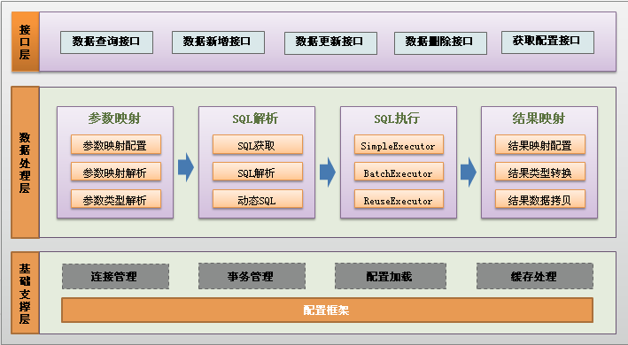
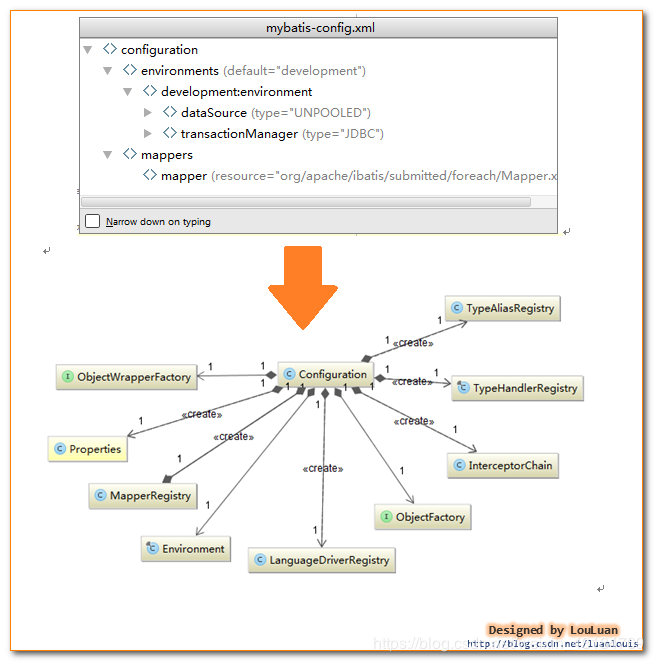

[TOC]

### MyBatis原理解析

#### 原理分析之一：从JDBC到Mybatis

##### 1. 引言

本文主要讲解 JDBC 怎么演变到 Mybatis 的渐变过程，重点讲解了为什么要将 JDBC 封装成 Mybaits 这样一个持久层框架。再而论述 Mybatis 作为一个数据持久层框架本身有待**改进之处**。

##### 2. JDBC实现查询分析

我们先看看我们最熟悉也是最基础的通过 JDBC 查询数据库数据，一般需要以下七个步骤：

（1） 加载 JDBC **驱动**

（2） 建立并获取**数据库连接**

（3） 创建 **JDBC Statements** 对象

（4） 设置 SQL 语句的**传入参数**

（5） **执行** SQL 语句并获得查询结果

（6） 对查询结果进行**转换处理**并将处理结果返回

（7） **释放**相关资源（关闭 Connection，关闭 Statement，关闭 ResultSet）

以下是具体的实现代码：

```java
public static List<Map<String,Object>> queryForList(){  
    Connection connection = null;  
    ResultSet rs = null;  
    PreparedStatement stmt = null;  
    List<Map<String,Object>> resultList = new ArrayList<Map<String,Object>>();  

    try {  
        // 加载JDBC驱动  
        Class.forName("oracle.jdbc.driver.OracleDriver").newInstance();  
        String url = "jdbc:oracle:thin:@localhost:1521:ORACLEDB";  

        String user = "trainer";   
        String password = "trainer";   

        // 获取数据库连接  
        connection = DriverManager.getConnection(url,user,password);   

        String sql = "select * from userinfo where user_id = ? ";  
        // 创建Statement对象（每一个Statement为一次数据库执行请求）  
        stmt = connection.prepareStatement(sql);  

        // 设置传入参数  
        stmt.setString(1, "zhangsan");  

        // 执行SQL语句  
        rs = stmt.executeQuery();  

        // 处理查询结果（将查询结果转换成List<Map>格式）  
        ResultSetMetaData rsmd = rs.getMetaData();  
        int num = rsmd.getColumnCount();  

        while(rs.next()){  
            Map map = new HashMap();  
            for(int i = 0;i < num;i++){  
                String columnName = rsmd.getColumnName(i+1);  
                map.put(columnName,rs.getString(columnName));  
            }  
            resultList.add(map);  
        }  

    } catch (Exception e) {  
        e.printStackTrace();  
    } finally {  
        try {  
            // 关闭结果集  
            if (rs != null) {  
                rs.close();  
                rs = null;  
            }  
            // 关闭执行  
            if (stmt != null) {  
                stmt.close();  
                stmt = null;  
            }  
            if (connection != null) {  
                connection.close();  
                connection = null;  
            }  
        } catch (SQLException e) {  
            e.printStackTrace();  
        }  
    }  

    return resultList;  
}  
```

##### 3. JDBC演变到Mybatis过程

上面我们看到了实现 JDBC 有七个步骤，有的步骤是可以**进一步封装**的，减少我们开发的代码量。

###### 第一步优化：连接获取和释放

问题描述：

数据库连接**频繁的开启和关闭**本身就造成了资源的浪费，影响系统的性能。

解决问题：

数据库连接的获取和关闭我们可以使用**数据库连接池**来解决资源浪费的问题。通过连接池就可以反复利用已经建立的连接去访问数据库了。减少连接的开启和关闭的时间。

问题描述：

但是现在**连接池多种多样**，可能存在变化，有可能采用 DBC P的连接池，也有可能采用容器本身的 JNDI 数据库连接池。

解决问题：

我们可以通过 **DataSource** 进行**隔离解耦**，我们统一从 DataSource 里面获取**数据库连接**，DataSource 具体由 DBCP 实现还是由容器的 JNDI 实现都可以，所以我们将 DataSource 的**具体实现通过让用户配置来应对变化**。

###### 第二步优化：SQL统一存取

问题描述：

我们使用 JDBC 进行**操作数据库**时，SQL 语句基本都散落在各个 Java 类中，这样有三个不足之处：

- 第一，可读性很差，不利于维护以及做性能调优。

- 第二，改动 Java 代码需要重新编译、打包部署。

- 第三，不利于取出 SQL 在数据库客户端执行（取出后还得删掉中间的 Java 代码，编写好的 SQL 语句写好后还得通过＋号在 Java 进行拼凑）。

解决问题：

我们可以考虑不把 SQL 语句写到 Java 代码中，那么把 SQL 语句放到哪里呢？首先需要有一个**统一存放**的地方，我们可以将这些 SQL 语句**统一集中放到配置文件或者数据库**里面（以 key-value 的格式存放）。然后通过 SQL 语句的 **key 值**去获取对应的 SQL 语句。

既然我们将 SQL 语句都统一放在**配置文件或者数据库**中，那么这里就涉及一个 SQL 语句的**加载问题**。

###### 第三步优化：传入参数映射和动态SQL

问题描述：

很多情况下，我们都可以通过在 SQL 语句中**设置占位符**来达到使用**传入参数**的目的，这种方式本身就有一定局限性，它是按照一定**顺序**传入参数的，要与占位符**一一匹配**。但是，如果我们传入的参数是不确定的（比如列表查询，根据用户填写的查询条件不同，传入查询的参数也是不同的，有时是一个参数、有时可能是三个参数），那么我们就得在后台代码中自己根据请求的传入参数去拼凑相应的 SQL 语句，这样的话还是避免不了在 Java 代码里面写 SQL 语句的命运。既然我们已经把 SQL 语句统一存放在配置文件或者数据库中了，怎么做到能够**根据前台传入参数的不同**，**动态生成**对应的 SQL 语句呢？

解决问题：

第一，我们先解决这个**动态问题**，按照我们正常的程序员思维是，通过 if 和 else 这类的判断来进行是最直观的，这个时候我们想到了 JSTL 中的 \<if test="">\</if> 这样的**标签**，那么，能不能将这类的**标签**引入到 SQL 语句中呢？假设可以，那么我们这里就需要一个专门的 **SQL 解析器**来**解析这样的 SQL 语句**，但是，if 判断的变量来自于哪里呢？传入的值本身是可变的，那么我们得为这个值定义一个**不变的变量名称**，而且这个变量名称必须和对应的值要有对应关系，可以通过这个变量名称找到对应的值，这个时候我们想到了 **key-value 的 Map**。**解析的时候根据变量名的具体值来判断**。

假如前面可以判断没有问题，那么假如判断的结果是 true，那么就需要输出的标签里面的 SQL 片段，但是怎么解决在标签里面使用**变量名称**的问题呢？这里我们需要使用一种有别于 SQL 的语法来**嵌入变量**（比如使用＃变量名＃）。这样，SQL 语句经过解析后就可以**动态的生成符合上下文**的 SQL 语句。

还有，怎么区分开占位符变量和非占位变量？有时候我们单单使用占位符是满足不了的，占位符只能为查询条件占位，SQL 语句其他地方使用不了。这里我们可以使用 **#变量名#** 表示**占位符变量**，使用 **$变量名$** 表示**非占位符变量**。

###### 第四步优化：结果映射和结果缓存

问题描述：

执行 SQL 语句、获取执行结果、对执行结果进行转换处理、释放相关资源是一整套下来的。假如是执行查询语句，那么执行 SQL 语句后，返回的是一个 **ResultSet** 结果集，这个时候我们就需要将 ResultSet 对象的数据**取出来**，不然等到释放资源时就取不到这些结果信息了。我们从前面的优化来看，以及将获取连接、设置传入参数、执行 SQL 语句、释放资源这些都封装起来了，只剩下结果处理这块还没有进行封装，如果能封装起来，每个数据库操作都不用自己写那么一大堆 Java 代码，直接调用一个封装的方法就可以搞定了。

解决问题：

我们分析一下，一般对**执行结果的有哪些处理**，有可能将结果**不做任何处理**就直接返回，也有可能将结果**转换成一个 JavaBean 对象返回**、一个 Map 返回、一个 List 返回等等，结果处理可能是多种多样的。从这里看，我们必须告诉 SQL 处理器两点：第一，**需要返回什么类型的对象**；第二，需要返回的**对象的数据结构怎么跟执行的结果映射**，这样才能将具体的值 copy 到对应的数据结构上。

接下来，我们可以进而考虑对 SQL 执行结果的**缓存**来提升性能。缓存数据都是 **key-value** 的格式，那么这个 key 怎么来呢？怎么保证唯一呢？即使同一条 SQL 语句几次访问的过程中由于**传入参数**的不同，得到的执行 SQL 语句也是**不同**的。但是 **SQL 语句和传入参数两部分合起来**可以作为数据缓存的 **key 值**。

###### 第五步优化：解决重复SQL语句问题

问题描述：

由于我们将所有 SQL 语句都放到**配置文件**中，这个时候会遇到一个 **SQL 重复**的问题，几个功能的 SQL 语句其实**都差不多**，有些可能是 SELECT 后面那段不同、有些可能是 WHERE 语句不同。有时候表结构改了，那么我们就需要改多个地方，不利于维护。

解决问题：

当我们的代码程序出现重复代码时怎么办？将重复的代码抽离出来成为独立的一个类，然后在各个需要使用的地方进行引用。对于 SQL 重复的问题，我们也可以采用这种方式，通过**将 SQL 片段模块化**，将重复的 SQL 片段独立成一个 SQL 块，然后在各个 SQL 语句**引用重复的 SQL 块**，这样需要修改时只需要修改一处即可。 

##### 4. 优化总结：

我们总结一下上面对 JDBC 的**优化和封装**：

（1） 使用**数据库连接池**对连接进行管理

（2） SQL 语句统一存放到**配置文件**

（3） SQL 语句**变量和传入参数**的映射以及**动态SQL**

（4） 动态 SQL 语句的**处理**

（5） 对数据库操作结果的**映射和结果缓存**

（6） SQL 语句的重复

##### 5.  Mybaits有待改进之处

问题描述：

Mybaits 所有的数据库操作都是基于 SQL 语句，导致什么样的数据库操作**都要写 SQL 语句**。一个应用系统要写的 SQL 语句实在**太多**了。

改进方法：

我们对数据库进行的操作大部分都是对表数据的**增删改查**，很多都是对**单表**的数据进行操作，由这点我们可以想到一个问题：单表操作可不可以不写 SQL 语句，通过 JavaBean 的**默认映射器生成对应的 SQL 语句**，比如：一个类 UserInfo 对应于 USER_INFO 表， userId 属性对应于 USER_ID 字段。这样我们就可以通过**反射可以获取到对应的表结构**了，**拼凑成对应的 SQL 语句**显然不是问题。


#### 原理分析之二：框架整体设计

##### 1. 引言

本文主要讲解 Mybatis 的整体**程序设计**，理清楚框架的主要脉络。后面文章我们再详细**讲解各个组件**。

##### 2. 整体设计

###### 2.1 总体流程

(1) **加载配置并初始化**

触发条件：加载配置文件

配置来源于两个地方，一处是**配置文件**，一处是 Java 代码的**注解**，将 SQL 的配置信息加载成为一个个 **MappedStatement** 对象（包括了传入参数映射配置、执行的 SQL 语句、结果映射配置），存储在**内存**中。

(2) **接收调用请求**

   触发条件：调用 Mybatis 提供的 API

   传入参数：为 SQL 的 ID 和传入**参数**对象

   处理过程：将请求传递给下层的请求处理层进行处理。

(3) **处理操作请求**

​    触发条件：API 接口层**传递请求**过来

​    传入参数：为 SQL 的 ID 和传入参数对象

​    处理过程：

​    (A) 根据 SQL 的 **ID** 查找对应的 **MappedStatement** 对象。

​    (B) 根据**传入参数对象解析 MappedStatement 对象**，得到最终要**执行的 SQL 和执行传入参数**。

​    (C) 获取**数据库连接**，根据得到的最终 SQL 语句和执行传入参数到数据库执行，并得到执行结果。

​    (D) 根据 **MappedStatement** 对象中的**结果映射配置对得到的执行结果进行转换处理**，并得到最终的处理结果。

​    (E) **释放**连接资源。

(4) **返回处理结果**

将最终的处理结果返回。

###### 2.2 功能架构设计



功能架构讲解：

我们把 Mybatis 的功能架构分为**三层**：

(1) **API接口层**：提供给外部使用的接口 API，开发人员通过这些**本地 API 来操纵数据库**。接口层一接收到调用请求就会调用数据处理层来完成具体的数据处理。

(2) **数据处理层**：负责具体的 SQL 查找、SQL 解析、SQL 执行和执行结果映射处理等。它主要的目的是根据调用的请求完成一次数据库操作。

(3) **基础支撑层**：负责最基础的功能支撑，包括**连接管理、事务管理、配置加载和缓存处理**，这些都是**共用**的东西，将他们抽取出来作为最基础的组件。为上层的数据处理层提供最基础的支撑。

###### 2.3 框架架构设计


框架架构讲解：

(1) **加载配置**：配置来源于两个地方，一处是**配置文件**，一处是 Java 代码的**注解**，将 SQL 的配置信息加载成为一个个 **MappedStatement** 对象（包括了传入参数映射配置、执行的SQL语句、结果映射配置），存储在**内存**中。

(2) **SQL解析**：当 API 接口层接收到调用请求时，会接收到传入 SQL 的 ID 和**传入对象**（可以是Map、JavaBean或者基本数据类型），Mybatis 会**根据 SQL 的 ID 找到对应的 MappedStatement**，然后根据传入**参数对象**对 **MappedStatement** 进行**解析**，解析后可以得到**最终要执行的 SQL 语句和参数**。

(3) **SQL执行**：将最终得到的 SQL 和参数拿到数据库进行执行，得到操作数据库的结果。

(4) **结果映射**：将操作数据库的结果**按照映射的配置进行转换**，可以转换成 HashMap、JavaBean 或者基本数据类型，并将最终结果返回。


#### 原理分析之三：初始化（配置文件读取和解析）

**1. 准备工作**

编写测试代码（具体请参考《Mybatis入门示例》）,设置断点,以Debug模式运行,具体代码如下: 

```java
String resource = "mybatis.cfg.xml";  
Reader reader = Resources.getResourceAsReader(resource);  
SqlSessionFactory ssf = new SqlSessionFactoryBuilder().build(reader);  
SqlSession session = ssf.openSession();  
```

**2. 源码分析**

我们此次就对上面的代码进行**跟踪和分析**，let's go。

首先我们按照顺序先看看第一行和第二行代码，看看它主要完成什么事情：

```java
String resource = "mybatis.cfg.xml";  
Reader reader = Resources.getResourceAsReader(resource);  
```

读取 Mybaits 的**主配置配置文件**，并返回该文件的**输入流**，我们知道 Mybatis 所有的 SQL 语句都写在 XML 配置文件里面,所以第一步就需要读取这些 XML 配置文件，这个不难理解，关键是读取文件后怎么**存放**。

我们接着看第三行代码（如下），该代码主要是读取配置文件流并将这些**配置信息**存放到 **Configuration** 类中。

```java
SqlSessionFactory ssf = new SqlSessionFactoryBuilder().build(reader);  
```

**SqlSessionFactoryBuilder** 的 build 的方法如下:

```java
public SqlSessionFactory build(Reader reader) {  
    return build(reader, null, null);  
}  
```

其实是调用该类的另一个 build 方法来执行的, 具体代码如下:

```java
public SqlSessionFactory build(Reader reader, String environment, 
                               Properties properties) {  
    try {  
        
        XMLConfigBuilder parser = new XMLConfigBuilder(reader, environment, properties); 
        return build(parser.parse());  
    } catch (Exception e) {  
        throw ExceptionFactory.wrapException("Error building SqlSession.", e);  
    } finally {  
        ErrorContext.instance().reset();  
        try {  
            reader.close();  
        } catch (IOException e) {  
            // Intentionally ignore. Prefer previous error.  
        }  
    }  
} 
```

我们重点看一下里面两行:

```java
// 创建一个配置文件流的解析对象XMLConfigBuilder,其实这里是将环境和配置文件流赋予解析类  
XMLConfigBuilder parser = new XMLConfigBuilder(reader, environment, properties);  
// 解析类对配置文件进行解析并将解析的内容存放到Configuration对象中,并返回SqlSessionFactory  
return build(parser.parse());  
```

这里的 **XMLConfigBuilder** 初始化其实调用的代码如下: 

```java
private XMLConfigBuilder(XPathParser parser, String environment, Properties props) {  
    super(new Configuration());  
    ErrorContext.instance().resource("SQL Mapper Configuration");  
    this.configuration.setVariables(props);  
    this.parsed = false;  
    this.environment = environment;  
    this.parser = parser;   
}  
```

 XMLConfigBuilder 的 **parse** 方法执行代码如下: 

```java
public Configuration parse() {  
    if (parsed) {  
        throw new BuilderException("Each MapperConfigParser can only be used once.");  
    }  
    parsed = true;  
    parseConfiguration(parser.evalNode("/configuration"));  
    return configuration;  
} 
```

解析的内容主要是在 **parseConfiguration** 方法中,它主要完成的工作是**读取配置文件的各个节点**,然后将这些**数据映射到内存配置对象 Configuration 中**,我们看一下 parseConfiguration 方法内容: 

```java
private void parseConfiguration(XNode root) {  
    try {  
        typeAliasesElement(root.evalNode("typeAliases"));  
        pluginElement(root.evalNode("plugins"));  
        objectFactoryElement(root.evalNode("objectFactory"));  
        objectWrapperFactoryElement(root.evalNode("objectWrapperFactory"));  
        propertiesElement(root.evalNode("properties"));  
        settingsElement(root.evalNode("settings"));  
        environmentsElement(root.evalNode("environments"));  
        typeHandlerElement(root.evalNode("typeHandlers"));  
        mapperElement(root.evalNode("mappers"));  
    } catch (Exception e) {  
        throw new BuilderException("Error parsing SQL Mapper Configuration. Cause: " + e, e);  
    }  
}  
```

最后的 **build** 方法其实是**传入配置对象**进去, 创建 **DefaultSqlSessionFactory** 实例出来。DefaultSqlSessionFactory 是SqlSessionFactory 的**默认实现**. 

```java
public SqlSessionFactory build(Configuration config) {  
    return new DefaultSqlSessionFactory(config);  
} 
```

Configuration 对象的结构和 xml 配置文件的对象**几乎相同**。

回顾一下 xml 中的**配置标签**有哪些：

**properties（属性），settings（设置），typeAliases（类型别名），typeHandlers（类型处理器），objectFactory（对象工厂），mappers（映射器）等**

Configuration 也有对应的**对象属性**来封装它们。



发散一下思路，既然解析 xml 是对 Configuration 中的属性进行复制，那么我们同样可以在一个**类中创建 Configuration 对象**，手动设置其中**属性的值**来达到配置的效果。

最后我们看一下第四行代码： 

```java
SqlSession session = ssf.openSession();  
```

通过调用 DefaultSqlSessionFactory 的 openSession 方法返回一个 **SqlSession 实例**,我们看一下具体是怎么得到一个 SqlSession 实例的。首先调用 **openSessionFromDataSource** 方法。 

```java
public SqlSession openSession() {  
    return openSessionFromDataSource(configuration.getDefaultExecutorType(), null, false);  
}  
```

 下面我们看一下 **openSessionFromDataSource** 方法的逻辑： 

```java
private SqlSession openSessionFromDataSource(ExecutorType execType, TransactionIsolationLevel level, boolean autoCommit) {  
    Connection connection = null;  
    try {  
        // 获取配置信息里面的环境信息，这些环境信息都是包括使用哪种数据库，连接数据库的信息，事务  
        final Environment environment = configuration.getEnvironment();  
        // 根据环境信息关于数据库的配置获取数据源  
        final DataSource dataSource = getDataSourceFromEnvironment(environment);  
        // 根据环境信息关于事务的配置获取事务工厂  
        TransactionFactory transactionFactory = getTransactionFactoryFromEnvironment(environment);  
        connection = dataSource.getConnection();  
        if (level != null) {  
            // 设置连接的事务隔离级别  
            connection.setTransactionIsolation(level.getLevel());  
        }  
        // 对connection进行包装，使连接具备日志功能，这里用的是代理。  
        connection = wrapConnection(connection);  
        // 从事务工厂获取一个事务实例  
        Transaction tx = transactionFactory.newTransaction(connection, autoCommit);  
        // 从配置信息中获取一个执行器实例  
        Executor executor = configuration.newExecutor(tx, execType);  
        // 返回SqlSession的一个默认实例  
        return new DefaultSqlSession(configuration, executor, autoCommit);  
    } catch (Exception e) {  
        closeConnection(connection);  
        throw ExceptionFactory.wrapException("Error opening session.  Cause: " + e, e); 
    } finally {  
        ErrorContext.instance().reset();  
    }  
} 
```

传入参数说明：

（1）**ExecutorType**：执行类型，ExecutorType 主要有三种类型：**SIMPLE, REUSE, BATCH**，默认是 SIMPLE，都在枚举类 ExecutorType 里面。Executor 也是一个**接口**，他有三个常用的实现类 BatchExecutor（重用语句并执行批量更新），ReuseExecutor（重用预处理语句prepared statements），SimpleExecutor（普通的执行器，默认）。

（2）**TransactionIsolationLevel**：事务**隔离级别**，都在枚举类 TransactionIsolationLevel 中定义。

（3）**autoCommit**：是否**自动提交**，主要是事务提交的设置。

 **DefaultSqlSession** 是 **SqlSession** 的实现类，该类主要提供操作数据库的方法给开发人员使用。

SqlSession 是一个**接口**，它有两个实现类：**DefaultSqlSession（默认）**和 SqlSessionManager（弃用，不做介绍）
SqlSession 是 MyBatis 中用于和**数据库交互**的顶层类，通常将它与 **ThreadLocal** 绑定，一个会话使用一个 SqlSession，并且在使用完毕后需要 close。
SqlSession 中的两个最重要的**参数**：Configuration 配置类和 Executor 执行器。

这里总结一下上面的过程，总共由**三个步骤**：

步骤一：读取 Mybatis 的**主配置文件**，并将文件读成**文件流形式**(InputStream)。

步骤二：从主配置文件流中读取文件的**各个节点信息**并存放到 **Configuration** 对象中。读取 **mappers** 节点的引用文件，并将这些文件的各个节点信息存放到 **Configuration** 对象。

步骤三：根据 **Configuration** 对象的信息获取**数据库连接**，并设置**连接的事务隔离级别**等信息，将经过**包装数据库连接对象** SqlSession 接口返回，DefaultSqlSession 是 SqlSession 的实现类，所以这里返回的是 **DefaultSqlSession**，SqlSession 接口里面就是对外提供的**各种数据库操作**。


#### 原理分析之四：一次SQL查询的源码分析

上回我们讲到 Mybatis 加载相关的**配置文件进行初始化**，这回我们讲一下一次 SQL 查询怎么进行的。

 Mybatis 完成一次 SQL 查询需要使用的代码如下：

```java
String resource = "mybatis.cfg.xml";  
Reader reader = Resources.getResourceAsReader(resource);  
SqlSessionFactory ssf = new SqlSessionFactoryBuilder().build(reader);  

SqlSession session = ssf.openSession();  

try {  
    UserInfo user = (UserInfo) session.selectOne("User.selectUser", "1");  
    System.out.println(user);  
} catch (Exception e) {  
    e.printStackTrace();  
} finally {  
    session.close();  
}
```

本次我们需要进行深入跟踪分析的是：

```java
SqlSession session = ssf.openSession();  
UserInfo user = (UserInfo) session.selectOne("User.selectUser", "1");  
```

第一步：打开一个**会话**，我们看看里面具体做了什么事情。

```java
SqlSession session = ssf.openSession();  
```

DefaultSqlSessionFactory 的 openSession() 方法内容如下：

```java
public SqlSession openSession() {  
    return openSessionFromDataSource(configuration.getDefaultExecutorType(), null, false);  
}  
```

跟进去，我们看一下 openSessionFromDataSource 方法到底做了啥：

```java
private SqlSession openSessionFromDataSource(ExecutorType execType, TransactionIsolationLevel level, boolean autoCommit) {  
    Connection connection = null;  
    try {  
        final Environment environment = configuration.getEnvironment();  
        final DataSource dataSource = getDataSourceFromEnvironment(environment);  
        TransactionFactory transactionFactory = getTransactionFactoryFromEnvironment(environment);  
        connection = dataSource.getConnection();  
        if (level != null) {  
            connection.setTransactionIsolation(level.getLevel());  
        }  
        connection = wrapConnection(connection);  
        Transaction tx = transactionFactory.newTransaction(connection, autoCommit);  
        Executor executor = configuration.newExecutor(tx, execType);  
        return new DefaultSqlSession(configuration, executor, autoCommit);  
    } catch (Exception e) {  
        closeConnection(connection);  
        throw ExceptionFactory.wrapException("Error opening session.  Cause: " + e, e);  
    } finally {  
        ErrorContext.instance().reset();  
    }  
}  
```

这里我们分析一下这里所涉及的步骤：

（1）获取前面我们加载配置文件的**环境信息**，并且获取环境信息中配置的**数据源**。

（2）通过数据源获取一个**连接**，对**连接进行包装代理**（通过 JDK 的代理来实现**日志功能**）。

（3）设置**连接的事务信息（是否自动提交、事务级别）**，从配置环境中获取事务工厂，事务工厂获取一个**新的事务**。

（4）传入事务对象获取一个**新的执行器**，并传入**执行器、配置信息等获取一个执行会话对象**。

从上面的代码我们可以得出，**一次配置加载只能有且对应一个数据源**。对于上述步骤，我们不难理解，我们重点看看新建执行器和 DefaultSqlSession。

首先，我们看看 newExecutor 到底做了什么？

```java
public Executor newExecutor(Transaction transaction, ExecutorType executorType) {  
    executorType = executorType == null ? defaultExecutorType : executorType;  
    executorType = executorType == null ? ExecutorType.SIMPLE : executorType;  
    Executor executor;  
    if (ExecutorType.BATCH == executorType) {  
        executor = new BatchExecutor(this, transaction);  
    } else if (ExecutorType.REUSE == executorType) {  
        executor = new ReuseExecutor(this, transaction);  
    } else {  
        executor = new SimpleExecutor(this, transaction);  
    }  
    if (cacheEnabled) {  
        executor = new CachingExecutor(executor);  
    }  
    executor = (Executor) interceptorChain.pluginAll(executor);  
    return executor;  
}  
```

上面代码的执行步骤如下：

（1）判断**执行器类型**，如果配置文件中没有配置执行器类型，则采用默认执行类型 ExecutorType.SIMPLE。

（2）根据执行器类型返回**不同类型的执行器**（执行器有三种，分别是 **BatchExecutor、SimpleExecutor 和 CachingExecutor**，后面我们再详细看看）。

（3）**跟执行器绑定拦截器插件**（这里也是使用**代理**来实现）。

DefaultSqlSession 到底是干什么的呢？

DefaultSqlSession 实现了 **SqlSession** 接口，里面有各种各样的 **SQL 执行方法**，主要用于 SQL 操作的**对外接口**，它会的**调用执行器来执行实际的 SQL 语句**。


介绍一下**MappedStatement** ：

**作用：** MappedStatement 与 Mapper 配置文件中的一个 select/update/insert/delete 节点相对应。mapper 中配置的标签都被封装到了此对象中，主要用途是描述一条 SQL 语句。

**初始化过程：**回顾刚开始介绍的加载配置文件的过程中，会对 mybatis-config.xml 中的各个**标签**都进行解析，其中有  mappers 标签用来引入`mapper.xml文件`或者配置`mapper接口`的目录。

```xml
<select id="getUser" resultType="user" >
    select * from user where id=#{id}
</select>
```

这样的一个 select 标签会在初始化配置文件时被解析**封装成一个 MappedStatement 对象**，然后存储在 Configuration 对象的 **mappedStatements** 属性中，mappedStatements 是一个 **HashMap**，**存储时 key = 全限定类名 + 方法名，value = 对应的 MappedStatement 对象。**在 Configuration 中对应的属性为:

```java
Map<String, MappedStatement> mappedStatements = new StrictMap<MappedStatement>("Mapped Statements collection")
```

接下来我们看看 SQL 查询是怎么进行的。

```java
UserInfo user = (UserInfo) session.selectOne("User.selectUser", "1");  
```

实际调用的是 **DefaultSqlSession** 类的 **selectOne** 方法，该方法代码如下：

```java
public Object selectOne(String statement, Object parameter) {  
    // Popular vote was to return null on 0 results and throw exception on too many.  
    List list = selectList(statement, parameter);  
    // 调用的是查询列表只是判断结果是不是只有一个
    if (list.size() == 1) {  
        return list.get(0);  
    } else if (list.size() > 1) {  
        throw new TooManyResultsException("Expected one result (or null) to be returned by selectOne(), but found: " + list.size());  
    } else {  
        return null;  
    }  
}  
```

我们再看看 selectList 方法（实际上是调用该类的另一个 selectList 方法来实现的）：

```java
public List selectList(String statement, Object parameter) {  
    return selectList(statement, parameter, RowBounds.DEFAULT);  
}  

public List selectList(String statement, Object parameter, RowBounds rowBounds) {  
    try { 
        // 获取Statement
        MappedStatement ms = configuration.getMappedStatement(statement);  
        // 使用执行器进行查询
        return executor.query(ms, wrapCollection(parameter), rowBounds, Executor.NO_RESULT_HANDLER);  
    } catch (Exception e) {  
        throw ExceptionFactory.wrapException("Error querying database.  Cause: " + e, e);  
    } finally {  
        ErrorContext.instance().reset();  
    }  
}  
```

第二个 **selectList** 的执行步骤如下：

（1）根据 SQL 的 **ID 到配置信息中找对应的 MappedStatement**，在之前配置被加载初始化的时候我们看到了系统会把配置文件中的 SQL 块解析并放到一个 MappedStatement 里面，并将 MappedStatement 对象放到一个 Map 里面进行存放，Map 的 **key 值是该 SQL 块的 ID**。

（2）调用**执行器**的 **query** 方法，**传入 MappedStatement 对象、SQL 参数对象、范围对象（此处为空）和结果处理方式。**


好了，目前只剩下一个疑问，那就是**执行器到底怎么执行 SQL** 的呢？

上面我们知道了，默认情况下是采用 **SimpleExecutor** 执行的，我们看看这个类的 **doQuery** 方法：

```java
public List doQuery(MappedStatement ms, Object parameter, RowBounds rowBounds, ResultHandler resultHandler) throws SQLException {  
    Statement stmt = null;  
    try {  
        // 获取配置
        Configuration configuration = ms.getConfiguration();  
        // 通过配置对象获取一个新的 StatementHandler，该类主要用来处理一次SQL操作。
        StatementHandler handler = configuration.newStatementHandler(this, ms, parameter, rowBounds, resultHandler);  
        // 预处理 StatementHandler 对象，得到 Statement 对象。
        stmt = prepareStatement(handler);  
        // 通过StatementHandler的query方法来执行 SQL，并对执行结果进行处理
        return handler.query(stmt, resultHandler);  
    } finally {  
        closeStatement(stmt);  
    }  
}  
```

doQuery 方法的内部执行步骤：

（1） 获取**配置信息**对象。

（2）通过配置对象获取一个新的 **StatementHandler**，该类主要用来处理**一次 SQL 操作**。

（3）预处理 StatementHandler 对象，**得到 Statement 对象**。

（4）传入 Statement 和**结果处理**对象，通过 **StatementHandler 的 query 方法来执行 SQL**，并对执行结果进行处理。


我们看一下 newStatementHandler 到底做了什么？

```java
public StatementHandler newStatementHandler(Executor executor, MappedStatement mappedStatement, Object parameterObject, RowBounds rowBounds, ResultHandler resultHandler) {  
    StatementHandler statementHandler = new RoutingStatementHandler(executor, mappedStatement, parameterObject, rowBounds, resultHandler);  
    // 绑定拦截器方法
    statementHandler = (StatementHandler) interceptorChain.pluginAll(statementHandler); 
    return statementHandler;  
}  
```

上面代码的执行步骤：

（1）根据相关的**参数**获取对应的 **StatementHandler** 对象。

（2）为 StatementHandle r对象**绑定拦截器插件**。

 

RoutingStatementHandler 类的构造方法 RoutingStatementHandler 如下：

```java
public RoutingStatementHandler(Executor executor, MappedStatement ms, Object parameter, RowBounds rowBounds, ResultHandler resultHandler) {  

    switch (ms.getStatementType()) {  
        case STATEMENT:  
            delegate = new SimpleStatementHandler(executor, ms, parameter, rowBounds, resultHandler);  
            break;  
        case PREPARED:  
            delegate = new PreparedStatementHandler(executor, ms, parameter, rowBounds, resultHandler);  
            break;  
        case CALLABLE:  
            delegate = new CallableStatementHandler(executor, ms, parameter, rowBounds, resultHandler);  
            break;  
        default:  
            throw new ExecutorException("Unknown statement type: " + ms.getStatementType());  
    }  

}  
```

根据 MappedStatement 对象的 **StatementType** 来创建**不同的 StatementHandler**，这个跟前面执行器的方式类似。StatementType 有 STATEMENT、PREPARED 和 CALLABLE 三种类型，跟 **JDBC 里面的 Statement 类型一一对应**。

 我们看一下前面 **prepareStatement** 方法具体内容：

```java
private Statement prepareStatement(StatementHandler handler) throws SQLException {  
    Statement stmt;  
    Connection connection = transaction.getConnection();  
    // 从连接中获取Statement对象  
    stmt = handler.prepare(connection);  
    // 处理预编译的传入参数  
    handler.parameterize(stmt);  
    return stmt;  
}  
```

