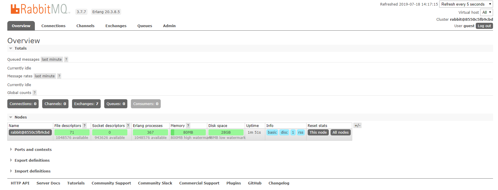
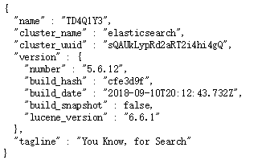

[TOC]

## Docker

### 1、简介

**Docker**是一个开源的应用容器引擎；是一个轻量级容器技术；

Docker支持将软件编译成一个镜像；然后在镜像中各种软件做好配置，将镜像发布出去，其他使用者可以直接使用这个镜像；

运行中的这个**镜像称为容器**，容器启动是非常快速的。


### 2、核心概念

**docker主机(Host)**：安装了Docker程序的机器（Docker直接安装在操作系统之上，如Linux或Windows）；

**docker客户端(Client)**：连接docker主机进行操作；

**docker仓库(Registry)**：用来保存各种打包好的软件镜像；公共仓库/私有仓库。

**docker镜像(Images)**：软件打包好的镜像；放在docker仓库中；

==**docker容器(Container)**：**镜像**启动后的**实例**称为**一个容器**；容器是独立运行的一个或一组应用。== 每次运行镜像都会产生一个容器。


使用Docker的步骤：

1）、安装Docker

2）、去Docker仓库找到这个软件对应的镜像；

3）、使用Docker运行这个镜像，这个**镜像就会生成一个Docker容器**；

4）、对容器的启动停止就是对软件的启动停止；

### 3、安装Docker

#### 1）、安装linux虚拟机

​	1）、VMWare、VirtualBox（安装）；

​	2）、导入虚拟机文件centos7-atguigu.ova；

​	3）、双击启动linux虚拟机;使用  root/ 123456登陆

​	4）、使用客户端连接linux服务器进行命令操作；

​	5）、设置虚拟机网络；

​		桥接网络选好网卡接入网线；

​	6）、设置好网络以后使用命令重启虚拟机的网络

```shell
service network restart
```

​	7）、查看linux的ip地址

```shell
ip addr
```

​	8）、使用客户端连接linux；

#### 2）、在linux虚拟机上安装docker

步骤：

```shell
1、检查内核版本，必须是3.10及以上
uname -r
2、安装docker
yum install docker
3、输入y确认安装
4、启动docker
[root@localhost ~]# systemctl start docker
[root@localhost ~]# docker -v
Docker version 1.12.6, build 3e8e77d/1.12.6
# 开机启动docker
[root@localhost ~]# systemctl enable docker
Created symlink from /etc/systemd/system/multi-user.target.wants/docker.service to /usr/lib/systemd/system/docker.service.
6、停止docker
systemctl stop docker
```

### 4、Docker常用命令&操作

#### 1）、镜像操作

| 操作 | 命令                                                | 说明                                                         |
| :--: | --------------------------------------------------- | ------------------------------------------------------------ |
| 检索 | **docker  search 关键字**  eg：docker  search redis | 我们经常去docker  hub上检索镜像的详细信息，如镜像的TAG。     |
| 拉取 | **docker pull** 镜像名:tag                          | :tag是可选的，tag表示标签，多为软件的版本，默认是latest最新版 |
| 列表 | **docker images**                                   | 查看所有本地镜像                                             |
| 删除 | **docker rmi image-id**                             | 删除指定的本地镜像                                           |

https://hub.docker.com/

#### 2）、容器操作

软件镜像（QQ安装程序）----运行镜像----产生一个容器（正在运行的软件，运行的QQ）；

步骤：

```shell
1、搜索镜像
[root@localhost ~]# docker search tomcat
2、拉取镜像
[root@localhost ~]# docker pull tomcat
3、根据镜像启动容器
# --name 指定容器名称  -d 指定后台运行
docker run --name mytomcat -d tomcat:latest  
4、docker ps  
查看运行中的容器
5、停止运行中的容器
docker stop  容器的id
6、查看所有的容器
docker ps -a
7、启动容器
docker start 容器id
8、删除一个容器
 docker rm 容器id
9、启动一个做了端口映射的tomcat 
# -p 端口映射 8888：Linux的端口 8080：Tomcat端口
[root@localhost ~]# docker run -d -p 8888:8080 tomcat
-d：后台运行
-p: 将主机的端口映射到容器的一个端口    主机端口:容器内部的端口

10、为了演示简单关闭了linux的防火墙
service firewalld status ；查看防火墙状态
service firewalld stop：关闭防火墙
11、查看容器的日志
docker logs container-name/container-id

更多命令参看
https://docs.docker.com/engine/reference/commandline/docker/
可以参考每一个镜像的文档

```


#### 3）、安装MySQL示例

```shell
# 不要使用最新的吧，更新了安全机制之后容易连接不上
docker pull mysql:5.7
```


错误的启动

```shell
[root@localhost ~]# docker run --name mysql01 -d mysql
42f09819908bb72dd99ae19e792e0a5d03c48638421fa64cce5f8ba0f40f5846

# mysql退出了
[root@localhost ~]# docker ps -a
CONTAINER ID        IMAGE               COMMAND                  CREATED             STATUS                           PORTS               NAMES
42f09819908b        mysql               "docker-entrypoint.sh"   34 seconds ago      Exited (1) 33 seconds ago                            mysql01
538bde63e500        tomcat              "catalina.sh run"        About an hour ago   Exited (143) About an hour ago                       compassionate_
goldstine
c4f1ac60b3fc        tomcat              "catalina.sh run"        About an hour ago   Exited (143) About an hour ago                       lonely_fermi
81ec743a5271        tomcat              "catalina.sh run"        About an hour ago   Exited (143) About an hour ago                       sick_ramanujan

# 应该参考官方文件安装
# 错误日志
[root@localhost ~]# docker logs 42f09819908b
error: database is uninitialized and password option is not specified 
  You need to specify one of MYSQL_ROOT_PASSWORD, MYSQL_ALLOW_EMPTY_PASSWORD and MYSQL_RANDOM_ROOT_PASSWORD；# 这个三个参数必须指定一个
```

正确的启动(其实也不能使用)

```shell
# 还需要做端口映射
[root@localhost ~]# docker run --name mysql01 -e MYSQL_ROOT_PASSWORD=123456 -d mysql
b874c56bec49fb43024b3805ab51e9097da779f2f572c22c695305dedd684c5f
[root@localhost ~]# docker ps
CONTAINER ID        IMAGE               COMMAND                  CREATED             STATUS              PORTS               NAMES
b874c56bec49        mysql               "docker-entrypoint.sh"   4 seconds ago       Up 3 seconds        3306/tcp            mysql01
```

做了端口映射

```shell
# 指定了映射端口即root的密码
[root@localhost ~]# docker run -p 3306:3306 --name mysql02 -e MYSQL_ROOT_PASSWORD=123456 -d mysql
ad10e4bc5c6a0f61cbad43898de71d366117d120e39db651844c0e73863b9434
[root@localhost ~]# docker ps
CONTAINER ID        IMAGE               COMMAND                  CREATED             STATUS              PORTS                    NAMES
ad10e4bc5c6a        mysql               "docker-entrypoint.sh"   4 seconds ago       Up 2 seconds        0.0.0.0:3306->3306/tcp   mysql02
```

几个其他的高级操作，多参考DockerHub的官方文档！！！

```shell
# 使用配置文件配置MySQL
# docker run --name mysql03 -v /conf/mysql:/etc/mysql/conf.d -e MYSQL_ROOT_PASSWORD=my-secret-pw -d mysql:tag
把主机的 /conf/mysql 文件夹挂载到 mysqldocker容器的 /etc/mysql/conf.d 文件夹里面
改mysql的 配置文件 就只需要把 mysql配置文件 放在自定义的文件夹下（/conf/mysql）

# 不使用配置文件配置MySQL
# docker run --name some-mysql -e MYSQL_ROOT_PASSWORD=my-secret-pw -d mysql:tag --character-set-server=utf8mb4 --collation-server=utf8mb4_unicode_ci
指定mysql的一些配置参数

```

---


### 5、安装其他软件

#### 安装Rabbit MQ

1.拉取镜像

```shell
# 注意后缀为management的版本是带有Web管理界面的版本
docker pull rabbitmq:3.7.7-management 
```

2.运行镜像

```shell
# 5672是客户端与Rabbit MQ通信的端口
# 15672是web管理页面的端口
docker run -d -p 5672:5672 -p 15672:15672 --name myrabbitmq rabbitmq:3.7.7-management 
```

3.访问管理界面

直接访问 http://120.79.59.125:15672/


使用默认的guest登录，密码用户都是guest。




#### 安装ElasticSearch

拉取镜像

```shell
docker pull elasticsearch
```

运行镜像

ElasticSearch是由Java写的，默认会启动占用2G的堆内存空间，需要开启限制一下。

```shell
# 限制最大内存和初始化内存 设置端口映射 9300是分布式通信用的端口
docker run -e ES_JAVA_OPTS="-Xms128m -Xmx128m" -d -p 9200:9200 -p 9300:9300 --name ES01 elasticsearch
```

浏览器访问

http://120.79.59.125:9200/

得到返回如下：



说明安装成功。

----


#### 安装Zookeeper

拉取镜像

```shell
docker pull zookeeper
```

运行镜像

```shel
# 2181是与客户机连接的端口 还有一些做分布式集群的端口可以查文档
docker run --name myzookeeper -p 2181:2181 --restart always -d zookeeper
```


