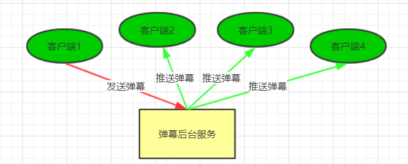
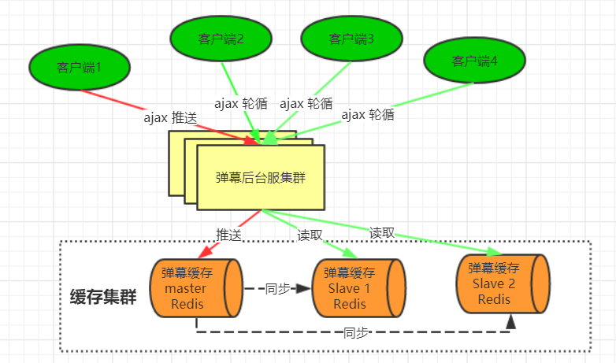
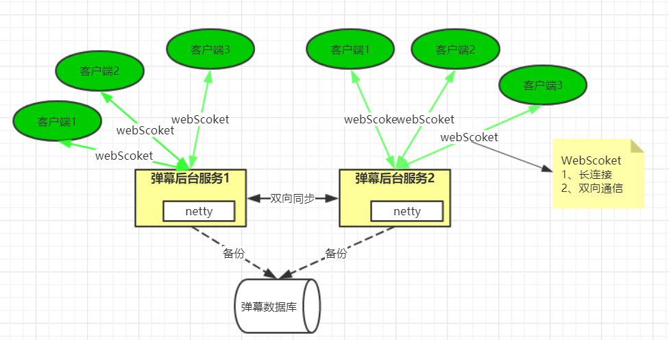
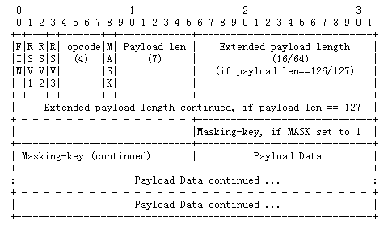
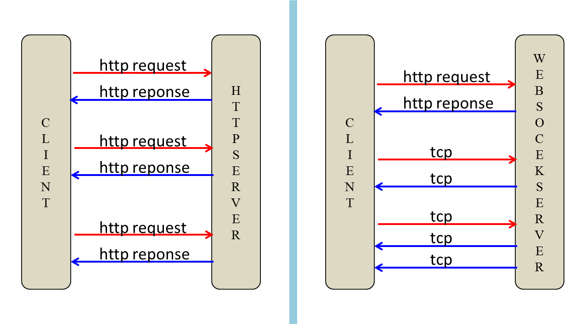
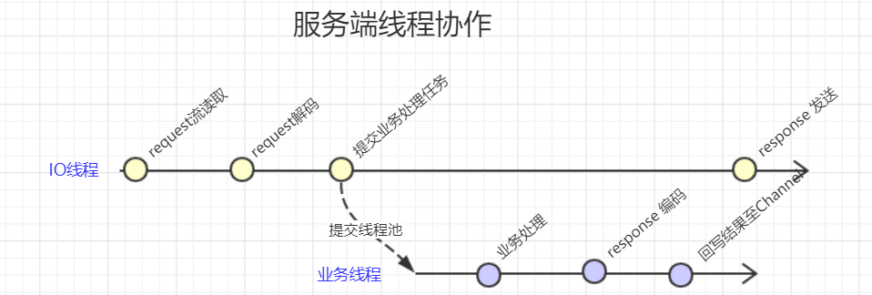
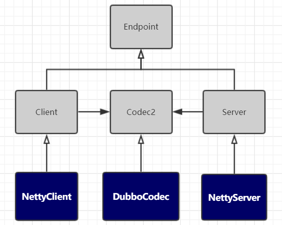
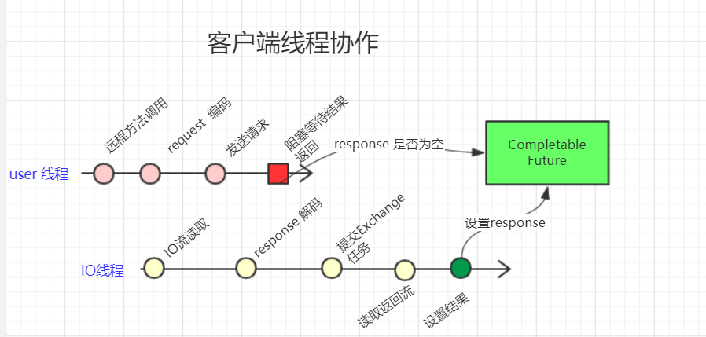

[TOC]

### Netty应用

Netty 可以做啥？

大型聊天室程序、游戏服务器、RPC 框架等...

#### 基于WebSocket与Netty的弹幕系统

#####  1. 什么是弹幕系统？

弹幕系统特点：

1. **实时性高**：你发我收， 毫秒之差
2. **并发量大**：一人吐槽，万人观看
3. 对数据**一至性要求并不高**

##### 2. 弹幕系统架构设计


业务架构：



​	

**实现方案一：**



HTTP 协议不好做，只能客户端去请求服务端。每个客户端采取一个定时任务去轮询，但是非常不好啊。

**实现方案二：**



##### 3. WebSocket协议简介

WebSocket 是 html5 开始提供的一种浏览器与服务器间进行**全双工二进制通信协议**，其基于 TCP **双向全双工作**进行消息传递，同一时刻即可以发又可以接收消息，相比 Http 的半双工协议性能有很大的提升。

**WebSocket 特点如下：**

1. 单一 TCP 长连接，采用**全双工**通信模式
2. 对代理、防火墙透明
3. **无头部信息**、消息更精简
4. 通过 **ping/pong** 来保活
5. 服务器可以主动推送消息给客户端，不在需要客户轮询

##### 2. WebSocket协议报文格式

任何应用协议都有其特有的报文格式，比如 Http 协议通过 空格 换行组成其报文。如 HTTP 协议（HTTP 是文本协议）不同在于 **WebSocket 属于二进制协议**，通过规范进二进位来组成其报文。具体组成如下图：



**报文说明：**

- FIN：标识是否为此消息的最后一个数据包，占 1 bit。
- RSV1, RSV2, RSV3: 用于扩展协议，一般为 0，各占1bit。
- Opcode：数据包类型（frame type），占 4bits。0x0：标识一个中间数据包。0x1：标识一个text类型数据包。0x2：标识一个binary类型数据包。0x3-7：保留。0x8：标识一个断开连接类型数据包。0x9：标识一个ping类型数据包。0xA：表示一个 pong 类型数据包。0xB-F：保留。
- MASK：占 1bits。用于标识 PayloadData 是否经过掩码处理。如果是 1，Masking-key 域的数据即是掩码密钥，用于解码 PayloadData。客户端发出的数据帧需要进行掩码处理，所以此位是 1。

- Payload length：Payload data 的长度，占 7bits，7+16bits，7+64bits：如果其值在0-125，则是payload的真实长度。如果值是126，则后面2个字节形成的16bits无符号整型数的值是payload的真实长度。注意，网络字节序，需要转换。如果值是127，则后面8个字节形成的64bits无符号整型数的值是payload的真实长度。注意，网络字节序，需要转换。
- Payload data：应用层数据

##### 3. WebSocket在浏览当中的使用

Http 连接与 WebSocket 连接建立示意图：



通过 javaScript 中的 API 可以直接操作 WebSocket 对象，其示例如下：

```js
var ws = new WebSocket(“ws://localhost:8080”); 
                       ws.onopen = function()// 建立成功之后触发的事件 { 
console.log(“打开连接”);   ws.send("ddd"); // 发送消息 
}; 
ws.onmessage = function(evt)  { // 接收服务器消息
    console.log(evt.data); 
}; 
ws.onclose   = function(evt)  { 
    console.log(“WebSocketClosed!”); // 关闭连接  };
    ws.onerror   = function(evt)  { 
        console.log(“WebSocketError!”); // 连接异常 
    }; 
```


#### Netty在Dubbo中应用分析

Dubbo 作用：远程调用、注册中心、负载均衡、容错、透明化 -> 协议实现：**Dubbo 协议**。

##### 1. 网络传输的实现组成



1. **IO模型：**
    - BIO 同步阻塞
    - **NIO 同步非阻塞**
    - AIO 异步非阻塞 
2. **连接模型：**
    - **长连接**
    - 短连接
3. **线程分类：**
    - IO 线程
    - 服务端业务线程
    - 客户端调度线程
    - 客户端结果 exchange 线程
    - 保活心跳线程
    - 重连线程
4. **线程池模型：**
    - 固定数量线程池
    - 缓存线程池
    - 有限线程池

##### 2. Dubbo传输UML类图



##### 3. Dubbo传输协作线程

1. **客户端调度线程**：用于发起远程方法调用的线程。
2. **客户端IO线程：**由传输框架实现，用于 request 消息流发送、response 消息流读取与解码等操作。
3. **服务端IO线程**：由传输框架实现，用于 request 消息流读取与解码 与 Response 发送。
4. **业务执行线程：**服务端具体执行业务方法的线程

**客户端线程协作流程：**



1. **调度线程**
  2. 调用远程方法
  3. 对request 进行协议编码
  4. 发送request 消息至IO线程
  5. 等待结果的获取
6. **IO线程**
  7. 读取response流
  8. response 解码
  9. 封返回结果
  10. 填充返回结果

**调用调试：**

设置超时任务:

>newFuture:98, DefaultFuture (org.apache.dubbo.remoting.exchange.support)
>request:116, HeaderExchangeChannel (org.apache.dubbo.remoting.exchange.support.header)
>request:84, HeaderExchangeClient (org.apache.dubbo.remoting.exchange.support.header)
>request:80, ReferenceCountExchangeClient (org.apache.dubbo.rpc.protocol.dubbo)
>doInvoke:97, DubboInvoker (org.apache.dubbo.rpc.protocol.dubbo)
>invoke:155, AbstractInvoker (org.apache.dubbo.rpc.protocol)
>invoke:52, AsyncToSyncInvoker (org.apache.dubbo.rpc.protocol)
>invoke:92, MonitorFilter (org.apache.dubbo.monitor.support)
>invoke:82, ProtocolFilterWrapper$1 (org.apache.dubbo.rpc.protocol)
>invoke:54, FutureFilter (org.apache.dubbo.rpc.protocol.dubbo.filter)
>invoke:82, ProtocolFilterWrapper$1 (org.apache.dubbo.rpc.protocol)
>invoke:14, ProviderHelloFilter (com.tuling.dubbo)
>invoke:82, ProtocolFilterWrapper$1 (org.apache.dubbo.rpc.protocol)
>invoke:60, ConsumerContextFilter (org.apache.dubbo.rpc.filter)
>invoke:82, ProtocolFilterWrapper$1 (org.apache.dubbo.rpc.protocol)
>invoke:157, ProtocolFilterWrapper$CallbackRegistrationInvoker (org.apache.dubbo.rpc.protocol)
>invoke:78, ListenerInvokerWrapper (org.apache.dubbo.rpc.listener)
>invoke:56, InvokerWrapper (org.apache.dubbo.rpc.protocol)
>doInvoke:82, FailoverClusterInvoker (org.apache.dubbo.rpc.cluster.support)
>invoke:248, AbstractClusterInvoker (org.apache.dubbo.rpc.cluster.support)
>invoke:78, MockClusterInvoker (org.apache.dubbo.rpc.cluster.support.wrapper)
>invoke:55, InvokerInvocationHandler (org.apache.dubbo.rpc.proxy)
>getUser:-1, proxy0 (org.apache.dubbo.common.bytecode)
>main:43, DubboClient (com.tuling.dubbo)

发起管道调用：

>writeAndFlush:1071, DefaultChannelPipeline (io.netty.channel)
>writeAndFlush:300, AbstractChannel (io.netty.channel)
>send:134, NettyChannel (org.apache.dubbo.remoting.transport.netty4)
>send:177, AbstractClient (org.apache.dubbo.remoting.transport)
>send:53, AbstractPeer (org.apache.dubbo.remoting.transport)
>request:118, HeaderExchangeChannel (org.apache.dubbo.remoting.exchange.support.header)
>request:84, HeaderExchangeClient (org.apache.dubbo.remoting.exchange.support.header)
>request:80, ReferenceCountExchangeClient (org.apache.dubbo.rpc.protocol.dubbo)
>doInvoke:97, DubboInvoker (org.apache.dubbo.rpc.protocol.dubbo)
>invoke:155, AbstractInvoker (org.apache.dubbo.rpc.protocol)
>invoke:52, AsyncToSyncInvoker (org.apache.dubbo.rpc.protocol)
>invoke:92, MonitorFilter (org.apache.dubbo.monitor.support)
>invoke:82, ProtocolFilterWrapper$1 (org.apache.dubbo.rpc.protocol)
>invoke:54, FutureFilter (org.apache.dubbo.rpc.protocol.dubbo.filter)
>invoke:82, ProtocolFilterWrapper$1 (org.apache.dubbo.rpc.protocol)
>invoke:14, ProviderHelloFilter (com.tuling.dubbo)
>invoke:82, ProtocolFilterWrapper$1 (org.apache.dubbo.rpc.protocol)
>invoke:60, ConsumerContextFilter (org.apache.dubbo.rpc.filter)
>invoke:82, ProtocolFilterWrapper$1 (org.apache.dubbo.rpc.protocol)
>invoke:157, ProtocolFilterWrapper$CallbackRegistrationInvoker (org.apache.dubbo.rpc.protocol)
>invoke:78, ListenerInvokerWrapper (org.apache.dubbo.rpc.listener)
>invoke:56, InvokerWrapper (org.apache.dubbo.rpc.protocol)
>doInvoke:82, FailoverClusterInvoker (org.apache.dubbo.rpc.cluster.support)
>invoke:248, AbstractClusterInvoker (org.apache.dubbo.rpc.cluster.support)
>invoke:78, MockClusterInvoker (org.apache.dubbo.rpc.cluster.support.wrapper)
>invoke:55, InvokerInvocationHandler (org.apache.dubbo.rpc.proxy)
>getUser:-1, proxy0 (org.apache.dubbo.common.bytecode)
>main:43, DubboClient (com.tuling.dubbo)

**服务端线程协作：**


1. **IO线程：**
  2. request 流读取
  3. request 解码
  4. 提交业务处理任务
5. **业务线程：**
  6. 业务方法执行
  7. response 编码
  8. 回写结果至channel


#### Netty实现HTTP服务器

也就是使用 HTTP 相关的编解码器和处理的 Handler 进行处理。

```java
import io.netty.bootstrap.ServerBootstrap;
import io.netty.buffer.Unpooled;
import io.netty.channel.*;
import io.netty.channel.nio.NioEventLoopGroup;
import io.netty.channel.socket.ServerSocketChannel;
import io.netty.channel.socket.nio.NioServerSocketChannel;
import io.netty.channel.socket.nio.NioSocketChannel;
import io.netty.handler.codec.http.*;
import io.netty.handler.codec.http.multipart.HttpPostRequestDecoder;
import io.netty.handler.codec.http.multipart.InterfaceHttpData;
import io.netty.handler.codec.http.websocketx.TextWebSocketFrame;
import io.netty.handler.codec.http.websocketx.WebSocketServerProtocolHandler;
import io.netty.handler.stream.ChunkedNioFile;
import io.netty.handler.stream.ChunkedWriteHandler;
import io.netty.util.concurrent.Future;
import io.netty.util.concurrent.GenericFutureListener;

import java.io.File;
import java.io.RandomAccessFile;
import java.net.ContentHandler;
import java.util.List;
import java.util.concurrent.ThreadFactory;

/**
 * HTTPServer
 * @author cz
 */
public class HttpSimpleServer {


    public void openServer() {
        ServerBootstrap bootstrap = new ServerBootstrap();
        bootstrap.channel(NioServerSocketChannel.class);
        EventLoopGroup boss = new NioEventLoopGroup(1);
        EventLoopGroup work = new NioEventLoopGroup(8);
        bootstrap.childHandler(new ChannelInitializer<NioSocketChannel>() {
            @Override
            protected void initChannel(NioSocketChannel ch) throws Exception {
                ch.pipeline().addLast("http-decoder", new HttpRequestDecoder());
                ch.pipeline().addLast("http-aggregator", new HttpObjectAggregator(65536));
                ch.pipeline().addLast("http-encoder", new HttpResponseEncoder());
                ch.pipeline().addLast("http-chunked",new ChunkedWriteHandler());
                ch.pipeline().addLast("http-server", new HttpServerHandler());

                // 封装了编码和解码操作
                ch.pipeline().addLast("WebSocket-protocol", new WebSocketServerProtocolHandler("/ws"));
                // 处理业务
                ch.pipeline().addLast("WebSocket-handler", new WebSocketServerHandler());
            }
        });
        bootstrap.group(boss, work);
        try {
            ChannelFuture future = bootstrap.bind(8080).sync();
            System.out.println("服务启动：8080");
            future.channel().closeFuture().sync();
        } catch (InterruptedException e) {
            e.printStackTrace();
        } finally {
            boss.shutdownGracefully();
            work.shutdownGracefully();
        }
    }

    /**
     * 处理HTTP的Handler
     */
    private static class HttpServerHandler extends SimpleChannelInboundHandler<FullHttpRequest> {

        @Override
        protected void channelRead0(ChannelHandlerContext ctx, FullHttpRequest msg) throws Exception {
            if ("/ws".equalsIgnoreCase(msg.uri())) {
                ctx.fireChannelRead(msg.retain());
                return;
            }
            File f = new File("E:\\git\\tuling-teach-netty\\src\\main\\resources\\HelloWord.html");
            RandomAccessFile file = new RandomAccessFile(f, "r");//4
            DefaultHttpResponse response = new DefaultHttpResponse(HttpVersion.HTTP_1_1, HttpResponseStatus.OK);
            response.headers().set(HttpHeaderNames.CONTENT_TYPE, "text/html; charset=UTF-8");
            response.headers().set(HttpHeaderNames.CONTENT_LENGTH, file.length());
            //            response.headers().set(HttpHeaderNames.CONNECTION, HttpHeaderNames.KEEP_ALIVE);
            ctx.write(response);
            ctx.write(new ChunkedNioFile(file.getChannel()));
            ChannelFuture future = ctx.writeAndFlush(LastHttpContent.EMPTY_LAST_CONTENT);
            future.addListener(ChannelFutureListener.CLOSE);
            file.close();
        }
    }

    /**
     * 业务Handler
     */
    private static class WebSocketServerHandler extends SimpleChannelInboundHandler<TextWebSocketFrame> {
        @Override
        protected void channelRead0(ChannelHandlerContext ctx, TextWebSocketFrame msg) throws Exception {
            System.out.println("接收数据:"+msg.text());
            ctx.writeAndFlush(new TextWebSocketFrame("hello word"));
        }
    }


    public static void main(String[] args) {
        HttpSimpleServer simpleServer = new HttpSimpleServer();
        simpleServer.openServer();
    }
}
```

