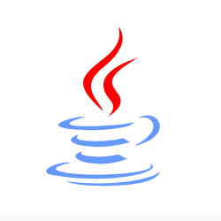
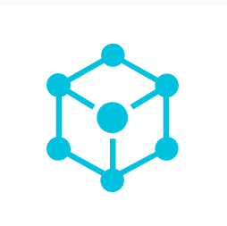

    
    
    
    

|  |  |  |  |  |  |  |  |  |  |
| :----------------------------------------------------------: | :----------------------------------------------------------: | :----------------------------------------------------------: | :----------------------------------------------------------: | :----------------------------------------------------------: | :----------------------------------------------------------: | :----------------------------------------------------------: | :----------------------------------------------------------: | :----------------------------------------------------------: | :----------------------------------------------------------: |
|                            JavaSE                            |                           设计模式                           |                             算法                             |                             网络                             |                           操作系统                           |                            数据库                            |                            Spring                            |                            分布式                            |                            大数据                            |                           一键三连                           |

### 备注

- 推荐使用 **Typora** 进行阅读，本项目文件均由 **Typora** 编辑器整理，因为大部分 GitHub 在线阅读无法显示高亮的地方。Typora 需要进行打开设置**高亮的功能**。如下图。

### 项目参考列表

注：本项目为自己学习过程的记录以及从各个大佬的项目及帖子整理的笔记。

**参考项目列表**

- https://github.com/CyC2018/CS-Notes

**参考书目**
- 《深入理解Java虚拟机》 周志明
- 《计算机网络第七版》 谢希仁
- 《Java Core》 凯S.霍斯特曼
- BruceEckel. Java 编程思想: 第 4 版 [M]. 机械工业出版社, 2007.

 