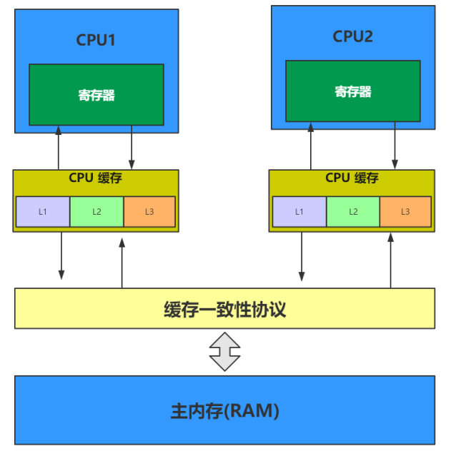

[TOC]

### JMM与Volatile专题

多个 CPU 与主内存之间的关系如下图所示。

一个现代 CPU 除了处理器核心之外还包括寄存器、L1、L2、L3 缓存这些存储设备、浮点运算单元、整数运算单元等一些辅助运算设备以及内部总线等。

一个计算机还包含一个主存。所有的 CPU 都可以访问主存。主存通常比 CPU 中的缓存大得多。

**CPU** 的计算速度非常快，一般是 **GHz 级别**。而内存条的频率大概才 100MHz 的读写速度，读写速度**跟不上** CPU 的计算频率，所以需要在 CPU 与主内存中设置缓存（现在一般有多级缓存）。

CPU 缓存即**高速缓冲存储器**，是位于 CPU 与主内存间的一种容量较小但**速度很高的存储器**。由于 CPU 的速度远高于主内存，CPU 直接从内存中存取数据要等待一定时间周期，Cache 中保存着 CPU 刚用过或循环使用的一部分数据，当 CPU 再次使用该部分数据时可从 Cache 中直接调用, 减少 CPU 的等待时间，提高了系统的效率。  

速度比较：**寄存器 > L1 > L2 > L3 > 内存条**。

#### 多线程环境下存在的问题  

##### 1. **缓存一致性问题**

在多处理器系统中，每个处理器都有自己的**高速缓存**，而它们又**共享同一主内存**（Main Memory）。基于高速缓存的存储交互很好地解决了**处理器与内存的速度矛盾**，但是也引入了新的问题：**缓存一致性**（CacheCoherence）。

当多个处理器的运算任务都涉及同一块主内存区域时，将**可能导致各自的缓存数据不一致**的情况，如果真的发生这种情况，那同步回到主内存时以谁的缓存数据为准呢？为了**解决一致性的问题**，需要各个处理器**访问缓存时都遵循一些协议**，在读写时要根据协议来进行操作，这类协议有**MSI**、**MESI**（IllinoisProtocol）、MOSI、Synapse、Firefly 及 DragonProtocol，等等。如下图所示。

MESI 其实是对应**四种状态**。M（修改 Modify）、E（独享、互斥 Exclusive）、S（共享 Share）、I（无效 Invalid）。

##### 2. 指令重排序问题

为了使得处理器内部的运算单元能尽量被充分利用，处理器可能会**对输入代码进行乱序执行**（Out-Of-Order Execution）优化，处理器会在计算之后将乱序执行的结果重组，保证该**结果与顺序执行的结果是一致**的，但并不保证程序中各个语句计算的先后顺序与输入代码中的顺序一致。

因此，如果存在一个计算任务**依赖**另一个计算任务的中间结果，那么其顺序性并不能靠代码的先后顺序来保证。与处理器的乱序执行优化类似，Java 虚拟机的**即时编译器**中也有类似的**指令重排序（Instruction Reorder）优化**。

