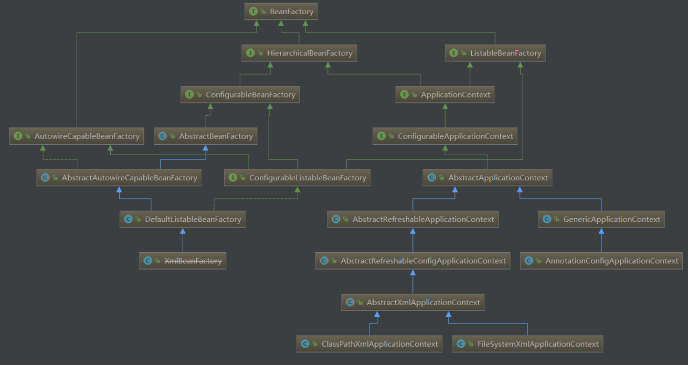

[TOC]

### IOC

BeanFactory：懒加载。

ApplicationContext：非懒加载（可指定为懒加载）




如何理解 IOC？

先理解依赖倒置。什么是依赖倒置原则？假设我们设计一辆汽车：先设计轮子，然后根据轮子大小设计底盘，接着根据底盘设计车身，最后根据车身设计好整个汽车。这里就出现了一个“依赖”关系：汽车依赖车身，车身依赖底盘，底盘依赖轮子 。但是 万一轮胎尺寸改了,那么底盘需要改，底盘改了，车身也改了，让后整个汽车构造都改了。然后汽车公司倒闭了。

IOC 的思想**最核心**的地方在于，资源不由使用资源的双方管理，而由不使用资源的第三方管理，这可以带来很多好处。第
一，资源集中管理，实现资源的可配置和易管理。第二，降低了使用资源双方的依赖程度，也就是我们说的耦合度。

IOC 容器是不使用资源的。资源使用者是其他的客户。


#### 获取bean

基于 xml 的形式定义 Bean 的信息。

```xml
<?xml version="1.0" encoding="UTF-8"?>
<beans xmlns="http://www.springframework.org/schema/beans"
       xmlns:xsi="http://www.w3.org/2001/XMLSchema-instance"
       xsi:schemaLocation="http://www.springframework.org/schema/beans http://www.springframework.org/schema/beans/sp
<beans>
	<!--定义一个Bean的信息-->
	<bean id="car" class="com.tuling.compent.Car"></bean>
</beans>
```

去容器中读取 Bean  

```java
public static void main(String[] args) {
    ClassPathXmlApplicationContext ctx = new ClassPathXmlApplicationContext("beans.xml");
    System.out.println(ctx.getBean("person"));
}
```

基于**读取配置类**的形式定义 Bean 信息  

```java
@Configuration
public class MainConfig {
    @Bean
    public Person person(){
        return new Person();
    }
}
```

注意: 通过 @Bean 的形式使用的话， bean 的默认名称是**方法名**，若 @Bean(value="bean的名称") ，那么 bean 的名称是指定的去容器中读取 Bean 的信息（传入配置类）。

```java
public static void main(String[] args) {
    AnnotationConfigApplicationContext ctx = new AnnotationConfigApplicationContext(MainConfig.class);
    System.out.println(ctx.getBean("person"));
}
```

也可以配置时指定 bean 的名称。

```java
@Configuration
public class MainConfig {
    // 指定Bean名称为myPerson而不是默认的方法名
    @Bean(name = "myPerson")
    public Person person(){
        return new Person();
    }
}
```

#### Scope


