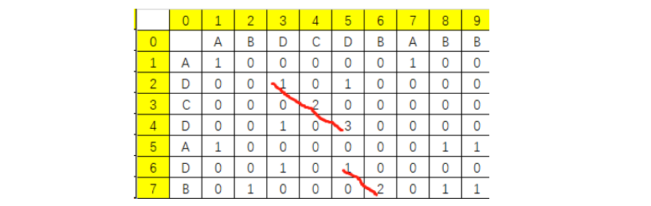

[TOC]

### 递归与动态规划经典题目

#### 1 矩阵最小的路径和

题目描述：给定一个 N * M 的矩阵 arr，从左上角开始每次只能向下或者向右走，最后到达右下角。路径上所有点的数字和为路径和，求最小的路径和。

因为每次只能向下和向右，所以第一行只能从左一直往右走，而第一列只能从上一直往下走，并且将经过的点累加起来。某个位置是由其上方的位置和左边的位置决定的。

典型的动态规划。状态方程为： dp\[i][j] = min( dp\[i - 1][j] ,dp\[i][j - 1] ) + arr\[i][i] 。dp\[i][j] 表示 达到点 arr\[i][j] 是的最小路径和，因为每次只能向下或者向右，所以要达到 arr\[i][j] 必须先经过 arr\[i - 1][j - 1] 或者 arr\[i][j - 1] 其中一个点，找出路径最小的即可。

```java
public static int minSumPath(int[][] array) {
    // Base case
    if (array == null || array.length == 0 || array[0] == null
            || array[0].length == 0) {
        return 0;
    }
    int row = array.length;
    int col = array[0].length;
    // 以原数组的大小初始化动态数组
    int[][] dp = new int[row][col];
    // 初始化第一个元素
    dp[0][0] = array[0][0];
    // 分别初始化第一行和第一列
    for (int i = 1; i < row; i++) {
        dp[i][0] = dp[i - 1][0] + array[i][0];
    }
    for (int i = 1; i < col; i++) {
        dp[0][i] = dp[0][i - 1] + array[0][i];
    }
    // 进行持续计算
    for (int i = 1; i < row; i++) {
        for (int j = 0; j < col; j++) {
            // 动态规划数组
            dp[i][j] = Math.min(dp[i - 1][j], dp[j - 1][i]) + array[i][j];
        }
    }
    return dp[row - 1][col - 1];
}
```


#### 2 机器人到达指定位置方法数

N个位置，1~N, N大于等于2，开始时机器人在其中的 M 位置，它可以向左或者右走。如果到了位置 1，下一步只能是位置 2；如果到了位置 N, 下一步只能是位置 N - 1 。机器人走 K 步，最终来到位置 P 的总方法一共有多少种？

##### ① 暴力递归方式

通过**尝试**的方式找到解决方法！

```java
// N : 位置为1 ~ N，固定参数
// cur : 当前在cur位置，可变参数
// rest : 还剩res步没有走，可变参数
// P : 最终目标位置是P，固定参数
// 该函数的含义：只能在1~N这些位置上移动，
// 当前在cur位置，走完rest步之后，停在P位置的方法数作为返回值返回
public static int walk(int N, int cur, int rest, int P) {
    // 如果没有剩余步数了，当前的cur位置就是最后的位置
    // 如果最后的位置停在P上，那么之前做的移动是有效的
    // 如果最后的位置没在P上，那么之前做的移动是无效的
    if (rest == 0) {
        return cur == P ? 1 : 0;
    }
    // 如果还有rest步要走，而当前的cur位置在1位置上，那么当前这步只能从1走向2
    // 后续的过程就是，来到2位置上，还剩rest-1步要走
    if (cur == 1) {
        return walk(N, 2, rest - 1, P);
    }
    // 如果还有rest步要走，而当前的cur位置在N位置上，那么当前这步只能从N走向N-1
    // 后续的过程就是，来到N-1位置上，还剩rest-1步要走
    if (cur == N) {
        return walk(N, N - 1, rest - 1, P);
    }
    // 如果还有rest步要走，而当前的cur位置在中间位置上，那么当前这步可以走向左，也可以走向右
    // 走向左之后，后续的过程就是，来到cur-1位置上，还剩rest-1步要走
    // 走向右之后，后续的过程就是，来到cur+1位置上，还剩rest-1步要走
    // 走向左、走向右是截然不同的方法，所以总方法数要都算上
    return walk(N, cur + 1, rest - 1, P) + walk(N, cur - 1, rest - 1, P);
}
```

暴力递归下时间复杂度，高度为 k 的二叉树的搜索过程。


上述机器人走路的过程其实可以映射成一颗二叉树的遍历，其中存在大量的重复过程。比如 f(5, 5) 表示当前在 5 还剩 5 步，它后面的数量与之前的状态无关。

 

##### ② 缓存数组方式

以下使用**缓存数组**来减少重复过程的计算（**没有计算**的状态拿一个**特殊值**表示）。--- 记忆化搜索

```java
public static int walkWays2(int N, int E, int S, int K) {
	// 初始化一个二维数组来记录已经走过的状态
    int[][] dp = new int[K + 1][N + 1];
    // 将数组全部初始化为 -1 说明是还没有算过的
	for (int i = 0; i <= K; i++) {
		for (int j = 0; j <= N; j++) {
			dp[i][j] = -1;
		}
	}
    // 这次带上状态记录数组
	return f2(N, E, K, S, dp);
}
```

```java
public static int f2(int N, int E, int rest, int cur, int[][] dp) {
    // 说明缓存记录中已经有了记录 直接查询返回
    if (dp[rest][cur] != -1) {
        return dp[rest][cur];
    }
    // 缓存记录没命中
    if (rest == 0) {
        // 返回之前记录状态信息到数组中
        dp[rest][cur] = cur == E ? 1 : 0;
        return dp[rest][cur];
    }
    // rest > 0 有路可以走
    if (cur == 1) { // 1 -> 2
        dp[rest][cur] = f1(N, E, rest - 1, 2);
    } else if (cur == N) {
        dp[rest][cur] = f1(N, E, rest - 1, N - 1);
    } else {
        dp[rest][cur] = f1(N, E, rest - 1, cur - 1) + f1(N, E, rest - 1, cur + 1);
    }
    return dp[rest][cur];
}

```


##### ③ 严格表结构法

通过分析表的结构来找答案。

```java
public static int ways3(int N, int M, int K, int P) {
    // 参数无效直接返回0
    if (N < 2 || K < 1 || M < 1 || M > N || P < 1 || P > N) {
        return 0;
    }
    int[] dp = new int[N + 1];
    dp[P] = 1;
    for (int i = 1; i <= K; i++) {
        int leftUp = dp[1];// 左上角的值
        for (int j = 1; j <= N; j++) {
            // 直接根据三种情况的依赖关系进行填表
            int tmp = dp[j];
            if (j == 1) {
                dp[j] = dp[j + 1];
            } else if (j == N) {
                dp[j] = leftUp;
            } else {
                dp[j] = leftUp + dp[j + 1];
            }
            leftUp = tmp;
        }
    }
    return dp[M];
}
```


#### 3 换钱的最少张数

给定数组 arr, arr 中所有的值都为正数且不重复。每个值代表一中面值的货币，每种面值的货币可以使用**任意张**，再给定一个整数 aim 代表要找的钱数，求组成 aim 的最少货币数。

**思路**

如果 arr 的长度为 N, 则生成一个行数为 N , 列数为 aim + 1 的动态规划表 dp\[N][aim + 1], dp\[i][j] 的含义为: 在可以任意使用 arr[0...i] 货币的情况下，组成 j 所需的最小张数。

设: arr = [5, 2, 3, 1] aim = 5

1.dp\[0..N - 1][0] 的值表示找钱数为 0 时需要的最少张数，所以全设为 0。（矩阵的第一列）

```
　　　　　0 0 0 0 0 0

　　dp=　0 0 0 0 0 0

　　　　　0 0 0 0 0 0

　　　　　0 0 0 0 0 0　
```


2. dp\[0][0...aim] 的值表示只能使用 arr[0] 货币也就是 5 的情况下，找 0 , 1, 2, 3, 4, 5 的钱的情况下。其中无法找开的一律设为 32 位的最大值，记为 **max**.

　　　　　　0  max  max  max  max  1  

　　dp =　   0   

　　　　　    0

　　　　　　0

 　3. 剩下的位置依次**从左到右**，再**从上到下**计算。假设计算到 (i,j) 位置，dp\[i][j] 的值**可能**来自下面的情况:

- **完全不使用**当前货币 arr[i] 情况系的最少张数，即 **dp\[i-1][j] + 0** 的值；
- 只**使用一张**当前货币 arr[i] 的情况下的最少张数，即**dp\[i - 1][j - arr[i]] + 1**  其中 j - arr[i] 的值为使用了一张arr[i] 后，还需要凑多少钱。 i - 1 是指使用 arr[i] 之前的钱来兑换；
- 只使用**两张**当前货币 arr[i] 的情况下的最少张数，即 **dp\[i - 1][j - 2 * arr[i]] + 2**；
- 只使用**三张**当前货币 arr[i] 的情况下的最少张数，即 **dp\[i - 1][j - 3 * arr[i]] + 3**；
- ........

==**所有情况中，取最小的纸张数**==。所以:

dp\[i][j] = min{dp\[i - 1][j],  dp\[i - 1][j - k * arr[i]]} + k  ==>

dp\[i][j] = min{dp\[i - 1][j], min{dp\[i - 1][j - x * arr[i]] + x (x >= 1)}}  ==>

设 x - 1 = y  >= 0  ==> x = y + 1代入得

dp\[i][j] = min{dp\[i - 1][j], min{dp\[i - 1][j - arr[i] - y * arr[i] + y + 1 (y >= 0)}}

又因为m in{dp\[i - 1][j - arr[i] - y * arr[i] + y (y >= 0)] =>

dp\[i][j - arr[i]] 因为其中 dp\[i - 1][j - y * arr[i] + y] = dp\[i][j] 

 最终有:dp\[i][j] = min{dp\[i - 1][j], dp\[i][j - arr[i] + 1]} 如果 j - arr[i] < 0,即发生越界。

说明 arr[i] 太大了，用一张都会超出钱数j，所以令 dp\[i][j] = dp\[i - 1][j] 即可。

　　　　

```
		0   max  max  max  max   1  

dp =　  0   max   1　 max　2　　1

		0　　max　 1　 1　　2　  1

		0　　1　　　1　 1　　2　　1
```


```java
package chapter_4.solution3;

public class Solution {

    public static void main(String[] args) {
        int[] arr = {5,2,3,1};
        int aim = 5;
        System.out.println(minConins1(arr, aim));
    }

    public static int minCoins1(int[] arr, int aim){
        if(arr == null || arr.length == 0 || aim < 0){
            return -1;
        }
        int[][] dp = new int[arr.length][aim+1];
        int max = Integer.MAX_VALUE;
        // 设置第一行
        for(int j = 1; j <= aim; j++){
            dp[0][j] = max;
            if(j - arr[0] >= 0 && dp[0][j - arr[0]] != max ){
                dp[0][j] = dp[0][j - arr[0]] + 1;
            }
        }
        int left = 0;
        for(int i=1; i < arr.length; i++){
            for(int j=1; j <=aim; j++){
				left = max;
                if(j-arr[i] >=0 && dp[i][j-arr[i]] != max){
                    left = dp[i][j-arr[i]] + 1;
                }
                dp[i][j] = Math.min(left, dp[i-1][j]);
            }
        }
        return dp[arr.length-1][aim] != max ? dp[arr.length-1][aim] : -1;
    }
}
```


#### 4 换钱的方法数

给定数组 arr，arr 中所有的值都为整数且不重复。每个值代表一种面值的货币，每种面值的货币可以使用任意张，再给定一个整数 aim 代表要换的钱数，求换钱有多少种方法。

举例：
arr = [5, 10, 25, 1]， aim = 0
组成0元的方法有1种，就是所有面值的货币都不用。所以返回1。
arr = [5, 10, 25, 1] , aim = 15
组成15元的方法有6种，分别为3张5元、1张10元+1张5元、1张10元+5张1元、10张1元+1张5元、2张5元+5元一张和15元一张。所以返回6。
arr = [3, 5] , aim = 2
任何方法都无法组成2元。所以返回0。

##### ① 暴力递归法

这道题可以体现暴力递归、记忆搜索和动态规划之间的关系，并且还可以在动态规划的基础上再进行一次优化。
暴力递归的方法。如果 arr = [5, 10, 25, 1] , aim = 1000， 分析过程如下：

1. 用 0 张 5 元的货币，让 [10, 25, 1] 组成剩下的 1000， 最终方法数记为 res1。
2. 用 1 张 5 元的货币，让 [10, 25, 1] 组成剩下的 995， 最终方法数记为 res2。
3. 用 2 张 5 元的货币，让 [10, 25, 1] 组成剩下的 990，最终方法数记为 res3。
………
4. 用 200 张 5 元的货币，让 [10, 25, 1] 组成剩下的 0，最终方法数记为 res201。

那么 **res1 + res2 + … + res201** 的值就是总的方法数。根据如上的分析过程定义递归函数 process(arr, index, aim)，它的含义是如何用 arr[index…N - 1] 这些面值的钱组成 aim，返回**总**的方法数。

```java
// 换钱的方法数
public static int coins1(int[] arr, int aim){
    // 方法一：暴力递归，时间复杂度最差为O（aim^N）
    if(arr == null || arr.length == 0 || aim < 0){
        return 0;
    }
    return process1(arr, 0, aim);
}

private static int process1(int[] arr, int index, int aim) {
    // 方法数为0
    int res = 0;
    // 说明index到了钱币面值数组的末尾
    if(index == arr.length){ // 因递归中有index + 1,所以最大为arr.length
        // aim=0,只有一种方法，就是所有面值都不用 如果剩余的钱 aim 刚好为0，则认为找到一种方法
        res = aim == 0 ? 1 : 0;
    } else {
        for(int i = 0; arr[index] * i <= aim; i++){
            res += process1(arr, index + 1, aim - arr[index] * i);
            // 对于arr[5,10,25,1],aim=1000
            // 用0张5，让[5,10,25,1]组成剩下的1000，方法res1
            // 用1张5，让[5,10,25,1]组成剩下的995，方法res2
            // 用200张5，让[5,10,25,1]组成剩下的0，方法res201
            // res  =res1 + .... + res201
        }
    }
    return res;
}
```

上述的暴力递归存在大量的重复计算，可能造成栈溢出。当已经使用 0 张 5 元 + 1张 10 元的情况下，后续应该求[25, 1] 组成剩下的 990 的方法总数。当已经使用 2 张 5 元 + 0 张 10 元的情况下，后续还是求 [25, 1] 组成剩下的990 的方法总数。两种情况下都需要求 process(arr, 2, 990)。类似这样的**重复计算**在暴力递归的过程中大量产生，所以暴力递归方法的时间复杂度非常高，并且与 arr 中钱的面值有关，最差的情况下为 O(aim^N)。

##### ② 缓存数组法

进行一些优化处理，process(arr, index, aim) 中 arr 始终**不变**的，**变化的**只有 **index** 和 **aim**，所以可以用p(index, aim) 表示一个递归的过程。重复计算是因为没一个递归过程都没记下来，所以下次还要重复去求，所以可以事先准备好一个 **map**，**每计算完一个递归过程，都将结果记录到 map 中**。当下次进行同样的递归过程之前，先在 map 中查询这个递归过程是否已经计算过，如果已经计算过，就把值拿出来直接用，如果没有计算过，需要再进入递归过程。具体看下面的代码中的 coins2 方法，它和 coins1 方法的区别就是准备好**全局变量 map**，记录已经计算过的递归过程的结果，防止下次重复计算。因为本题的递归过程可由两个变量表示，所以map 是一张二维表。map\[i][j] 表示递归过程 p(i,j) 的返回值。另外还有一些特别值，map\[i][j] 表示递归过程 p(i,j) 从来没有计算过。map\[i][j] == -1表示递归过程 p(i,j) 计算过，但返回值是 0。如果 map\[i][j] 的值既不等于 0，也不等于 -1，记为 a，则表示递归过程 p(i, j) 的**返回值为 a**。

```java
// 获得换钱的方法数目(记忆搜索方法O(N*aim^2))
public static int getCoinNum02(int[] arr, int aim) {
    if (arr == null || arr.length == 0 || aim <= 0) {
        return 0;
    }
    // 用于记录的memo map
    int[][] map = new int[arr.length + 1][aim + 1];
    return process02(arr, 0, aim, map);

}
// 使用记录数组的记忆化搜索
public static int process02(int[] arr, int index, int aim, int[][] map) {
    
    int res = 0;
    if (index == arr.length) {
        res = aim == 0 ? 1 : 0;
    } else {
        int mapValue = 0;
        for (int i = 0; arr[index] * i <= aim; i++) {
            
            // 对比记录已经计算过的值
            mapValue = map[index + 1][aim - arr[index] * i];
            if (mapValue != 0) {
                // 找到已经计算的结果
                res += mapValue == -1 ? 0 : mapValue;
            } else {
                res += process02(arr, index + 1, aim - arr[index] * i, map);
            }
        }
    }
    // 更新记录map的值
    map[index][aim] = res == 0 ? -1 : res;
    return res;
}
```

分析递归函数的状态可以由哪些变量表示，做出相应**维度**和大小的 map 即可。记忆化搜索方法的时间复杂度为**O(N * aim ^ 2)**。


##### ③ 动态规划法

```java
    //方法二：动态规划，非最优，时间复杂度为O（N×aim）
    public static int coins2(int[] arr, int aim) {
        if (arr == null || arr.length == 0 || aim < 0) {
            return 0;
        }
        int[][] dp = new int[arr.length][aim + 1];
        // dp[i][j]表示使用arr[0...i]组成j的方法数
        for (int i = 0; i < arr.length; i++) {
            dp[i][0] = 1;// 矩阵第一列，组成0的方法：1种
        }
        for (int j = 0; arr[0] * j <= aim; j++) {
            dp[0][arr[0] * j] = 1;//矩阵第一行，arr[0]组成arr[0]*j的方法：1种
        }
        // 求一般位置的dp[i][j],由两者叠加
        for (int i = 1; i < arr.length; i++) {
            for (int j = 1; j <= aim; j++) {
                dp[i][j] = dp[i - 1][j];// 不用arr[i]组成j
                dp[i][j] += j - arr[i] >= 0 ? dp[i][j - arr[i]] : 0;// 先用一张arr[i],剩下arr[0...i]组成j-arr[i]
            }
        }
        return dp[arr.length - 1][aim];// arr[0...N]组成aim的方法数
    }
```

还可以结合空间压缩写出更 NB 的动态规划。


#### 5 最长递增子序列

给定一个长度为N的数组，找出一个最长的单调自增子序列（不一定连续，但是顺序不能乱）。例如：给定一个长度为6的数组A{5， 6， 7， 1， 2， 8}，则其最长的单调递增子序列为{5，6，7，8}，长度为4.

① 先获取最长递增子序列的 dp 数组，d**p[i] 表示以 nums[i] 这个数结尾的最长递增子序列的长度**。
其值默认为 1，及当前位置的数是 num[0 - i] 中最大的数。dp[i] 为 dp[0...i - 1] 中最大的值 + 1。

② 根据获取的 dp 数字**反求**最长递增子序列。找到 dp 数组中最大的值 max 和位置，从右往左依次遍历，如果某个位置的 **dp[i] == max - 1 且 num[i] < num[max]**。则这个数可以定义为**倒数第二大**的数，依次类推。

注意：时间复杂度是 O(N^2)。因为求 dp 数组是 O(N^2)。可以使用一种二分查找的方式来将 dp 数组的生成复杂度降低到 O(NlogN)，也即整体的复杂度。

```java
// 生成dp数组
public int[] getDp(int[] array) {

    int[] dp = new int[array.length];
    for (int i = 0; i < dp.length; i++) {
        // 默认为1
        dp[i] = 1;
        // 当前的dp值跟之前的全部比他小的值得dp+1进行对比，选择最大的
        for (int j = 0; j < i; j++) {
            if (array[i] > array[j]) {
                dp[i] = Math.max(dp[i], dp[j] + 1);
            }
        }
    }
    return dp;
}

/**
 * 根据dp数组和原数组找最长递增子序列
 */
public int[] generateLIS(int[] array, int[] dp) {
    // 最大递增序列长度
    int length = 0;
    // 最大dp值的索引，同时也是最长递增子序列的结尾值
    int index = 0;
    // 首先寻找上述两个值
    for (int i = 0; i < dp.length; i++) {
        if (dp[i] > length) {
            length = dp[i];
            index = i;
        }
    }
    int[] lis = new int[length];
    // 先把最后一个值填上
    lis[--length]  = array[index];
    for (int i = index; i >= 0; i--) {
        // 同时满足这两个条件才是前一个符合条件的数
        if (array[i] < array[index] && dp[index] == dp[i] + 1) {
            lis[--length] = array[i];
            index = i;
        }
    }
    return lis;
}
```


#### 6 最大公共子串

求两个字符串的最长公共子串。

再次辨析下两者的关系：

**最长公共子序列 VS 最长公共子串：**

**找两个字符串的最长公共子串，这个子串要求在原字符串中是连续的。而最长公共子序列则并不要求连续。**

其实最长公共子串的算法求解思想与最长公共子序列的思路基本类似。

DP 数组表示必须把 str1[i] 和 str2[j] 当做公共子串的最后一个字符的情况下最长公共子串的长度。

可以初始化第一行和第一列。相等为 1，不相等为 0。普通位置如果 str1[i] 和 str2[j] 两字符相同，则 dp\[i][j] 的值为左上角的值 + 1。



```java
// 获取DP数组 DP数组表示必须把str1[i] str2[j]当做公共子串的最后一个字符的情况下最长公共子串的长度
public int[][] getDp(String string1, String string2) {

    char[] str1 = string1.toCharArray();
    char[] str2 = string2.toCharArray();

    // dp数组中的元素默认全部为0不用管
    int[][] dp = new int[str1.length][str2.length];
    // 根据base case初始化第一行
    for (int i = 0; i < str1.length; i++) {
        if (str1[i] == str2[0]) {
            dp[i][0] = 1;
        }
    }
    // 根据base case初始化第一列
    for (int i = 0; i < str2.length; i++) {
        if (str2[i] == str1[0]) {
            dp[0][i] = 1;
        }
    }
    // 从位置1开始，如果字符相等则最长的子串长度 + 1
    for (int i = 1; i < str1.length; i++) {
        for (int j = 1; j < str2.length; j++) {
            if (str1[i] == str2[j]) {
                dp[i][j] = dp[i - 1][j - 1] + 1;
            }
        }
    }
    return dp;
}
```

获取到 dp  数组之后，找到其中的最大值，然后倒推回去就找到最大公共子串了。


#### 7 最小编辑代价

给定两个字符串 str1 和 str2，再给定三个整数 ic，dc，rc，分别代表插入、删除、替换一个字符的代价，返回将str1 编辑成 str2 的最小代价。
举例：
str1="abc"   str2="adc"  ic=5    dc=3   rc=2，从"abc"编辑到"adc"把b替换成d代价最小，为2；
str1="abc"   str2="adc"  ic=5    dc=3   rc=10，从"abc"编辑到"adc"，先删除b再插入d代价最小，为8；

经典动态规划方法，利用二维数组 dp \[][] 保存动态规划表；
假设 str1 长度为 M[0.....M - 1]，str2 长度为 N[0.......N - 1]，dp 大小为 (M + 1) * (N + 1)；

dp\[i][j] 表示 str1[0......i - 1]编辑成 str2[0......j - 1]的最小编辑代价，dp 大小为(M + 1) * (N + 1)是为了从空串开始计算，即 dp\[0][0] 表示空串编辑到空串的最小编辑代价。


**如何生成 dp\[][]:**

1.dp\[0][0] 表示空串编辑成空串，故 dp\[0][0] = 0;

2.求第一行 dp\[0][j]，空串编辑成 str2[0....j - 1]，则 dp\[0][j] = ic * j;

3.求第一列 dp\[i][0]，str1[0......i - 1]编辑成空串，则dp\[i][0] = dc * i;

4.求dp\[i][j]，即 str1[0....i - 1]编辑成str2[0.....j - 1]，四种可能的途径：

- str1[0....i - 1] 先编辑成 str2[0.....j - 2]，再由 str2[0.....j - 2] 到 str2[0.....j - 1]，即 dp\[i][j - 1] + ic;

- str1[0....i - 1] 先编辑成 str1[0.....i - 2]，再由 str1[0.....i - 2]到 str2[0.....j - 1]，即 dc + dp\[i - 1][j];

- 如果 str1[i - 1] == str2[j - 1],则 dp\[i][j] = dp\[i - 1][j - 1];
- 如果 str1[i - 1] != str2[j - 1],则 dp\[i][j] = dp\[i - 1][j - 1] + rc;   

选择上面四个中**最小的值**作为 dp\[i][j]，时间复杂度 O(MN)，空间复杂度 O(MN)。最小编辑距离为 dp\[M][N]。

```java
public int findMinCost(String str1, String str2, int ic, int dc, int rc) {
    if (str1 == null || str2 == null) {
        return 0;
    }
    char[] chs1 = str1.toCharArray();
    char[] chs2 = str2.toCharArray();
    // dp数组长宽为字符串长度+1，因为需要考虑空串的情况
    int row = chs1.length + 1;
    int col = chs2.length + 1;
    int[][] dp = new int[row][col];
    // 初始化第一行和第一列
    for (int i = 1; i < row; i++) {
        dp[i][0] = dc + i;
    }
    for (int j = 1; j < col; j++) {
        dp[0][j] = ic * j;
    }
    // 四种普通情况取最小的
    for (int i = 1; i < row; i++) {
        for (int j = 1; j < col; j++) {
            if (chs1[i - 1] == chs2[j - 1]) {
                dp[i][j] = dp[i - 1][j - 1];
            } else {
                dp[i][j] = dp[i - 1][j - 1] + rc;
            }
            dp[i][j] = Math.min(dp[i][j], dp[i][j - 1] + ic);
            dp[i][j] = Math.min(dp[i][j], dp[i - 1][j] + dc);
        }
    }
    return dp[row - 1][col - 1];
}
```


#### 8 排成一条线的纸牌博弈问题

有一个整型数组 A，代表数值不同的纸牌排成一条线。玩家 a 和玩家 b 依次拿走每张纸牌，规定玩家 a 先拿，玩家 b 后拿，但是每个玩家每次只能拿走最左或最右的纸牌，玩家 a 和玩家 b 都绝顶聪明，他们总会采用最优策略。请返回最后获胜者的分数。
给定纸牌序列  A 及序列的大小 n，请返回最后分数较高者得分数(相同则返回任意一个分数)。保证 A 中的元素均小于等于 1000。且 A 的大小小于等于300。
测试样例：
[1, 2, 100, 4], 4
返回：101

##### ① 暴力递归法

定义递归函数 **f(i, j)** ,表示如果 arr[i...j] 这个排列上的纸牌被绝顶聪明的人**先拿**，最终能够获得什么分数。
定义递归函数 **s(i,j)** ,表示如果 a[i..j] 这个排列上的纸牌被绝顶聪明的人**后拿**，最终能获得什么分数。
首先来分析 **f(i, j)**，具体过程如下：
1.如果 i == j (只有一张纸牌)，会被先拿纸牌的人拿走，所以返回 arr[i];
2.如果 i != j,先拿纸牌的人有**两种**选择，要么拿走 arr[i], 要么拿走 arr[j];
如果拿走 arr[i], 剩下 arr[i + 1, j]。对于 arr[i + 1, j] 的纸牌，当前玩家成了**后拿**的人，因此他后续能获得的分数为s(i + 1, j)。如果拿走 arr[j], 那么剩下 arr[i, j - 1],当前玩家后续能获得的分数为 s[i, j - 1],作为绝顶聪明的人，必然会在两种决策中选择**最优**的。所以返回 **max{arr[i] + s[i + 1, j], arr[j] + s\[i][j - 1]}**
然后来分析 **s(i, j)**:
1.如果 i == j, 后拿纸牌的人什么也拿不到，返回 0。
2.如果 i != j, 玩家的对手会先拿纸牌。对手要么先拿走 arr[i], 要么先拿走 arr[j], 如果对手拿走 arr[i], 那么排列剩下arr[i + 1, j], 如果对手拿走 arr[j], 剩下arr[i, j - 1]。对手也是绝顶聪明的人，所以也会把**最差**的情况留给玩家因此返回 **min{f(i + 1, j), f(i, j - 1)}**。

```java
// 暴力递归法
public int cardGame(int[] arr, int n) {
    if (arr == null || n == 0) {
        return 0;
    }
    return Math.max(f(arr, 0, n - 1), s(arr, 0, n - 1)); // write code here
}

// 先手拿取最大
public int f(int[] arr, int start, int end) {
    if (start == end) {
        return arr[start];
    }
    return Math.max(arr[start] + s(arr, start + 1, end), arr[end] + s(arr, start, end - 1));
}

// 后手拿取最小
public int s(int[] arr, int start, int end) {
    if (start == end) {
        return arr[start];
    }
    return Math.min(f(arr, start + 1, end), f(arr, start, end - 1));
}
```


##### ② 动态规划法

第一个玩家每次会保证自己是本次和另一个玩家取完最大值后再取剩下的的和最大 f\[i][j] 就记录最大值即

```java
Math.max(arr[j] + s[i][j - 1], arr[i] + s[i + 1][j]);
```

对于另一个玩家来说，会取第一个玩家取完剩下的较大的数，对于第一个玩家来说就是没取数之前较小的即

```java
Math.min(f[i + 1][j], f[i][j - 1]);
```

需要借助**两个** dp 数组。

```java
// 动态规划法
public int cardGameDp(int[] arr, int n) {
    if (arr == null || arr.length == 0) {
        return 0;
    }
    // 需要两个dp数组
    int[][] f = new int[n][n];
    int[][] s = new int[n][n];
    for (int j = 0; j < arr.length; j++) {
        f[j][j] = arr[j];
        for (int i = j - 1; i >= 0; i--) {
            // f[i][j]表示在arr[i...j]区间内当前玩家最大的累加和
            f[i][j] = Math.max(arr[j] + s[i][j - 1], arr[i] + s[i + 1][j]);
            // s[i][j]表示在arr[i..j]区间内的最小累加和
            s[i][j] = Math.min(f[i + 1][j], f[i][j - 1]);
        }
    }
    return Math.max(f[0][n - 1], s[0][n - 1]);
}
```

