[TOC]

## 设计模式

### 一、面向对象思想

#### 面向对象思想的三大特性

- **封装：确保对象中的数据安全**
- **继承：保证了对象的可扩展性**
- **多态：保证了程序的灵活性**

​                                                    --- **阿里巴巴**

##### 1. 封装

利用抽象数据类型将数据和基于数据的操作封装在一起，使其构成一个不可分割的**独立实体**。数据被保护在抽象数据类型的内部，尽可能地**隐藏内部的细节**，只保留一些对外接口使之与外部发生联系。用户无需知道对象内部的细节，但可以通过对象对外提供的接口来访问该对象。

优点：

- 减少耦合：可以独立地开发、测试、优化、使用、理解和修改
- 减轻维护的负担：可以更容易被程序员理解，并且在调试的时候可以不影响其他模块
- 有效地调节性能：可以通过剖析确定哪些模块影响了系统的性能
- 提高软件的可重用性
- 降低了构建大型系统的风险：即使整个系统不可用，但是这些独立的模块却有可能是可用的

以下 Person 类封装 name、gender、age 等属性，外界只能通过 **get**() 方法获取一个 Person 对象的 name 属性和 gender 属性，而无法获取 age 属性，但是 age 属性可以供 work() 方法使用。

注意到 gender 属性使用 int 数据类型进行存储，封装使得用户注意不到这种实现细节。并且在需要修改 gender 属性使用的数据类型时，也可以在不影响客户端代码的情况下进行。

```java
public class Person {

    private String name;
    private int gender;
    private int age;

    public String getName() {
        return name;
    }

    public String getGender() {
        return gender == 0 ? "man" : "woman";
    }

    public void work() {
        if (18 <= age && age <= 50) {
            System.out.println(name + " is working very hard!");
        } else {
            System.out.println(name + " can't work any more!");
        }
    }
}
```

##### 2. 继承

继承实现了  **IS-A**  关系，例如 Cat 和 Animal 就是一种 **IS-A** 关系，因此 Cat 可以继承自 Animal，从而获得 Animal **非 private** 的属性和方法。

继承应该遵循里氏替换原则，**子类对象必须能够替换掉所有父类对象。**

Cat 可以当做 Animal 来使用，也就是说可以使用 Animal 引用 Cat 对象。父类引用指向子类对象称为  **向上转型** 。

```java
Animal animal = new Cat();
```

##### 3. 多态

多态分为**编译时多态**和**运行时多态**：

- **编译**时多态主要指方法的**重载**
- **运行**时多态指程序中定义的对象引用所指向的**具体类型**（动态类型）在运行期间才确定

运行时多态有**三个条件**：

- **继承**
- **覆盖**（重写）
- **向上转型**

下面的代码中，乐器类（Instrument）有两个子类：Wind 和 Percussion，它们都覆盖了父类的 play() 方法，并且在 main() 方法中使用父类 Instrument 来引用 Wind 和 Percussion 对象。在 Instrument 引用调用 play() 方法时，会执行实际引用对象所在类的 play() 方法，而不是 Instrument 类的方法。

```java
public class Instrument {

    public void play() {
        System.out.println("Instument is playing...");
    }
}

public class Wind extends Instrument {

    public void play() {
        System.out.println("Wind is playing...");
    }
}

public class Percussion extends Instrument {

    public void play() {
        System.out.println("Percussion is playing...");
    }
}

public class Music {

    public static void main(String[] args) {
        List<Instrument> instruments = new ArrayList<>();
        instruments.add(new Wind());
        instruments.add(new Percussion());
        for(Instrument instrument : instruments) {
            instrument.play();
        }
    }
}
```


#### 设计原则

##### 1. S.O.L.I.D

| 简写 |                全拼                 |     中文翻译     |
| :--: | :---------------------------------: | :--------------: |
| SRP  | The Single Responsibility Principle | **单一责任**原则 |
| OCP  |      The Open Closed Principle      |   **开闭**原则   |
| LSP  |  The Liskov Substitution Principle  | **里氏替换**原则 |
| ISP  | The Interface Segregation Principle | **接口分离**原则 |
| DIP  | The Dependency Inversion Principle  | **依赖倒置**原则 |

###### ① 单一责任原则

> 一个类只负责一件事。

换句话说就是让修改一个类的原因应该只有一个，当这个类需要做**过多事情**的时候，就需要**分解这个类**。

如果一个类承担的职责过多，就等于把这些职责耦合在了一起，一个职责的变化可能会削弱这个类完成其它职责的能力。

###### ② 开闭原则

> 类应该对扩展开放，对修改关闭。

扩展就是添加新功能的意思，因此该原则要求在**添加新功能时不需要修改代码**。

符合开闭原则最典型的设计模式是**装饰者模式**，它可以动态地将责任附加到对象上，而不用去修改类的代码。

###### 3. 里氏替换原则

> 子类对象必须能够替换掉所有父类对象。

继承是一种 **IS-A** 关系，**子类需要能够当成父类来使用，并且需要比父类更特殊**。

如果不满足这个原则，那么各个子类的行为上就会有很大差异，增加继承体系的复杂度。

###### 4. 接口分离原则

> 不应该强迫客户依赖于它们不用的方法。

因此使用**多个专门的接口比使用单一的总接口**要好。

###### 5. 依赖倒置原则

> 高层模块不应该依赖于低层模块，二者都应该依赖于抽象；抽象不应该依赖于细节，细节应该依赖于抽象。

高层模块包含一个应用程序中重要的策略选择和业务模块，如果高层模块依赖于低层模块，那么低层模块的改动就会直接影响到高层模块，从而迫使高层模块也需要改动。

依赖于抽象意味着：

- **任何变量**都**不应该**持有一个**指向具体类的指针**或者引用；
- 任何类都不应该从具体类派生；
- 任何方法都不应该覆写它的任何基类中的已经实现的方法。

##### 2. 其他常见原则

除了上述的经典原则，在实际开发中还有下面这些常见的设计原则。

| 简写 |               全拼                |     中文翻译     |
| :--: | :-------------------------------: | :--------------: |
| LOD  |        The Law of Demeter         |  **迪米特**法则  |
| CRP  |   The Composite Reuse Principle   | **合成复用**原则 |
| CCP  |   The Common Closure Principle    | **共同封闭**原则 |
| SAP  | The Stable Abstractions Principle | **稳定抽象**原则 |
| SDP  | The Stable Dependencies Principle | **稳定依赖**原则 |

###### 1. 迪米特法则

迪米特法则又叫作**最少知识原则**（Least Knowledge Principle，简写 LKP），就是说一个对象应当对其他对象有**尽可能少的了解**，不和陌生人说话。

###### 2. 合成复用原则

尽量使用**对象组合**，而不是通过继承来达到复用的目的。

###### 3. 共同封闭原则

一起修改的类，应该组合在一起（同一个包里）。如果必须修改应用程序里的代码，我们希望所有的修改都发生在一个包里（修改关闭），而不是遍布在很多包里。

###### 4. 稳定抽象原则

最稳定的包应该是最抽象的包，不稳定的包应该是具体的包，即包的抽象程度跟它的稳定性成正比。

###### 5. 稳定依赖原则

包之间的依赖关系都应该是稳定方向依赖的，包要依赖的包要比自己更具有稳定性。


### 二、UML类图

UML 类图是一种**结构图**，用于描述一个系统的**静态结构**。

类图以反映类结构和类之间**关系**为目的，用以描述软件系统的结构，是一种**静态建模方法**。类图中的类，与面向对象语言中的类的概念是对应的。

#### 类结构

在类的 UML 图中，使用**长方形**描述一个**类的主要构成**，长方形垂直地分为**三层**，以此放置类的**名称、属性和方法**。


其中

- 一般类的**类名**用正常字体粗体表示，如上图。抽象类名用斜体字粗体，如 *User*；接口则需在上方加上`<<interface>>`。

- 属性和方法都需要标注**可见性符号**，含义如下。

  | 符号 |   含义    |
  | :--: | :-------: |
  |  +   |  public   |
  |  #   | protected |
  |  -   |  private  |

- 另外，还可以用冒号`:`表明属性的类型和方法的**返回类型**，如`+$name:string`、`+getName():string`。类型说明**并非必须**。


#### 类关系

类与类之间的关系主要有六种：**继承、实现、组合、聚合、关联和依赖**，这六种关系的箭头表示如下。


接着我们来了解类关系的具体内容。六种类关系中，**组合、聚合、关联**这三种类关系的代码结构一样，都是**用==属性==来保存另一个==类的引用==**，所以要通过内容间的关系来区别。

##### ① 继承

继承关系也称**泛化关系**（Generalization），用于描述**==父类与子类==**之间的关系。父类又称作**基类**，子类又称作**派生类**。

继承关系中，子类继承父类的**所有功能**，父类所具有的属性、方法，子类应该都有。子类中除了与父类一致的信息以外，还包括额外的信息。

例如：公交车、出租车和小轿车都是汽车，他们都有名称，并且都能在路上行驶。

##### ② 实现

实现关系（Implementation），主要用来规定==**接口和实现类**==的关系。

接口（包括抽象类）是方法的集合，在实现关系中，类实现了接口，类中的方法实现了接口声明的所有方法。

例如：汽车和轮船都是交通工具，而交通工具只是一个可移动工具的抽象概念，船和车实现了具体移动的功能。

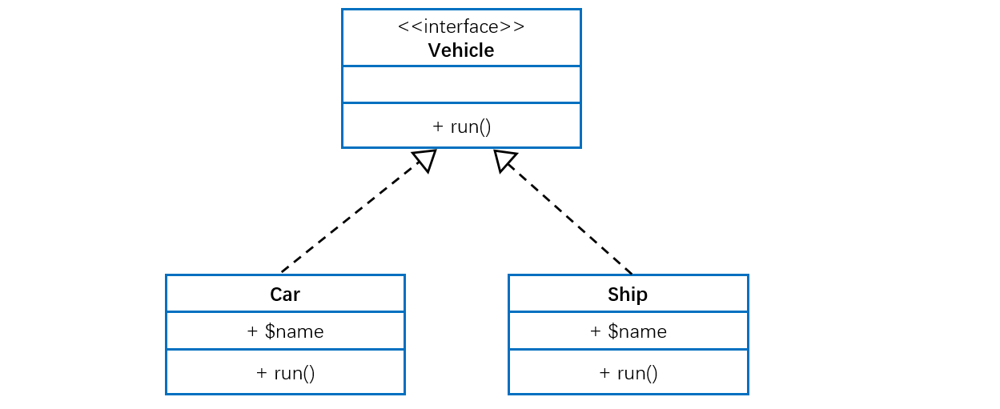

##### ③ 组合

组合关系（Composition）：**整体与部分的关系**，但是整体与部分**不可以分开**。

组合关系表示类之间**整体与部分**的关系，整体和部分有**一致的生存期**。一旦整体对象不存在，部分对象也将不存在，是**同生共死**的关系。

例如：人由头部和身体组成，两者不可分割，共同存在。


##### ④ 聚合

聚合关系（Aggregation）：**整体和部分**的关系，整体与部分**可以分开**。

聚合关系也表示类之间**整体与部分**的关系，成员对象是整体对象的**一部分**，但是成员对象**可以脱离整体对象独立存在**。

例如：公交车司机和工衣、工帽是整体与部分的关系，但是可以分开，工衣、工帽可以穿在别的司机身上，公交司机也可以穿别的工衣、工帽。

##### ⑤ 关联

关联关系（Association）：表示一个==**类的属性保存了对另一个类的一个实例**==（或多个实例）的**引用**。

关联关系是类与类之间**最常用**的一种关系，表示一类对象与另一类对象之间有联系。组合、聚合也属于关联关系，只是关联关系的类间关系比其他两种**要弱**。

关联关系有四种：双向关联、单向关联、自关联、多重数关联。

例如：汽车和司机，一辆汽车对应特定的司机，一个司机也可以开多辆车。

在 UML 图中，**双向的关联可以有两个箭头**或者没有箭头，单向的关联或自关联**有一个箭头**。

在多重性关系中，可以直接在关联直线上增加**一个数字**，表示与之对应的另一个类的对象的个数。

- `1..1`：仅一个
- `0..*`：零个或多个
- `1..*`：一个或多个
- `0..1`：没有或只有一个
- `m..n`：最少m、最多n个 (m<=n)

##### ⑥ 依赖

依赖关系（Dependence）：假设 A 类的**变化引起**了 B 类的变化，则说名 **B 类依赖于 A 类**。

大多数情况下，依赖关系体现在==**某个类的方法使用另一个类的对象作为参数**==。

依赖关系是一种**“使用”关系**，特定事物的改变有可能会影响到使用该事物的其他事物，在需要表示一个事物使用另一个事物时使用依赖关系。

例如：汽车依赖汽油，如果没有汽油，汽车将无法行驶。


#### 总结

这六种类关系中，组合、聚合和关联的代码结构一样，可以从关系的强弱来理解，各类关系从强到弱依次是：继承→实现→组合→聚合→关联→依赖。如下是完整的一张 UML 关系图。

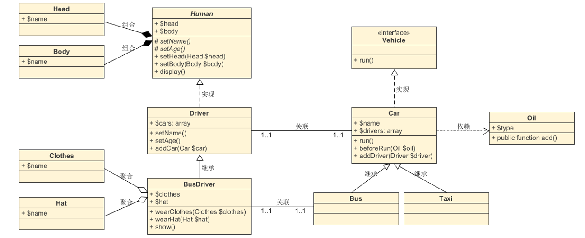


### 三、设计模式-创建型

#### 单例模式（Singleton）

##### 1. 概述

确保**一个类==只有一个实例==**，并提供该实例的**全局访问点**。

使用一个**私有构造函数**、一个**私有静态变量**以及一个**公有静态函数**来实现。

私有构造函数保证了不能通过构造函数来创建对象实例，只能通过公有静态函数返回**唯一的私有静态变量**。

##### 2. 使用场景

-  **数据库连接池**的设计一般也是采用单例模式，因为数据库连接是一种数据库资源。

-  应用程序的**日志应用**，一般都可用单例模式实现，这一般是由于共享的日志文件一直处于打开状态，因为只能有一个实例去操作，否则内容不好追加。
-  **应用配置类**
-  Windows 的 Task Manager（**任务管理器**）就是很典型的单例模式
-  资源共享的情况下，避免由于资源操作时导致的性能问题或损耗等。如上述中的**日志文件**，应用配置。
-  控制资源的情况下，方便资源之间的互相通信。如**线程池**等。

##### 3. 类图


##### 4. 实现

单例模式有好几种**实现方式**，如下。

###### ① 懒汉式1-线程不安全

以下实现中，私有静态变量 uniqueInstance 被**延迟实例化**，这样做的好处是，如果没有用到该类，那么就不会实例化 uniqueInstance，从而节约资源。

这个实现在**多线程环境下是不安全**的，如果多个线程能够同时进入 `if (uniqueInstance == null)` ，并且此时 uniqueInstance 为 null，那么会有==**多个线程**==执行 `uniqueInstance = new Singleton();` 语句，这将导致实例化多次 uniqueInstance。

```java
public class Singleton {
	
    // 私有静态变量 唯一实例
    private static Singleton uniqueInstance;

    private Singleton() {
    }

    public static Singleton getUniqueInstance() {
        // 这里在多线程下不安全，如果多个判断为null就初始化多个实例
        if (uniqueInstance == null) {
            uniqueInstance = new Singleton();
        }
        return uniqueInstance;
    }
}
```

###### ② 懒汉式2-线程安全

只需要对 getUniqueInstance() 方法**加锁**，那么在一个时间点只能有**一个线程**能够进入该方法，从而避免了实例化多次 uniqueInstance。

但是当一个线程进入该方法之后，其它试图进入该方法的线程都必须**等待**，**即使** uniqueInstance 已经被**实例化**了。这会让线程阻塞时间过长，因此该方法有性能问题，**不推荐使用**。

```java
// 对整个方法加锁
public static synchronized Singleton getUniqueInstance() {
    if (uniqueInstance == null) {
        uniqueInstance = new Singleton();
    }
    return uniqueInstance;
}
```

###### ③ 饿汉式-线程安全

线程不安全问题主要是由于 uniqueInstance 被**实例化多次**，采取**直接实例化** uniqueInstance 的方式就不会产生线程不安全问题。

但是**直接实例化**的方式也丢失了**延迟实例化**带来的**节约资源**的好处。

```java
// 自己直接实例化
private static Singleton uniqueInstance = new Singleton();
```

###### ④ ==双重校验锁-线程安全※==

uniqueInstance 只需要被实例化一次，之后就可以直接使用了。加锁操作只需要对实例化那部分的代码进行，只有当 uniqueInstance **没有被实例化时**，才需要进行**加锁**。

**双重校验锁**先判断 uniqueInstance 是否已经被实例化，如果没有被实例化，那么才对实例化语句进行加锁。

```java
public class Singleton {
	// 如果不加volatile关键字的话，可能会引发空指针异常
    private volatile static Singleton uniqueInstance;

    private Singleton() {
    }
	
    // 双重校验锁
    public static Singleton getUniqueInstance() {
        if (uniqueInstance == null) {
            // 仅仅在初始化的时候才加锁
            synchronized (Singleton.class) {
                // 再加一层判断
                if (uniqueInstance == null) {
                    uniqueInstance = new Singleton();
                }
            }
        }
        return uniqueInstance;
    }
}
```

考虑下面的实现，也就是只使用了一个 if 语句。在 uniqueInstance == null 的情况下，如果两个线程都执行了 if 语句，那么两个线程都会进入 if 语句块内。虽然在 if 语句块内有加锁操作，但是两个线程都会执行 `uniqueInstance = new Singleton();` 这条语句，只是**先后**的问题，那么就会进行**两次实例化**。因此必须使用双重校验锁，也就是需要使用==**两个 if 语句**==。

uniqueInstance 采用 ==**volatile**== 关键字修饰也是**很有必要**的（否则可能出现**空指针**异常）。

因为 `uniqueInstance = new Singleton();` 这段代码其实是分为三步执行：

1. 为 uniqueInstance 分配**内存**空间
2. **初始化** uniqueInstance
3. 将 uniqueInstance **指向**分配的内存地址

但是由于 JVM 具有**指令重排**的特性，执行顺序有可能变成 1 > 3 > 2。指令重排在单线程环境下不会出现问题，但是在多线程环境下会导致一个线程获得还没有初始化的实例。例如，线程 T<sub>1</sub> 执行了 1 和 3，此时 T<sub>2</sub> 调用 getUniqueInstance() 后发现 uniqueInstance 不为空，因此返回 uniqueInstance，但此时 uniqueInstance 还未被初始化。

**使用 volatile 可以==禁止== JVM 的指令重排**，保证在多线程环境下也能正常运行。

###### ⑤ ==静态内部类实现 Holder 方式==

当 Singleton 类加载时，静态内部类 SingletonHolder **没有**被加载进内存。只有当调用 `getUniqueInstance()` 方法从而触发 `SingletonHolder.INSTANCE` 时 SingletonHolder 才**会被加载** ，此时初始化 INSTANCE 实例，并且 **JVM** 能确保 INSTANCE **只被实例化一次**。

这种方式**不仅具有延迟初始化**的好处，而且由 JVM 提供了对线程安全的支持。目前**使用比较多**的方法。

```java
public class Singleton {

    private Singleton() {
    }

    // 使用静态内部类 可安全的延迟加载
    private static class SingletonHolder {
        private static final Singleton INSTANCE = new Singleton();
    }

    // 调用时才触发静态内部类加载生成单例实例
    public static Singleton getUniqueInstance() {
        return SingletonHolder.INSTANCE;
    }
}
```

###### ⑥ ==枚举实现==

```java
public enum Singleton {

    INSTANCE;

    private String objName;

    public String getObjName() {
        return objName;
    }

    public void setObjName(String objName) {
        this.objName = objName;
    }

    public static void main(String[] args) {
        // 单例测试
        Singleton firstSingleton = Singleton.INSTANCE;
        firstSingleton.setObjName("firstName");
        System.out.println(firstSingleton.getObjName());
        Singleton secondSingleton = Singleton.INSTANCE;
        secondSingleton.setObjName("secondName");
        System.out.println(firstSingleton.getObjName());
        System.out.println(secondSingleton.getObjName());

        // 反射获取实例测试
        try {
            Singleton[] enumConstants = Singleton.class.getEnumConstants();
            for (Singleton enumConstant : enumConstants) {
                System.out.println(enumConstant.getObjName());
            }
        } catch (Exception e) {
            e.printStackTrace();
        }
    }
}
```

```html
firstName
secondName
secondName
secondName
```

该实现在多次序列化再进行反序列化之后，不会得到多个实例。而其它实现需要使用 **transient** 修饰所有字段，并且实现序列化和反序列化的方法。

该实现可以==**防止反射攻击**==。在其它实现中，通过 **setAccessible**() 方法可以将**私有**构造函数的访问级别设置为 **public**，然后调用构造函数从而实例化对象，如果要防止这种攻击，需要在构造函数中添加防止多次实例化的代码。该实现是**由 JVM 保证**只会实例化一次，因此**不会出现上述的反射攻击。**


#### 简单工厂模式（Simple Factory）

##### 1. 概述

在**创建一个对象**时不向客户暴露内部细节，并提供一个**创建对象的==通用接口==**。

简单工厂把实例化的操作单独放到一个类中，这个类就成为**简单工厂类**，让**简单工厂类**来决定应该实例化哪个**具体子类**。**创建对象的任务交给简单工厂**。

这样做能把**客户类**和具体**子类**的实现解耦，客户类不再需要知道有哪些子类以及应当实例化哪个子类。客户类往往有**多个**，如果不使用简单工厂，那么所有的客户类都要知道所有子类的细节。而且一旦子类发生改变，例如增加子类，那么所有的客户类都要进行修改。

##### 2. 类图


##### 3. 实现

```java
// 产品接口
public interface Product {
}
```

Product 的三种实现

```java
public class ConcreteProduct implements Product {
}
```

```java
public class ConcreteProduct1 implements Product {
}
```

```java
public class ConcreteProduct2 implements Product {
}
```

以下的 Client 类包含了实例化的代码，这是一种**错误**的实现。如果在客户类中存在这种实例化代码，就需要**考虑将代码放到简单工厂**中。

**不好的实现**​ :sweat:

```java
public class Client {
    
    public static void main(String[] args) {
        int type = 1;
        // 自己定义产生Product对象
        Product product;
        if (type == 1) {
            product = new ConcreteProduct1();
        } else if (type == 2) {
            product = new ConcreteProduct2();
        } else {
            product = new ConcreteProduct();
        }
        // do something with the product
    }
}
```

以下的 SimpleFactory 是简单工厂实现，它被所有需要进行实例化的**客户类**调用。

```java
// 简单工厂类
public class SimpleFactory {
    /**
     * 根据类型获取对象 统一使用其接口来表示
     * 
     * @param type 类型
     * @return 产品对象
     */
    public Product createProduct(int type) {
        if (type == 1) {
            return new ConcreteProduct1();
        } else if (type == 2) {
            return new ConcreteProduct2();
        }
        return new ConcreteProduct1();
    }
}
```

```java
// 客户类
public class Client {

    public static void main(String[] args) {
        // 构造简单工厂
        SimpleFactory simpleFactory = new SimpleFactory();
        // 往工厂传入产品类型得到产品对象
        Product product = simpleFactory.createProduct(1);	
        // do something with the product
    }
}
```


#### 工厂方法模式（Factory Method）

##### 1. 概述

定义了一个**创建对象的接口**，但由**子类**决定要**实例化哪个类**。**工厂方法把==实例化操作推迟到子类==**。工厂方法模式是对简单工厂模式进一步的**解耦**，因为在工厂方法模式中是**一个子类对应一个工厂类**，而这些**工厂类都实现于一个抽象接口**。这相当于是把原本会因为业务代码而庞大的简单工厂类，拆分成了**==一个个的工厂类==**，这样代码就不会都耦合在同一个类里了。

在简单工厂中，创建对象的是**另一个类**，而在工厂方法中，是由==**子类来创建对象**==。

下图中，Factory 有一个 **doSomething**() 方法，这个方法需要用到一个**产品对象**，这个产品对象由 factoryMethod() 方法创建。该方法是**抽象**的，需要由**子类去实现**。


组成（下面代码）：

- **抽象工厂**（Factory）：提供了创建产品的接口，调用者通过它访问具体工厂的工厂方法 **newProduct**() 来创建产品。
- **工厂方法**（factoryMethod）：主要是实现抽象工厂中的抽象方法，完成具体产品的创建。
- **具体工厂**（三个 ConcreteFactory）：具体用于产生产品的小工厂。
- **抽象产品角色**（Product 接口）：定义产品。
- **具体产品角色**（Product 接口的实现类）：实现了抽象产品角色所定义的接口，由具体工厂来创建，它同具体工厂之间一一对应。

##### **3. 使用场景**

###### Logback 中的工厂方法模式

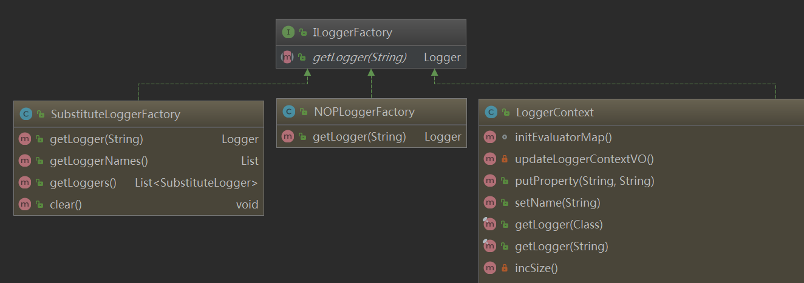

**可以看出**，抽象工厂角色为 `ILoggerFactory` 接口，工厂方法为 `getLogger`，具体工厂角色为 `LoggerContext`、`NOPLoggerFactory`、`SubstituteLoggerFactory` 等，抽象产品角色为 `Logger`。

###### JDK中应用

- [java.util.Calendar](http://docs.oracle.com/javase/8/docs/api/java/util/Calendar.html#getInstance--)
- [java.util.ResourceBundle](http://docs.oracle.com/javase/8/docs/api/java/util/ResourceBundle.html#getBundle-java.lang.String-)
- [java.text.NumberFormat](http://docs.oracle.com/javase/8/docs/api/java/text/NumberFormat.html#getInstance--)
- [java.nio.charset.Charset](http://docs.oracle.com/javase/8/docs/api/java/nio/charset/Charset.html#forName-java.lang.String-)
- [java.net.URLStreamHandlerFactory](http://docs.oracle.com/javase/8/docs/api/java/net/URLStreamHandlerFactory.html#createURLStreamHandler-java.lang.String-)
- [java.util.EnumSet](https://docs.oracle.com/javase/8/docs/api/java/util/EnumSet.html#of-E-)
- [javax.xml.bind.JAXBContext](https://docs.oracle.com/javase/8/docs/api/javax/xml/bind/JAXBContext.html#createMarshaller--)

##### 3. 实现

```java
// 抽象工厂类
public abstract class Factory {
    // 工厂方法
    abstract public Product newProduct();

    public void doSomething() {
        // 使用小工厂自己的对象产生方法
        Product product = newProduct();
        // do something with the product
    }
}
```

之后下面有好几个==**小工厂**==，负责产生具体的对象，而**不是**简单工厂模式那样把全部都**综合在一个类**中。这些小工厂覆写了抽象工厂的工厂方法，用于产生实际的对象。

```java
// 具体工厂
public class ConcreteFactory extends Factory {
    @Override
    public Product newProduct() {
        return new ConcreteProduct();
    }
}
```

```java
// 具体工厂1
public class ConcreteFactory1 extends Factory {
    @Override
    public Product newProduct() {
        return new ConcreteProduct1();
    }
}
```

```java
// 具体工厂2
public class ConcreteFactory2 extends Factory {
    @Override
    public Product newProduct() {
        return new ConcreteProduct2();
    }
}
```

工厂方法把简单工厂的内部逻辑判断转移到了客户端代码来进行。

你想要**加功能**，本来是改工厂类的，而现在是**修改客户端**。而且各个不同功能的实例对象的创建代码，也没有耦合在同一个工厂类里，这也是工厂方法模式对**简单工厂模式解耦**的一个体现。工厂方法模式克服了简单工厂会违背开-闭原则的缺点，又保持了封装对象创建过程的优点。

但工厂方法模式的缺点是每增加一个**产品类**，就需要增加一个对应的**工厂类**，增加了额外的开发量。


#### 抽象工厂模式（Abstract Factory）

##### 1. 概述

> **抽象工厂与工厂方法模式的区别**

抽象工厂与工厂方法模式的区别在于：抽象工厂是可以**生产==多个产品==**的，例如 MysqlFactory 里可以生产 MysqlUser 以及 MysqlLogin 两个产品，而这两个产品又是属于**一个系列**的，因为它们都是属于MySQL数据库的表。而**工厂方法**模式则只能生产**一个产品**，例如之前的 MysqlFactory 里就只可以生产一个 MysqlUser 产品。

抽象工厂模式是工厂方法模式的**升级版本**，工厂方法模式**只生产一个等级**的产品，而**抽象工厂模式可生产多个等级**的产品。

> **如何理解同对象族？**

**工厂方法**模式只考虑生产**同等级**的产品，但是在现实生活中许多工厂是**综合型**的工厂，能生产**多等级（种类）** 的产品，如农场里既养动物又种植物，电器厂既生产电视机又生产洗衣机或空调，大学既有软件专业又有生物专业等。

抽象工厂模式将考虑**多等级产品**的生产，将同一个**具体工厂**所生产的位于**不同等级的一组产品称为一个产品族**，如下图所示的是海尔工厂和 TCL 工厂所生产的电视机与空调对应的关系图。

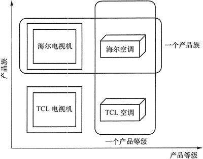

抽象工厂模式**创建的是==对象家族==**，也就是**很多对象**而不是一个对象，并且这些对象是==**相关**==的，也就是说**必须一起创建**出来。而工厂方法模式只是用于创建一个对象，这和抽象工厂模式有很大不同。

抽象工厂模式**用到**了工厂方法模式来创建**单一对象**，AbstractFactory 中的 createProductA() 和 createProductB() 方法都是让子类来实现，这两个方法单独来看就是在创建一个对象，这**符合**工厂方法模式的定义。

至于创建对象的家族这一概念是在 **Client** 体现，Client 要通过 **AbstractFactory** 同时调用两个方法来创建出两个对象，在这里这两个对象就有很大的**相关性**，Client 需要**同时创建出**这两个对象。

从高层次来看，**抽象工厂使用了==组合==，即 Cilent 组合了 AbstractFactory，而工厂方法模式使用了==继承==**。

##### 2. 应用场景

使用抽象工厂模式常见场景。

1. 当需要创建的对象是一系列相互关联或相互依赖的**产品族**时，如电器工厂中的**电视机、洗衣机、空调**等。
2. 系统中有多个**产品族**，但每次只使用其中的某一族产品。如有人只喜欢穿某一个品牌的衣服和鞋。
3. 系统中提供了产品的类库，且所有产品的接口相同，客户端不依赖产品实例的创建细节和内部结构。
4. [javax.xml.parsers.DocumentBuilderFactory](http://docs.oracle.com/javase/8/docs/api/javax/xml/parsers/DocumentBuilderFactory.html)
5. [javax.xml.transform.TransformerFactory](http://docs.oracle.com/javase/8/docs/api/javax/xml/transform/TransformerFactory.html#newInstance--)
6. [javax.xml.xpath.XPathFactory](http://docs.oracle.com/javase/8/docs/api/javax/xml/xpath/XPathFactory.html#newInstance--)

##### 3. 类图

抽象工厂模式的主要角色如下。

1. **抽象工厂**（Abstract Factory）：提供了创建产品的接口，它包含多个创建产品的方法 newProduct()，可以创建多个不同等级的产品。
2. **具体工厂**（Concrete Factory）：主要是实现抽象工厂中的多个抽象方法，完成具体产品的创建。
3. **抽象产品**（Product）：定义了产品的规范，描述了产品的主要特性和功能，抽象工厂模式有多个抽象产品。
4. **具体产品**（ConcreteProduct）：实现了抽象产品角色所定义的接口，由具体工厂来创建，它 同具体工厂之间是多对一的关系。抽象工厂模式的主要角色如下。
   1. **抽象工厂**（Abstract Factory）：提供了创建产品的接口，它包含多个创建产品的方法 newProduct()，可以创建多个不同等级的产品。
   2. **具体工厂**（Concrete Factory）：主要是实现抽象工厂中的多个抽象方法，完成具体产品的创建。
   3. **抽象产品**（Product）：定义了产品的规范，描述了产品的主要特性和功能，抽象工厂模式有多个抽象产品。
   4. **具体产品**（ConcreteProduct）：实现了抽象产品角色所定义的接口，由具体工厂来创建，它 同具体工厂之间是多对一的关系。


##### 4. 实现

两个抽象产品**系列**。

```java
// 抽象产品A 如空调
public class AbstractProductA {
}
```

```java
// 抽象产品B 如冰箱
public class AbstractProductB {
}
```

一个抽象产品有两个不同的实际产品。

```java
// 产品A1 
public class ProductA1 extends AbstractProductA {
}
```

```java
// 产品A2
public class ProductA2 extends AbstractProductA {
}
```

```java
// 产品B1
public class ProductB1 extends AbstractProductB {
}
```

```java
// 产品B2
public class ProductB2 extends AbstractProductB {
}
```

将上述的**组合**。

```java
// 组合成抽象工厂
public abstract class AbstractFactory {
    /**
     * 获取产品系列的抽象方法
     */
    abstract AbstractProductA createProductA();
    abstract AbstractProductB createProductB();
}
```

```java
// 具体工厂1 如 格力工厂
public class ConcreteFactory1 extends AbstractFactory{
	// 实现工厂方法A
    @Override
    AbstractProductA createProductA() {
        return new ProductA1();
    }

	// 实现工厂方法B
    @Override
    AbstractProductB createProductB() {
        return new ProductB1();
    }
}
```

```java
// 具体工厂2 如 美的工厂
public class ConcreteFactory2 extends AbstractFactory {
    // 实现工厂方法A
    @Override
    AbstractProductA createProductA() {
        return new ProductA2();
    }
    
	// 实现工厂方法B
    @Override
    AbstractProductB createProductB() {
        return new ProductB2();
    }
}
```

```java
public class Client {
    public static void main(String[] args) {
        // 得到具体工厂1
        AbstractFactory abstractFactory = new ConcreteFactory1();
        // 得到工厂1产生的产品A
        AbstractProductA productA = abstractFactory.createProductA();
        // 得到工厂1产生的产品B
        AbstractProductB productB = abstractFactory.createProductB();
        // do something with productA and productB
    }
}
```

抽象工厂模式最大的好处是**易于交换产品系列**。抽象工厂模式的另一个好处就是它**让具体的创建实例过程与客户端分离**，客户端是通过它们的抽象接口操作实例，产品实现类的具体类名也被具体的工厂实现类分离，不会出现在客户端代码中。

##### 5. 拓展

> 抽象工厂的==改进==

- 1、简单工厂 + 抽象工厂
- 2、**反射**  + 简单工厂
- 3、反射 + 配置文件 + 简单工厂


#### 生成器（Builder）

##### 1. 概述

封装一个对象的==**构造过程**==，并允许按**步骤**构造。是用于**构建复杂对象**的一种模式。

指将一个复杂对象的**构造**与它的**表示分离**，使同样的构建过程可以创建不同的表示。它是将一个复杂的对象分解为多个简单的对象，然后一步一步构建而成。它将变与不变相分离，即产品的组成部分是不变的，但每一部分是可以灵活选择的。

> **与工厂方法模式的区别**

建造者（Builder）模式和工厂模式的**关注点**不同：生成器模式注重**零部件的组装**过程，而工厂方法模式更注重**零部件的创建**过程，但两者可以结合使用。

##### 2. 使用场景

建造者（Builder）模式创建的是**复杂对象**，其产品的各个部分经常面临着剧烈的变化，但将它们组合在一起的算法却相对稳定，所以它通常在以下场合使用。

- 创建的对象较复杂，由多个部件构成，各部件面临着复杂的变化，但构件间的建造顺序是稳定的。
- 创建复杂对象的算法独立于该对象的组成部分以及它们的装配方式，即产品的构建过程和最终的表示是独立的。

- [java.lang.StringBuilder](http://docs.oracle.com/javase/8/docs/api/java/lang/StringBuilder.html)
- [java.nio.ByteBuffer](http://docs.oracle.com/javase/8/docs/api/java/nio/ByteBuffer.html#put-byte-)
- [java.lang.StringBuffer](http://docs.oracle.com/javase/8/docs/api/java/lang/StringBuffer.html#append-boolean-)
- [java.lang.Appendable](http://docs.oracle.com/javase/8/docs/api/java/lang/Appendable.html)
- [Apache Camel builders](https://github.com/apache/camel/tree/0e195428ee04531be27a0b659005e3aa8d159d23/camel-core/src/main/java/org/apache/camel/builder)

##### 3. 类图

建造者（Builder）模式的**主要角色**如下。

1. **产品角色**（Product）：它是包含多个组成部件的复杂对象，由具体建造者来创建其各个滅部件。
2. **抽象建造者**（Builder）：它是一个包含创建产品各个子部件的抽象方法的接口，通常还包含一个返回复杂产品的方法 getResult()。
3. **具体建造者**(Concrete Builder）：实现 Builder 接口，完成复杂产品的各个部件的具体创建方法。
4. **指挥者**（Director）：它调用建造者对象中的部件构造与装配方法完成复杂对象的创建，在指挥者中不涉及具体产品的信息。


##### 2. 实现

使用 Builder 模式来替代**多参数构造函数**是一个比较好的实践法则。

常常会面临编写一个有多个构造函数的实现类(假设类名叫 User)，如下

```java
User(String name);
User(String name, int age);
User(String name, int age, String address);
User(String name, int age, String address, int cardID);
```

这样一系列的构造函数主要目的就是为了提供更多的客户调用选择，以处理不同的构造请求。这种方法很常见，也很有效力，但是它的缺点也很多。

类的作者不得不书写**多种参数组合的构造函数**，而且其中还需要设置默认参数值，这是一个需要**细心而又枯燥**的工作。其次，这样的构造函数灵活性也不高，而且在调用时你不得不提供一些没有意义的参数值，例如，User("Ace", -1, "SH")，显然年龄为负数没有意义，但是你又不的不这样做，得以符合 Java 的规范。如果这样的代码发布后，后面的维护者就会很头痛，因为他根本不知道这个 -1 是什么含义。对于这样的情况，就非常适合使用 Builder 模式。

Builder模式的要点就是通过一个代理来完成对象的构建过程。这个代理职责就是完成构建的各个步骤，同时它也是易扩展的。

```java
public class User {
    // 多个属性字段
    private final int age;
    private final int safeID;
    private final String name;
    private final String address;

    public int getAge() {
        return age;
    }

    public int getSafeID() {
        return safeID;
    }

    public String getName() {
        return name;
    }

    public String getAddress() {
        return address;
    }

    // 私有构造方法
    private User(Builder b) {
        age = b.age;
        safeID = b.safeID;
        name = b.name;
        address = b.address;
    }

    // 内部生成器类
    private static class Builder {
        // 属性默认值
        private int age = 0;
        private int safeID = 0;
        private String name = null;
        private String address = null;

        // 构建的步骤
        public Builder(String name) {
            this.name = name;
        }

        public Builder age(int val) {
            age = val;
            return this;
        }

        public Builder safeID(int val) {
            safeID = val;
            return this;
        }

        public Builder address(String val) {
            address = val;
            return this;
        }

        // 构建，返回一个新对象
        public User build() {
            return new User(this);
        }
    }

}
```

采用类似链式的方式生成对象。

```java
public class Client {
    public static void main(String[] args) {
        // 使用生成器产生对象
        User user = new User.Builder("Ace")
                .age(10)
                .address("beijing")
                .safeID(2)
                .build();
    }
}
```

另：一个简易的 **StringBuilder** 实现，参考了 JDK 1.8 源码。

```java
public class AbstractStringBuilder {
    protected char[] value;

    protected int count;
	
    // 构造方法设置初始容量
    public AbstractStringBuilder(int capacity) {
        count = 0;
        value = new char[capacity];
    }

    // 返回AbstractStringBuilder对象
    public AbstractStringBuilder append(char c) {
        ensureCapacityInternal(count + 1);
        value[count++] = c;
        return this;
    }
	
    // 保证容量足够
    private void ensureCapacityInternal(int minimumCapacity) {
        // overflow-conscious code
        if (minimumCapacity - value.length > 0)
            expandCapacity(minimumCapacity);
    }
	
    // 扩容
    void expandCapacity(int minimumCapacity) {
        int newCapacity = value.length * 2 + 2;
        if (newCapacity - minimumCapacity < 0)
            newCapacity = minimumCapacity;
        if (newCapacity < 0) {
            if (minimumCapacity < 0) // overflow
                throw new OutOfMemoryError();
            newCapacity = Integer.MAX_VALUE;
        }
        value = Arrays.copyOf(value, newCapacity);
    }
}
```

```java
public class StringBuilder extends AbstractStringBuilder {
    public StringBuilder() {
        // 默认的大小16
        super(16);
    }

    @Override
    public String toString() {
        // Create a copy, don't share the array
        return new String(value, 0, count);
    }
}
```

```java
public class Client {
    public static void main(String[] args) {
        StringBuilder sb = new StringBuilder();
        final int count = 26;
        for (int i = 0; i < count; i++) {
            sb.append((char) ('a' + i));
        }
        System.out.println(sb.toString());
    }
}
```

```html
abcdefghijklmnopqrstuvwxyz
```


#### 原型模式（Prototype）

##### 1. 概述

使用==**原型实例**==指定要创建**对象的类型**，通过==**复制**==这个**原型来创建新对象**。

**原型模式的优点：**

- 扩展性好，增加或减少**具体原型**对系统没有任何影响
- 原型模式提供了简化的创建结构，常常与**工厂方法**模式一起使用
- 如果创建对象的实例比较复杂的时候，原型模式可以简化对象的创建过程
- 可以使用深克隆的方式保存对象的状态，在操作过程中可以追溯操作日志，做撤销和回滚操作

**原型模式的缺点：**

- 需要为**每一个类**配置一个**克隆方法**，而且该克隆方法位于一个类的内部，当对已有的类进行改造时，需要修改源代码，违背了开闭原则
- 在做**深克隆**的时候，如果对象之间存在多重嵌套的引用时，为了实现克隆，对每一层对象对应的类都必须支持深克隆实现起来比较麻烦

**原型模式的适用环境：**

- 创建成本比较大，比如初始化需要较长时间、占用太多CPU、占用大量网络资源等
- 系统需要保存对象状态
- 避免使用分层创建的对象，并且实例对象只有一个或少数几个组合状态

##### 2. 使用场景

原型模式通常适用于以下场景。

- 对象之间相同或相似，即只是个别的几个属性不同的时候。
- 对象的创建过程比较麻烦，但复制比较简单的时候。

- [java.lang.Object#clone()](http://docs.oracle.com/javase/8/docs/api/java/lang/Object.html#clone%28%29)

##### 3. 类图

如小明的水果点即将开业，需要做一些**宣传**和**优惠券**，这时我们只需要**一张优惠券**然后通过打印店**复制一大堆**，下次还需要搞活动的时候直接拿去复印就好了，不需要每一张每一张手动的去重新制作。

原型模式包含以下主要角色。

1. **抽象原型类**：规定了具体原型对象必须实现的接口。
2. **具体原型类**：**实现**抽象原型类的 **clone**() 方法，它是可被复制的对象。
3. **访问类**：**使用**具体原型类中的 **clone**() 方法来复制新的对象。


##### 4. 实现

**Prototype** 原型类：声明==**克隆方法**==的接口，是所有具体原型类的公共类。

```java
// 原型类
public abstract class Prototype {
    // 抽象方法
    abstract Prototype myClone();
}
```

**ConcretePrototype**（具体**原型类**）：它**实现**抽象类中声明的**克隆方法**，返回**一个自己的克隆对象**。

```java
public class ConcretePrototype extends Prototype {

    private String filed;

    public ConcretePrototype(String filed) {
        this.filed = filed;
    }

    @Override
    Prototype myClone() {
        return new ConcretePrototype(filed);
    }

    @Override
    public String toString() {
        return filed;
    }
}
```

Client（客户端）：客户让一个原型对象克隆自身，从而创建一个**新的对象**。

```java
public class Client {
    public static void main(String[] args) {
        // 构建原型对象
        Prototype prototype = new ConcretePrototype("abc");
        // 使用原型对象进行复制
        Prototype clone = prototype.myClone();
        System.out.println(clone.toString());
    }
}
```

```html
abc
```

根据在复制原型对象的同时是否复制在原型对象中的引用类型成员变量，原型模式分为两种：**浅克隆**（Shallow Clone）、**深克隆**（Deep Clone）。

##### 5. 拓展

原型模式可扩展为**带原型管理器**的原型模式，它在原型模式的基础上增加了一个**原型管理器 PrototypeManager 类**。该类用 **HashMap** 保存**多个复制的原型**，Client 类可以通过管理器的 get(String id) 方法从中**获取**复制的原型。


### 四、设计模式-行为型

#### 责任链模式（Chain Of Responsibility）

##### 1. 概述

使**多个对象都有机会处理请求**，从而避免请求的发送者和接收者之间的耦合关系。

将这些对象连成**一条链**，并沿着这**条链**发送该请求，**直到有一个对象处理它为止**。

由于责任链的创建完全在**客户端**，因此新增新的具体处理者对原有类库没有任何影响，只需添加新的类，然后在客户端调用时添加即可。符合开闭原则。


主要优点如下。

1. 降低了对象之间的耦合度。该模式使得一个对象无须知道到底是哪一个对象处理其请求以及链的结构，发送者和接收者也无须拥有对方的明确信息。
2. 增强了系统的可扩展性。可以根据需要增加新的请求处理类，满足开闭原则。
3. 增强了给对象指派职责的灵活性。当工作流程发生变化，可以动态地改变链内的成员或者调动它们的次序，也可动态地新增或者删除责任。
4. 责任链简化了对象之间的连接。每个对象只需保持一个指向其后继者的引用，不需保持其他所有处理者的引用，这**避免**了使用众多的 **if 或者 if···else** 语句。
5. 责任分担。每个类只需要处理自己该处理的工作，不该处理的传递给下一个对象完成，**明确各类的责任范围，符合类的单一职责原则**。


其主要缺点如下。

1. 不能保证每个请求一定被处理。由于一个请求没有明确的接收者，所以不能保证它一定会被处理，该请求可能一直传到链的末端都得不到处理。
2. 对比较长的职责链，请求的处理可能涉及**多个处理对象**，系统**性能**将受到一定影响。
3. 职责链建立的合理性要靠客户端来保证，增加了客户端的复杂性，可能会由于职责链的错误设置而导致系统出错，如可能会造成**循环调用**。

##### 2. 使用场景

###### 现实中的场景

- 打牌时，轮流出牌
- 接力赛跑
- 公司里面，请假条的审批过程：如果请假天数小于3天，主任审批；如果请假天数大于等于3天，小于10天，经理审批；如果大于等于10天，小于30天，总经理审批；如果大于等于30天，提示拒绝

###### **开发中的常见场景**

- Java中，**异常机制**就是一种责任链模式。一个 try 可以对应多个 catch，当第一个 catch 不匹配类型，则自动跳到第二个 catch；
- Javascript 语言中，事件的冒泡和捕获机制。Java 语言中，事件的处理采用观察者模式；
- Servlet 开发中，**过滤器**的链式处理；
- Struts2 中，**拦截器**的调用也是典型的责任链模式。
- Netty
- Spring MVC 中的 **Interceptor 拦截器**。

###### JDK应用

- [java.util.logging.Logger#log()](http://docs.oracle.com/javase/8/docs/api/java/util/logging/Logger.html#log%28java.util.logging.Level,%20java.lang.String%29)
- [Apache Commons Chain](https://commons.apache.org/proper/commons-chain/index.html)
- [javax.servlet.Filter#doFilter()](http://docs.oracle.com/javaee/7/api/javax/servlet/Filter.html#doFilter-javax.servlet.ServletRequest-javax.servlet.ServletResponse-javax.servlet.FilterChain-)

##### 3. 类图

职责链模式主要包含以下**角色**。

1. **抽象处理器**（Handler）角色：定义一个处理请求的接口，包含**抽象处理方法和一个后继连接**。
2. **具体处理器**（ConcreteHandler）角色：实现抽象处理者的处理方法，判断能否处理本次请求，如果可以处理请求则处理，否则将**该请求转给它的后继者**。
3. **客户类**（Client）角色：创建**处理链**，并向**链头**的具体处理者对象提交请求，它不关心处理细节和请求的传递过程。

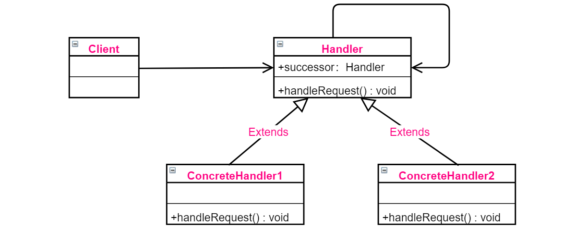

##### 4. 实现

请求类

```java
@Data
public class Request {

    private RequestType type;
    private String name;

    public Request(RequestType type, String name) {
        this.type = type;
        this.name = name;
    }
}
```

请求类型枚举

```java
public enum RequestType {
    TYPE1, TYPE2
}
```

定义**抽象**处理器类

```java
public abstract class Handler {
    // 处理器 successor：后继的事物
    protected Handler successor;

    public Handler(Handler successor) {
        this.successor = successor;
    }
	// 处理请求
    protected abstract void handleRequest(Request request);
}
```

**具体处理器**实现类 1，如果当前处理器复合该请求的类型，就直接处理，否则交给下一个处理器。

```java
public class ConcreteHandler1 extends Handler {

    public ConcreteHandler1(Handler successor) {
        super(successor);
    }

    @Override
    protected void handleRequest(Request request) {
        if (request.getType() == RequestType.TYPE1) {
            System.out.println(request.getName() + " is handle by ConcreteHandler1");
            return;
        }
        if (successor != null) {
            // 交给下一个处理器进行处理
            successor.handleRequest(request);
        }
    }
}
```

**具体处理器**实现类 2 

```java
public class ConcreteHandler2 extends Handler {

    public ConcreteHandler2(Handler successor) {
        super(successor);
    }

    @Override
    protected void handleRequest(Request request) {
        if (request.getType() == RequestType.TYPE2) {
            System.out.println(request.getName() + " is handle by ConcreteHandler2");
            return;
        }
        if (successor != null) {
            // 交给下一个处理器进行处理
            successor.handleRequest(request);
        }
    }
}
```

客户端类

```java
public class Client {

    public static void main(String[] args) {
        // 构造一个处理器构成的链
        Handler handler1 = new ConcreteHandler1(null);
        Handler handler2 = new ConcreteHandler2(handler1);

        // 使用处理器链进行处理
        Request request1 = new Request(RequestType.TYPE1, "request1");
        handler2.handleRequest(request1);
        Request request2 = new Request(RequestType.TYPE2, "request2");
        handler2.handleRequest(request2);
    }
}
```

```html
request1 is handle by ConcreteHandler1
request2 is handle by ConcreteHandler2
```


#### 命令模式（Command）

##### 1. 概述

将一个**请求**封装为一个**对象**，从而使你可用不同的**请求对客户进行参数化**，对请求**排队**或记录请求**日志**，以及支持**可取消**的操作。

将**命令**封装成**对象**中，具有以下作用：

- 使用**命令来参数化**其它对象
- 将命令放入队列中进行**排队**
- 将命令的操作记录到**日志**中
- 支持**可撤销**的操作

命令模式的主要**优点**如下。

- 降低系统的耦合度。命令模式能将调用操作的对象与实现该操作的对象解耦。
- **增加或删除命令**非常方便。采用命令模式增加与删除命令不会影响其他类，它满足“开闭原则”，对扩展比较灵活。
- 可以实现**宏命令**。命令模式可以与组合模式结合，将多个命令装配成一个组合命令，即宏命令。
- 方便实现 **Undo 和 Redo** 操作。**命令模式**可以与后面介绍的备忘录模式结合，实现命令的**撤销与恢复**。

其**缺点**是：

- 可能产生**大量具体命令类**。因为计对每一个具体操作都需要设计一个具体命令类，这将增加系统的复杂性。

##### 2. 使用场景

**何时使用**：在某些场合，比如要对行为进行"**==记录、撤销/重做、事务==**"等处理，这种无法抵御变化的紧耦合是不合适的。在这种情况下，如何将"行为请求者"与"行为实现者"解耦？将一组行为抽象为对象，可以实现二者之间的松耦合。

**主要解决**：在软件系统中，行为请求者与行为实现者通常是一种紧耦合的关系，但某些场合，比如需要对行为进行记录、撤销或重做、事务等处理时，这种无法抵御变化的紧耦合的设计就不太合适。

**开发中常见的场景**：

- Struts2中，**action** 的整个调用过程中就有命令模式。Struts 其实就是一种将请求和呈现分离的技术，其中必然涉及命令模式的思想。比如 : struts 1 中的 action 核心控制器 ActionServlet 只有一个，相当于 Invoker，而模型层的类会随着不同的应用有不同的模型类，相当于具体的 Command；
- 数据库**事务机制**的底层实现；
- 命令的**撤销和恢复**；

- [java.lang.Runnable](http://docs.oracle.com/javase/8/docs/api/java/lang/Runnable.html)
- [Netflix Hystrix](https://github.com/Netflix/Hystrix/wiki)
- [javax.swing.Action](http://docs.oracle.com/javase/8/docs/api/javax/swing/Action.html)

##### 3. 类图

经典的命令模式包括 4 个角色：

- **Command 接口**：定义命令的统一**接口**。拥有执行命令的抽象方法 **execute**() 和撤销命令的 **undo**()。
- **ConcreteCommand**：Command 接口的**实现类**，用来执行**具体的命令**，某些情况下可以直接用来**充当Receiver**。
- **Receiver**：命令的实际**执行者**。
- **Invoker**：命令的**请求者**，是命令模式中**最重要**的角色。这个角色用来**对各个命令进行控制**。

****

##### 4. 实现

设计一个遥控器，可以控制电灯开关。

定义命令统一 Command 接口。

灯类。

```java
public class Light {
    
    public void on() {
        System.out.println("Light is on!");
    }

    public void off() {
        System.out.println("Light is off!");
    }
}
```

```java
public interface Command {
    void execute();
}
```

Command 命令接口**实现类**，实现开灯的命令。

```java
public class LightOnCommand implements Command {
    Light light;

    public LightOnCommand(Light light) {
        this.light = light;
    }

    @Override
    public void execute() {
        light.on();
    }
}
```

Command 命令接口**实现类**，实现关灯的命令。

```java
public class LightOffCommand implements Command {
    Light light;

    public LightOffCommand(Light light) {
        this.light = light;
    }

    @Override
    public void execute() {
        light.off();
    }
}
```

命令的请求者，实现类似**遥控器**控制灯的功能。

```java
/**
 * 调用者
 */
public class Invoker {
    // 开灯命令
    private Command[] onCommands;
    // 关灯命令
    private Command[] offCommands;
    private final int slotNum = 7;

    public Invoker() {
        this.onCommands = new Command[slotNum];
        this.offCommands = new Command[slotNum];
    }

    public void setOnCommand(Command command, int slot) {
        onCommands[slot] = command;
    }

    public void setOffCommand(Command command, int slot) {
        offCommands[slot] = command;
    }

    // 调用执行命令
    public void onButtonWasPushed(int slot) {
        onCommands[slot].execute();
    }

    public void offButtonWasPushed(int slot) {
        offCommands[slot].execute();
    }
}
```

客户端

```java
public class Client {
    public static void main(String[] args) {
        // 遥控器
        Invoker invoker = new Invoker();
        // 灯
        Light light = new Light();
        // 开关灯命令
        Command lightOnCommand = new LightOnCommand(light);
        Command lightOffCommand = new LightOffCommand(light);
		// 将命令与遥控器一一对应
        invoker.setOnCommand(lightOnCommand, 0);
        invoker.setOffCommand(lightOffCommand, 0);
        // 开灯
        invoker.onButtonWasPushed(0);
        // 关灯
        invoker.offButtonWasPushed(0);
    }
}
```

输出

```java
Light is on!
Light is off!
```


#### 解释器模式（Interpreter）

##### 1. 概述

为**语言**创建**解释器**，通常由**语言的语法和语法分析来定义**。定义一个语言，定义它的**文法**的一种表示，并定义一个解释器，该解释器使用该表示来**解释**语言中的句子。

- 是一种**不常用**的设计模式；
- 用于描述如何构成一个简单的语言解释器，**主要用于使用面向对象语言开发的编译器和解释器设计**；
- 当我们需要开发一种新的语言时，可以考虑使用解释器模式；
- **尽量不要使用**解释器模式，后期维护会有很大麻烦。在项目中，可以使用 Jruby，Groovy、java 的 js 引擎来替代解释器的作用，弥补 java 语言的不足。

##### 2. 使用场景

开发中场景：

1. EL **表达式**的处理；
2. **正则表达式**解释器；
3. SQL 语法的**解释器**；
4. 数学表达式解析器，如现成的工具包: Math Expression String Parser、Expression4J 等。

**JDK**

- [java.util.Pattern](http://docs.oracle.com/javase/8/docs/api/java/util/regex/Pattern.html)
- [java.text.Normalizer](http://docs.oracle.com/javase/8/docs/api/java/text/Normalizer.html)
- All subclasses of [java.text.Format](http://docs.oracle.com/javase/8/docs/api/java/text/Format.html)
- [javax.el.ELResolver](http://docs.oracle.com/javaee/7/api/javax/el/ELResolver.html)

##### 3. 类图

- **抽象表达式**（Abstract Expression）角色：定义解释器的接口，约定解释器的解释操作，主要包含解释方法 interpret()。
- 终结符表达式（Terminal  Expression）角色：是抽象表达式的子类，用来实现文法中与终结符相关的操作，文法中的每一个终结符都有一个具体终结表达式与之相对应。
- **非终结符表达式**（Nonterminal Expression）角色：也是抽象表达式的子类，用来实现文法中与非终结符相关的操作，文法中的每条规则都对应于一个非终结符表达式。
- **环境（Context）角色**：通常包含各个解释器需要的数据或是公共的功能，一般用来传递被所有解释器共享的数据，后面的解释器可以从这里获取这些值。


##### 4. 实现

以下是一个**规则检验器**实现，具有 **and 和 or** 规则，通过规则可以构建一颗**解析树**，用来检验一个**文本**是否满足解析树定义的规则。

例如一颗解析树为 D And (A Or (B C))，文本 "D A" 满足该解析树定义的规则。

这里的 Context 指的是 String。

```java
public abstract class Expression {
    // 解释
    public abstract boolean interpret(String str);
}
```

```java
public class TerminalExpression extends Expression {

    private String literal = null;

    public TerminalExpression(String str) {
        literal = str;
    }

    // 实现解释方法
    public boolean interpret(String str) {
        StringTokenizer st = new StringTokenizer(str);
        while (st.hasMoreTokens()) {
            String test = st.nextToken();
            if (test.equals(literal)) {
                return true;
            }
        }
        return false;
    }
}
```

```java
public class AndExpression extends Expression {

    private Expression expression1 = null;
    private Expression expression2 = null;

    public AndExpression(Expression expression1, Expression expression2) {
        this.expression1 = expression1;
        this.expression2 = expression2;
    }

    public boolean interpret(String str) {
        return expression1.interpret(str) && expression2.interpret(str);
    }
}
```

```java
public class OrExpression extends Expression {
    private Expression expression1 = null;
    private Expression expression2 = null;

    public OrExpression(Expression expression1, Expression expression2) {
        this.expression1 = expression1;
        this.expression2 = expression2;
    }

    public boolean interpret(String str) {
        return expression1.interpret(str) || expression2.interpret(str);
    }
}
```

```java
public class Client {

    /**
     * 构建解析树
     */
    public static Expression buildInterpreterTree() {
        // Literal
        Expression terminal1 = new TerminalExpression("A");
        Expression terminal2 = new TerminalExpression("B");
        Expression terminal3 = new TerminalExpression("C");
        Expression terminal4 = new TerminalExpression("D");
        // B C
        Expression alternation1 = new OrExpression(terminal2, terminal3);
        // A Or (B C)
        Expression alternation2 = new OrExpression(terminal1, alternation1);
        // D And (A Or (B C))
        return new AndExpression(terminal4, alternation2);
    }

    public static void main(String[] args) {
        Expression define = buildInterpreterTree();
        String context1 = "D A";
        String context2 = "A B";
        System.out.println(define.interpret(context1));
        System.out.println(define.interpret(context2));
    }
}
```

```html
true
false
```


#### 迭代器模式（Iterator）

##### 1. 概述

在现实生活以及程序设计中，经常要访问一个聚合对象中的**各个元素**，如数据结构中的**链表遍历**，通常的做法是将链表的创建和遍历都放在同一个类中，但这种方式不利于程序的扩展，如果要更换遍历方法就必须修改程序源代码，这违背了 “开闭原则”。

既然将遍历方法封装在聚合类中不可取，那么聚合类中**不提供遍历方法**，将遍历方法由用户自己实现是否可行呢？答案是同样不可取，因为这种方式会存在两个缺点：

1. 暴露了聚合类的内部表示，使其数据不安全；
2. 增加了客户的负担。

**“迭代器模式”**能较好地克服以上缺点，它在**客户访问类与聚合类**之间**插入一个迭代器**，这分离了聚合对象与其遍历行为，对客户也**隐藏**了其内部细节，且满足“单一职责原则”和“开闭原则”，如  Java 中的 Collection、List、Set、Map 等都包含了迭代器。

提供一种**顺序访问聚合对象元素**的方法，并且**不暴露**聚合对象的**内部表示**。

##### 2. 使用场景

**开发中常见的场景**：

- JDK 内置的迭代器(List/Set)

##### 3. 类图

- **Aggregate** 是**聚合类**，其中 createIterator() 方法可以产生一个 Iterator，聚合类就好比 一个**集合类**，产生 Iterator 时即将聚合类的元素放入到迭代器 Iterator 中；
- **Iterator** 主要定义了 **hasNext**() 和 **next**() 方法。
- **Client** 组合了 Aggregate，为了迭代遍历 Aggregate，也需要组合 Iterator。

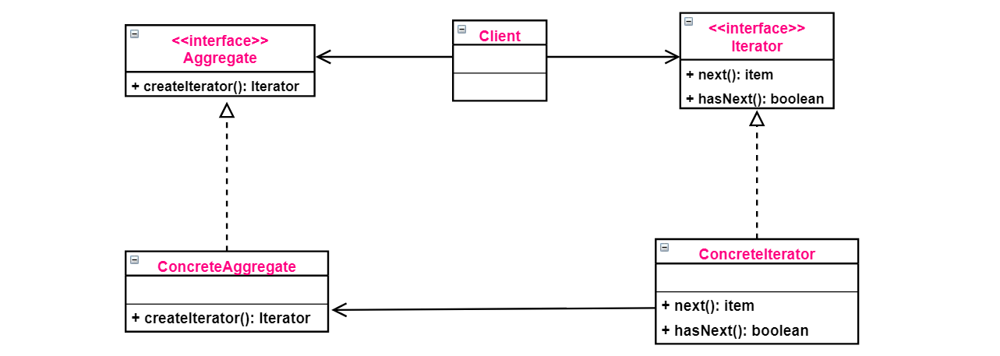

##### 4. 实现

**聚合接口**

```java
public interface Aggregate {
    Iterator createIterator();
}
```

**聚合接口实现类**，类似于一个集合类，是数据元素的集合。

```java
public class ConcreteAggregate implements Aggregate {
	// 存放元素
    private Integer[] items;
	
    public ConcreteAggregate() {
        items = new Integer[10];
        for (int i = 0; i < items.length; i++) {
            items[i] = i;
        }
    }
	// 创建迭代器
    @Override
    public Iterator createIterator() {
        return new ConcreteIterator<Integer>(items);
    }
}
```

**迭代器接口**

```java
public interface Iterator<Item> {

    Item next();

    boolean hasNext();
}
```

**迭代器接口实现类**

```java
public class ConcreteIterator<Item> implements Iterator {

    private Item[] items;
    // 位置指针
    private int position = 0;

    // 构造迭代器时传入需迭代的对象数组
    public ConcreteIterator(Item[] items) {
        this.items = items;
    }

    // 下一个元素
    @Override
    public Object next() {
        return items[position++];
    }
	
    // 是否还有下一个
    @Override
    public boolean hasNext() {
        return position < items.length;
    }
}
```

```java
public class Client {

    public static void main(String[] args) {
        // 聚合类 类似于一个集合类
        Aggregate aggregate = new ConcreteAggregate();
        // 从聚合类中获取迭代器
        Iterator<Integer> iterator = aggregate.createIterator();
        // 遍历
        while (iterator.hasNext()) {
            System.out.println(iterator.next());
        }
    }
}
```


#### 中介者（Mediator）

##### 1. 概述

集中相关对象之间复杂的沟通和控制方式。

解耦多个==**同事对象**==之间的交互关系。每个对象都持有**中介者对象**的**引用**，**只跟中介者对象打交道**。我们通过**中介者对象**统一管理这些交互关系。

如果一个系统中，对象之间的联系呈网状结构，对象之间存在大量的多对多关系，导致关系很复杂。

比如说，一个公司有三个部门：财务部、人事部、销售部。这是可以引入一个**中介者对象**（总经理），各个同事对象只跟中介者对象打交道，将复杂的网络结构化解成为**星型结构**。

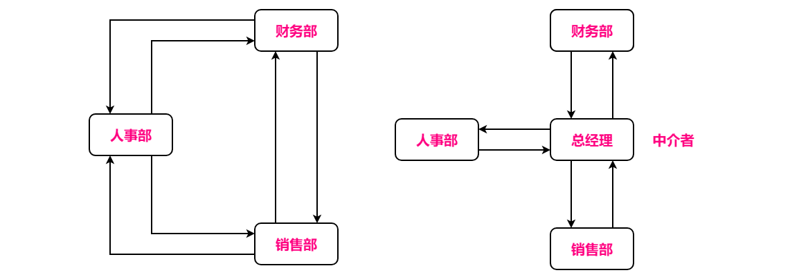

##### 2. 使用场景

开发中常见的场景：

- MVC 模式(其中的 Controller，控制器就是一个**中介者**对象。Model 和 View 都和它打交道)
- 窗口游戏程序，窗口软件开发中**窗口对象**也是一个中介者对象
- 图形界面开发 GUI 中，多个组件之间的交互，可以通过引入一个中介者对象来解决，可以是整体的窗口对象或者 DOM 对象
- Java.lang.reflect.Method#invoke()
- All scheduleXXX() methods of [java.util.Timer](http://docs.oracle.com/javase/8/docs/api/java/util/Timer.html)
- [java.util.concurrent.Executor#execute()](http://docs.oracle.com/javase/8/docs/api/java/util/concurrent/Executor.html#execute-java.lang.Runnable-)
- submit() and invokeXXX() methods of [java.util.concurrent.ExecutorService](http://docs.oracle.com/javase/8/docs/api/java/util/concurrent/ExecutorService.html)
- scheduleXXX() methods of [java.util.concurrent.ScheduledExecutorService](http://docs.oracle.com/javase/8/docs/api/java/util/concurrent/ScheduledExecutorService.html)

##### 3. 类图

- **Mediator**：**中介者**，定义一个接口用于与各同事（Colleague）对象通信。

- **ConcreteMediator**：中介者实现类，具体实现中介功能。

- **Colleague**：**同事**，相关对象。代表一类差不多等级的事物。

- **ConcreteColleague**：同事实现类。

  

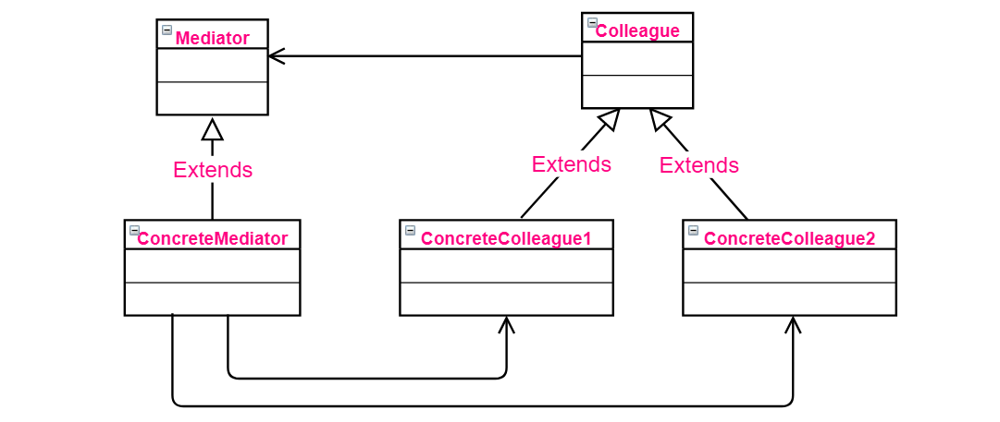

##### 4. 实现

Alarm（闹钟）、CoffeePot（咖啡壶）、Calendar（日历）、Sprinkler（喷头）是一组**相关**的对象，在**某个对象的事件产生时需要去操作其它对象**，形成了下面这种依赖结构：


使用中介者模式可以将复杂的依赖结构变成**星形结构**：


**中介者接口**

```java
public abstract class Mediator {
    public abstract void doEvent(String eventType);
}
```

**抽象同事接口**

```java
public abstract class Colleague {
    public abstract void onEvent(Mediator mediator);
}
```

**闹钟类**

```java
public class Alarm extends Colleague {

    @Override
    public void onEvent(Mediator mediator) {
        mediator.doEvent("alarm");
    }

    public void doAlarm() {
        System.out.println("doAlarm()");
    }
}
```

**咖啡壶类**

```java
public class CoffeePot extends Colleague {
    @Override
    public void onEvent(Mediator mediator) {
        mediator.doEvent("coffeePot");
    }

    public void doCoffeePot() {
        System.out.println("doCoffeePot()");
    }
}
```

**日历类**

```java
public class Calender extends Colleague {
    @Override
    public void onEvent(Mediator mediator) {
        mediator.doEvent("calender");
    }

    public void doCalender() {
        System.out.println("doCalender()");
    }
}
```

**喷头类**

```java
public class Sprinkler extends Colleague {
    @Override
    public void onEvent(Mediator mediator) {
        mediator.doEvent("sprinkler");
    }

    public void doSprinkler() {
        System.out.println("doSprinkler()");
    }
}
```

**中介者实现类**

```java
public class ConcreteMediator extends Mediator {
    // 各个同事类
    private Alarm alarm;
    private CoffeePot coffeePot;
    private Calender calender;
    private Sprinkler sprinkler;

    // 传入需要中介管理的对象
    public ConcreteMediator(Alarm alarm, CoffeePot coffeePot, Calender calender, Sprinkler sprinkler) {
        this.alarm = alarm;
        this.coffeePot = coffeePot;
        this.calender = calender;
        this.sprinkler = sprinkler;
    }

    // 根据类型让中介者判断执行什么操作
    @Override
    public void doEvent(String eventType) {
        switch (eventType) {
            case "alarm":
                doAlarmEvent();
                break;
            case "coffeePot":
                doCoffeePotEvent();
                break;
            case "calender":
                doCalenderEvent();
                break;
            default:
                doSprinklerEvent();
        }
    }
	// 以下是具体的操作
    public void doAlarmEvent() {
        alarm.doAlarm();
        coffeePot.doCoffeePot();
        calender.doCalender();
        sprinkler.doSprinkler();
    }

    public void doCoffeePotEvent() {
        // ...
    }

    public void doCalenderEvent() {
        // ...
    }

    public void doSprinklerEvent() {
        // ...
    }
}
```

**客户端**

```java
public class Client {
    public static void main(String[] args) {
        // 定义同类对象
        Alarm alarm = new Alarm();
        CoffeePot coffeePot = new CoffeePot();
        Calender calender = new Calender();
        Sprinkler sprinkler = new Sprinkler();
        // 构造一个中介者对象
        Mediator mediator = new ConcreteMediator(alarm, coffeePot, calender, sprinkler);
        // 闹钟事件到达，调用中介者就可以操作相关对象
        alarm.onEvent(mediator);
    }
}
```

```java
doAlarm()
doCoffeePot()
doCalender()
doSprinkler()
```


#### 备忘录模式（Memento）

##### 1. 概述

在**不违反封装**的情况下获得对象的**内部状态**，从而在需要时可以将对象**恢复**到**最初状态**。

就是保存某个对象**内部状态**的拷贝，这样**以后**就可以将该对象**恢复到原先的状态**。

又叫快照模式。提供了一种可以恢复状态的机制。当用户需要时能够比较方便地将数据恢复到**某个历史的状态**。 

##### 2. 使用场景

**开发中常见的应用场景** ：

1. 棋类游戏中的，悔棋
2. 普通软件中的，**撤销**操作
3. 数据库软件中的，事务管理中的，**回滚**操作
4. 实现**历史记录**功能

##### 3. 类图

- **Originator**：原始对象，即**需要保存状态**的对象。
- **Caretaker**：负责**保存**好备忘录
- **Menento**：**备忘录**，**存储原始对象的的状态**。备忘录实际上有两个接口，一个是提供给 Caretaker 的窄接口：它只能将备忘录传递给其它对象；一个是提供给 Originator 的宽接口，允许它访问到先前状态所需的所有数据。理想情况是只允许 Originator 访问本备忘录的内部状态。


##### 4. 实现

步骤1：定义**源发器类**（Originator），负责创建一个**备忘录** Memento, 用以记录当前时刻它的**内部状态**，并可使用备忘录恢复内部状态。

```java
/**
 * 源发器类 Originator
 */
@Data
public class Emp {
	private String ename;
	private int age;
	private double salary;

	// 进行备忘操作，并返回备忘录对象
	public EmpMemento memento(){
		return new EmpMemento(this);
	}

	// 进行数据恢复，恢复成制定备忘录对象的值
	public void recovery(EmpMemento mmt){
		this.ename = mmt.getEname();
		this.age = mmt.getAge();
		this.salary = mmt.getSalary();
	}

	public Emp(String ename, int age, double salary) {
		super();
		this.ename = ename;
		this.age = age;
		this.salary = salary;
	}	
}
```

步骤2：定义**备忘录类（Memento）**,负责存储 **Originator 对象**的**内部状态**，并可防止 Originator 以外的其它对象访问备忘录（Memento）。备忘录的字段与 Originator 的字段相同。

```java
/**
 * 备忘录类 Memento
 */
@Data
public class EmpMemento {
    // 属性与Emp相同
	private String ename;
	private int age;
	private double salary;

	public EmpMemento(Emp e) {
		this.ename = e.getEname();
		this.age = e.getAge();
		this.salary = e.getSalary();
	}
	
	//get/set方法
}
```

步骤3：定义**负责人类（CareTaker）**，负责**保存好备忘录**（Memento）。

```java
/**
 * 负责人类 :负责管理备忘录对象
 */
public class CareTaker {
	// 保存memento对象
	private EmpMemento memento;

    // 可以用集合结构List Map等保存多个Memento对象
	// private List<EmpMemento> list = new ArrayList<EmpMemento>();

	public EmpMemento getMemento() {
		return memento;
	}

	public void setMemento(EmpMemento memento) {
		this.memento = memento;
	}
}
```

步骤4：客户端

```java
public class Client {
    public static void main(String[] args) {
        // 定义Memento管理者对象
        CareTaker taker = new CareTaker();

        Emp emp = new Emp("Jack", 48, 900);
        System.out.println("Init State：" + emp.getEname() + " age：" + emp.getAge() + " salary：" + emp.getSalary());
        // 备忘一次
        taker.setMemento(emp.memento());
        System.out.println("注意：备忘一次");

        // 修改对象状态
        emp.setAge(18);
        emp.setEname("Alice");
        emp.setSalary(9000);
        System.out.println("Changed State：" + emp.getEname() + " age：" + emp.getAge() + " salary：" + emp.getSalary());

        // 恢复到备忘录对象保存的状态
        emp.recovery(taker.getMemento());
        System.out.println("注意：恢复到备忘录对象保存的状态");

        System.out.println("Back To Init State： " + emp.getEname() + " age：" + emp.getAge() + " salary：" + emp.getSalary());
    }
}
```

输出

```java
Init State：Jack age：48 salary：900.0
注意：备忘一次
Changed State：Alice age：18 salary：9000.0
注意：恢复到备忘录对象保存的状态
Back To Init State： Jack age：48 salary：900.0
```


#### 观察者模式（发布订阅）（Observer）

##### 1. 概述

定义对象之间的**一对多**依赖，当一个对象状态改变时，它的**所有依赖都会收到通知并且自动更新状态**。

**主题**（Subject）是**被观察的对象**，而其所有**依赖者**（Observer）称为**观察者**。

简单来说，就是 **发布-订阅模式**，发布者发布信息，订阅者获取信息，订阅了就能收到信息，没订阅就收不到信息。比如：有一个微信公众号服务，不定时发布一些消息，关注公众号就可以收到推送消息，取消关注就收不到推送消息。

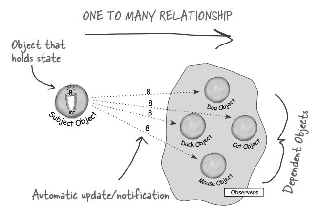

观察者模式的优缺点：

**优点：**

- 观察者和被观察者之间抽象**耦合**。观察者模式容易扩展，被观察者只持有观察者集合，并不需要知道具体观察者内部的实现。
- 对象之间的保持高度的协作。当被观察者发生变化时，所有被观察者**都会通知**到，然后做出相应的动作。

**缺点：**

- 如果观察者太多，被观察者通知观察者消耗的时间很多，影响系统的性能。
- 当观察者集合中的某一观察者错误时就会导致系统卡壳，因此一般会**采用异步**方式。

**跟代理模式对比**：观察者模式和代理模式主要区别在它们**功能不一样**，观察者模式强调的是***被观察者反馈结果***，而代理模式是***同根负责做同样的事情***。

##### 2. 使用场景

**开发中常见的场景**：

1. 聊天室程序的，服务器转发给所有客户端
2. 京东商城中，群发某商品打折信息
3. Servlet 中，**监听器**的实现
4. **邮件订阅**
5. 网络游戏(多人联机对战)场景中，服务器将客户端的状态进行分发
6. [java.util.Observer](http://docs.oracle.com/javase/8/docs/api/java/util/Observer.html)
7. [java.util.EventListener](http://docs.oracle.com/javase/8/docs/api/java/util/EventListener.html)
8. [javax.servlet.http.HttpSessionBindingListener](http://docs.oracle.com/javaee/7/api/javax/servlet/http/HttpSessionBindingListener.html)
9. [RxJava](https://github.com/ReactiveX/RxJava)

##### 3. 类图

- **主题**（Subject）具有**注册和移除**观察者、并**通知**所有观察者的功能，主题是通过**维护一张观察者列表**来实现这些操作的。

- **观察者**（Observer）的注册功能需要调用主题的 **registerObserver**() 方法。

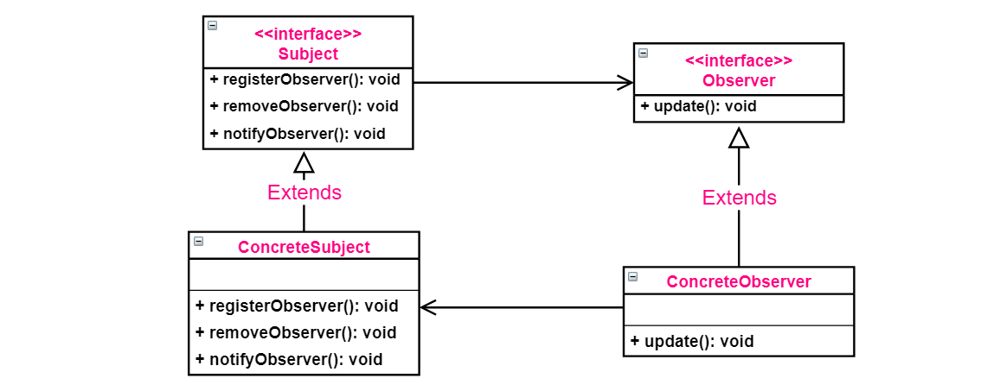

##### 4. 实现

比如天气预报系统会不定时发布一些消息，关注的用户就可以收到推送消息，取消关注就收不到推送消息。

用观察者模式完成该案例，大概有以下五步：

第一，定义**被观察者接口**：也就是一个**抽象主题**，它把所有对观察者对象的引用保存在一个集合中，每个主题都可以有任意数量的观察者。抽象主题提供一个**接口**，可以**增加和删除观察者**角色。(也可以用抽象类来实现)

```java
/**
 * 抽象被观察者接口:声明了添加、删除、通知观察者方法
 */
public interface Topic {
	// 注册观察者
    public void registerObserver(Observer o);
    // 移除观察者
    public void removeObserver(Observer o);
    // 通知观察者
    public void notifyObserver();
}
```

第二，定义**观察者接口**：为所有的**具体观察者**定义一个接口，在**得到**主题通知时**更新自己**。

```java
/**
 * 抽象观察者:定义了一个update()方法，当被观察者调用notifyObservers()方法时，
 * 观察者的update()方法会被回调。
 */
public interface Observer {
    // 收到主题时更新消息
    public void update(String message);
}
```

第三，定义具体**被观察者角色**，也就是一个**具体的主题**，在集体主题的内部状态改变时，**向所有登记过的观察者发出通知**。比如下面代码，实现了 Topic 接口，对 Topic 接口的三个方法进行了具体实现，同时有一个 **List 集合**，用以保存**注册的**观察者，等需要**通知观察者**时，遍历该集合即可。

```java
/**
 * 被观察者，也就是天气服务发布系统
 * 实现了Observerable接口，对Observerable接口的三个方法进行了具体实现
 */
public class WeatherTopic implements Topic {

    // 注意到这个List集合的泛型参数为Observer接口，
    // 设计原则：面向接口编程而不是面向实现编程
    private List<Observer> list;
    private String message;

    public WeatherTopic() {
        list = new ArrayList<>();
    }

    @Override
    public void registerObserver(Observer o) {
        list.add(o);
    }

    @Override
    public void removeObserver(Observer o) {
        if (!list.isEmpty()) {
            list.remove(o);
        }
    }

    @Override
    public void notifyObserver() {
        for (int i = 0; i < list.size(); i++) {
            Observer observer = list.get(i);
            observer.update(message);
        }
    }
    // 设置消息
    public void setInfomation(String s) {
        this.message = s;
        System.out.println("天气系统更新消息： " + s);
        //消息更新，通知所有观察者
        notifyObserver();
    }
}
```

第四，**实现观察者接口**：实现抽象观察者角色所需要的**更新接口**，一边使本身的状态与**系统的状态相协调**。

```java
/**
 * 定义具体观察者：实现了update方法
 */
public class WeatherUser implements Observer{
    private String name;
    private String message;

    public WeatherUser(String name) {
        this.name = name;
    }
	
    // 覆写观察者的更新方法，当收到天气更新通知时自己更新状态
    @Override
    public void update(String message) {
        this.message = message;
        read();
    }

    public void read() {
        System.out.println(name + " 收到推送消息： " + message);
    }
}
```

第五，客户端
首先注册了**三个用户**，zhangsan、lisi、wangwu。公众号发布了一条消息 " 今天有大雨！！！"，三个用户都收到了消息。若用户 zhangsan 不想看到天气预报推送的消息，于是取消订阅了，这时公众号又推送了一条消息 " 明天是晴天~~~"，此时用户 zhangsan 已经收不到消息，其他用户还是正常能收到推送消息。

```java
public class TestObserver {
    public static void main(String[] args) {
        // 定义天气主题
        WeatherTopic weatherTopic = new WeatherTopic();

        // 定义天气三个观察者
        Observer user1 = new WeatherUser("Bob");
        Observer user2 = new WeatherUser("Jack");
        Observer user3 = new WeatherUser("Alice");

        // 观察者注册到主题上
        weatherTopic.registerObserver(user1);
        weatherTopic.registerObserver(user2);
        weatherTopic.registerObserver(user3);

        // 主题发布消息
        weatherTopic.setInfomation("今天有大雨！！！");

        System.out.println("************************************");
        // 将User1取消订阅主题
        weatherTopic.removeObserver(user1);
        // 再次发布消息
        weatherTopic.setInfomation("明天是晴天");
    }
}
```

```java
天气系统更新消息： 今天有大雨！！！
Bob 收到推送消息： 今天有大雨！！！
Jack 收到推送消息： 今天有大雨！！！
Alice 收到推送消息： 今天有大雨！！！
************************************
天气系统更新消息： 明天是晴天
Jack 收到推送消息： 明天是晴天
Alice 收到推送消息： 明天是晴天
```


#### 状态模式（State）

##### 1. 概述

允许对象在**内部状态改变**时改变它的**行为**，对象看起来好像修改了它所属的类。用于解决系统中复杂对象的状态转换以及不同状态下行为 的封装问题。

当有状态的对象与外部事件产生互动时，其内部状态会发生改变，从而使得其行为也随之发生改变。如人的情绪有高兴的时候和伤心的时候，不同的情绪有不同的行为，当然外界也会影响其情绪变化。

对这种有状态的对象编程，传统的解决方案是：将这些所有可能发生的情况全都考虑到，然后**使用 if-else 语句**来做状态判断，再进行不同情况的处理。但当对象的状态很多时，程序会变得很复杂。这违背了“开闭原则”，不利于程序的扩展。

以上问题如果采用“状态模式”就能很好地得到解决。状态模式的解决思想是：当控制一个对象状态转换的条件表达式过于复杂时，把相关“判断逻辑”提取出来，放到一系列的状态类当中，这样可以把原来复杂的逻辑判断简单化。

##### 2. 使用场景

**开发中常见的场景**：

1. 银行系统中账号状态的管理；
2. OA 系统中公文状态的管理；
3. 酒店系统中，房间状态的管理；
4. 线程对象各状态之间的切换

##### 3. 类图

1. **环境（Context）角色**：也称为**上下文**，它定义了客户感兴趣的接口，维护**一个当前状态**，并将与状态相关的操作委托给当前状态对象来处理。
2. **抽象状态（State）角色**：定义一个接口，用以封装环境对象中的**特定状态所对应的行为**。
3. **具体状态（Concrete  State）角色**：实现抽象状态**所对应的行为**。


##### 4. 实现

在酒店系统中，**房间的状态**变化：已预订，已入住，空闲。（当遇到这种需要频繁的修改状态时，考虑状态模式）

该过程用状态模式实现，大致有以下4步：

步骤1：定义 State **抽象状态接口**，定义一个接口以封装与 Context 的一个特定状态相关的行为。

```java
public interface State {
	void handle();
}
```

步骤2：**定义 Context 环境类**，维护一个 ConcreteState 子类的实例，这个实例**记录当前的状态**。

```java
/**
 * Context类 : 房间对象
 * 如果是银行系统，这个Context类就是账号。根据金额不同，切换不同的状态！
 */
public class HomeContext {
	// 传入状态
	private State state;
    
    // 修改状态
	public void setState(State s){
		System.out.println("修改状态！");
		state = s;
		state.handle();
	}
}
```

步骤3：定义 **ConcreteState 具体状态类**，每一个类封装了一个**状态对应的行为**。

1. **已预订状态**

```java
/**
 * 已预订状态
 */
public class BookedState implements State {

	@Override
	public void handle() {
		System.out.println("房间已预订！别人不能定！");
	}
}
```

2. **已入住状态**

```java
/**
 * 已入住状态
 */
public class CheckedInState implements State {

	@Override
	public void handle() {
		System.out.println("房间已入住！请勿打扰！");
	}
}
```

3. **空闲状态**

```java
/**
 * 空闲状态
 */
public class FreeState implements State {

	@Override
	public void handle() {
		System.out.println("房间空闲！！！没人住！");
	}
}
```

步骤4：客户端测试

```java
public class Client {
	public static void main(String[] args) {
        // 获取环境上下文对象
        HomeContext ctx = new HomeContext();
        // 不断修改状态 产生两种行为
        ctx.setState(new FreeState());
        ctx.setState(new BookedState());
	}
}
```

```jade
修改状态！
房间空闲！！！没人住！
修改状态！
房间已预订！别人不能定！
```


#### 策略模式（Strategy）

##### 1. 概述

定义**一系列算法**，封装**每个算法**，并使它们可以**互换**。

策略模式对应于解决某一个问题的一个**算法族**，允许用户从该算法族中**任选一个算法**解决某一问题，同时可以方便的更换算法或者增加新的算法。并且由**客户端决定调用哪个**算法。

策略模式可以让算法**独立于**使用它的客户端。

在软件开发中也常常遇到类似的情况，当实现某一个功能存在多种算法或者策略，我们可以根据环境或者条件的不同选择不同的算法或者策略来完成该功能，如数**据排序策略**有冒泡排序、选择排序、插入排序、二叉树排序等。

**策略模式本质是**：分离算法，选择实现。

**策略模式的优点**：

- 开闭原则；
- 避免使用多重条件转移语句；
- 提高了算法的保密性和安全性：可使用策略模式以避免暴露复杂的，与算法相关的数据结构。

**策略模式体现了面向对象程序设计中非常重要的两个原则**：

1. 封装变化的概念。
2. 编程中使用接口，而不是使用的是具体的实现类(面向接口编程)。

##### 2. 使用场景

开发中常见的场景：

- JAVASE 中 GUI 编程中，布局管理 ；
- Spring 框架中，Resource 接口，**资源访问**；
- javax.servlet.http.HttpServlet#service()；
- 如果一个方法有大量 if else 语句，可通过**策略模式**来消除掉；
- 一个系统，需要**动态地在几个算法中选择一种**，可用策略模式实现；
- 系统有很多类，而他们的区别仅仅在于他们的行为不同。
- java.util.Comparator#**compare**()
- javax.servlet.http.**HttpServlet**
- javax.servlet.Filter#**doFilter**()

##### 3. 类图

- 抽象策略（Strategy）接口：定义了一个算法族，包含  **behavior**() 方法。
- **具体策略**（Concrete Strategy）类：**实现**了抽象策略定义的接口，提供具体的算法实现。
- 上下文环境（**Context**） 是使用到该算法族的类，其中的 **doSomething**() 方法会调用 behavior()，setStrategy(Strategy) 方法可以动态地改变 strategy 对象，也就是说能**动态地改变 Context 所使用的算法**。Context 持有一个策略类的引用，最终给客户端调用。


##### 4. 实现

比如：去买衣服

1. 新客户小批量：原价，不打折
2. 新客户大批量：打九折
3. 老客户小批量：打八五折
4. 老客户大批量：打8折

可用 **if else** 来实现，弊端也很明显，如代码注释中解释，代码参考如下：

```java
/**
 * 实现起来比较容易，符合一般开发人员的思路
 * 假如，类型特别多，算法比较复杂时，整个条件语句的代码就变得很长，难于维护。
 * 如果有新增类型，就需要频繁的修改此处的代码！
 * 不符合开闭原则！
 */
public class TestStrategy {
	public double getPrice(String type, double price) {
		if (type.equals("普通客户小批量")) {
			System.out.println("不打折,原价");
			return price;
		} else if (type.equals("普通客户大批量")) {
			System.out.println("打九折");
			return price * 0.9;
		} else if (type.equals("老客户小批量")) {
			System.out.println("打八五折");
			return price * 0.85;
		} else if (type.equals("老客户大批量")) {
			System.out.println("打八折");
			return price * 0.8;
		}
		return price;
	}
}
```

下面用策略模式来实现去买衣服打折的问题：
第一步：定义**抽象策略角色**，通常情况下使用**接口**或者抽象类去实现，相当于一个**算法族**。

```java
public interface Strategy {
	public double getPrice(double standardPrice);
}
```

第二步：实现**策略接口**，实现具体的策略，相当于实现几个不同的**算法**。

```java
/**
 * 新客户小批量
 */
public class NewCustomerFewStrategy implements Strategy {
	
	@Override
	public double getPrice(double standardPrice) {
		System.out.println("不打折，原价");
		return standardPrice;
	}
}
```

```java
/**
 * 新客户大批量
 */
public class NewCustomerManyStrategy implements Strategy {

	@Override
	public double getPrice(double standardPrice) {
		System.out.println("打九折");
		return standardPrice*0.9;
	}
}
```

```java
/**
 * 老客户小批量
 */
public class OldCustomerFewStrategy implements Strategy {

	@Override
	public double getPrice(double standardPrice) {
		System.out.println("打八五折");
		return standardPrice*0.85;
	}
}
```

```java
/**
 * 老客户大批量
 */
public class OldCustomerManyStrategy implements Strategy {

	@Override
	public double getPrice(double standardPrice) {
		System.out.println("打八折");
		return standardPrice*0.8;
	}
}
```

第三步：**定义环境角色** Context，负责和具体的**策略类交互**，内部持有一个**策略类的引用**，给客户端调用。

```java
/**
 * 负责和具体的策略类交互
 * 这样的话，具体的算法和直接的客户端调用分离了，使得算法可以独立于客户端独立的变化。
 * 如果使用spring的依赖注入功能，还可以通过配置文件，动态的注入不同策略对象，动态的切换不同的算法.
 */
public class MallContext {
	private Strategy strategy;	//当前采用的算法对象

	//可以通过构造器来注入
	public MallContext(Strategy strategy) {
		super();
		this.strategy = strategy;
	}
	//可以通过set方法来注入
	public void setStrategy(Strategy strategy) {
		this.strategy = strategy;
	}
	
	public void pringPrice(double s){
		System.out.println("您该报价："+strategy.getPrice(s));
	}
}
```

第四步：测试

```java
/**
 * 测试类
 */
public class Client {
	public static void main(String[] args) {
		// 自己选择使用何种策略
		Strategy s1 = new OldCustomerManyStrategy();
        // 根据选择的策略使用不同的算法
		MallContext ctx = new MallContext(s1);
		ctx.pringPrice(500);
	}
}
```

```
打八折
您该报价:400.0
```

##### 5. 拓展

策略模式类图与状态模式类图好像啊。

> **与状态模式的比较**

状态模式的类图和策略模式类似，并且都是能够**动态**改变对象的行为。但是**状态模式**是通过**状态转移**来改变 Context 所组合的 State 对象，而**策略模式**是通过 Context **本身的决策**来改变组合的 Strategy 对象。所谓的**状态转移**，是指 Context 在运行过程中由于一些条件发生改变而使得 State 对象发生改变，注意必须要是在运行过程中。

**状态模式**主要是用来解决**状态转移**的问题，当状态发生转移了，那么 Context 对象就会改变它的行为；而**策略模式**主要是用来**封装一组可以互相替代的算法族**，并且可以根据需要**动态地去替换** Context 使用的算法。


#### 模板方法模式（Template Method）

##### 1. 概述

定义**算法框架**，并将一些步骤的**实现延迟到子类**。

通过模板方法，**子类可以重新定义算法的某些步骤**，而**不用改变算法的结构**。

例如，去银行办理业务一般要经过以下 4 个流程：**取号、排队、办理具体业务、对银行工作人员进行评分**等，其中取号、排队和对银行工作人员进行评分的业务对每个客户是一样的，可以在父类中实现，但是办理具体业务却因人而异，它可能是存款、取款或者转账等，可以延迟到子类中实现。

这样的例子在生活中还有很多，例如，一个人每天会**起床、吃饭、做事、睡觉**等，其中“做事”的内容每天可能不同。我们把这些规定了流程或格式的实例定义成模板，允许使用者根据自己的需求去更新它，例如，简历模板、论文模板、Word 中模板文件等。

**核心**：父类中**定义好处理步骤**，具体实现延迟到**子类实现**。

**什么时候用到模板方法模式**：实现一个算法时，**整体步骤很固定**。但是**某些部分易变**，易变部分可以抽象出来，供子类实现。

##### 2. 使用场景

**开发中常见的场景**：非常频繁，各个框架，类库中都有他的影子。比如：

1. **数据库访问**的封装；
2. Junit 单元测试；
3.  ；
4. Hibernate 中模板程序；
5. Spring 中 **JDBCTemplate , HibernateTemplate** 等；
6. java.util.Collections#**sort**()
7. java.io.InputStream#skip()
8. java.io.InputStream#**read**()
9. java.util.AbstractList#indexOf()

##### 3. 类图

(1) **抽象类**（Abstract Class）：负责给出一个算法的轮廓和骨架。它由一个模板方法和若干个基本方法构成。这些方法的定义如下。

① 模板方法：定义了算法的骨架，按某种**顺序调用**其包含的基本方法。

② 基本方法：是整个算法中的一个**步骤**，包含以下几种类型。

- 抽象方法：在抽象类中申明，由具体子类实现。
- 具体方法：在抽象类中已经实现，在具体子类中可以继承或重写它。
- 钩子方法：在抽象类中已经实现，包括用于判断的逻辑方法和需要子类重写的空方法两种。


(2) **具体子类**（Concrete Class）：实现抽象类中所定义的抽象方法和钩子方法，它们是一个顶级逻辑的一个组成步骤。


##### 4. 实现

冲咖啡和冲茶都有类似的流程，但是**某些步骤**会有点不一样，要求**复用那些相同步骤**的代码。如下图有两个方法不同，两个方法相同。


**抽象父类**：prepareRecipe() 方法包含整个饮料准备流程，当做是模板流程。抽象父类提供了公共方法的实现，对于特殊的业务行为需要由子类实现。

```java
public abstract class CaffeineBeverage {
	// 泡茶和冲咖啡都具有的步骤
    final void prepareRecipe() {
        boilWater();
        brew();
        pourInCup();
        addCondiments();
    }
	
    // 子类完成自己的独有的方法
    abstract void brew();
    abstract void addCondiments();

    // 以下两个方法是都有的方法
    void boilWater() {
        System.out.println("烧水");
    }

    void pourInCup() {
        System.out.println("饮料倒入杯中");
    }
}
```

**咖啡子类**

```java
public class Coffee extends CaffeineBeverage {
    // 覆写第二个特殊的方法
    @Override
    void brew() {
        System.out.println("煮咖啡");
    }

    @Override
    void addCondiments() {
        System.out.println("添加咖啡调味料");
    }
}
```

**茶子类**

```java
public class Tea extends CaffeineBeverage {
    // 覆写第三个特殊的方法
    @Override
    void brew() {
        System.out.println("煮茶");
    }

    // 覆写第三个特殊的方法
    @Override
    void addCondiments() {
        System.out.println("茶中加入调味料");
    }
}
```

测试

```java
public class Client {
    public static void main(String[] args) {
        CaffeineBeverage caffeineBeverage = new Coffee();
        caffeineBeverage.prepareRecipe();
        System.out.println("-----------");
        caffeineBeverage = new Tea();
        caffeineBeverage.prepareRecipe();
    }
}
```

```html
烧水
煮咖啡
饮料倒入杯中
添加咖啡调味料
-----------
烧水
煮茶
饮料倒入杯中
茶中加入调味料
```


#### 访问者模式（Visitor）

##### 1. 概述

为一个对象结构（比如组合结构）**增加新能力**。表示一个作用于某对象结构中的各元素的操作。它使你可以在**不改变**各元素类别的前提下**定义**作用于这些元素的**新操作**。

**模式动机**：对于存储在一个集合中的对象，他们可能具有**不同的类型(即使有一个公共的接口)**，对于该集合中的对象，可以接受一类称为访问者的对象来访问，**不同的访问者其访问方式也有所不同**。

例如，公园中存在多个景点，也存在多个游客，不同的游客对同一个景点的评价可能不同；医院医生开的处方单中包含多种药元素，査看它的划价员和药房工作人员对它的处理方式也不同，划价员根据处方单上面的药品名和数量进行划价，药房工作人员根据处方单的内容进行抓药。

##### 2. 使用场景

**开发中的场景** : (应用范围**非常窄**，了解即可)：

1. XML 文档解析器设计;
2. 编译器的设计;
3. 复杂集合对象的处理
4. javax.lang.model.element.Element and javax.lang.model.element.ElementVisitor
5. javax.lang.model.type.TypeMirror and javax.lang.model.type.TypeVisitor

##### 3. 类图

- **Visitor**：访问者，为每一个 ConcreteElement 声明一个 visit 操作
- **ConcreteVisitor**：具体访问者，存储遍历过程中的累计结果
- **ObjectStructure**：对象结构，可以是组合结构，或者是一个集合。


##### 4. 实现

**元素接口**

```java
public interface Element {
    void accept(Visitor visitor);
}
```

顾客

```java
public class Customer implements Element {

    private String name;
    private List<Order> orders = new ArrayList<>();

    Customer(String name) {
        this.name = name;
    }

    String getName() {
        return name;
    }

    void addOrder(Order order) {
        orders.add(order);
    }

    public void accept(Visitor visitor) {
        visitor.visit(this);
        for (Order order : orders) {
            order.accept(visitor);
        }
    }
}
```

顾客组

```java
class CustomerGroup {
	// 顾客列表
    private List<Customer> customers = new ArrayList<>();

    void accept(Visitor visitor) {
        for (Customer customer : customers) {
            customer.accept(visitor);
        }
    }
	// 添加顾客
    void addCustomer(Customer customer) {
        customers.add(customer);
    }
}
```

订单

```java
public class Order implements Element {

    private String name;
    private List<Item> items = new ArrayList();

    Order(String name) {
        this.name = name;
    }

    Order(String name, String itemName) {
        this.name = name;
        this.addItem(new Item(itemName));
    }

    String getName() {
        return name;
    }

    void addItem(Item item) {
        items.add(item);
    }

    public void accept(Visitor visitor) {
        visitor.visit(this);

        for (Item item : items) {
            item.accept(visitor);
        }
    }
}
```

条目

```java
public class Item implements Element {

    private String name;

    Item(String name) {
        this.name = name;
    }

    String getName() {
        return name;
    }

    public void accept(Visitor visitor) {
        visitor.visit(this);
    }
}
```

**访问者接口**

```java
public interface Visitor {
    void visit(Customer customer);

    void visit(Order order);

    void visit(Item item);
}
```

**访问者接口实现类**

```java
public class GeneralReport implements Visitor {
	
    private int customersNo;
    private int ordersNo;
    private int itemsNo;

    // 访问某个顾客
    public void visit(Customer customer) {
        System.out.println(customer.getName());
        customersNo++;
    }

    // 访问订单
    public void visit(Order order) {
        System.out.println(order.getName());
        ordersNo++;
    }
	// 访问条目
    public void visit(Item item) {
        System.out.println(item.getName());
        itemsNo++;
    }

    public void displayResults() {
        System.out.println("Number of customers: " + customersNo);
        System.out.println("Number of orders:    " + ordersNo);
        System.out.println("Number of items:     " + itemsNo);
    }
}
```

测试

```java
public class Client {
    public static void main(String[] args) {
        // 构造用户，订单，条目
        Customer customer1 = new Customer("customer1");
        customer1.addOrder(new Order("order1", "item1"));
        customer1.addOrder(new Order("order2", "item1"));
        customer1.addOrder(new Order("order3", "item1"));
        Order order = new Order("order_a");
        order.addItem(new Item("item_a1"));
        order.addItem(new Item("item_a2"));
        order.addItem(new Item("item_a3"));
        
        Customer customer2 = new Customer("customer2");
        customer2.addOrder(order);
		// 构造用户组
        CustomerGroup customers = new CustomerGroup();
        customers.addCustomer(customer1);
        customers.addCustomer(customer2);
		// 构造访问者
        GeneralReport visitor = new GeneralReport();
        // 接收访问者
        customers.accept(visitor);
        // 展示访问结果
        visitor.displayResults();
    }
}
```

```html
customer1
order1
item1
order2
item1
order3
item1
customer2
order_a
item_a1
item_a2
item_a3
Number of customers: 2
Number of orders:    4
Number of items:     6
```


#### 空对象（Null）

##### 1. 概述

使用什么都不做的**空对象来代替 NULL**。

一个方法返回 NULL，意味着方法的调用端需要去检查返回值是否是 NULL，这么做会**导致非常多的冗余的检查代码**。并且如果某一个调用端忘记了做这个检查返回值，而直接使用返回的对象，那么就有可能抛出空指针异常 NPE。

##### 2. 类图


##### 3. 实现

**抽象操作**。

```java
public abstract class AbstractOperation {
    abstract void request();
}
```

**不为空**时的行为

```java
public class RealOperation extends AbstractOperation {
    @Override
    void request() {
        System.out.println("do something");
    }
}
```

**为空时**的行为

```java
public class NullOperation extends AbstractOperation{
    @Override
    void request() {
        // do nothing
    }
}
```

```java
public class Client {
    public static void main(String[] args) {
        //  使用抽象父类来进行操作 
        AbstractOperation abstractOperation = func(-1);
        abstractOperation.request();
    }
	// 根据不同的情况返回不同的对象
    public static AbstractOperation func(int para) {
        if (para < 0) {
            return new NullOperation();
        }
        return new RealOperation();
    }
}
```


### 五、设计模式-结构型

#### 适配器模式（Adapter）

##### 1. 概述

把一个**类接口**转换成另一个用户需要的接口。Adapter 模式使得原本由于**接口不兼容**而不能一起工作的那些类可以一起工作。

例如，讲中文的人同讲英文的人对话时需要一个**翻译**，用直流电的笔记本电脑接交流电源时需要一个**电源适配器**，用计算机访问照相机的 SD 内存卡时需要一个**读卡器**等。

在软件设计中也可能出现：需要开发的具有某种业务功能的组件在现有的组件库中**已经存在**，但它们与当前系统的**接口规范不兼容**，如果重新开发这些组件成本又很高，这时用**适配器模式**能很好地解决这些问题。

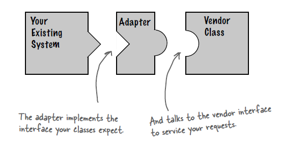

定义一个**包装类**，用于**包装不兼容接口的对象**：

- **包装类 = 适配器 Adapter**；
- **被包装对象 = 适配者Adaptee = 被适配的类**

**类的适配器模式和对象的适配器模式的选择：**

适配器模式的形式分为：**类的适配器模式 & 对象的适配器模式**

- 灵活使用时：选择对象的适配器模式，类适配器使用对象继承的方式，是静态的定义方式；而对象适配器使用对象组合的方式，是动态组合的方式。
- 需要同时配源类和其子类：选择对象的适配器，对于对象适配器，一个适配器可以把多种不同的源适配到同一个目标。
- 需要重新定义 Adaptee 的部分行为：选择类适配器。对于类适配器，适配器可以重定义 Adaptee 的部分行为，相当于子类覆盖父类的部分实现方法。对于对象适配器，要重定义 Adaptee 的行为比较困难。
- 仅仅希望使用方便时：选择类适配器，对于类适配器，仅仅引入了一个对象，并不需要额外的引用来间接得到Adaptee。对于对象适配器，需要额外的引用来间接得到Adaptee。

##### 2. 使用场景

**使用场景：**

- 系统需要复用现有类，而该类的接口**不符合**系统的需求，可以使用适配器模式使得原本由于接口不兼容而不能一起工作的那些类可以一起工作。
- 多个组件功能**类似**，但接口**不统一**且可能会经常切换时，可使用适配器模式，使得客户端可以以统一的接口使用它们。
- 需要一个**统一的输出接口**，但是**输入类型却不可预知**。

- [java.util.Arrays#asList()](http://docs.oracle.com/javase/8/docs/api/java/util/Arrays.html#asList%28T...%29)
- [java.util.Collections#list()](https://docs.oracle.com/javase/8/docs/api/java/util/Collections.html#list-java.util.Enumeration-)
- [java.util.Collections#enumeration()](https://docs.oracle.com/javase/8/docs/api/java/util/Collections.html#enumeration-java.util.Collection-)
- [javax.xml.bind.annotation.adapters.XMLAdapter](http://docs.oracle.com/javase/8/docs/api/javax/xml/bind/annotation/adapters/XmlAdapter.html#marshal-BoundType-)

##### 3. 类图

适配器模式（Adapter）包含以下主要角色。

1. **目标（Target）接口**：当前系统业务**所期待**的接口，它可以是抽象类或接口。
2. **适配者（Adaptee）类**：它是**被访问**和适配的**现存组件库**中的组件接口。
3. **适配器（Adapter）类**：它是一个**转换器**，通过继承或引用适配者的对象，把**适配者接口转换成目标接口**，让客户按目标接口的格式访问适配者。


##### 4. 实现

下面以一个案例来介绍设配器模式：该过程大概分成 4 步：

步骤1：定义**目标接口**（Target）：**客户所期待的接口**。目标可以是具体的或抽象的类，也可以是接口。

```java
public interface Target {
	void handleReq();
}
```

步骤2：定义 **需要适配的类（Adaptee）**：需要**被适配**的类或适配者类。

```java
/**
 * 被适配的类
 * (相当于例子中的，PS/2键盘)
 */
public class Adaptee {
	
	public void request(){
		System.out.println("可以完成客户请求的需要的功能！");
	}
}
```

步骤3：**定义适配器（Adapter）**：通过包装一个需要适配的对象，把**原接口转换成目标接口**。

```java
/**
 * 适配器 (类适配器方式)
 * (相当于usb和ps/2的转接器)
 */
public class Adapter extends Adaptee implements Target {
    
	@Override
	public void handleReq() {
		super.request();
	}
}
```

**对象适配器**方式:

```java
/**
 * 适配器 (对象适配器方式,使用了组合的方式跟被适配对象整合)
 * (相当于usb和ps/2的转接器)
 */
public class Adapter2 implements Target {
	// 被适配对象
	private Adaptee adaptee;

	@Override
	public void handleReq() {
		adaptee.request();
	}

	public Adapter2(Adaptee adaptee) {
		super();
		this.adaptee = adaptee;
	}
}
```

步骤4：测试

```java
/**
 * 客户端类:测试
 */
public class Client {
	
	public void test1(Target t){
		t.handleReq();
	}
	
	public static void main(String[] args) {
		Client  c = new Client();
		Adaptee a = new Adaptee();
//		Target t = new Adapter();
		Target t = new Adapter2(a);
		c.test1(t);
	}
}
```

```java
可以完成客户请求的需要的功能！
```


#### 桥接模式（Bridge）

##### 1. 概述

将**抽象与实现分离**开来，使它们可以**独立变化**。就像一个桥，将**两个变化维度连接**起来。各个维度都可以**独立的变化**。故称之为桥接模式。

**核心要点** ： 处理**多层继承**结构，处理**多维度变化**的场景，将各个维度设计成独立的继承结构，使各个维度可以独立的扩展在抽象层建立关联。

在现实生活中，某些类具有**两个或多个维度**的变化，如图形既可按**形状分，又可按颜色分**。如何设计类似于 Photoshop 这样的软件，能画不同形状和不同颜色的图形呢？如果用继承方式，m 种形状和 n 种颜色的图形就有 m×n 种，不但对应的**子类很多**，而且扩展困难。

当然，这样的例子还有很多，如不同颜色和字体的文字、不同品牌和功率的汽车、不同性别和职业的男女、支持不同平台和不同文件格式的媒体播放器等。如果用桥接模式就能很好地解决这些问题。

它是用**组合关系代替继承关系**来实现，从而降低了抽象和实现这两个可变维度的耦合度。

##### 2. 使用场景

**实际开发中应用场景**:

1. JDBC 驱动程序;
2. AWT 中的 Peer 架构;
3. 银行日志管理：格式分类：操作日志、交易日志、异常日志。距离分类：本地记录日志、异地记录日志。

##### 3. 类图

桥接（Bridge）模式包含以下主要角色。

1. **抽象化**（Abstraction）角色：定义抽象类，并包含一个对**实现化对象的引用**。
2. **扩展抽象化**（Refined  Abstraction）角色：是**抽象化角色的子类**，实现父类中的业务方法，并通过**组合关系**调用实现化角色中的业务方法。
3. **实现化**（Implementor）角色：定义实现化角色的接口，供扩展抽象化角色调用。
4. **具体实现化**（Concrete Implementor）角色：给出实现化角色接口的**具体实现**。


##### 4. 实现

RemoteControl 表示**遥控器**，指代 **Abstraction**。

TV 表示**电视**，指代 **Implementor**。

桥接模式将**遥控器和电视分离开**来，从而可以独立改变遥控器或者电视的实现。

```java
public abstract class TV {
    public abstract void on();

    public abstract void off();

    public abstract void tuneChannel();
}
```

```java
public class Sony extends TV {
    @Override
    public void on() {
        System.out.println("Sony.on()");
    }

    @Override
    public void off() {
        System.out.println("Sony.off()");
    }

    @Override
    public void tuneChannel() {
        System.out.println("Sony.tuneChannel()");
    }
}
```

```java
public class RCA extends TV {
    @Override
    public void on() {
        System.out.println("RCA.on()");
    }

    @Override
    public void off() {
        System.out.println("RCA.off()");
    }

    @Override
    public void tuneChannel() {
        System.out.println("RCA.tuneChannel()");
    }
}
```

遥控器抽象类

```java
public abstract class RemoteControl {
    // 需要控制的电视对象
    protected TV tv;

    public RemoteControl(TV tv) {
        this.tv = tv;
    }
	
    // 几个抽象方法
    public abstract void on();
    public abstract void off();
    public abstract void tuneChannel();
}
```

遥控器实现类1

```java
public class ConcreteRemoteControl1 extends RemoteControl {
    public ConcreteRemoteControl1(TV tv) {
        super(tv);
    }

    @Override
    public void on() {
        System.out.println("ConcreteRemoteControl1.on()");
        tv.on();
    }

    @Override
    public void off() {
        System.out.println("ConcreteRemoteControl1.off()");
        tv.off();
    }

    @Override
    public void tuneChannel() {
        System.out.println("ConcreteRemoteControl1.tuneChannel()");
        tv.tuneChannel();
    }
}
```

遥控器实现类2

```java
public class ConcreteRemoteControl2 extends RemoteControl {
    public ConcreteRemoteControl2(TV tv) {
        super(tv);
    }

    @Override
    public void on() {
        System.out.println("ConcreteRemoteControl2.on()");
        tv.on();
    }

    @Override
    public void off() {
        System.out.println("ConcreteRemoteControl2.off()");
        tv.off();
    }

    @Override
    public void tuneChannel() {
        System.out.println("ConcreteRemoteControl2.tuneChannel()");
        tv.tuneChannel();
    }
}
```

```java
public class Client {
    public static void main(String[] args) {
        // 遥控器1控制RCA电视
        RemoteControl remoteControl1 = new ConcreteRemoteControl1(new RCA());
        remoteControl1.on();
        remoteControl1.off();
        remoteControl1.tuneChannel();
        // 遥控器2控制Sony电视
        RemoteControl remoteControl2 = new ConcreteRemoteControl2(new Sony());
        remoteControl2.on();
        remoteControl2.off();
        remoteControl2.tuneChannel();
    }
}
```

```java
ConcreteRemoteControl1.on()
RCA.on()
ConcreteRemoteControl1.off()
RCA.off()
ConcreteRemoteControl1.tuneChannel()
RCA.tuneChannel()
ConcreteRemoteControl2.on()
Sony.on()
ConcreteRemoteControl2.off()
Sony.off()
ConcreteRemoteControl2.tuneChannel()
Sony.tuneChannel()
```


#### 组合模式（Composite）

##### 1. 概述

存在很多“**部分-整体**”的关系，例如，大学中的部门与学院、总公司中的部门与分公司、学习用品中的书与书包、生活用品中的衣月艮与衣柜以及厨房中的锅碗瓢盆等。在软件开发中也是这样，例如，文件系统中的文件与文件夹、窗体程序中的简单控件与容器控件等。对这些简单对象与复合对象的处理，如果用组合模式来实现会很方便。

将对象组合成**树形结构**来表示“**整体-部分**”层次关系，允许用户以**相同的方式处理单独对象和组合对象**。

##### 2. 使用场景

**开发中的应用场景**：

1. 操作系统的资源管理器
2. GUI 中的**容器层次图**
3. **XML 文件解析**
4. OA 系统中，组织结构的处理
5. **Junit 单元测试框架** : 底层设计就是典型的组合模式，TestCase(叶子)、TestUnite(容器)、Test接口(抽象)
6. javax.swing.JComponent#**add**(Component)
7. java.awt.Container#**add**(Component)
8. java.util.Map#**putAll**(Map)
9. java.util.List#**addAll**(Collection)
10. java.util.Set#**addAll**(Collection)

##### 3. 类图

1. **component** (抽象构件：**容器**)：它可以是接口或者抽象类，为**叶子**构建和**子容器**构建对象声明接口，在该角色中可以包含**所有子类共有的行为的实现和声明**。在抽象构建中定义了访问及管理它的子构件的方法，如增加子构件，删除子构件，获取子构件等。它**定义了叶子和容器构件的共同点**。
2. **leaf**(**叶子**构建)：叶子构建可以说就是各**种类型的文件**！叶子构建没有子构件。它**实现了抽象构建中的定义的行为**。对于那些访问子容器，删除子容器，增加子容器的就报错。
3. **compsite**(**子容器**构建)：它在组合模式中表示容器节点对象，容器结点是子节点，可以是子容器，也可以是叶子构建，它提供一个集合来存储子节点。它有容器特征，可以包含子节点。

**组件（Component）类**是**组合类**（Composite）和**叶子类**（Leaf）的父类，可以把**组合类**看成是树的**中间节点。**

**组合对象拥有一个或者多个组件对象**，因此组合对象的操作可以委托给组件对象去处理，而组件对象可以是另一个组合对象或者叶子对象。


##### 4. 实现

```java
public abstract class Component {
    protected String name;

    public Component(String name) {
        this.name = name;
    }

    public void print() {
        print(0);
    }

    // 几个抽象方法
    abstract void print(int level);
    abstract public void add(Component component);
    abstract public void remove(Component component);
}
```

中间结点

```java
public class Composite extends Component {
	// 中间结点可以存放叶子结点
    private List<Component> child;

    public Composite(String name) {
        super(name);
        child = new ArrayList<>();
    }
	
    // 打印这个组件
    @Override
    void print(int level) {
        for (int i = 0; i < level; i++) {
            System.out.print("--");
        }
        System.out.println("Composite:" + name);
        for (Component component : child) {
            component.print(level + 1);
        }
    }

    @Override
    public void add(Component component) {
        child.add(component);
    }

    @Override
    public void remove(Component component) {
        child.remove(component);
    }
}
```

叶子类

```java
public class Leaf extends Component {
    public Leaf(String name) {
        super(name);
    }

    @Override
    void print(int level) {
        for (int i = 0; i < level; i++) {
            System.out.print("--");
        }
        System.out.println("left:" + name);
    }

    @Override
    public void add(Component component) {
        // 牺牲透明性换取单一职责原则，这样就不用考虑是叶子节点还是组合节点
        throw new UnsupportedOperationException(); 
    }

    @Override
    public void remove(Component component) {
        throw new UnsupportedOperationException();
    }
}
```

```java
public class Client {
    public static void main(String[] args) {
        // 构造根节点
        Composite root = new Composite("root");
        Component node1 = new Leaf("1");
        Component node2 = new Composite("2");
        Component node3 = new Leaf("3");
        root.add(node1);
        root.add(node2);
        root.add(node3);
        Component node21 = new Leaf("21");
        Component node22 = new Composite("22");
        node2.add(node21);
        node2.add(node22);
        Component node221 = new Leaf("221");
        node22.add(node221);
        // 测试打印整个树
        root.print();
    }
}
```

```html
Composite:root
--left:1
--Composite:2
----left:21
----Composite:22
------left:221
--left:3
```


#### 装饰者模式（Decorator）

##### 1. 概述

为对象**动态添加功能**。也叫包装器模式（Wrapper），装饰模式是一种用于替代继承的技术，无需通过子类增加继承就能拓展对象的新功能；使用对象的**关联关系**替代继承关系，更加灵活，同时避免类型体系的快速膨胀。

在现实生活中，常常需要对**现有产品增加新的功能或美化其外观**，如房子装修、相片加相框等。在软件开发过程中，有时想用一些现存的组件。这些组件可能只是完成了一些核心功能。但在不改变其结构的情况下，可以**动态**地扩展其功能。所有这些都可以釆用装饰模式来实现。

**优点：**

- 扩展对象功能，比继承灵活，不会导致类个数急剧增加；
- 可以对一个对象进行多次装饰，创造出不同行为的组合，得到功能更加强大的对象；
- 具体构建类和具体装饰类可以独立变化，用户可以根据需要自己增加；
- 新的具体构件子类和具体装饰子类。

**缺点：**

- 产生很多小对象。大量小对象占据内存，一定程度上影响性能；
- 装饰模式易于出错，调试排查比较麻烦。

##### 2. 使用场景

开发中使用的场景：

1. 典型应用场景就是：**IO 中输入流和输出流**的设计；
2. Swing 包中图形界面构件功能；
3. Servlet API 中提供了一个 reques t对象的 Decorator 设计模式的默认实现类 HttpServletRequestWrapper，HttpServletRequestWrapper 类，**增强了 request 对象**的功能；
4. Struts2中，**request，response, session 对象的处理**。
5. java.io.**BufferedInputStream**(InputStream)
6. java.io.**DataInputStream**(InputStream)
7. java.io.**BufferedOutputStream**(OutputStream)
8. java.util.zip.**ZipOutputStream**(OutputStream)
9. java.util.Collections#checked[List|Map|Set|SortedSet|SortedMap]()

##### 3. 类图

装饰模式主要包含以下角色。

1. 抽象构件（Component）角色：定义一个抽象接口以规范准备接收附加责任的对象。
2. 具体构件（Concrete  Component）角色：实现抽象构件，通过装饰角色为其添加一些职责。
3. 抽象装饰（Decorator）角色：继承抽象构件，并包含具体构件的实例，可以通过其子类扩展具体构件的功能。
4. 具体装饰（ConcreteDecorator）角色：实现抽象装饰的相关方法，并给具体构件对象添加附加的责任。

装饰者（Decorator）和具体组件（ConcreteComponent）都继承自组件（Component），具体组件的方法实现不需要依赖于其它对象，而装饰者组合了一个组件，这样它可以装饰其它装饰者或者具体组件。

、所谓装饰，就是把这个装饰者套在被装饰者之上，从而动态扩展被装饰者的功能。装饰者的方法有一部分是自己的，这属于它的功能，然后调用被装饰者的方法实现，从而也保留了被装饰者的功能。可以看到，具体组件应当是装饰层次的最低层，因为只有具体组件的方法实现不需要依赖于其它对象。


##### 4. 实现

设计不同种类的**饮料**，饮料可以添加**配料**，比如可以添加牛奶，并且支持**动态添加新配料**。

每增加一种配料，该饮料的价格就会增加，要求计算一种饮料的价格。

> **开闭原则**

类应该**对扩展开放，对修改关闭**：也就是添加新功能时不需要修改代码。饮料可以动态添加新的配料，而不需要去修改饮料的代码。

不可能把所有的类设计成都满足这一原则，应当把该原则应用于**最有可能发生改变**的地方。

下图表示在 **DarkRoast 饮料**上新增新添加 **Mocha 配料**，之后又添加了 **Whip 配料**。DarkRoast 被 Mocha 包裹，Mocha 又被 Whip 包裹。它们都继承自**相同父类**，都有 cost() 方法，外层类的 cost() 方法调用了内层类的 cost() 方法。

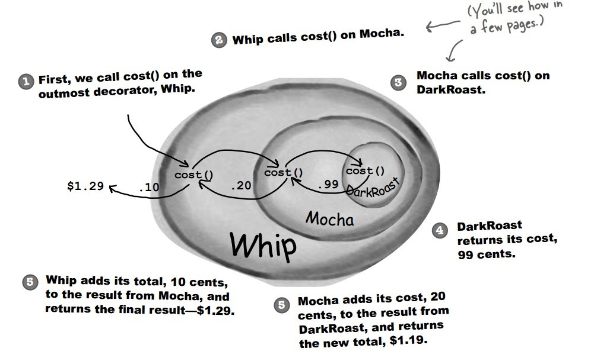

**饮料接口**

```java
public interface Beverage {
    double cost();
}
```

具体饮料 1

```java
public class DarkRoast implements Beverage {
    @Override
    public double cost() {
        return 1;
    }
}
```

具体饮料 2

```java
public class HouseBlend implements Beverage {
    @Override
    public double cost() {
        return 1;
    }
}
```

**调味品装饰器类**

```java
public abstract class CondimentDecorator implements Beverage {
    // 传入需装饰的饮料类
    protected Beverage beverage;
}
```

配料类-牛奶

```java
public class Milk extends CondimentDecorator {

    public Milk(Beverage beverage) {
        this.beverage = beverage;
    }

    @Override
    public double cost() {
        return 1 + beverage.cost();
    }
}
```

配料类-抹茶

```java
public class Mocha extends CondimentDecorator {

    public Mocha(Beverage beverage) {
        this.beverage = beverage;
    }

    @Override
    public double cost() {
        return 1 + beverage.cost();
    }
}
```

```java
public class Client {

    public static void main(String[] args) {
        // 点了一杯HouseBlend
        Beverage beverage = new HouseBlend();
        // 在HouseBlend外面包装上抹茶和牛奶 每包装一层增加一次价格
        beverage = new Mocha(beverage);
        beverage = new Milk(beverage);
        // 计算总的价格
        System.out.println(beverage.cost());
    }
}
```

```html
3.0
```

##### 5. 拓展

> **装饰模式和桥接模式的区别**

两个模式都是为了解决**过多子类对象**问题。但他们的诱因不一样。桥模式是对象自身现有机制**沿着多个维度变化**，是既有部分不稳定。装饰模式是为了**增加新的**功能。


#### 外观模式（Facade）

##### 1. 概述

在现实生活中，常常存在办事较复杂的例子，如办房产证或注册一家公司，有时要同**多个小部门**联系，这时要是有一个综合部门能解决一切手续问题就好了。

软件设计也是这样，当一个系统的功能越来越强，**子系统**会越来越多，客户对系统的访问也变得越来越复杂。这时如果系统内部发生改变，客户端也要跟着改变，这违背了“开闭原则”，也违背了“迪米特法则”，所以有必要为多个子系统提供一个统一的接口，从而降低系统的耦合度，这就是外观模式的目标。

提供了一个**统一的接口**，用来访问**子系统中的一群接口**，从而让**子系统**更容易使用。

**外观模式核心**： 为子系统提供**统一的入口**。封装子系统的复杂性，便于客户端调用。使得客户端和子系统之间解耦，让子系统内部的模块功能更容易扩展和维护。

通过**门面 Facade** 来与子系统打交道。

##### 2. 使用场景

**开发中常见的场景** ： 应用频率很高。哪里都会遇到。各种技术和框架中，都有外观模式的使用。如：

- Hibernate 提供的**工具类**
- Spring JDBC **工具类**等

##### 3. 类图

简单来说，该模式就是把一些**复杂的流程**封装成一个**接口**供给外部用户更简单的使用。

这个模式中，设计到 3 个角色。
　　1）**子系统角色** （Sub System）: 实现了子系统的功能。它对客户角色和 Facade 时未知的。它内部可以有系统内的相互交互，也可以由供外界调用的接口。
　　2） **门面角色**（facade）：外观模式的核心。它被客户角色调用，它熟悉子系统的功能。内部根据客户角色的需求预定了几种功能的组合。
　　3）**客户角色**（client） : 通过调用 Facede 来完成要实现的功能。


##### 4. 实现

观看电影需要操作很多**电器**，使用外观模式实现**一键看电影**功能。

**子系统**

```java
public class SubSystem {
    // 开电视
    public void turnOnTV() {
        System.out.println("turnOnTV()");
    }
	// 放置CD
    public void setCD(String cd) {
        System.out.println("setCD( " + cd + " )");
    }
	// 开始观看
    public void startWatching(){
        System.out.println("startWatching()");
    }
}
```

**门面**

```java
public class Facade {
    // 子系统
    private SubSystem subSystem = new SubSystem();
	// 看电影方法
    public void watchMovie() {
        subSystem.turnOnTV();
        subSystem.setCD("九品芝麻官");
        subSystem.startWatching();
    }
}
```

测试

```java
public class Client {
    public static void main(String[] args) {
        Facade facade = new Facade();
        facade.watchMovie();
    }
}
```

```java
turnOnTV()
setCD( 九品芝麻官 )
startWatching()
```


#### 享元模式（Flyweight）

##### 1. 概述

利用**共享**的方式来支持**大量细粒度**的对象，这些对象一部分**内部状态是相同**的。

例如，围棋和五子棋中的黑白棋子，图像中的坐标点或颜色，局域网中的路由器、交换机和集线器，教室里的桌子和凳子等。这些对象有很多相似的地方，如果能把它们相同的部分提取出来共享，则能节省大量的系统资源，这就是享元模式的产生背景。

**享元模式核心**：

1. 享元模式以共享的方式高效地支持大量细粒度对象的重用。
2. Java 利用**缓存**来加速**大量小对象**的访问时间。
3. 享元对象能做到共享的关键是**区分**了内部状态和外部状态。
   • 内部状态：可以共享，不会随环境变化而改变
   • 外部状态：不可以共享，**会随环境变化而改变**

享元模式的优缺点：
**优点**

- 极大减少内存中对象的**数量**
- 相同或相似对象内存中**只存一份**，极大的节约资源，提高系统性能
- 外部状态相对独立，不影响内部状态

**缺点**

- 模式较复杂，使程序逻辑复杂化
- 为了节省内存，共享了内部状态，分离出外部状态，而读取外部状态使运行时间变长。用**时间换取了空间**。

##### 2. 使用场景

**享元模式开发中应用的场景**：

1. 享元模式由于其共享的特性，可以在**==任何“池”==**中操作，比如：**线程池**、数据库连接池、**Integer 缓存池**。
2. **String 类**的设计也是享元模式。
3. Java 利用**缓存**来加速**大量小对象**的访问时间。**自动装箱**和拆箱操作。
4. java.lang.Integer#**valueOf**(int)
5. java.lang.Boolean#**valueOf**(boolean)
6. java.lang.Byte#**valueOf**(byte)
7. java.lang.Character#**valueOf**(char)

##### 3. 类图

- **Flyweight**：享元**对象**
- **IntrinsicState**：内部状态，享元对象共享**内部**状态
- **ExtrinsicState**：外部状态，每个享元对象的**外部**状态**不同**


##### 4. 实现

比如围棋软件设计，每个围棋**棋子**都是一个对象，有如下属性：颜色、形状、大小(这些是可以共享的)。称之为：**内部状态**。而围棋的位置(这些**不可以共享**)称之为：**外部状态**。该过程可分为以下 5 步：

步骤1：定义**抽象享元接口**

```java
/**
 * 享元类
 */
public interface ChessFlyWeight {
    // 颜色
	void setColor(String c);
	String getColor();
    // 展示
	void display(Coordinate c);
}
```

步骤2：定义**具体享元类**

```java
/**
 * 具体享元类
 */
class ConcreteChess implements ChessFlyWeight {

	private String color;
	
	public ConcreteChess(String color) {
		super();
		this.color = color;
	}

	@Override
	public void display(Coordinate c) {
		System.out.println("棋子颜色：" + color);
		System.out.println("棋子位置：" + c.getX() + "----" + c.getY());
	}

	@Override
	public String getColor() {
		return color;
	}

	@Override
	public void setColor(String c) {
		this.color = c;
	}
}
```

步骤3：定义**非共享享元类**，棋子坐标。即为**外部状态**，状态不同。

```java
/**
 * 外部状态 UnSharedConcreteFlyWeight
 */
public class Coordinate {
	private int x, y;

	public Coordinate(int x, int y) {
		super();
		this.x = x;
		this.y = y;
	}

	public int getX() {
		return x;
	}
	public void setX(int x) {
		this.x = x;
	}
	public int getY() {
		return y;
	}
	public void setY(int y) {
		this.y = y;
	}
}
```

步骤4：定义享元工厂类。

```java
/**
 * 享元工厂类
 */
public class ChessFlyWeightFactory {
	// 享元池
	private static Map<String,ChessFlyWeight> map = new HashMap<String, ChessFlyWeight>();
	// 获取一个颜色的棋子
	public static ChessFlyWeight getChess(String color){
		if(map.get(color) != null){
			return map.get(color);
		}else{
            // 没有这个元则生成后放入池中
			ChessFlyWeight cfw = new ConcreteChess(color);
			map.put(color, cfw);
			return cfw;
		}
	}
}
```

步骤5：测试

```java
public class Client {
	public static void main(String[] args) {
        // 首先池中没有黑色棋子，创建黑色棋子放入池中
		ChessFlyWeight chess1 = ChessFlyWeightFactory.getChess("黑色");
        // 池中已经有黑色棋子，直接从池中获取
		ChessFlyWeight chess2 = ChessFlyWeightFactory.getChess("黑色");
        // 这两个棋子是同一个对象
		System.out.println(chess1);
		System.out.println(chess2);
		
		System.out.println("增加外部状态的处理===========");
		chess1.display(new Coordinate(10, 10));
		chess2.display(new Coordinate(20, 20));
	}
}
```

```java
// 地址相同 说明是同一个对象
com.nano.designpattern.flyweight.ConcreteChess@5b464ce8
com.nano.designpattern.flyweight.ConcreteChess@5b464ce8
增加外部状态的处理===========
棋子颜色：黑色
棋子位置：10----10
棋子颜色：黑色
棋子位置：20----20
```


#### 代理模式（Proxy）

##### 1. 概述

**控制对其它对象的访问**。可以详细控制访问某个（某类）对象的方法，在调用这个方法前做**前置处理**，调用这个方法后做**后置处理**。对类的功能进行增强。

**分类**：

- **静态代理**(静态定义代理类)：静态代理需要自己写很多代理类。
- **动态代理**(动态生成代理类) : JDK 自带的**动态代理**， javaassist 字节码操作库实现, **CGLIB**。

**JDK自带的动态代理 :**

java.lang.reflect.**Proxy** , 作用：动态生成代理类和对象。
java.lang.reflect.**InvocationHandler**(处理器接口) , 可以通过 invoke 方法实现对真实角色的代理访问。每次通过Proxy 生成代理类对象时都要指定对应的处理器对象。

**动态代理相比于静态代理的优点**
抽象角色中(接口)声明的所以方法都被转移到调用处理==器一个==集中的方法中处理，这样，我们可以更加灵活和统一的处理众多的方法。

##### 2. 使用场景

**应用场景：**

- **安全代理**：屏蔽对真实角色的直接访问。
- **远程代理**：通过代理类处理远程方法调用(RMI)。
- **延迟加载**：先加载轻量级的代理对象，真正需要再加载真实对象。( 比如你要开发一个大文档查看软件，大文档中有大的图片，有可能一个图片有 100MB，在打开文件时不可能将所有的图片都显示出来，这样就可以使用代理模式，当需要查看图片时，用 proxy 来进行大图片的打开。)

**开发框架中应用场景**：实际上，随便选择一个技术框架**都会**用到代理模式！

- struts2 中**拦截器**的实现
- 数据库**连接池关闭**处理
- Hibernate 中**延时加载**的实现
- AspectJ 的实现 , spring 中 **AOP** 的实现
- Mybatis 中实现**拦截器插件**
- **日志**拦截
- **声明式事务处理**
- **Web Service**
- RMI 远程方法调用
- java.lang.reflect.Proxy

##### 3. 类图

代理有以下四类：

- **远程代理**（Remote Proxy）：控制对远程对象（不同地址空间）的访问，它负责将请求及其参数进行编码，并向不同地址空间中的对象发送已经编码的请求。
- **虚拟代理**（Virtual Proxy）：根据需要创建开销很大的对象，它可以缓存实体的附加信息，以便延迟对它的访问，例如在网站加载一个很大图片时，不能马上完成，可以用虚拟代理缓存图片的大小信息，然后生成一张临时图片代替原始图片。
- **保护代理**（Protection Proxy）：按权限控制对象的访问，它负责检查调用者是否具有实现一个请求所必须的访问权限。
- **智能代理**（Smart Reference）：取代了简单的指针，它在访问对象时执行一些附加操作：记录对象的引用次数；当第一次引用一个对象时，将它装入内存；在访问一个实际对象前，检查是否已经锁定了它，以确保其它对象不能改变它。


##### 4. 实现

以下是一个虚拟代理的实现，模拟了**图片延迟加载**的情况下使用与图片大小相等的**临时内容**去**替换原始图片**，直到图片加载完成才将图片显示出来。

图片接口

```java
public interface Image {
    void showImage();
}
```

高分辨率图片类

```java
public class HighResolutionImage implements Image {

    private URL imageURL;
    private long startTime;
    private int height;
    private int width;

    public int getHeight() {
        return height;
    }

    public int getWidth() {
        return width;
    }

    public HighResolutionImage(URL imageURL) {
        this.imageURL = imageURL;
        this.startTime = System.currentTimeMillis();
        this.width = 600;
        this.height = 600;
    }
	// 是否加载
    public boolean isLoad() {
        // 模拟图片加载，延迟 3s 加载完成
        long endTime = System.currentTimeMillis();
        return endTime - startTime > 3000;
    }

    @Override
    public void showImage() {
        System.out.println("Real Image: " + imageURL);
    }
}
```

图片**代理** --> **实现了图片接口**。

```java
public class ImageProxy implements Image {
	// 传入被代理对象
    private HighResolutionImage highResolutionImage;

    public ImageProxy(HighResolutionImage highResolutionImage) {
        this.highResolutionImage = highResolutionImage;
    }
	
    // 实现加载图片方法
    @Override
    public void showImage() {
        // 如果没有下载好则等待一会儿
        while (!highResolutionImage.isLoad()) {
            try {
                System.out.println("Temp Image: " + highResolutionImage.getWidth() + " " + highResolutionImage.getHeight());
                Thread.sleep(100);
            } catch (InterruptedException e) {
                e.printStackTrace();
            }
        }
        // 下载好了加载图片
        highResolutionImage.showImage();
    }
}
```

测试

```java
public class Client {

    public static void main(String[] args) throws Exception {
        String image = "http://image.jpg";
        URL url = new URL(image);
        HighResolutionImage highResolutionImage = new HighResolutionImage(url);
        ImageProxy imageProxy = new ImageProxy(highResolutionImage);
        imageProxy.showImage();
    }
}
```


### 参考资料

- 弗里曼. Head First 设计模式 [M]. 中国电力出版社, 2007.
- Gamma E. 设计模式: 可复用面向对象软件的基础 [M]. 机械工业出版社, 2007.
- Bloch J. Effective java[M]. Addison-Wesley Professional, 2017.
- [Design Patterns](http://www.oodesign.com/)
- [Design patterns implemented in Java](http://java-design-patterns.com/)
- [The breakdown of design patterns in JDK](http://www.programering.com/a/MTNxAzMwATY.html)
- Java 编程思想
- 敏捷软件开发：原则、模式与实践
- 一个不错的帖子：https://blog.csdn.net/cui_yonghua/article/details/90512943
- [面向对象设计的 SOLID 原则](http://www.cnblogs.com/shanyou/archive/2009/09/21/1570716.html)
- [看懂 UML 类图和时序图](http://design-patterns.readthedocs.io/zh_CN/latest/read_uml.html#generalization)
- [UML 系列——时序图（顺序图）sequence diagram](http://www.cnblogs.com/wolf-sun/p/UML-Sequence-diagram.html)
- [面向对象编程三大特性 ------ 封装、继承、多态](http://blog.csdn.net/jianyuerensheng/article/details/51602015)
- https://www.cnblogs.com/ldj3/p/9143821.html
- https://blog.csdn.net/wwwdc1012/article/details/82560410


